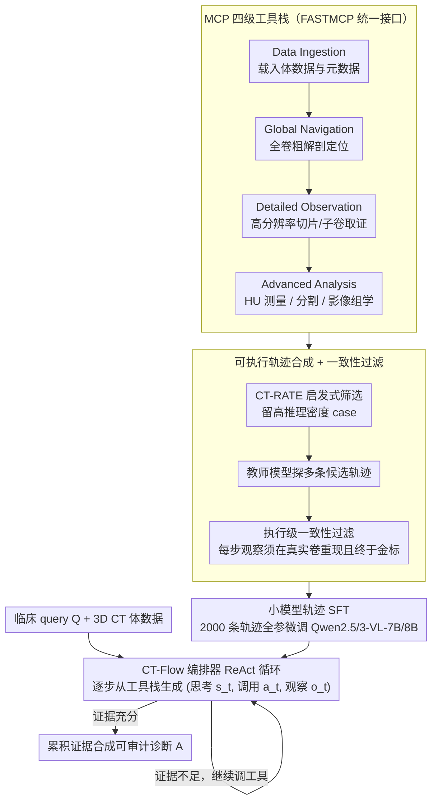

# CT-Flow: Orchestrating CT Interpretation Workflow with Model Context Protocol Servers

**会议**: ACL 2026  
**arXiv**: [2603.00123](https://arxiv.org/abs/2603.00123)  
**代码**: 暂未公开（论文承诺将放出 CT-FlowBench）  
**领域**: 医学NLP
**关键词**: CT 解释、MCP、Agentic LVLM、ReAct、工具编排、CT-FlowBench

## 一句话总结
作者把 3D CT 解读重新建模成"放射科医生用工具迭代探查"的智能体任务，用 Model Context Protocol（MCP）暴露 Data Ingestion / Global Navigation / Detailed Observation / Advanced Analysis 四类工具，构造 2000+300 条可执行轨迹的 CT-FlowBench，并 SFT 出 CT-Flow-8B：在 3D-RAD 上达到 69.46% ACC，比纯切片基线提升 +22.46%，工具调用名称错误率仅 0.007/case。

## 研究背景与动机
**领域现状**：当前 3D CT 大模型有两条主流路线——原生 3D backbone（M3D、RadFM 用 3D ViT 全卷积编码）和切片序列化（Hulu-Med、OmniCT 把体数据拆成 2D 切片序列）。无论哪条，都是端到端的"一次性"推理：模型把整卷数据吃进去，吐出一段文本作为诊断或报告。

**现有痛点**：(1) 3D 编码必然带"信息瓶颈"——体素被压缩成有限 token，小血肿、早期缺血、淡薄磨玻璃这些临床决定性的微细征象会被洗掉；(2) 这种"read-only"模式和真实临床工作流根本不同步——放射科医生其实是边滚切片、边切平面、边量 HU 值、边量径线、边按需调用分割/影像组学工具，是个高度互动的迭代过程；(3) 现有医学 agent（ChatCAD/ChatCAD+/Med-Agents/MedRAX）虽然引入了工具调用，但工具是临时拼接、孤立散点式的，无法承接 3D CT 那种"多步、可回溯、可验证"的复杂工作流。

**核心矛盾**：CT 诊断需要"细粒度证据 + 多步推理 + 工具验证"，但端到端 LVLM 是"粗粒度感知 + 单步预测 + 无可追溯"——架构形态和任务形态错位。

**本文目标**：把 3D CT 解读从"感知问题"重新表述为"agentic 问题"，让模型显式做计划、调工具、验证假设、产出可审计的推理轨迹。

**切入角度**：Anthropic 最近提出的 MCP 标准化了 LLM 与外部工具的接口，可以把异构的影像处理工具（slicing、segmentation、radiomics、measurement）封装成统一的工具空间；再叠 ReAct 范式把诊断过程拆成 $(s_t, a_t, o_t)$ 三元组序列。

**核心 idea**：以 MCP 为底座，把 LVLM 从"被动编码者"升级为"主动 orchestrator"——既提供了工具空间和执行环境（CT-Flow 框架），又提供了一份可执行轨迹的训练/评测基准（CT-FlowBench），还训练了 Qwen2.5/Qwen3-VL 小模型证明这套范式比堆参数更有效。

## 方法详解

### 整体框架
CT-Flow 系统由三层组成：

1. **Tool Space（工具空间）**：四类 MCP 工具套件覆盖从"载入数据"到"决策前验证"的全链路——Data Ingestion 把 CT 体数据和元数据封装成标准查询接口；Global Navigation 提供全卷定位和粗解剖学定位；Detailed Observation 取高分辨率切片或子卷以局部证据校验假设；Advanced Analysis 提供 HU 值测量、分割、影像组学等定量分析。每个工具通过 FASTMCP 暴露给 LLM。
2. **Orchestrator（LLM 编排器）**：可以是 GPT-5.2/Gemini-3-Pro 这样的通用 frontier model，也可以是经过 CT-Flow SFT 的 7B/8B 小模型。它在每个时间步生成思考 $s_t$、选择工具调用 $a_t$，并接收来自影像环境的观察 $o_t$。
3. **CT-FlowBench**：基于 CT-RATE 构建的 2000 训练 + 300 评测条 trajectory，每条都是 (s, a, o) 序列且最终答案有金标。

诊断时给定临床 query $Q$，整套系统生成完整 Reasoning-Acting Trajectory $\mathcal{T} = \{(s_0, a_0, o_0), \ldots, (s_n, a_n, o_n)\}$，最终答案 $A$ 是累积证据合成的结果而非单次预测。

### 关键设计

**1. MCP 标准化的四级工具栈（Data Ingestion → Global Navigation → Detailed Observation → Advanced Analysis）：把所有低层影像操作抽象成可组合的原子动作**

端到端 LVLM 把整卷 CT 压成有限 token，小血肿、淡薄磨玻璃这类临床决定性的微细征象会在编码瓶颈里被洗掉；而真实放射科医生其实是边滚切片、边量 HU、边调分割工具地迭代探查。本文把这套异构低层操作（DICOM 读取、轴位/冠状位切换、ROI 裁剪、HU 测量、分割、影像组学）抽象成一组原子工具，按临床工作流的自然层级分四级：Data Ingestion 永远是前置条件，负责把体数据与元数据载入成可查询接口；Global Navigation 做全卷与粗解剖定位；Detailed Observation 取高分辨率切片或子卷做局部证据校验；Advanced Analysis 跑 HU 测量、分割、影像组学等定量分析。所有工具经 FASTMCP 用统一 MCP 接口暴露，LLM 只看到工具名、参数 schema 和文本/图像观察，不必关心底层实现。相比 ChatCAD 那种自己临时包工具的 ad-hoc 拼接，MCP 标准化让工具可热插拔、不同模型共用同一套；四级分类还形成依赖约束（不可能先 Analysis 再 Ingestion），把 agent 的规划搜索空间显著收窄。消融（Fig 4）显示去掉任一类工具都会让 ACC 显著下降、format error 上升，证明四类是互补必需而非冗余。

**2. Execution-in-the-loop Trajectory Synthesis + Procedural Consistency Filter：把"病历→答案"的静态监督升级成每一步都能在真实 CT 上重现的可执行轨迹**

传统蒸馏式 trajectory 有个隐患：教师模型可能凭空编出根本无法复现的中间观察（例如随手编个 HU=−800），学生照单全收就学到了错误的工具行为。本文先从 CT-RATE 里按解剖多样性、诊断丰富度、可定量评估潜力做启发式筛选，留下高推理密度的 case；再让 GPT-4o / Gemini-3-Pro-Preview / GPT-5.2 / Claude-Sonnet-4.5 这些教师模型对每个 case 探索多条候选轨迹，但只保留满足

$$\forall (a_i, o_i)\in \mathcal{T},\ \text{val}(o_i \mid \mathcal{V}) \land \text{pred}(\mathcal{T}) = y_{gt}$$

的轨迹——即每个动作的观察都必须能在 raw volume $\mathcal{V}$ 上真实执行得到，且整条链终止于金标 $y_{gt}$。这一步把"教师轨迹"在真实工具环境里重跑验证，等于给训练数据加了一道可执行性硬约束，是保证学生学到真工具行为而非幻觉调用的关键过滤。筛选同时覆盖 Quantitative Analysis / Spatial Mapping / Diagnostic Inference 三个任务场景，形成多层次的能力评测。

**3. Trajectory-form Instruction Tuning on Small Backbones：把 agentic 能力直接 SFT 进 7B/8B 小模型**

通用 frontier model（GPT-5.2、Gemini-3-Pro）zero-shot 就能调工具，但小模型差得远——Qwen3-VL-8B zero-shot 在 CT-FlowBench 上只有 25.33%、工具名错误率高达 0.969/case，问题不在"理解"而在"合规调用"。本文用 2000 条执行级轨迹（CT-RATE 蒸馏 + 3D-RAD 子集）对 Qwen2.5-VL-7B / Qwen3-VL-8B 做全参数 SFT：LLaMA-Factory 框架，学习率 $1\times 10^{-5}$，DeepSpeed ZeRO-2 + cosine 衰减，4×H100。每条样本都是一条完整的 ReAct trajectory，模型一次性学三件事——生成思考、调用合法工具、消费工具输出。SFT 后 8B 模型在 3D-RAD 上飙到 69.46%（反超 235B 的 Qwen3-VL）、工具名错误率降到 0.027，印证了"小模型 + 高质量轨迹 + 明确工具接口"比"堆参数"是更高效的路径。

### 一条完整轨迹：从一个临床 query 到可审计的诊断

以一次"判断该胸部 CT 是否存在肺结节、若有则给出位置与性质"的查询为例，CT-Flow 不是一次性吐答案，而是走一条 $(s_t, a_t, o_t)$ 的迭代链。第一步思考 $s_0$ 认定"得先把数据装进来"，动作 $a_0$ 调 Data Ingestion 载入体数据与元数据，观察 $o_0$ 返回可查询的卷句柄；接着 $s_1$ 决定先粗定位，$a_1$ 调 Global Navigation 在全卷里扫到肺野的大致层面，$o_1$ 回报候选可疑区所在的切片范围；$s_2$ 要核实细节，$a_2$ 调 Detailed Observation 取那几张高分辨率切片，$o_2$ 给回局部图像证据；$s_3$ 需要定量，$a_3$ 调 Advanced Analysis 量结节径线与 HU 值以判定实性/磨玻璃，$o_3$ 返回测量结果。每一步的观察都来自真实影像环境而非模型臆测，最终答案 $A$ 是把这几步累积的证据合成出来的，整条轨迹 $\mathcal{T}$ 又能逐 $(s,a,o)$ 回放给放射科医生复核。这正是 CT-Flow-7B 学到的行为——实验里它平均只用 4.01 次工具调用就拿到正确答案，靠"少调、调对"压低了推理延迟。

### 损失函数 / 训练策略
标准 token-level 自回归 cross-entropy，对整条轨迹（thought + action + observation）做 next-token 预测；不引入额外强化学习（作者明确表示后续考虑 PPO/DPO/RLCF）。关键超参：lr $1\times 10^{-5}$，DeepSpeed ZeRO-2，cosine schedule，4×H100；推理时用 SGLang 提供 OpenAI 兼容 API。评测时 multiple-choice 用 ACC，开放式问答用 BLEU-4/ROUGE-L/BERTScore + LLM-as-Judge（DeepSeek-V3、Kimi-K2-Thinking、GPT-OSS-120B 三模型取平均）。

## 实验关键数据

### 主实验
在 3D-RAD（每子任务 200 stratified 样本）与 CT-FlowBench（300 条，分 QA/AM/DD 三类）上对比：

| 模型 | Tool-use | 3D-RAD ACC↑ | 3D-RAD BLEU-4 | 3D-RAD ROUGE-L | CT-FlowBench Avg↑ |
|------|----------|-------------|---------------|----------------|-------------------|
| GPT-5.2 | ✓ | 63.50 | 22.08 | 26.06 | 37.33 |
| Gemini-3-Pro-Preview | ✓ | 62.59 | 29.59 | 35.59 | 44.00 |
| Claude-Sonnet-4.5 | ✓ | 54.83 | 20.14 | 26.81 | 43.67 |
| Qwen3-VL-235B-A22B | ✓ | 54.21 | 20.55 | 22.62 | 34.00 |
| M3D-RAD（医学专用） | ✗ | 58.00 | 29.76 | 37.39 | 36.00 |
| Hulu-Med-7B | ✗ | 61.29 | 12.77 | 23.71 | 47.00 |
| Qwen2.5-VL-7B（基线） | ✓ | 26.83 | 18.33 | 23.46 | 19.00 |
| Qwen3-VL-8B（基线） | ✓ | 49.06 | 20.89 | 22.31 | 25.33 |
| **CT-Flow-7B（SFT）** | ✓ | 61.36 | 36.67 | 34.73 | 44.33 |
| **CT-Flow-8B（SFT）** | ✓ | **69.46** | **36.96** | 37.47 | 43.00 |

CT-Flow-8B 在 3D-RAD 上 ACC 比同底 Qwen3-VL-8B 提升 +20.40，比所有医学专用模型和所有通用 frontier 都高；BLEU-4 36.96 是全表最高，说明 SFT 不只是把答案选对，还把报告文风对齐到了临床规范。CT-FlowBench 上 Hulu-Med-7B 反而最高（47），作者归因为它走纯多模态判别路径绕过了 long-horizon tool 失败的风险，而所有 agent 系模型都受到工具链长度的拖累。

### 消融实验
工具使用统计（Table 2）+ 工具类别消融（Fig 4 描述）：

| 模型 | 3D-RAD Calls | 3D-RAD Name Err | 3D-RAD Arg Err | CT-FlowBench Calls | CT-FlowBench Name Err | CT-FlowBench Arg Err |
|------|--------------|-----------------|----------------|--------------------|------------------------|----------------------|
| GPT-5.2 | 4.13 | 0.006 | 0.056 | 7.19 | 0.003 | 0.108 |
| Claude-Sonnet-4.5 | 5.93 | 0.002 | 0.092 | 9.49 | 0.017 | 0.407 |
| Qwen3-VL-8B（zero-shot） | 5.96 | **0.782** | 0.211 | 11.20 | **0.969** | 0.385 |
| **CT-Flow-7B（SFT）** | 4.01 | **0.007** | **0.018** | 6.17 | **0.007** | **0.033** |
| **CT-Flow-8B（SFT）** | 4.25 | 0.007 | 0.057 | 7.48 | 0.027 | 0.282 |

工具类别消融（基础 Ingestion 必留，其它三类逐一移除）：移除 Advanced Analysis → 失去定量综合能力（流速、容积比这类定义性指标算不出来）；移除 Detailed Observation → 微小病灶敏感度暴跌；移除 Global Navigation → 出现"spatial disorientation"，无法在切片间高效跳转。三类工具都被验证不可替代。

### 关键发现
- **工具中介推理（tool-mediated reasoning）整体大幅抬升 3D-RAD 表现**：CT-Flow SFT +22.46%，GPT-5.2 +8.33%，Claude-Opus +12.83%；通用模型靠 CT-Flow 就能反超医学专用 M3D-RAD（58.00%），证明 agentic 框架可以低成本绕过医学预训练壁垒。
- **工具调用纪律 = 模型能力的隐性瓶颈**：Qwen3-VL-8B zero-shot 工具名错误率 0.782（3D-RAD）、0.969（CT-FlowBench），SFT 后降到 0.007，是性能跃升的根因之一——说明小模型不缺"理解"，缺的是"合规调用"。
- **CT-FlowBench 比 3D-RAD 更难**：所有模型平均分都低于对应 3D-RAD 分（最高 44.33），凸显多步工具规划本身的认知负载远高于单次视觉判断。
- **CT-Flow-7B 工具调用次数（4.01/6.17）反而是全表最低**：模型学会了"用更少工具拿到正确答案"，对推理延迟敏感的临床场景（如卒中急诊）尤为关键。

## 亮点与洞察
- **把 MCP 引入医学影像是一步聪明的范式迁移**：MCP 的本意是通用 LLM 工具协议，能直接借用其生态成熟度（FASTMCP、合规检查、工具注册），避免每个医学 agent 工作都重造工具接口的轮子；这种"标准接口 + 医学工具实现"是真正可扩展的路径。
- **Execution-in-the-loop 过滤是 trajectory 数据可信度的关键**：仅靠教师模型生成轨迹会引入"幻觉工具调用"，把每条 (a, o) 在真实 CT 上跑一次再保留，把数据质量约束硬化到流程内，避免了 SFT 学到错误工具行为。
- **"小模型 + 高质量轨迹"打败"大模型 + zero-shot"**：CT-Flow-8B 在 3D-RAD 上反超 GPT-5.2 与 Gemini-3-Pro-Preview，对部署敏感的医学场景（不能上云的医院）有直接现实价值。
- **ReAct 三元组天然提供可审计性**：每个 (s, a, o) 都可被放射科医生回溯检查，是 FDA/CE 等医疗器械合规审批最看重的"可解释推理路径"。

## 局限与展望
- 作者承认的局限：(1) 仅 SFT，未做 RL（PPO/DPO/RLCF）；(2) 多步推理推理延迟高于单次端到端，对急诊场景有挑战。
- 自己发现的局限：(1) 训练轨迹依赖 GPT-5.2/Gemini-3-Pro 等顶级教师，复现成本高，未来需要 distillation chain 的开放化；(2) 工具空间仅四类，对增强造影、动态/灌注扫描等高级 CT 模态尚未涵盖；(3) CT-FlowBench 仅 300 测试样本且来自单一 CT-RATE 来源，对其他厂商/协议泛化性证据不足；(4) 仅胸部 CT 验证，腹部/头颈/血管 CT 未触及；(5) 评测 LLM-as-Judge 三模型加权可能引入系统偏置。
- 改进思路：(1) RLCF 优化轨迹长度与定量分析正确率；(2) 把工具空间扩到时序 4D-CT、CTA、PET-CT；(3) 引入跨中心数据做泛化验证；(4) 用工具调用图替代线性轨迹，支持并行假设探查；(5) 把 CT-FineBench 的属性级评测接入 CT-Flow 训练目标，形成评测-训练闭环。

## 相关工作与启发
- **vs RadFM / M3D / Hulu-Med**：它们仍是端到端的 LVLM（3D ViT 或切片序列化），CT-Flow 把 LVLM 拆为"orchestrator + 工具"，绕过 3D 编码的信息瓶颈，把"看图"换成"调显微镜/标尺/分割器"。
- **vs ChatCAD / ChatCAD+ / Med-Agents / MedRAX**：早期医学 agent 走 ad-hoc 工具拼接，CT-Flow 引入 MCP 标准化接口和 trajectory-level 监督，工具调用从孤立动作变成可被训练的连续策略。
- **vs ReAct 通用范式**：CT-Flow 在 ReAct 的 $(s, a, o)$ 之上加了"执行可重现性约束"，把通用 agent 工程化为可在真实物理环境（CT 卷）落地的版本。
- **启发**：MCP + trajectory SFT + execution-in-the-loop 这套组合可以平移到病理切片（WSI 上的局部观察 + 定量分析）、内窥镜视频（关键帧跳转 + 测量）、3D 工业 CT 等所有"高维数据 + 工具密集型"诊断任务；CT-FineBench 类属性 QA 评测可与 CT-Flow 互补——前者评"内容正确性"、后者评"过程正确性"，二者组合是医学 agent 评测的更完整闭环。

## 评分
- 新颖性: ⭐⭐⭐⭐ 把 MCP 首次系统引入 3D CT 解释、并形成"工具空间 + 可执行轨迹基准 + SFT 范式"三件套，是清晰的领域级范式迁移。
- 实验充分度: ⭐⭐⭐⭐ 覆盖 10+ 基线（含 frontier 通用模型与医学专用模型）、两个 benchmark、工具使用统计 + 工具类别消融 + 增益分析，主体很完整；遗憾的是只做 SFT、未触 RL，且只验证胸部 CT。
- 写作质量: ⭐⭐⭐⭐ 故事线清晰（被动→主动）、图 1 对比直观、Table 1/2 信息密度高；伦理章节齐备；个别公式排版小瑕疵不影响理解。
- 价值: ⭐⭐⭐⭐⭐ 给医学影像 agent 提供了第一个真正可被工业界复制的开放协议范式（MCP），并配套训练 + 评测数据，对医院端可解释 AI 部署有直接推动力。

<!-- RELATED:START -->

## 相关论文

- [\[ACL 2026\] CT-FineBench: A Diagnostic Fidelity Benchmark for Fine-Grained Evaluation of CT Report Generation](ct-finebench_a_diagnostic_fidelity_benchmark_for_fine-grained_evaluation_of_ct_r.md)
- [\[ACL 2026\] MARCH: Multi-Agent Radiology Clinical Hierarchy for CT Report Generation](march_multi-agent_radiology_clinical_hierarchy_for_ct_report_generation.md)
- [\[ACL 2026\] CURA: Clinical Uncertainty Risk Alignment for Language Model-Based Risk Prediction](cura_clinical_uncertainty_risk_alignment_for_language_model-based_risk_predictio.md)
- [\[ACL 2026\] PCoA: A New Benchmark for Medical Aspect-Based Summarization With Phrase-Level Context Attribution](pcoa_a_new_benchmark_for_medical_aspect-based_summarization_with_phrase-level_co.md)
- [\[ICML 2025\] Agent WARPP: Workflow Adherence via Runtime Parallel Personalization](../../ICML2025/medical_nlp/agent_warpp_workflow_adherence_via_runtime_parallel_personalization.md)

<!-- RELATED:END -->
