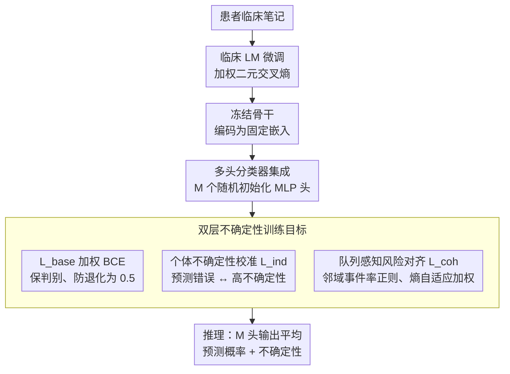

# CURA: Clinical Uncertainty Risk Alignment for Language Model-Based Risk Prediction

**会议**: ACL 2026  
**arXiv**: [2604.14651](https://arxiv.org/abs/2604.14651)  
**代码**: [GitHub](https://github.com/sizhe04/CURA)  
**领域**: 医学NLP
**关键词**: 临床风险预测, 不确定性校准, 双层对齐, 队列感知, 临床语言模型

## 一句话总结
CURA 提出一个双层不确定性校准框架：个体层面将预测不确定性与错误概率对齐，队列层面通过嵌入空间的邻域风险率正则化预测，在 MIMIC-IV 的五个临床风险预测任务上一致提升校准指标而不牺牲判别性能。

## 研究背景与动机

**领域现状**：临床语言模型（如 BioClinicalBERT、BioGPT）在从自由文本临床笔记预测死亡率、ICU 停留时间等风险方面表现出色。但这些模型的不确定性估计通常校准不佳——过度自信的错误预测直接危及患者安全。

**现有痛点**：通用不确定性方法（MC Dropout、Deep Ensembles）在孤立样本上聚合预测而不利用表示空间的语义结构；LLM 专用校准方法依赖专家推理链或教师模型的文本解释，但临床任务通常只有二分类标签且缺乏大规模的基础解释。

**核心矛盾**：微调提高预测性能但加剧过度自信——模型对高风险患者高置信度但错误的预测造成"虚假安心"（false reassurance），在临床中极其危险。

**本文目标**：设计一个轻量级即插即用的校准框架，使正确预测保持高置信度，错误预测分配高不确定性。

**切入角度**：从个体和队列两个层面同时对齐不确定性——个体层面与自身错误率对齐，队列层面与嵌入空间邻居的事件率对齐。

**核心 idea**：冻结微调后的临床 LM 嵌入 → 多头分类器 + 双层不确定性目标（个体校准 $L_{ind}$ + 队列感知 $L_{coh}$）。

## 方法详解

### 整体框架
CURA 想解决的是临床风险模型"自信地犯错"的问题，做法是把校准从训练流程里解耦出来、只在一个轻量分类头上做文章。整条流水线分两步：先用加权二元交叉熵标准微调一个临床 LM（BioGPT / BioClinicalBERT 等），训完即冻结，把每个患者笔记编码成固定嵌入；再在这些冻结嵌入上训练一个由 M 个随机初始化 MLP 头组成的分类器集成，训练目标在常规判别损失之外加上两层不确定性约束——个体层的 $L_{ind}$ 和队列层的 $L_{coh}$。推理时对 M 个头的输出取平均得到预测概率与不确定性。因为骨干被冻结、只动小分类头，整套校准几乎是即插即用、零额外推理代价的。

### 关键设计

**1. 个体不确定性校准 $L_{ind}$：让"我错了"和"我不确定"绑定在一起**

标准交叉熵只管把概率推向标签，从不约束"置信度该不该和错误率匹配"，于是微调后的模型常常对高风险患者给出高置信度的错误预测——这正是临床上最危险的"虚假安心"。CURA 直接把不确定性和正确性挂钩：先定义样本的正确性概率 $a(x) = y\bar{p}(x) + (1-y)(1-\bar{p}(x))$（预测越贴近真标签，$a$ 越大），再把归一化熵 $u(x) = H(x)/H_{max}$ 当作不确定性分数，然后用一项交叉熵把 $u(x)$ 对齐到 $1-a(x)$：

$$L_{ind} = -\lambda_{ind}\,[(1-a(x))\log u(x) + a(x)\log(1-u(x))]$$

这样一来，预测正确（$a$ 高）时模型被鼓励压低熵、保持高置信度；预测错误（$a$ 低）时若仍然给出低熵就会吃到大惩罚，被迫把这类样本推到高不确定性区。校准约束因此是逐样本、和真实对错直接耦合的，而不是事后统一缩放温度。

**2. 队列感知风险对齐 $L_{coh}$：临床表现相似的患者，风险估计也该相似**

个体校准只盯着单个样本，用不上"相似患者应有相似风险"这条临床先验，而决策边界附近那批模糊样本恰恰最需要这种邻域信息。CURA 在冻结嵌入空间里为每个患者 $x_i$ 检索 $K$ 个最近邻，用邻域里的真实事件率 $q(x_i) = \frac{1}{K}\sum_{j \in \mathcal{N}_K(e_i)} y_j$ 当作"队列风险"，再把预测往这个队列风险上正则化。关键是权重不是固定的，而是用邻域事件率的熵自适应给出 $w(x_i) = \lambda_{coh}\,\hat{H}(q(x_i))$——当邻域事件率接近 0.5（队列本身就模棱两可）时权重最大，对清晰的高/低风险队列则几乎不干预。这一项可以解释成一种数据依赖的标签平滑：等价于用"真标签与邻域事件率之间插值出的软标签"做交叉熵，模糊区域平滑得更狠，刚好把过度自信压在最该压的地方。

**3. 多头分类器集成：用一个骨干换来多样的不确定性**

要拿到可靠的不确定性估计，Deep Ensembles 的办法是训练好几个完整模型，代价高昂。CURA 改成在同一个冻结嵌入上挂 M 个独立随机初始化的轻量 MLP 头，推理时平均它们的预测。共享骨干让训练和推理成本几乎不变，而多头之间因初始化不同带来的分歧，又保留了集成式不确定性估计的多样性，是成本与质量之间的折中。

### 损失函数 / 训练策略
总损失为 $L_{total} = L_{base} + L_{ind} + L_{coh}$。其中 $L_{base}$ 是加权二元交叉熵，提供判别力基础，同时防止 $L_{ind}$ 把输出退化成均匀概率（一味追求"承认不确定"会让模型摆烂输出 0.5）；$L_{ind}$ 与 $L_{coh}$ 分别由 $\lambda_{ind}$、$\lambda_{coh}$ 控权，邻域大小 $K$ 为超参。三项联合优化时，$L_{base}$ 保判别、$L_{ind}$ 管个体校准、$L_{coh}$ 管队列一致性，互为补充。

## 实验关键数据

### 主实验

| 任务 | 方法 | AUROC | Brier↓ | NLL↓ | AURC↓ |
|------|------|-------|--------|------|-------|
| 7天死亡率 | Baseline | 0.852 | 0.032 | 0.120 | 0.008 |
| 7天死亡率 | Deep Ensemble | 0.856 | 0.029 | 0.110 | 0.007 |
| 7天死亡率 | CURA | **0.892** | **0.015** | **0.075** | **0.002** |
| 30天死亡率 | Baseline | 0.881 | 0.064 | 0.231 | 0.024 |
| 30天死亡率 | CURA | **0.890** | **0.038** | **0.146** | **0.009** |
| 院内死亡率 | Baseline | 0.621 | 0.044 | 0.175 | 0.015 |
| 院内死亡率 | CURA | **0.641** | **0.029** | **0.124** | **0.011** |

### 消融实验

| 配置 | 关键指标 | 说明 |
|------|---------|------|
| $L_{base}$ only (多头) | 校准接近 baseline | 多头架构本身不足以改善校准 |
| $L_{base} + L_{ind}$ | Brier/NLL 改善 | 个体校准有效 |
| $L_{base} + L_{coh}$ | 进一步改善 | 队列正则化有效 |
| $L_{base} + L_{ind} + L_{coh}$ | 最佳 | 双层协同效果最优 |

### 关键发现
- CURA 在所有五个任务上一致改善校准指标（Brier、NLL、AURC），同时不降低甚至轻微提升判别性能（AUROC、AUPRC）
- Deep Ensembles 和 MC Dropout 在校准指标上改善有限，甚至在某些任务上轻微恶化
- CURA 显著减少了高风险患者的"虚假安心"——将高置信错误预测重分配到高不确定性区域
- 框架跨 BioGPT、BioClinicalBERT、ClinicalBERT 三个骨干均稳健

## 亮点与洞察
- **双层对齐的思路**优雅且有实用价值——个体层面对齐"我错了就说不确定"，队列层面对齐"相似患者应有相似风险"，两者互补
- $L_{coh}$ 的标签平滑解释提供了理论洞察——本质上是用邻域事件率做数据依赖的标签软化，模糊区域平滑力度更大
- 作为即插即用的损失项，CURA 不需要修改模型架构或推理流程，部署成本极低

## 局限与展望
- 仅在 MIMIC-IV 上评估，需要验证对其他 EHR 数据集的泛化性
- 邻域大小 K 是超参数，不同任务可能需要不同的 K
- 嵌入质量依赖预训练 LM 的领域适配程度
- 二分类设定限制了对多级风险分层的适用性

## 相关工作与启发
- **vs Deep Ensembles**: 需要训练多个完整模型但校准改善有限，CURA 用多头+双层损失以更低成本实现更好校准
- **vs MC Dropout**: 通过随机丢弃获取不确定性但不利用表示空间结构，CURA 通过邻域关系利用了嵌入空间的语义信息
- **vs LLM 校准方法**: 依赖 CoT 解释作为监督，临床场景缺乏此类标注，CURA 只需二分类标签

## 评分
- 新颖性: ⭐⭐⭐⭐ 双层不确定性对齐的设计新颖且有理论支撑
- 实验充分度: ⭐⭐⭐⭐⭐ 五个任务、三个骨干模型、五折交叉验证、详细消融
- 写作质量: ⭐⭐⭐⭐⭐ 临床动机清晰，数学推导完整，可视化分析直观

<!-- RELATED:START -->

## 相关论文

- [\[ACL 2026\] Reliable Automated Triage in Spanish Clinical Notes: A Hybrid Framework for Risk-Aware HIV Suspicion Identification](reliable_automated_triage_in_spanish_clinical_notes_a_hybrid_framework_for_risk-.md)
- [\[ACL 2026\] ReMedi: Reasoner for Medical Clinical Prediction](remedi_reasoner_for_medical_clinical_prediction.md)
- [\[ACL 2026\] PrinciplismQA: A Philosophy-Grounded Approach to Assessing LLM-Human Clinical Medical Ethics Alignment](principlismqa_a_philosophy-grounded_approach_to_assessing_llm-human_clinical_med.md)
- [\[ACL 2026\] Efficient and Effective Internal Memory Retrieval for LLM-Based Healthcare Prediction](efficient_and_effective_internal_memory_retrieval_for_llm-based_healthcare_predi.md)
- [\[NeurIPS 2025\] CGBench: Benchmarking Language Model Scientific Reasoning for Clinical Genetics Research](../../NeurIPS2025/medical_nlp/cgbench_benchmarking_language_model_scientific_reasoning_for_clinical_genetics_r.md)

<!-- RELATED:END -->
