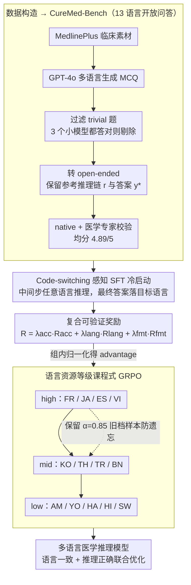

# CURE-Med: Curriculum-Informed Reinforcement Learning for Multilingual Medical Reasoning

**会议**: ACL 2026  
**arXiv**: [2601.13262](https://arxiv.org/abs/2601.13262)  
**代码**: cure_med（论文链接，仓库地址未在缓存中明示）  
**领域**: 医学 NLP / 多语言 LLM / 强化学习  
**关键词**: 多语言医学推理, GRPO, 课程学习, 代码切换 SFT, 低资源语言

## 一句话总结
作者构造了一个覆盖 13 种语言（含 Amharic、Yoruba、Swahili 等低资源语言）、共 15,774 条开放问答的医学推理数据集 CureMed-Bench，并提出 Cure-Med：一个两阶段「code-switching 感知的 SFT + 课程式 GRPO」框架，把推理正确性和语言一致性联合优化，在 7B 上将语言一致率 / 推理正确率拉到 85.21% / 54.35%，在 32B 上拉到 94.96% / 70.04%。

## 研究背景与动机
**领域现状**：医学 LLM 主流要么走「闭式 MCQ + 监督微调」（MedQA / MMedBench / MedMCQA），要么做单语言开放式 QA（HealthSearchQA），评测仍以英文为中心，多语言医学推理几乎是空白。

**现有痛点**：在非英语、尤其是 Amharic / Yoruba / Hausa 等低资源语言上，LLM 出现两类失败 —— (1) 逻辑准确率掉点严重；(2) 出现「语言漂移」（输入是斯瓦希里语，中间或最终答案漂回英语），临床上没法用。

**核心矛盾**：要让医生 / 病人信任系统，必须让「推理过程透明 + 输出语言稳定」同时成立，而现有 SFT 会牺牲推理深度，纯 RL 又奖励稀疏、低资源语言早期信号差，二者很难一次性优化好。

**本文目标**：(i) 给社区一个覆盖 13 种语言的开放式医学推理 benchmark；(ii) 训出一个能同时优化「逻辑正确性」与「语言保真度」的模型，且对低资源语言鲁棒。

**切入角度**：作者观察到高资源语言上 reward 信号更稳定，于是把「语言资源等级」当作课程难度，先在高资源语言上稳定 RL，再逐步引入中 / 低资源语言；同时允许中间推理 code-switch（思路用英文 + 临床术语，最后答案用目标语言），既保住推理深度又稳定输出语言。

**核心 idea**：用「code-switching SFT 冷启动 + 资源等级课程式 GRPO + 复合 reward（accuracy + language + format）」联合优化多语言医学推理。

## 方法详解

### 整体框架
Pipeline 分三段：(A) 数据构造 —— 从 MedlinePlus 拉临床素材，GPT-4o 多语言生成 MCQ，多阶段过滤掉 3 个小模型都能做对的 trivial 题，再转成 open-ended（保留参考推理链 $r$ 和参考答案 $y^*$），最后由 native + 医学专家逐条校验，平均评分 4.89/5。(B) Cold-Start SFT —— 在 Qwen2.5-Instruct backbone 上用允许 code-switching 的长 CoT 轨迹做 SFT，让中间推理步可以用任意 $\ell_t \in \mathcal{L}$，但最终答案必须落到目标语言 $\ell$。(C) Curriculum GRPO —— 按语言资源等级划分高 / 中 / 低三档，按 high→mid→low 顺序训练，每进入新档保留 $\alpha=0.85$ 比例的旧档样本防遗忘，复合奖励同时约束 accuracy、language、format。

### 关键设计

**1. Code-switching 感知的 SFT 冷启动：先给 RL 一个不会中途崩掉的起点**

如果直接逼模型全程用低资源语言推理，质量会当场坍塌——很多医学术语在 Amharic 里压根没有对应词，硬翻只会诱发幻觉。冷启动阶段因此放宽中间步骤的语言约束：对目标语言 $\ell$ 的查询 $x$，构造一条长 CoT 轨迹 $\mathbf{r}=\{r_1,\dots,r_T\}$，每一步 $r_t$ 的语言 $\ell_t$ 可以与 $\ell$ 不同（比如用法语问诊、中间却用英语临床术语推理），只有最终答案 $y^*$ 被强制写成 $\ell$，损失就是普通的轨迹似然 $\mathcal{L}_{\text{SFT}}=-\log p_\theta(\mathbf{r}, y^*\mid x)$。这等于让模型"用它最熟练的语言思考、用病人的语言回答"，既保住了多步推理深度，又给后续 RL 留下了可优化的空间，而不是一上来就把策略压垮。

**2. 复合可验证奖励：把答得对、说对语言、格式合规拆开计分**

单一答案奖励会纵容模型"答对就行、语言乱写无所谓"，单一语言奖励又会让它放弃推理只去刷格式分——两种 reward hacking 必须同时堵住。CURE-Med 把奖励拆成三路加权：

$$R = \lambda_{\text{acc}} R_{\text{acc}} + \lambda_{\text{lang}} R_{\text{lang}} + \lambda_{\text{fmt}} R_{\text{fmt}}$$

其中 $R_{\text{acc}} \in [0,1]$ 由 GPT-4.1 当验证器给出（闭式题严格 exact match，开放题允许 paraphrase 的部分得分），$R_{\text{lang}}$ 是 0/1 判断输出是否完全落在目标语言，$R_{\text{fmt}}$ 检查 `<thinking>/<step n>/<answer>` 标签是否合规。三路解耦再加上一个与训练裁判分离的第三方判分模型，才能同时压住"为了准确率漂语言"和"为了语言一致瞎编答案"这两种相反方向的作弊。

**3. 基于语言资源等级的课程式 GRPO：让奖励信号从高资源语言"蒸馏"到低资源语言**

如果一上来就在 13 种语言上混合做 RL，低资源语言的正样本几乎为 0，一组采样里 reward 全是常数、advantage 趋近于零，更新等于白做。CURE-Med 把语言按资源等级分成三档——high（FR / JA / ES / VI）、mid（KO / TH / TR / BN）、low（AM / YO / HA / HI / SW），按 high→mid→low 顺序训练：先在高资源语言上把 GRPO 训到奖励 plateau，再扩到中档，最后才引入低资源语言。每进入新一档，采样按 $\mathcal{D}_i = \alpha \mathcal{D}_{i-1} + (1-\alpha)\mathcal{D}_{L_i}$（$\alpha=0.85$）保留大比例旧档样本防遗忘，而 GRPO 本身的更新规则 $A_{i,k} = R_{i,k} - \text{mean}(\{R_{i,k}\})$ 一字不改。这条课程的本质是用"reward 信号最稳"的语言先把整个奖励曲面热身好，等模型已经具备基本的多语言推理 + 语言一致能力，再去啃正样本稀缺的低资源语言。

### 损失函数 / 训练策略
SFT 阶段最大化 $\log p_\theta(\mathbf{r}, y^*\mid x)$，RL 阶段沿用 GRPO 的标准 clipped 目标，advantage 用组内 reward 归一化，KL 正则到 cold-start 模型；课程跨阶段时采用 $\alpha=0.85$ 的样本保留比例；scaling 从 1.5B 一直做到 32B。

## 实验关键数据

### 主实验
benchmark 报告 13 种语言的平均 Language Consistency / Logical Accuracy（mean ± std）。下表节选 7B 段对比（数字来自论文 Table 4 类主表，缓存里直接列出）：

| 模型 | Consistency ↑ | Accuracy ↑ |
|------|---------------|------------|
| Qwen2.5-Instruct-7B (基座) | 25.44 ± 0.36 | 29.56 ± 0.42 |
| Mistral-7B | 18.70 ± 1.30 | 15.23 ± 1.20 |
| BioMistral-7B | 7.10 ± 0.90 | 4.80 ± 0.95 |
| MedAlpaca-7B | 3.50 ± 0.90 | 2.47 ± 0.95 |
| HuatuoGPT-o1-8B（既有最强 baseline） | 67.30 ± 0.14 | 46.86 ± 0.09 |
| LLaMA-3.1-Instruct-8B | 36.56 ± 0.31 | 18.91 ± 0.18 |
| **Cure-Med-Qwen2.5-7B（本文）** | **85.21** | **54.35** |

在 3B 段（小模型也吃这一套）：

| 模型 | Consistency ↑ | Accuracy ↑ |
|------|---------------|------------|
| Qwen2.5-Instruct-3B | 8.39 ± 0.42 | 10.83 ± 0.60 |
| LLaMA-3.2-3B | 23.69 ± 0.36 | 10.41 ± 0.38 |
| **Cure-Med-Qwen2.5-3B** | **74.28 ± 0.60** | **42.93 ± 0.60** |

放大到 32B 时进一步到 Consistency 94.96 / Accuracy 70.04，曲线显示方法可扩展。

### 消融实验

| 配置 | Consistency / Accuracy 趋势 | 说明 |
|------|------------------------------|------|
| Full Cure-Med（SFT + Curriculum GRPO + 3 路奖励） | 85.21 / 54.35（7B） | 完整方法 |
| w/o code-switching SFT（直接强制目标语言 SFT） | 推理质量显著下滑、低资源语言更明显 | code-switch 是低资源语言推理的关键 |
| w/o curriculum（13 语言混合 GRPO） | 低资源语言 accuracy 大幅落后 | 课程顺序对正样本稀缺的语言至关重要 |
| w/o $R_{\text{lang}}$ | accuracy 维持但 consistency 塌方 | 语言奖励缺一不可 |
| w/o $R_{\text{acc}}$（只奖励语言 + 格式） | consistency 高但答案胡说 | 验证组合奖励的必要性 |

### 关键发现
- 课程式 RL 的最大收益不是在 high 档，而是在 low 档：高资源语言上各方法差距不大，低资源语言上 Cure-Med 相对最强 baseline 至少翻一倍以上，说明「先高资源后低资源」实质等于把奖励信号「蒸馏」到了低资源语言。
- code-switching 是「医学多语言推理」的工程必经之路：临床术语在低资源语言中常常缺失，强行翻译反而让 LLM 出现幻觉；允许中间英语术语 + 最终目标语回答既保住准确率，又不破坏病人体验。
- 在 OOD 上（未见过的医学题 + 未见过的语言）也保持优势，说明方法学到的不是题面分布，而是「先做对、再写对语言」的通用模式。

## 亮点与洞察
- 把「语言资源等级」当作课程难度的设计很巧妙：常见课程学习是按问题复杂度排序，本文按「reward signal 的稳定性」排序，本质是用早期高 SNR 的奖励来稳定整个策略，对所有 reward 稀疏 + 不均衡的多语言 RL 任务都适用。
- 三路解耦奖励 + 第三方裁判模型，是「同时阻止语言漂移和准确率漂移」的最小可行方案；任何想做多约束 RL 的工作都可以借鉴这个组合。
- CureMed-Bench 是少有的「开放式 + 单一可验证答案 + 低资源语言 + 临床校验」四件齐全的医学数据集，可能成为后续多语言医学 RL 的事实标准 benchmark。

## 局限与展望
- 奖励仍依赖 GPT-4.1 当 verifier，存在「同源偏置」与黑盒成本；低资源语言上 verifier 自己可能就不准，会造成 reward 噪声。
- code-switching SFT 数据的「最优混合比例」靠经验，未做系统化研究；不同语言对的最佳 switch 模式可能差异巨大。
- 评测仍偏重单轮 QA，没覆盖真实临床场景里的多轮病史采集、不确定性沟通；想真正落地还要补 multi-turn dialog 能力。
- 文化与术语层面的差异（同一药名在不同地区写法不同）只靠人工 review 兜底，可扩展性有限。

## 相关工作与启发
- **vs HuatuoGPT-o1 / OpenBioLLM / UltraMedical**: 它们走 monolingual + 域监督路线，多语言尤其低资源场景下 consistency 几乎为 0；本文核心区别是把多语言保真度作为 first-class 优化目标。
- **vs GRPO / DeepSeekMath**: 共用 GRPO 框架，本文不改优化规则，但通过「课程 + 复合奖励」把同一算法迁到了 reward 稀疏的多语言医学任务上。
- **vs MMedBench / XMedBench**: 这些 benchmark 都是 MCQ，掩盖了中间推理；CureMed-Bench 强制开放生成，能独立度量推理过程与语言一致性，更贴近临床。

## 评分
- 新颖性: ⭐⭐⭐⭐ 把「语言资源等级 = 课程难度」是一个轻巧但显著有效的视角切换。
- 实验充分度: ⭐⭐⭐⭐ 13 语言 × 3 规模 + 多 baseline，缺更细致的奖励消融。
- 写作质量: ⭐⭐⭐⭐ pipeline 清晰，公式与图配合到位。
- 价值: ⭐⭐⭐⭐ 数据集 + 训练框架双产物，对低资源医疗 AI 公平性有直接推动。

<!-- RELATED:START -->

## 相关论文

- [\[ACL 2026\] Eliciting Medical Reasoning with Knowledge-enhanced Data Synthesis: A Semi-Supervised Reinforcement Learning Approach](eliciting_medical_reasoning_with_knowledge-enhanced_data_synthesis_a_semi-superv.md)
- [\[ACL 2026\] From Answers to Arguments: Toward Trustworthy Clinical Diagnostic Reasoning with Toulmin-Guided Curriculum Goal-Conditioned Learning](from_answers_to_arguments_toward_trustworthy_clinical_diagnostic_reasoning_with_.md)
- [\[ACL 2026\] Dr. Assistant: Enhancing Clinical Diagnostic Inquiry via Structured Diagnostic Reasoning Data and Reinforcement Learning](dr_assistant_enhancing_clinical_diagnostic_inquiry_via_structured_diagnostic_rea.md)
- [\[ACL 2026\] RADS: Reinforcement Learning-Based Sample Selection Improves Transfer Learning in Low-resource and Imbalanced Clinical Settings](rads_reinforcement_learning-based_sample_selection_improves_transfer_learning_in.md)
- [\[ACL 2026\] Multi-View Attention Multiple-Instance Learning Enhanced by LLM Reasoning for Cognitive Distortion Detection](multi-view_attention_multiple-instance_learning_enhanced_by_llm_reasoning_for_co.md)

<!-- RELATED:END -->
