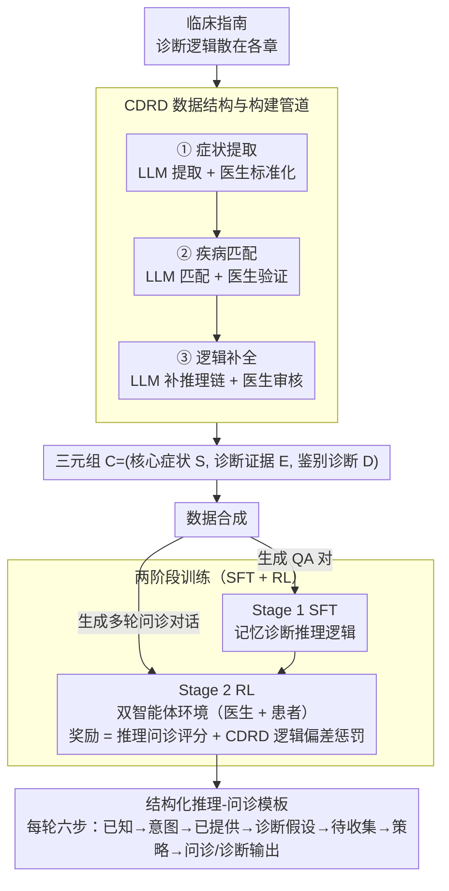

# Dr. Assistant: Enhancing Clinical Diagnostic Inquiry via Structured Diagnostic Reasoning Data and Reinforcement Learning

**会议**: ACL 2026  
**arXiv**: [2601.13690](https://arxiv.org/abs/2601.13690)  
**代码**: [GitHub](https://github.com/YGswu/Dr.-Assistant)  
**领域**: 医学NLP
**关键词**: 临床诊断推理, 强化学习, 结构化数据, 问诊引导, CDSS

## 一句话总结

本文提出临床诊断推理数据（CDRD）结构来捕获从症状到鉴别诊断的抽象临床推理逻辑，并基于 CDRD 通过 SFT+RL 两阶段训练构建 Dr. Assistant 模型（14B），在临床问诊基准上 ICD-Recall 超过 HuatuoGPT-o1-72B 13.59%，达到与 GPT-5 竞争的水平。

## 研究背景与动机

**领域现状**：临床决策支持系统（CDSS）为医生提供推理和问诊指导。LLM 因其广泛的医学知识已被广泛应用于医疗咨询，在医学基准上表现出色。

**现有痛点**：(1) 传统 CDSS 依赖结构化知识库和规则算法，开发维护成本高且适应性差；(2) 现有医疗 LLM（如 Baichuan-M2、HuatuoGPT-o1）主要优化患者咨询体验，缺乏专业的临床诊断推理和问诊技能；(3) 临床指南中的诊断推理逻辑分散在不同章节中，难以直接用于训练；(4) 即使有高质量数据，训练模型掌握临床问诊技能仍然是一个显著挑战。

**核心矛盾**：LLM 拥有广泛的医学知识，但缺乏系统性的临床诊断推理逻辑——在零样本提示下无法像经验丰富的医生那样进行结构化的症状分析和鉴别诊断。

**本文目标**：(1) 设计 CDRD 数据结构来捕获抽象诊断推理逻辑；(2) 构建具备诊断推理和问诊技能的 Dr. Assistant 模型；(3) 构建临床诊断推理与问诊评估基准。

**切入角度**：从临床指南中提取结构化的诊断推理逻辑（CDRD），然后用 CDRD 作为种子合成 SFT 和 RL 训练数据，通过两阶段训练使模型内化临床推理能力。

**核心 idea**：临床诊断推理可以被抽象为（核心症状, 诊断证据, 鉴别诊断）的结构化三元组——以此为种子生成训练数据，再通过包含"逻辑偏差惩罚"的 RL 奖励函数约束模型的推理行为。

## 方法详解

### 整体框架

CDRD 构建管道（LLM+医生协作三阶段：症状提取→疾病匹配→逻辑补全）→ 数据合成（CDRD→QA 对用于 SFT + CDRD→多轮问诊对话用于 RL）→ Dr. Assistant 两阶段训练（SFT 记忆推理逻辑 + RL 强化问诊技能），训练出的模型在每轮问诊里都按结构化模板"先想清楚再开口"。

### 关键设计

**1. CDRD 数据结构与构建管道：把散在指南各处的诊断逻辑，重组成从症状出发的鉴别诊断路径**

临床指南里的诊断推理逻辑是分散的——症状描述在一章、鉴别诊断在另一章、检查项目又在别处，没法直接拿来训练模型。CDRD 的做法是把这套逻辑抽象成一个三元组 $\mathcal{C} = (\mathcal{S}, \mathcal{E}, \mathcal{D})$：核心症状 $\mathcal{S}$（如头痛）、诊断证据 $\mathcal{E}$（相关症状 / 体征 / 化验检查结果）、鉴别诊断 $\mathcal{D}$（候选疾病及其典型表现和所需检查）。构建走 LLM 与医生交替的三阶段流水线——LLM 先提取候选症状、医生精炼并标准化，LLM 再匹配可能疾病、医生验证，最后 LLM 补全从症状到鉴别诊断的推理链、医生审核。每一阶段都有医生兜底，既借了 LLM 的产能，又用人工审核守住了临床可靠性。

**2. 两阶段训练（SFT + RL）：先记住推理逻辑，再在模拟问诊里把它练成技能**

光把推理逻辑喂给模型记住，并不等于模型会在真实的多轮问诊里灵活调用它。Dr. Assistant 因此分两阶段：Stage 1 用 CDRD 生成的 QA 对做 SFT，让模型先记牢初步的诊断推理逻辑；Stage 2 用 CDRD 生成的多轮问诊对话做 RL，搭一个双智能体环境（医生智能体负责问诊、患者智能体按设定回答）让模型在交互中练问诊。RL 的奖励有两个维度——临床推理与问诊技能评分（由 LLM 评判覆盖率、准确性、问诊逻辑性），以及 CDRD 逻辑保真度（对偏离 CDRD 标准推理路径的行为施加惩罚）。这个逻辑偏差惩罚是关键：它约束模型在自由探索式问诊里不至于产生"看似合理、实则跳步"的推理。

**3. 结构化推理-问诊模板：让每一轮问诊都有据可循**

非结构化的问诊容易漏掉关键信息，或者凭空跳到某个诊断。Dr. Assistant 把每一轮的推理过程固定成六步——已知信息 → 用户意图 → 已提供信息 → 诊断假设 → 待收集信息 → 回应策略 → 最终的问诊 / 诊断输出。模型每轮都要先填完这套思维链，再决定问下一个问题还是给出诊断，等于把"先想清楚再开口"写进了输出格式，问诊的系统性和完整性因此被强制约束住。

### 一个完整示例：一轮"头痛"问诊怎么走

以一位主诉"头痛三天"的患者为例，看结构化模板在一轮里如何流转：模型先在**已知信息**里登记"头痛、持续 3 天"；**用户意图**判定为描述症状求诊；**已提供信息**确认目前只有部位和病程；对照 CDRD 中头痛对应的 $\mathcal{E}$ 与 $\mathcal{D}$，**诊断假设**列出偏头痛、紧张性头痛、需警惕的颅内病变等候选；**待收集信息**据此锁定最能区分这些候选的证据——是否伴恶心呕吐、有无畏光、是否突发剧烈（排查蛛网膜下腔出血）；**回应策略**决定这一轮先问鉴别价值最高的一项；最终**输出**一句具体的追问"这几天头痛时有没有伴随恶心或怕光？"。患者智能体回答后，新证据回填到下一轮的"已知信息"，假设集随之收缩，如此逐轮逼近，直到证据足以支撑某个鉴别诊断。整个过程始终被 CDRD 逻辑保真度惩罚牵着，不会跳过取证直接下结论。

### 损失函数 / 训练策略

SFT 阶段：标准交叉熵损失。RL 阶段：奖励函数 = 临床推理与问诊技能评分（由 LLM 评估覆盖率、准确性、问诊逻辑性）+ CDRD 逻辑保真度（惩罚与 CDRD 标准逻辑的偏差）。基座模型为 14B 参数。

## 实验关键数据

### 主实验

**诊断推理评估（242 个真实临床案例，8 个二级科室）**

| 模型 | 参数 | ICD-Recall ↑ | 综合评分 |
|------|------|-------------|---------|
| HuatuoGPT-o1 | 72B | 基线 | - |
| GPT-5 | - | 高 | 竞争水平 |
| **Dr. Assistant** | **14B** | **+13.59%** | **与 GPT-5 竞争** |

### 消融实验

| 配置 | ICD-Recall | 问诊质量 |
|------|-----------|---------|
| 仅 SFT | 基础水平 | 中等 |
| SFT + RL（无逻辑惩罚） | 提升 | 提升但有逻辑偏差 |
| SFT + RL（完整奖励） | **最高** | **最高** |

### 关键发现

- Dr. Assistant（14B）以小模型超越 HuatuoGPT-o1（72B），ICD-Recall 提升 13.59%——证明专业化的诊断推理训练比模型规模更重要
- RL 中的 CDRD 逻辑保真度惩罚是关键——没有它模型容易产生看似合理但逻辑不严谨的推理
- 结构化推理模板使模型的每轮问诊都有据可循，提升了问诊的系统性和完整性
- Dr. Assistant 达到与 GPT-5 竞争的水平，为 CDSS 的实际部署提供了可行方案

## 亮点与洞察

- CDRD 数据结构是一个通用的临床知识表示方案，可扩展到更多临床指南
- LLM+医生协作的数据构建管道平衡了效率和可靠性
- RL 奖励函数中"逻辑偏差惩罚"的设计确保模型的自由探索不偏离临床推理正轨

## 局限与展望

- 目前仅基于内科相关临床指南构建 CDRD，覆盖科室有限
- 评估基准规模较小（242 个案例，147 轮问诊），统计效力有限
- 未在真实临床环境中进行前瞻性评估
- RL 奖励函数的权重调节可能需要领域专家参与

## 相关工作与启发

- **vs Baichuan-M2/HuatuoGPT-o1**: 这些模型优化通用医疗咨询体验，本文专注于临床诊断推理和问诊技能的专业化
- **vs 传统 CDSS**: 传统系统依赖规则难以扩展，Dr. Assistant 通过 LLM+结构化推理数据实现灵活适应
- **vs Doctor-R1**: Doctor-R1 侧重推理过程，本文更注重诊断推理逻辑的结构化和问诊技能

## 评分

- 新颖性: ⭐⭐⭐⭐ CDRD 数据结构和逻辑偏差惩罚 RL 的设计新颖
- 实验充分度: ⭐⭐⭐⭐ 对比全面但评估规模有限
- 写作质量: ⭐⭐⭐⭐ 方法清晰系统，临床问题定义准确
- 价值: ⭐⭐⭐⭐⭐ 为 CDSS 实际部署提供了有效的 LLM 解决方案

<!-- RELATED:START -->

## 相关论文

- [\[ACL 2026\] From Answers to Arguments: Toward Trustworthy Clinical Diagnostic Reasoning with Toulmin-Guided Curriculum Goal-Conditioned Learning](from_answers_to_arguments_toward_trustworthy_clinical_diagnostic_reasoning_with_.md)
- [\[ACL 2026\] RADS: Reinforcement Learning-Based Sample Selection Improves Transfer Learning in Low-resource and Imbalanced Clinical Settings](rads_reinforcement_learning-based_sample_selection_improves_transfer_learning_in.md)
- [\[ACL 2026\] Eliciting Medical Reasoning with Knowledge-enhanced Data Synthesis: A Semi-Supervised Reinforcement Learning Approach](eliciting_medical_reasoning_with_knowledge-enhanced_data_synthesis_a_semi-superv.md)
- [\[ACL 2026\] MultiDx: A Multi-Source Knowledge Integration Framework towards Diagnostic Reasoning](multidx_a_multi-source_knowledge_integration_framework_towards_diagnostic_reason.md)
- [\[ACL 2026\] CURE-Med: Curriculum-Informed Reinforcement Learning for Multilingual Medical Reasoning](cure-med_curriculum-informed_reinforcement_learning_for_multilingual_medical_rea.md)

<!-- RELATED:END -->
