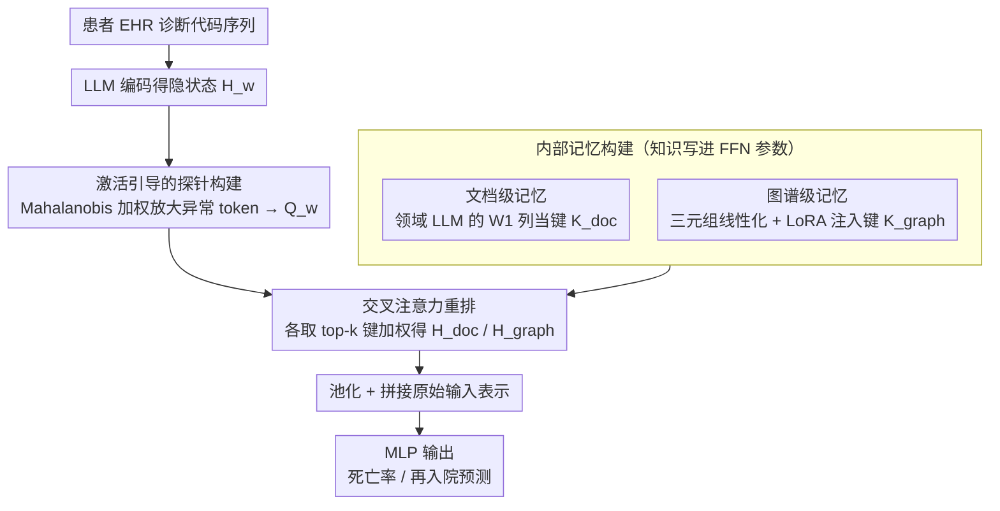

# Efficient and Effective Internal Memory Retrieval for LLM-Based Healthcare Prediction

**会议**: ACL 2026  
**arXiv**: [2604.07659](https://arxiv.org/abs/2604.07659)  
**代码**: [https://anonymous.4open.science/r/K2K-2390/](https://anonymous.4open.science/r/K2K-2390/)  
**领域**: 医疗NLP
**关键词**: 内部记忆检索、FFN键值记忆、医疗预测、知识注入、交叉注意力重排

## 一句话总结
本文提出K2K框架，将LLM的FFN参数空间视为可检索的知识库，通过LoRA注入临床知识、激活引导的探针构建精确检索、交叉注意力重排序自适应整合，实现了无需外部检索延迟的医疗预测SOTA。

## 研究背景与动机

**领域现状**：LLM在医疗领域展现了显著潜力，但部署中面临幻觉和缺乏细粒度医学上下文的问题。RAG是主流的知识接地策略，现有方法从知识图谱、非结构化文档或自生成知识中检索。

**现有痛点**：传统RAG管线存在两个关键瓶颈——(1) 通过输入prompt注入外部知识会扩展上下文长度，增加推理成本并限制可扩展性；(2) 构建高质量检索器仍是难题，监督检索需要大量标注的查询-上下文对，结构化检索依赖昂贵的图搜索或过度简化的启发式。这些在时间敏感的临床环境中是不可接受的。

**核心矛盾**：需要既准确又快速地获取相关医学知识，但外部检索带来的延迟和复杂性与临床实时决策的需求冲突。已有研究表明FFN层隐式存储了事实知识（键值记忆解释），但直接用原始查询检索内部键不够准确——不同查询检索到的键高度相似，探针表示缺乏判别力。

**本文目标**：设计一种从LLM内部参数空间直接检索知识的框架，避免外部检索的延迟和复杂性。

**切入角度**：利用Geva et al.的FFN键值记忆解释——FFN权重矩阵 $W_1$ 的列作为"键"存储语义模式，$W_2$ 的行作为"值"存储对应知识。通过LoRA注入领域知识后，这些键就成为了一个可搜索的内部知识库。

**核心 idea**：将医学知识通过LoRA"写入"LLM参数空间，然后用激活引导的探针精确检索相关内部键，再通过交叉注意力动态整合。

## 方法详解

### 整体框架

K2K 想解决的是：医疗预测既要靠外部医学知识接地、又受不了外部检索带来的延迟和上下文膨胀。它的思路是把知识"搬进"LLM 自己的参数里再就地检索。整条管线分三步：先把文档和知识图谱两路知识通过领域适配与 LoRA 写进 FFN 参数空间，形成可检索的内部记忆；再用激活引导的探针把输入查询变得有判别力，从内部记忆里精确取键；最后用交叉注意力对多源检索结果重排加权。输入是患者纵向 EHR 的诊断代码序列，输出是死亡率/再入院的二分类预测。

### 关键设计

**1. 内部记忆构建：把外部临床知识"焊进"FFN 权重，让检索不再需要外部系统**

外部 RAG 要额外维护检索器、还要把长上下文塞进 prompt，这两笔开销在时间敏感的临床场景里都难以承受。K2K 借用 Geva et al. 的 FFN 键值记忆解释——FFN 第一层 $W_1$ 的列是存语义模式的"键"、第二层 $W_2$ 的行是存知识的"值"——把知识直接编码进参数。它走两路：文档级记忆直接拿领域适配 LLM（如 BioMistral）的 $W_1$ 当键 $K_{\text{doc}}^l$；图谱级记忆先把医学知识图谱三元组线性化成文本（如 "The relationship between [head] and [tail] is [relation]"），再用 LoRA 微调注入，把 LoRA 的 $A_1 B_1$ 矩阵当作图谱键 $K_{\text{graph}}^l$。两路提供互补的非结构化与结构化知识，而 LoRA 的低秩特性让注入既高效又不伤模型原有能力，推理时彻底省掉了检索延迟。

**2. 激活引导的探针构建：用 Mahalanobis 加权放大异常 token，让不同查询检索到不同的键**

直接拿原始查询去检索内部键有个致命问题：用均值池化得到的探针在不同查询间高度相似，缺乏判别力，检索结果几乎没区分度。K2K 不做简单平均，而是对输入隐状态 $H_w$ 的每个 token 算它偏离上下文均值的 Mahalanobis 距离（对角近似）：

$$\phi_j^w \approx \sqrt{\sum_d \frac{(h_{j,d}^w - \bar{z}_d^w)^2}{\sigma_d^2}}$$

归一化后当作软注意力权重 $\alpha_j^w$，再加权聚合出增强探针 $Q_w = \sum_j \alpha_j^w \cdot h_j^w$。Mahalanobis 距离按维度方差缩放，对低方差方向上的偏差格外敏感，于是那些真正稀缺、有信息量的语义锚点 token 被放大、常见 token 被压低，探针由此获得判别力，检索才能精确命中相关内部键。

**3. 交叉注意力重排：用任务感知的方式动态选择和加权多源内部知识**

从内部记忆取出的键是潜在的、没有显式来源，直接堆在一起用并不知道哪条对当前任务更重要。K2K 把输入表示切成多个窗口，每个窗口的增强探针 $Q_w^+$ 分别从文档和图谱记忆里取 top-k 键，再用交叉注意力（CA）对这些键重排，得到文档知识 $H_{\text{doc}}^w$ 和图谱知识 $H_{\text{graph}}^w$。两者池化、拼接后与原始输入表示合并，交给 MLP 出最终预测。交叉注意力在这里扮演自适应门控的角色：它让模型按当前患者的具体情况、动态决定多源内部知识各自的权重，而不是固定地一视同仁。

### 一个完整示例

以一条患者 EHR 为例走一遍：输入是该患者历次就诊的 ICD 诊断代码序列，目标是预测他下次是否会再入院。此时内部记忆已经就位——BioMistral 的 FFN 列里存着文档级临床知识键，LoRA 注入的图谱键里存着诊断之间的结构化关系。推理时，模型先把这段诊断序列编码成隐状态，对每个 token 算 Mahalanobis 权重，那些罕见但关键的诊断码（而非反复出现的常见码）被放大，聚合成有判别力的探针 $Q_w$。探针分头去文档记忆和图谱记忆各取 top-k 键，交叉注意力按这位患者的具体病情对取回的两路知识重新加权——比如结构化的并发症关系权重被抬高、泛泛的文档知识被压低——最后把加权知识与原始表示拼接，MLP 输出再入院概率。整个过程没有任何一次访问外部数据库。

### 损失函数 / 训练策略

分类阶段用标准交叉熵损失，知识注入阶段用 LoRA。评估在 MIMIC-III 和 MIMIC-IV 上进行，按患者 ID 分组划分训练/测试集以防数据泄漏。

## 实验关键数据

### 主实验

| 方法 | MIMIC-III Mort Avg | MIMIC-III Read Avg | MIMIC-IV Mort Avg | MIMIC-IV Read Avg |
|------|-------------------|-------------------|-------------------|-------------------|
| KARE (前SOTA) | 较低 | 较低 | 较低 | 较低 |
| Standard RAG | 中等 | 中等 | 中等 | 中等 |
| K2K (BioMistral) | 较高 | 较高 | 较高 | 较高 |
| K2K (Meditron3) | **最高** | **最高** | **最高** | **最高** |

### 消融实验

| 配置 | 效果 | 说明 |
|------|------|------|
| Full K2K | 最优 | 完整框架 |
| w/o 图谱记忆 | 下降 | 结构化知识的贡献 |
| w/o 激活引导 | 下降 | 探针判别力的重要性 |
| w/o 交叉注意力重排 | 下降 | 动态整合的必要性 |
| 使用均值池化探针 | 显著下降 | 验证了Mahalanobis加权的优势 |

### 关键发现
- K2K在四个基准数据集上达到SOTA，且检索效率远高于KARE和prompt-based方法
- Meditron3-Qwen2.5-7B比BioMistral-7B表现更好，说明基础模型能力对内部记忆质量有重要影响
- 激活引导的探针比标准均值池化显著提升检索精度，验证了Mahalanobis距离的有效性
- 同时使用文档级和图谱级记忆优于单一来源，两者提供互补信息

## 亮点与洞察
- **参数即知识库**：将FFN的键值记忆解释从理论洞察转化为实用系统，直接在参数空间中检索知识，消除了外部检索的延迟。这个思路可以推广到任何需要快速知识访问的场景。
- **Mahalanobis距离增强探针**：考虑每个维度的方差来加权token的重要性，比简单的欧氏距离或均值池化更能识别语义锚点。这是一个通用的表示增强技巧。
- **LoRA作为知识注入工具**：不是用LoRA来微调任务性能，而是用它来"写入"新知识到参数空间。这种用法为LoRA开辟了新的应用方向。

## 局限与展望
- 内部键是潜在的、未接地的，缺乏可解释性——不知道检索到的键对应什么具体知识
- 依赖领域适配的基础模型（BioMistral/Meditron3），通用LLM的效果未知
- 仅在ICD代码序列的分类任务上验证，未测试生成性任务
- 知识图谱线性化的质量依赖于三元组的表述方式

## 相关工作与启发
- **vs KARE**：KARE结合文档检索和知识图谱最短路径，但图搜索成本高。K2K将所有知识编码到参数中，推理时零延迟
- **vs Standard RAG**：RAG扩展上下文长度增加推理成本，K2K通过内部检索避免上下文膨胀
- **vs RETRO**：RETRO也使用基于窗口的检索和交叉注意力，但从外部数据库检索。K2K将这种架构适配到内部参数检索

## 评分
- 新颖性: ⭐⭐⭐⭐⭐ 将FFN键值记忆解释转化为实用的内部检索系统是非常新颖的思路
- 实验充分度: ⭐⭐⭐⭐ 四个数据集、多个基线、充分的消融实验
- 写作质量: ⭐⭐⭐⭐ 方法描述清晰，理论与实践结合好
- 价值: ⭐⭐⭐⭐ 为时间敏感的临床场景提供了低延迟的知识接地方案

<!-- RELATED:START -->

## 相关论文

- [\[AAAI 2026\] BiCA: Effective Biomedical Dense Retrieval with Citation-Aware Hard Negatives](../../AAAI2026/medical_nlp/bica_effective_biomedical_dense_retrieval_with_citation-aware_hard_negatives.md)
- [\[ACL 2026\] ReMedi: Reasoner for Medical Clinical Prediction](remedi_reasoner_for_medical_clinical_prediction.md)
- [\[ACL 2026\] CURA: Clinical Uncertainty Risk Alignment for Language Model-Based Risk Prediction](cura_clinical_uncertainty_risk_alignment_for_language_model-based_risk_predictio.md)
- [\[ACL 2026\] IndicMedDialog: A Parallel Multi-Turn Medical Dialogue Dataset for Accessible Healthcare in Indic Languages](indicmeddialog_a_parallel_multi-turn_medical_dialogue_dataset_for_accessible_hea.md)
- [\[ACL 2026\] HypEHR: Hyperbolic Modeling of Electronic Health Records for Efficient Question Answering](hypehr_hyperbolic_modeling_of_electronic_health_records_for_efficient_question_a.md)

<!-- RELATED:END -->
