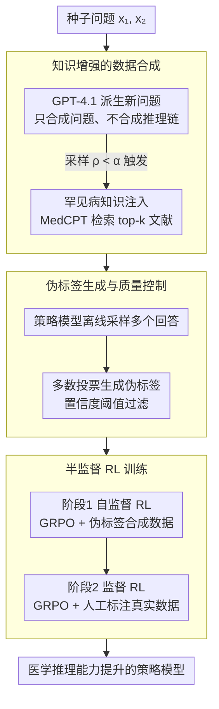

# Eliciting Medical Reasoning with Knowledge-enhanced Data Synthesis: A Semi-Supervised Reinforcement Learning Approach

**会议**: ACL 2026  
**arXiv**: [2604.11547](https://arxiv.org/abs/2604.11547)  
**代码**: [https://github.com/tdlhl/MedSSR](https://github.com/tdlhl/MedSSR)  
**领域**: 医学NLP
**关键词**: 医学推理、罕见病、数据合成、半监督强化学习、GRPO

## 一句话总结
本文提出MedSSR框架，通过注入罕见病知识的可控数据合成和"自监督RL→监督RL"的半监督训练范式，高效提升LLM的医学推理能力，在罕见病任务上实现最高+5.93%的提升，突破了现有方法+3%的改进上限。

## 研究背景与动机

**领域现状**：LLM在医学推理方面的发展受限于高质量推理数据的稀缺。现有方法主要通过从GPT-4o等大型闭源模型蒸馏CoT推理链来初始化策略模型，然后进行RL训练。

**现有痛点**：(1) 现有医学基准中仅22%是推理密集型问题，其中仅3%涉及罕见病；(2) 从闭源模型蒸馏长推理链成本高昂；(3) 所有现有方法在罕见病上的改进都无法超过+3%的上限——即使使用全监督GRPO；(4) 隐私约束和专业知识要求使得获取复杂医学推理数据极具挑战。

**核心矛盾**：罕见病数据极度稀缺，而现有方法的数据分布受限于已有标注数据，导致在罕见病任务上的改进天花板很低。同时，合成数据可能包含事实错误，在医学场景中不可接受。

**本文目标**：在不依赖昂贵的推理链蒸馏的前提下，高效提升LLM在包括罕见病在内的广泛医学推理任务上的表现。

**切入角度**：(1) 只合成问题（而非长推理链），大幅降低生成成本；(2) 注入罕见病知识来控制合成数据的分布；(3) 用策略模型自身生成伪标签，避免对外部模型的依赖。

**核心 idea**：合成分布可控的医学推理问题（通过罕见病知识注入），用模型自身的多数投票生成伪标签，然后执行"自监督RL→监督RL"的课程训练。

## 方法详解

### 整体框架
MedSSR 把整条流程串成"合成问题 → 自打伪标签 → 两阶段 RL"的课程：先用知识增强的数据合成管线从种子问题派生新问题（按阈值 $\alpha$ 控住罕见病比例），再用策略模型自身的多数投票给这些无答案的问题打伪标签，最后先在伪标签合成数据上做自监督 RL（内在学习、广撒网）、再在人工标注真实数据上做监督 RL（外在学习、收口校准）。三个贡献阶段首尾相接，前一阶段的产物正是后一阶段的输入。

### 关键设计

**1. 知识增强的数据合成：把"合成问题+推理链"砍成"只合成问题"，再用知识注入控住罕见病比例**

蒸馏长推理链既贵又可能把事实错误一起学进来，是前作的两个硬伤。MedSSR 干脆只合成问题：给定两个种子问题 $\{x_1^s, x_2^s\}$，用 GPT-4.1 派生出新问题，推理链留给策略模型自己去答——这样每个样本的 API token 成本远低于蒸馏，也不再受外部模型推理质量的牵制。要突破罕见病那 3% 的天花板，关键是让合成分布可控：每合成一个样本先采样 $\rho \sim \text{Uniform}(0,1)$，当 $\rho < \alpha$ 时就从罕见病列表里挑一个实体 $e$，用 MedCPT 检索 top-k 相关文献 $\mathcal{C}(e)$ 注入合成 prompt。阈值 $\alpha$ 因此成了一个直接拨动长尾分布的旋钮，注入的检索文献又顺带保证了合成问题的医学准确性。

**2. 伪标签生成与质量控制：用策略模型自己的多数投票打标签，让训练数据贴着模型的能力走**

合成出来的问题没有答案，没法直接喂 RL。借外部模型标注又会埋下分布不匹配的隐患（容易诱发 reward hacking）。MedSSR 的做法是自举——直接用策略模型（base model）对每个合成问题离线采样多个回答，取多数投票的答案作伪标签，并只保留置信度超过阈值的那些。这样标签天然落在模型自己的能力轨迹上，多数投票本身又充当了一道质量过滤：模型答不一致的问题，往往就是噪声大、该丢的样本。

**3. 半监督RL训练策略：先在伪标签数据上"自监督RL"广撒网，再在真实数据上"监督RL"收口校准**

伪标签终归有噪声，若一上来就当真值做监督训练，容易因噪声而失稳。MedSSR 把它拆成一条"先广后精"的课程：第一阶段自监督 RL，用 GRPO 在伪标签合成数据上训练，让模型从自身的知识与推理里学习（内在学习），把覆盖面尤其是罕见病铺开；第二阶段监督 RL，再用 GRPO 在人工标注的真实数据上训练（外在学习），把前一阶段探索出来的推理能力校准、巩固。先探索后精炼的次序，正是这套半监督范式能稳定吃下合成数据的原因。

### 损失函数 / 训练策略
使用GRPO优化，验证奖励 $r(y, y') = \mathbb{I}[\text{ans}(y') = y]$。KL散度约束偏离参考策略。在Qwen3-8B和Llama-3.1-8B-Instruct上验证。

## 实验关键数据

### 主实验

| 方法 | 通用医学提升 | 罕见病提升 | 每样本API Token消耗 |
|------|------------|-----------|-------------------|
| HuatuoGPT-O1 | 中等 | <3% | 高（长推理链） |
| MedReason | 中等 | <3% | 高 |
| 全监督GRPO | 中等 | <3% | 低 |
| MedSSR (Llama) | **+3.91%** | **+5.93%** | 低（仅生成问题） |
| MedSSR (Qwen3) | 显著提升 | 突破3%上限 | 低 |

### 消融实验

| 配置 | 通用 | 罕见病 | 说明 |
|------|------|--------|------|
| Full MedSSR | 最优 | 最优 | 完整框架 |
| w/o 知识注入 | 下降 | 显著下降 | 罕见病数据比例不足 |
| w/o 自监督RL阶段 | 下降 | 下降 | 缺少合成数据的广泛覆盖 |
| w/o 伪标签过滤 | 下降 | 下降 | 噪声标签影响训练 |
| 单阶段混合训练 | 低于两阶段 | 低于两阶段 | 课程设计的必要性 |

### 关键发现
- MedSSR是首个在罕见病任务上突破+3%改进上限的方法，达到+5.93%
- 仅合成问题（不合成推理链）就能有效提升推理能力，且成本大幅降低
- 半监督RL的两阶段课程优于单阶段混合训练，验证了"先广后精"策略的有效性
- 罕见病知识注入的阈值 $\alpha$ 提供了对数据分布的精确控制
- 在10个医学基准上全面超越现有方法

## 亮点与洞察
- **只合成问题不合成答案**：巧妙地将高成本的"问题+推理链"合成简化为低成本的"仅问题"合成，然后利用策略模型自身的推理能力生成答案。这大幅降低了对闭源API的依赖。
- **伪标签的自举式学习**：用模型自身的多数投票生成伪标签是一种优雅的自举策略，确保训练数据与模型能力匹配。
- **分布可控的数据合成**：通过 $\alpha$ 阈值精确控制罕见病数据的比例，这为解决医学领域的长尾分布问题提供了直接工具。

## 局限与展望
- 伪标签质量依赖于策略模型自身的能力——如果模型对某些罕见病完全无知，伪标签可能不可靠
- 罕见病知识库的覆盖范围可能有限，未涵盖的罕见病仍难以生成高质量问题
- 仅在8B规模模型上验证，更大规模模型的效果未知
- 合成问题的多样性受限于种子问题的质量和数量

## 相关工作与启发
- **vs HuatuoGPT-O1**：蒸馏GPT-4o推理链+SFT+RL，成本高且罕见病改进有限。MedSSR只合成问题，成本低且罕见病提升显著
- **vs MedReason**：使用知识图谱改进CoT生成的事实准确性，但仍依赖长链蒸馏。MedSSR通过知识注入直接在合成阶段保证准确性
- **vs Self-Instruct**：通用的自指令合成方法，MedSSR针对医学领域加入了知识检索和分布控制

## 评分
- 新颖性: ⭐⭐⭐⭐ "合成问题+自伪标签+半监督RL"的组合是新颖且高效的范式
- 实验充分度: ⭐⭐⭐⭐⭐ 10个医学基准、两个基础模型、充分的消融和对比
- 写作质量: ⭐⭐⭐⭐ 动机清晰，问题界定精确（罕见病的3%天花板）
- 价值: ⭐⭐⭐⭐⭐ 为医学LLM的数据稀缺问题提供了实用且高效的解决方案

<!-- RELATED:START -->

## 相关论文

- [\[ACL 2026\] CURE-Med: Curriculum-Informed Reinforcement Learning for Multilingual Medical Reasoning](cure-med_curriculum-informed_reinforcement_learning_for_multilingual_medical_rea.md)
- [\[ACL 2026\] Dr. Assistant: Enhancing Clinical Diagnostic Inquiry via Structured Diagnostic Reasoning Data and Reinforcement Learning](dr_assistant_enhancing_clinical_diagnostic_inquiry_via_structured_diagnostic_rea.md)
- [\[ACL 2026\] Ryze: Evidence-Enriched Data Synthesis from Biomedical Papers](ryze_evidence-enriched_data_synthesis_from_biomedical_papers.md)
- [\[ACL 2026\] Multi-View Attention Multiple-Instance Learning Enhanced by LLM Reasoning for Cognitive Distortion Detection](multi-view_attention_multiple-instance_learning_enhanced_by_llm_reasoning_for_co.md)
- [\[ACL 2026\] RADS: Reinforcement Learning-Based Sample Selection Improves Transfer Learning in Low-resource and Imbalanced Clinical Settings](rads_reinforcement_learning-based_sample_selection_improves_transfer_learning_in.md)

<!-- RELATED:END -->
