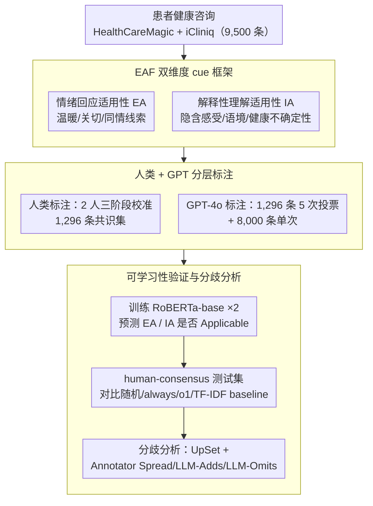

# Empathy Applicability Modeling for General Health Queries

**会议**: ACL2026 Findings  
**arXiv**: [2601.09696](https://arxiv.org/abs/2601.09696)  
**代码**: https://github.com/shanmrandhawa/Empathy-Applicability-Framework  
**领域**: 医疗NLP / 临床同理心建模  
**关键词**: clinical empathy, health queries, empathy applicability, annotation framework, RoBERTa classifier

## 一句话总结
本文提出 Empathy Applicability Framework (EAF)，先判断患者单轮健康咨询中是否“适合”表达情绪回应或解释性理解，再用人类与 GPT-4o 标注构建基准并训练分类器，为医疗 LLM 回答前的同理心需求识别提供上游信号。

## 研究背景与动机
**领域现状**：临床沟通中的同理心通常包含理解患者处境、回应情绪和采取行动等成分。NLP 里已有 EmpatheticDialogues、ESConv、EPITOME 等框架，多数关注“如何生成或评价同理心回应”。

**现有痛点**：医疗问答并不是每个 query 都需要情绪化回应。比如纯事实性问题更适合直接医学信息，而带有恐惧、严重症状、生活负担或不确定性的 query 才需要不同程度的情绪回应或解释性理解。现有框架往往在回答生成之后标注同理心，缺少回答前的 applicability decision。

**核心矛盾**：LLM 如果无差别表达同理心，可能显得空泛、冒犯或偏离事实；如果完全不表达，又会错过患者真正的情绪需求。因此系统需要先判断“什么时候应该同理心回应、应该是哪种同理心”。

**本文目标**：作者希望建立一个 cue-based 框架，用于在单轮、异步、general health queries 中预测两类同理心维度是否适用：Emotional Reactions Applicability (EA) 和 Interpretations Applicability (IA)。

**切入角度**：论文把同理心从 response quality 问题前移成 query understanding 问题。也就是说，不是先生成回答再看有没有同理心，而是在回答前识别患者 query 中的临床、语境和语言线索。

**核心 idea**：用 EAF 把“适合表达情绪温暖”和“适合理解/解释患者感受或处境”拆成两个二分类任务，并通过人类与 GPT 标注、分类器训练和分歧分析验证该框架可学、可解释但也保留主观性。

## 方法详解
EAF 的重点是 applicability，而不是生成具体同理心句子。框架把患者 query 分别标成 EA Applicable/Not Applicable 和 IA Applicable/Not Applicable。EA 更偏情绪回应，例如温暖、关切、同情；IA 更偏认知同理心，例如理解患者显性/隐性的感受、经历、语境或健康不确定性。

### 整体框架
作者先从 HealthCareMagic 和 iCliniq 公开数据中采样 9,500 条患者 query，其中 1,500 条预留给人类和 GPT 双重标注，剩余 8,000 条只由 GPT-4o 标注。人类标注部分经过三阶段训练校准后，最终 1,296 条 query 被两名人类标注者独立标注。GPT-4o 对这 1,296 条做五次 annotation pass 并用 majority vote 得到标签，对剩余 8,000 条做单次标注。随后，作者用这些标签训练两个独立的 RoBERTa-base 二分类器，分别预测 EA 和 IA 是否 Applicable，并与随机、always applicable、always not applicable、o1 zero-shot、TF-IDF+LR/SVM 等 baseline 比较。

### 关键设计
**1. EAF 双维度 cue framework：把"是否需要同理心"拆成情绪回应和解释性理解两个上游判断**

医疗问答里"患者有情绪"和"回答需要表达理解"并不是同一件事，把所有非事实问题都粗暴归为情绪支持只会让回答显得空泛。EAF 因此把同理心拆成两个二分类维度。EA（Emotional Reactions Applicability）看是否该给温暖、关切、同情这类情绪回应，它的 Applicable cues 包括 severe negative emotion、inferred negative state、seriousness of symptoms、concern for relations，Not Applicable cues 则是 routine health management、purely factual medical queries、neutral symptom descriptions、hypothetical queries。IA（Interpretations Applicability）则是认知同理心，关注 expression of feeling、experiences/context affecting emotional state、symptoms with emotional impact、distressing uncertainty about health 等线索。两个维度各自独立判断，正好能接住"没有显式情绪、但带着生活负担或健康不确定性"这类只需要解释性理解、不需要情绪安慰的 query。

**2. 人类标注 + GPT 标注的分层数据构建：用小而可信的人类共识集校准，用大规模 GPT 标注集放量**

同理心判断高度主观，众包很难拿到稳定标签，但纯靠人类又上不了量。EAF 把数据分两层：两名英语能力达标的 lay annotator 经过三阶段训练校准后，独立标注 1,296 条 query，构成高可信的人类共识集；GPT-4o 则用带定义、subcategory 描述和示例的 contrastive prompt 标注，对这 1,296 条做 5 次 annotation pass 再 majority vote 以提稳，对另外 8,000 条只做单次标注。强调一致性训练而非众包，是为了控住主观噪声；额外铺开 8,000 条 GPT 标注，则是要检验自动标签能否训练出逼近人类共识的模型。

**3. 可学习性验证与分歧分析：既证明标签可学，又把"为什么分歧"拆开看清楚**

EAF 若只停在概念框架就没有说服力，得证明它能形成可预测、可解释的标签模式。所有分类器统一在 human-consensus test set 上评估，看 accuracy、macro-F1、weighted-F1。但医疗同理心不能只追一个最高 F1——哪些 cue 分歧大、为什么分歧，才决定框架在真实系统里怎么校准。于是作者用 UpSet plot 检查 GPT 与人类是否选了相同的 subcategory rationale，再用 divergence bar 把 mismatch 拆成 Annotator Spread、LLM-Adds、LLM-Omits 三类，让分歧本身变成可分析的信号而非一团噪声。

### 损失函数 / 训练策略
建模任务是两个独立二分类任务：给定患者 query $P_i$，分别预测 $A_{i,EA}$ 和 $A_{i,IA}$ 是否为 Applicable。模型为 RoBERTa-base，训练 10 epochs，learning rate 为 $2\times10^{-5}$，batch size 为 8。Human Set 按 75%/5%/20% 划分训练、验证、测试；Autonomous Set 只用 GPT-labeled 8,000 条训练，但测试仍在同一个 human-consensus test set 上，以便和人类标签对齐比较。作者强调目标是验证 EAF 的可学习性，而不是追求 SOTA 架构。

## 实验关键数据

### 主实验
EAF 的可靠性先通过标注一致性衡量。人类之间达到中等一致性，GPT 与 human-consensus subset 的一致性更高。

| 维度 | Human-Human κ | Human-Human agree/disagree | Human-GPT κ | Human-GPT agree/disagree |
|------|--------------:|----------------------------:|------------:|--------------------------:|
| EA | 0.521 | 981 / 315 | 0.614 | 667 / 153 |
| IA | 0.404 | 898 / 398 | 0.659 | 681 / 139 |

分类结果显示，RoBERTa-base 明显优于简单 baseline 和 classical text classifiers，说明 EAF 标签具有可学习的语言模式。

| Training Set / Model | EA Acc | EA Macro-F1 | EA Wtd-F1 | IA Acc | IA Macro-F1 | IA Wtd-F1 |
|----------------------|-------:|------------:|----------:|-------:|------------:|----------:|
| Random | 0.47 | 0.47 | 0.47 | 0.44 | 0.43 | 0.44 |
| Always Applicable | 0.52 | 0.34 | 0.36 | 0.53 | 0.35 | 0.37 |
| Always Not Applicable | 0.48 | 0.32 | 0.31 | 0.47 | 0.32 | 0.30 |
| o1 Zero-Shot | 0.55 | 0.40 | 0.41 | 0.62 | 0.53 | 0.54 |
| Logistic Regression | 0.84 | 0.84 | 0.84 | 0.80 | 0.80 | 0.80 |
| Linear SVM | 0.83 | 0.83 | 0.83 | 0.77 | 0.77 | 0.77 |
| RoBERTa, Human Set | 0.92 | 0.92 | 0.92 | 0.87 | 0.87 | 0.87 |
| RoBERTa, GPT-only Autonomous Set | 0.85 | 0.85 | 0.85 | 0.78 | 0.77 | 0.77 |

### 消融实验
论文没有传统模块消融，但用训练数据来源和 baseline 形成了可解释的对照。

| 对照 | 目的 | 关键结果 | 说明 |
|------|------|---------:|------|
| o1 Zero-Shot vs RoBERTa | 检验框架标签是否比直接 LLM 判断更可学 | EA Macro-F1 0.40 vs 0.92，IA 0.53 vs 0.87 | 结构化标注训练明显优于零样本判断 |
| LR/SVM vs RoBERTa | 检验局部词面特征是否足够 | LR EA/IA Macro-F1 0.84/0.80，RoBERTa 0.92/0.87 | 词面 cue 很强，但上下文表示仍有增益 |
| Human Set vs GPT-only Set | 检验 GPT 标签是否可替代人类标签 | GPT-only RoBERTa EA/IA Macro-F1 0.85/0.77 | 自动标签有用，但相比人类共识有损失 |
| EA vs IA | 检验两个维度难度差异 | Human-Human κ: 0.521 vs 0.404 | IA 更依赖隐含感受和语境，主观性更高 |

### 关键发现
- 人类标注的一致性处于 empathy annotation 常见的中等区间，说明任务本身不是客观事实分类。
- GPT 与 human-consensus 的 κ 均超过 0.6，表示在较清晰 case 上，EAF 能有效指导 GPT 预测 empathy applicability。
- RoBERTa 在 human-consensus set 上达到 EA 0.92 Macro-F1、IA 0.87 Macro-F1，说明 EAF cue 不是随意主观标签，而是有稳定语言信号。
- 三类系统性挑战最突出：implied distress 的主观推断、clinical severity ambiguity、contextual hardship 的文化差异。

## 亮点与洞察
- 最大亮点是把同理心建模前移到“回答前是否适用”的判断。这个位置很关键，因为它可以作为生成模型的控制信号，而不是事后评价分数。
- EAF 的双维度设计避免了“情绪=同理心”的简单化。很多健康 query 没有显式情绪，但包含 distressing uncertainty 或生活负担，仍然需要解释性理解。
- 作者没有把分歧当成纯噪声，而是认真分析人类和 GPT 为什么不同意。这对医疗 NLP 特别重要，因为文化、性别、临床训练背景都会影响同理心判断。
- GPT-only 数据训练的模型仍有不错表现，说明可以用 LLM 扩展标注规模，但人类共识仍然明显更可靠。

## 局限与展望
- 作者明确指出，只有两名人类标注者，且都没有临床训练，无法代表更广泛的人群、患者或临床专家观点；临床严重性判断尤其可能受此限制。
- 自动标注只使用 GPT-4o，结果未必能泛化到 Gemini、Claude、reasoning models 或开源模型。
- 人类每个维度只选一个最显著 subcategory，而 GPT 可返回多个 subcategories；这种流程不一致会影响 rationale-level 分歧分析。
- 模型实验只用 RoBERTa-base 验证可学习性，没有探索 ModernBERT、更大 LLM 或 prompt-based classifiers 的上限。
- Applicable/Not Applicable 是二分类，无法表达同理心需求强度。低/中/高 applicability 或 uncertainty calibration 是自然后续方向，但需要更多标注和更细校准。
- 部署伦理上，EAF 应该辅助而非替代 clinician empathy judgment；自动化同理心如果表达不真诚，可能产生 uncanny valley 或操控感。

## 相关工作与启发
- **vs EPITOME**: EPITOME 评价回应中表达出的 empathy mechanisms，EAF 判断患者 query 是否需要这些机制，时间点更靠前。
- **vs EmpatheticDialogues / ESConv**: 这些数据集通常默认需要情绪支持；EAF 面向医疗健康 query，明确允许“此处不适合同理心表达”。
- **vs cause-aware empathetic generation**: cause-aware 方法在 empathy 已假定相关时增强生成；EAF 可作为上游 gate，决定是否以及如何触发这些生成策略。
- **vs zero-shot LLM classification**: 直接问 o1 是否适用同理心效果有限；结构化 cue framework + 标注训练能显著提升稳定性。
- **启发**: 对医疗 LLM 来说，回答风格控制不应只靠系统提示词，还需要 query-level 的情绪/认知需求识别器。

## 评分
- 新颖性: ⭐⭐⭐⭐☆ 把 empathy 从响应评价前移到 applicability modeling，问题定义很有价值。
- 实验充分度: ⭐⭐⭐⭐☆ 有标注一致性、模型训练、baseline、分歧分析和 limitations，但标注者规模和模型家族仍偏窄。
- 写作质量: ⭐⭐⭐⭐☆ 框架定义清楚，分歧案例和伦理讨论让论文更可信。
- 价值: ⭐⭐⭐⭐⭐ 对医疗 LLM、异步患者消息和临床沟通辅助系统都有直接应用价值。

<!-- RELATED:START -->

## 相关论文

- [\[ACL 2026\] HypEHR: Hyperbolic Modeling of Electronic Health Records for Efficient Question Answering](hypehr_hyperbolic_modeling_of_electronic_health_records_for_efficient_question_a.md)
- [\[NeurIPS 2025\] Faithful Summarization of Consumer Health Queries: A Cross-Lingual Framework with LLMs](../../NeurIPS2025/medical_nlp/faithful_summarization_of_consumer_health_queries_a_cross-lingual_framework_with.md)
- [\[ACL 2026\] Can Continual Pre-training Bridge the Performance Gap between General-purpose and Specialized Language Models in the Medical Domain?](can_continual_pre-training_bridge_the_performance_gap_between_general-purpose_an.md)
- [\[ACL 2026\] ProMedical: Hierarchical Fine-Grained Criteria Modeling for Medical LLM Alignment via Explicit Injection](promedical_hierarchical_fine-grained_criteria_modeling_for_medical_llm_alignment.md)
- [\[ACL 2026\] Responsible Evaluation of AI for Mental Health](responsible_evaluation_of_ai_for_mental_health.md)

<!-- RELATED:END -->
