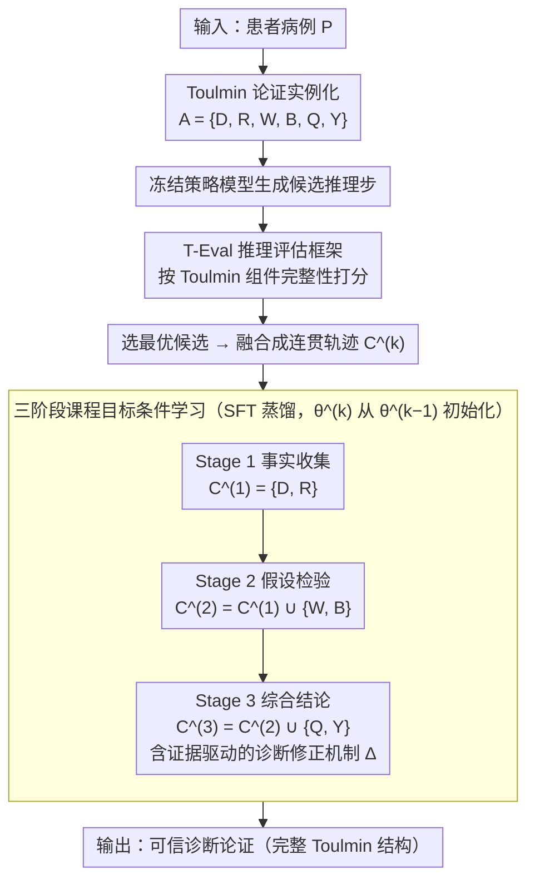

# From Answers to Arguments: Toward Trustworthy Clinical Diagnostic Reasoning with Toulmin-Guided Curriculum Goal-Conditioned Learning

**会议**: ACL 2026  
**arXiv**: [2604.11137](https://arxiv.org/abs/2604.11137)  
**代码**: [https://github.com/Leonard-zc/CGCL](https://github.com/Leonard-zc/CGCL)  
**领域**: 医学NLP
**关键词**: 临床推理、Toulmin论证模型、课程学习、目标条件学习、可信诊断

## 一句话总结
本文将Toulmin论证模型适配到临床诊断过程，提出CGCL三阶段课程训练框架（事实收集→假设检验→综合结论），配合T-Eval量化评估推理结构完整性，在无需RL的情况下实现与RL方法可比的诊断推理质量。

## 研究背景与动机

**领域现状**：LLM在医学基准（如MedQA、USMLE）上表现优异甚至超越人类专家，但标准化考试≠真实临床实践。临床决策需要在不确定性下推理、整合不完整信息、承受错误代价。

**现有痛点**：(1) 当前LLM存在危险的"正确答案+错误推理"现象——通过模式匹配得出正确结论但推理过程有缺陷，信号缺乏稳健理解；(2) 现有评估仅关注最终答案正确性，不检验推理路径的逻辑性和证据支撑；(3) RL方法理论上可以优化推理质量，但奖励模型设计难、训练不稳定、计算需求高。

**核心矛盾**：在医学领域，正确答案但错误推理比错误答案更危险——它给人虚假的信心，在面对真实临床复杂性时会不可预测地失败。当前评估范式通过只看结果来系统性地高估LLM的实际能力。

**本文目标**：(1) 建立结构化的临床推理评估框架；(2) 设计稳定高效的训练方法来教LLM进行Toulmin式论证推理。

**切入角度**：Toulmin论证模型强调主张必须有证据支持、不确定性限定和反驳防御——这与临床医生从症状到诊断的推理过程高度吻合。将此模型实例化为临床诊断的结构化输出。

**核心 idea**：三阶段课程模拟医学培训的自然进阶——住院医提取事实和初步鉴别→高年资住院医假设检验和反驳→主治医综合判断和限定结论。

## 方法详解

### 整体框架
CGCL 把“评估”和“训练”两件事打通：评估侧是 T-Eval——一个基于 Toulmin 论证模型、直接量化推理质量的框架；训练侧是一条三阶段的目标条件离线模仿学习管线——用冻结的策略模型生成候选推理轨迹，让 T-Eval 给它们打分挑出最优，再把最优轨迹 SFT 蒸馏进目标模型。整条流程不碰 RL，却想达到 RL 级别的推理质量。

### 关键设计

**1. T-Eval 推理评估框架：不看答案对不对，而看论证结构完不完整**

仅凭最终诊断是否正确去评判模型，会把“靠模式匹配猜对”和“靠严谨推理论证对”两种模型混为一谈——它们的答案准确率可能完全相同，临床可靠性却天差地别。T-Eval 的破法是把一次诊断推理形式化成一个 Toulmin 论证 $A=\{D,R,W,B,Q,Y\}$：$D$ 是案例证据，$R$ 是鉴别诊断排名，$W$ 是从证据到假设的论证（病理生理学链接），$B$ 是支持性临床原则，$Q$ 是不确定性校准，$Y$ 是最终诊断。对这六个组件分别独立评分再综合成论证完整性分数，推理路径本身就从“看不见的过程”变成了可测量的对象，那些答案对、却缺 $W$/$B$/$Q$ 支撑的“虚假自信”模型也就被直接暴露出来。

**2. 三阶段课程目标条件学习：照着医学训练的进阶顺序，从提事实一路教到下结论**

直接让模型一步生成完整论证，对能力有限的模型太难、往往学不扎实。CGCL 改成把目标条件 $C$ 逐级加码，模拟住院医→高年资住院医→主治医的成长路径。Stage 1 事实收集，目标 $C^{(1)}=\{D,R\}$，模型只需提取临床发现并给出初步鉴别诊断；Stage 2 假设检验，$C^{(2)}=C^{(1)}\cup\{W,B\}$，模型要用病理生理学证据论证主假设、并反驳替代诊断；Stage 3 综合结论，$C^{(3)}=C^{(2)}\cup\{Q,Y,\Delta\}$，模型整合全部分析、给出带不确定性限定的结论，必要时做证据驱动的修正。每个阶段的训练数据都由策略模型生成候选 → T-Eval 评分选最优 → 融合成连贯轨迹 → SFT 蒸馏，且每阶段从上一阶段的模型初始化，让能力一层层累积而不是推倒重来。

**3. 证据驱动的诊断修正机制：逼模型在证据指向变了时改口，而不是死守初判**

好的临床医生不只是一次答对，更要在发现初判有误时基于新证据纠正自己，这种元认知能力恰恰是临床可信度的核心。CGCL 把它写进 Stage 3 的硬约束：当最终诊断 $Y$ 与 Stage 1 的初步排名不一致时，模型必须生成修正理由 $\Delta$，明确说清是哪些证据触发了诊断变更，并用一个修正指标 $\mathbb{I}_{\text{rev}}$ 标记本次是否发生了修正。这样修正不再是模型偶然的“反悔”，而成了被显式训练、可被检验的行为。

### 损失函数 / 训练策略
标准SFT的负对数似然损失，三阶段顺序训练。每阶段的训练数据由策略模型（如GPT-4）生成候选、T-Eval评分、最优选择后融合构成。不使用RL，仅用模仿学习。

## 实验关键数据

### 主实验

| 方法 | 诊断准确率 | T-Eval推理分数 | 训练稳定性 |
|------|-----------|---------------|-----------|
| 直接SFT | 中等 | 低 | 高 |
| RL方法（GRPO等） | 高 | 中高 | 低（不稳定） |
| CGCL | **高（可比RL）** | **高** | **高** |

### 消融实验

| 配置 | 准确率 | T-Eval | 说明 |
|------|--------|--------|------|
| Full CGCL (3阶段) | 最优 | 最优 | 完整课程 |
| 单阶段直接生成 $C^{(3)}$ | 较低 | 较低 | 缺少渐进式能力构建 |
| w/o 诊断修正 | 略低 | 低于完整 | 元认知能力的贡献 |
| w/o T-Eval选择 | 下降 | 下降 | 随机轨迹质量不够 |

### 关键发现
- CGCL在诊断准确率上与RL方法可比，但训练更稳定、计算更高效
- T-Eval揭示了"答案正确但推理有缺陷"的隐藏问题——某些高准确率的方法在推理质量上明显不足
- 课程式训练对小模型的提升最为显著——能力有限时更需要渐进式引导
- 证据驱动的修正机制对临床可信度至关重要

## 亮点与洞察
- **从"做对题"到"讲清楚"的范式转变**：T-Eval将临床推理质量从主观评估提升为可量化的自动指标，这对所有需要可解释推理的领域都有价值。
- **课程学习替代RL**：通过精心设计的课程可以达到RL的推理质量水平，但避免了奖励设计和训练不稳定性。这为资源受限的场景提供了实用选择。
- **Toulmin模型的临床实例化**：将哲学论证理论与临床实践精确对接，提供了一个可操作的结构化推理框架。

## 局限与展望
- 依赖GPT-4作为策略模型生成候选轨迹，成本仍然不低
- T-Eval的评分质量依赖于评估LLM的能力
- 仅在诊断推理上验证，未扩展到治疗决策或预后评估
- 三阶段的划分是手工设计的，可探索更细粒度或自适应的课程

## 相关工作与启发
- **vs HuatuoGPT-O1**：通过CoT蒸馏+RL训练，但不评估推理结构。CGCL直接优化推理的Toulmin完整性
- **vs MedPRM**：训练过程奖励模型监督推理路径，成本高。CGCL用T-Eval做离线质量评估替代在线PRM
- **vs 一般临床LLM**：多数临床LLM仅优化答案准确率，CGCL首次将推理结构作为一等优化目标

## 评分
- 新颖性: ⭐⭐⭐⭐⭐ Toulmin模型的临床实例化和T-Eval框架是原创性很强的贡献
- 实验充分度: ⭐⭐⭐⭐ 与多种基线和方法的充分对比，T-Eval提供新维度的评估
- 写作质量: ⭐⭐⭐⭐⭐ 问题动机深刻（"正确答案+错误推理"的危险），方法设计优雅
- 价值: ⭐⭐⭐⭐⭐ 对医学AI的可信度提出了根本性的方法论贡献

<!-- RELATED:START -->

## 相关论文

- [\[ACL 2026\] CURE-Med: Curriculum-Informed Reinforcement Learning for Multilingual Medical Reasoning](cure-med_curriculum-informed_reinforcement_learning_for_multilingual_medical_rea.md)
- [\[ACL 2026\] Dr. Assistant: Enhancing Clinical Diagnostic Inquiry via Structured Diagnostic Reasoning Data and Reinforcement Learning](dr_assistant_enhancing_clinical_diagnostic_inquiry_via_structured_diagnostic_rea.md)
- [\[ACL 2026\] MultiDx: A Multi-Source Knowledge Integration Framework towards Diagnostic Reasoning](multidx_a_multi-source_knowledge_integration_framework_towards_diagnostic_reason.md)
- [\[ACL 2026\] RADS: Reinforcement Learning-Based Sample Selection Improves Transfer Learning in Low-resource and Imbalanced Clinical Settings](rads_reinforcement_learning-based_sample_selection_improves_transfer_learning_in.md)
- [\[ACL 2026\] Learning Dynamic Representations and Policies from Multimodal Clinical Time-Series with Informative Missingness](learning_dynamic_representations_and_policies_from_multimodal_clinical_time-seri.md)

<!-- RELATED:END -->
