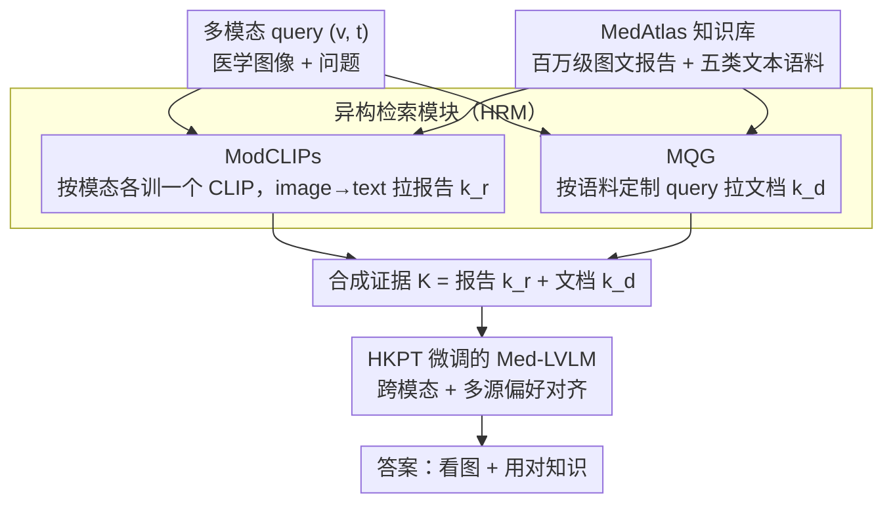

# HeteroRAG: A Heterogeneous Retrieval-Augmented Generation Framework for Medical Vision Language Tasks

**会议**: ACL 2026  
**arXiv**: [2508.12778](https://arxiv.org/abs/2508.12778)  
**代码**: https://github.com/Jack-ZC8/HeteroRAG-Med  
**领域**: 医学NLP
**关键词**: 异构 RAG、模态专用 CLIP、多语料查询生成、偏好微调、Med-LVLM

## 一句话总结
HeteroRAG 构建了 270 万张图文对 + 五类语料的 MedAtlas 知识库，把医学多模态 RAG 拆成三件套——按模态分训的 ModCLIPs 拉报告、按语料定制 query 的 MQG 拉文档、用 HKPT 偏好微调对齐跨模态与多源知识——让 7B 模型在 11 个数据集上稳定击败 4-5× 参数量的开源 Med-LVLM。

## 研究背景与动机

**领域现状**：Med-LVLM（医学多模态大模型）已被广泛用于多模态诊断和临床决策辅助，但事实性和可靠性差严重制约真实部署。主流缓解方案是多模态 RAG：用医学 CLIP（FactMM-RAG、RULE、MMed-RAG）按图像检索相关报告作为上下文，或者用 zero-shot query rewriting（ChatCAD+、MIRA）去检索文档。

**现有痛点**：(1) **报告检索差**——现有医学 CLIP 只在极少数公开数据集训练集上微调，retrieval recall 很低（Radiology recall@5 ~30），检索到的报告往往无关，反而污染生成；(2) **文档检索更糟**——医学语料（研究论文、教材、临床指南、知识图谱）语言风格各异，统一用一个 multimodal query 直接搜根本搜不到对的；MIRA 的 zero-shot rewriting 也没法适配每个语料的特性；(3) **知识不对齐**——即便检索回来，模型也常常忽略图像直接抄报告，或者反过来固守内部知识不用外部证据。

**核心矛盾**：医学 RAG 的两类知识源（image-text 报告 vs 纯文本异构语料）需要根本不同的检索策略，但现有工作把它们硬塞进同一个 retriever；同时即便检索准了，cross-modality 与 multi-source 两条对齐线都没被显式处理。

**本文目标**：(1) 构一个真正"大且广"的医学多模态知识库，把报告库扩到百万级、语料从单一文献扩到 5 种类型；(2) 给报告和文档分别设计"对症"的检索器；(3) 用统一的偏好学习框架同时治"模态忽略"和"知识利用/鲁棒性"两类对齐问题。

**切入角度**：(a) 不同模态（放射、眼科、病理）的图文对齐分布差异很大 → 每个模态单训一个 ModCLIP；(b) 不同语料（PubMed、Wikipedia、教材、指南、知识图谱）需要不同 query 风格 → 训一个 Multi-Corpora Query Generator (MQG) 显式按语料生成专属查询；(c) cross-modality 和 multi-source 都可以通过构造"应该用 vs 不该用"的反事实偏好对来对齐。

**核心 idea**：把"异构"作为一等公民——异构知识库 + 异构检索器（图侧 ModCLIPs + 文侧 MQG） + 异构知识偏好微调（HKPT 同时管模态与多源对齐）。

## 方法详解

### 整体框架
HeteroRAG 把“异构”贯彻到三个串联模块里。第一块是 **MedAtlas 知识库**——Radiology 1.10M / Ophthalmology 0.11M / Pathology 1.51M 图文对，外加 Research/Wiki/Book/Guideline/Graph 五类文本语料，规模和广度都比以往医学 RAG 的知识库大一截。第二块是 **Heterogeneous Retrieval Module (HRM)**：图侧用按模态各训一个 BiomedCLIP 的 ModCLIPs 去拉相关报告，文侧用 **Multi-Corpora Query Generator (MQG)** 对每个多模态 query $(v,t)$ 生成多语料定制查询集 $Q=\{(i,j,q_j^i)\}$ 去拉文档。第三块是 **Heterogeneous Knowledge Preference Tuning (HKPT)**：构造跨模态对齐 $\mathcal{D}_{cm}$ 和多源对齐 $\mathcal{D}_{mk}$ 两类偏好对，用一个 DPO 风格 loss $\mathcal{L}_{\text{HKPT}}$ 一次性把“看图”和“用对知识”一起调好。

### 关键设计

**1. Modality-specific CLIPs（ModCLIPs）：每个模态配一个专属检索器，而不是一个 CLIP 通吃**

医学影像在不同模态下的视觉统计差异极大——X-ray 的灰度、眼底彩照、病理 H&E 几乎是三种世界，单一“通用医学 CLIP”学出的特征空间不够分化，跨模态噪声还会互相干扰，这正是现有医学 CLIP retrieval recall 偏低的根源。HeteroRAG 干脆从 BiomedCLIP 初始化、对每个模态各分出 2000 dev / 2000 test 后，用剩下的全部样本（Radiology 1.10M、Oph 0.11M、Pathology 1.51M）单独做对比学习，训练量比“只在几个公开数据集训练集上微调”大了一个数量级。结果三个 ModCLIPs 在 image→text recall@5 上分别冲到 79.40 / 47.55 / 77.35，相对 FactMM-RAG 的 44.25（Rad）、MMed-RAG 的 19.25（Oph）/30.20（Pat）翻倍以上——在垂直域里，“分模态训”几乎总值得做。

**2. Multi-Corpora Query Generator（MQG）：给每个语料“对症”生成检索 query**

PubMed 论文吃的是科学术语，Wikipedia 要通用百科表述，临床指南认疾病/操作命名，知识图谱要 “term, relation” 结构——硬用一个 multimodal query 拉所有语料，就像拿一把钥匙开五把不同的锁，这也是 MIRA 那种 zero-shot rewriting 搜不准的原因。MQG 把“按语料风格生成查询”显式参数化训练：对每个 $(v,t)$ 让 expert MLLM（Lingshu-32B AWQ）在每个语料源上探索性生成 6 个候选查询，再让同一个 expert 当 judge 评判每个 query 检回的文档是否支撑参考答案（这套 VLM-as-a-judge 在 500 样本人工核对上 acc=0.836、F1=0.855）。被判支撑的归 $Q_w$、不支撑的归 $Q_l$，然后两段训 MQG：先 SFT 学会生成好查询 $\mathcal{L}_{\text{SFT}}=-\mathbb{E}\log\mathcal{M}_\theta(Q_w\mid v,t)$，再用 DPO 把好坏查询拉开

$$\mathcal{L}_{\text{DPO}}=-\log\sigma\Big(\beta\log\tfrac{\mathcal{M}_\theta(Q_w\mid v,t)}{\mathcal{M}_{\text{ref}}}-\beta\log\tfrac{\mathcal{M}_\theta(Q_l\mid v,t)}{\mathcal{M}_{\text{ref}}}\Big).$$

比起 prompt 级的 zero-shot rewriting，这是把“哪种 query 配哪种语料”变成可学习的行为，强出一档。

**3. Heterogeneous Knowledge Preference Tuning（HKPT）：一个 DPO loss 同治三种“知识不对齐”病**

检索准了不代表用得对——模型常犯三种病：忽略图像直接抄报告、不会用外部知识、或对噪声知识不够鲁棒。以前 MMed-RAG 类只治模态对齐、K-LLaVA 类只治文档利用，没人把三种一起管。HKPT 用反事实数据构造把它们统一成 chosen/rejected 偏好对。跨模态那套 $\mathcal{D}_{cm}$：检索与 $v$ 同模态训练集中最不相似的图当 $v^*$，若 $\mathcal{M}(v,t,K)=y$、$\mathcal{M}(v^*,t)\ne y$、却 $\mathcal{M}(v^*,t,K)=y$，说明模型用错图也能答对、纯靠抄 $K$ 不看图，于是把 $(v,t,K)$ 设为 chosen、$(v^*,t,K)$ 设为 rejected 逼它看图。多源那套 $\mathcal{D}_{mk}$：对 $k\in\{\{k_r\},\{k_d\},\{k_r,k_d\}\}$ 各查两步——利用度上，若 $\mathcal{M}(v,t,K)=y$ 但 $\mathcal{M}(v,t,K\setminus k)\ne y$，说明 $k$ 关键，chosen 是带 $K$ 的正答；鲁棒性上，若 $\mathcal{M}(v,t,K\setminus k)=y$ 但 $\mathcal{M}(v,t,K)\ne y$，说明 $k$ 是噪声，chosen 改成“忽略 $k$ 的正答” $y_w$。所有偏好对最后一并扔进

$$\mathcal{L}_{\text{HKPT}}=-\mathbb{E}\log\sigma\Big(\beta\log\tfrac{\mathcal{M}_{\theta'}(y_w\mid x_w)}{\mathcal{M}_{\text{ref}'}}-\beta\log\tfrac{\mathcal{M}_{\theta'}(y_l\mid x_l)}{\mathcal{M}_{\text{ref}'}}\Big)$$

一遍优化，相当于用模型自己的预测变化“免费”造出监督信号，把忽略图 / 不会用 / 太信噪声三个失败模式一次性掰回来。

### 一个完整示例：一道放射 VQA 怎么走完三模块
假设输入是一张胸片 $v$ 加问题 $t$“是否有气胸”。先进 HRM 图侧：Radiology 那个 ModCLIP 把 $v$ 编码后在百万级报告库里做 image→text 检索，拉回几条最贴合的放射报告 $k_r$。与此同时文侧 MQG 接过 $(v,t)$，针对五类语料各自生成专属 query——给 Research 出术语化查询、给 Guideline 出“气胸 处理”式命名、给 Graph 出“pneumothorax, treatment”结构——分别检回文档 $k_d$。两路证据合成 $K=\{k_r,k_d\}$ 喂给经过 HKPT 微调的 Med-LVLM：因为训练时被跨模态反事实对逼着“必须看图”，它不会无视胸片直接照抄报告；又因为学过“哪条知识该用、哪条是噪声”，它会采信真正支撑诊断的报告与指南、过滤掉跑偏的文档，最后给出带证据的答案。这一路下来报告补图像贴合度、文档补开放域知识，正好对应后面消融里 w/o Doc 在开放域 QA 暴跌、w/o Reports 在贴图任务掉分的现象。

### 损失函数 / 训练策略
ModCLIPs：单模态图文对比学习。MQG：SFT + DPO 两段。Med-LVLM：HKPT 用 $\mathcal{L}_{\text{HKPT}}$ DPO 风格统一微调。底模 Lingshu-7B。

## 实验关键数据

### 主实验：医学 VQA（Lingshu-7B 底模，Accuracy ↑）

| 方法 | 检索 | VQA-RAD | SLAKE | OMVQA-Rad† | DME-VQA | OMVQA-Oph† | PathMMU | PathVQA | Quilt-VQA† |
|------|------|---------|-------|------------|---------|------------|---------|---------|------------|
| Original | — | 72.79 | 83.65 | 74.92 | 81.92 | 80.83 | 57.36 | 77.38 | 49.27 |
| FactMM-RAG (Report) | R | 76.84 | 83.89 | 75.58 | 81.92 | 81.50 | 73.58 | 91.98 | 69.68 |
| MMed-RAG (Report) | R | 75.74 | 86.06 | 76.33 | 80.70 | 79.08 | 68.06 | 85.67 | 67.35 |
| K-LLaVA (Doc) | D | 77.21 | 84.62 | 76.00 | 88.48 | 83.75 | 73.75 | 87.76 | 61.81 |
| MIRA (R+D) | R+D | 76.84 | 84.38 | 76.58 | 87.95 | 82.50 | 74.25 | **92.10** | 68.80 |
| **HeteroRAG (R+D)** | R+D | **81.99** | **87.50** | **80.42** | **88.56** | **86.00** | **75.59** | 90.83 | **72.89** |

(†=OOD 数据集，无训练 split。)

报告生成（BLEU/ROUGE-L/RaTEScore/METEOR）上 HeteroRAG 同样在 MIMIC-CXR / IU-Xray / Harvard-FairVLMed 多数指标 SOTA（详 Table 4）。Figure 3 显示 HeteroRAG-7B 超越 HuatuoGPT-V-34B、HealthGPT-32B、Lingshu-32B 等 4-5× 参数模型。

### 消融：知识源、SFT vs HKPT、Retriever 对比

| 配置 | OMVQA-Rad | OMVQA-Oph | Quilt-VQA |
|------|------|------|------|
| Original | 74.92 | 80.83 | 49.27 |
| SFT | 75.00 | 82.17 | 63.85 |
| **HeteroRAG** | **80.42** | **86.00** | **72.89** |
| w/o Reports | 75.08 | 81.33 | 62.97 |
| w/o Doc | 74.17 | 79.08 | 53.94 |
| w/o Research | 79.42 | 84.33 | 68.80 |
| w/o Wiki | 77.75 | 84.00 | 67.64 |
| w/o Book | 75.17 | 80.92 | 67.06 |
| w/o Guideline | 79.33 | 84.58 | 69.68 |
| w/o Graph | 78.58 | 83.25 | 66.47 |

Retriever 对比（image→text Recall@5）：HeteroRAG 的 ModCLIPs 在 Rad/Oph/Pat 上分别 79.40/47.55/77.35，吊打前 SOTA FactMM-RAG 44.25 / MMed-RAG 19.25 / 30.20。

### 关键发现
- **报告 + 文档缺一不可**：w/o Doc 在 Quilt-VQA 上从 72.89 暴跌到 53.94，证明纯报告 RAG 对开放域 OOD 病理 QA 严重不足；w/o Reports 在 OMVQA-Rad 上从 80.42 跌到 75.08，证明报告对图像贴合度更强的任务必不可少。
- **HKPT 比纯 SFT 强 5–9 个点**：在三个 OOD 数据集上 SFT 只能小幅提升，而 HKPT 显著拉开，证明偏好微调比纯监督更能强迫模型"看图 + 用对知识"。
- **不同语料贡献差异巨大**：w/o Book 在 OMVQA-Oph 上几乎掉到 baseline，说明医学教材对眼科 QA 极关键；w/o Research 影响较小可能是 PubMed 太宽泛覆盖度低；w/o Graph 影响中等说明知识图谱的"term+relation"结构对术语类问题有用。
- **小模型 + 好 RAG > 大模型**：7B + HeteroRAG 多数任务上超过 32B Lingshu 原版，证明把算力花在"检索质量 + 知识对齐"上比堆参数划算。

## 亮点与洞察
- **"按模态切 retriever"的简单想法被推到极致**：医学 RAG 一直假设可以一个 CLIP 通吃所有模态；本文用三个独立 ModCLIP + 各自百万级数据训练就让 recall 翻倍——这说明在垂直域，"分模态训"几乎总值得做，不光医学，遥感、卫星、显微镜场景都适用。
- **MQG 把"语料适配"提升到训练目标**：之前 RAG 里 query rewriting 多是 prompt trick；本文用 VLM-as-a-judge 自动产生 chosen/rejected DPO 数据再训一个专门生成器，是把"哪种 query 配哪种语料"作为可学习行为，思路可以迁移到法律、金融等多语料 RAG。
- **HKPT 的反事实偏好构造**：用"换不相关图仍能答对" → 模型在抄知识；用"去掉 k 就答错" → 知识是关键；这种"用模型自己的预测变化构造正负对"的范式让监督信号几乎免费，是 RLAIF 思路在 RAG 对齐上的优雅实例化。

## 局限与展望
- **MedAtlas 仍偏英文 + 三种成像模态**：CT、MRI、超声、心电等其他重要模态未覆盖；中文/低资源语言医学语料缺失。
- **依赖 Lingshu-32B 做 judge 与 query 生成**：整个 pipeline 的"上限"被这个 32B 老师模型锁死；judge accuracy 0.836 在医学场景下仍可能错 16%。
- **HKPT 偏好对靠模型自身预测构造**：可能放大底模偏置（如果底模本来就常忽略某类图像，反事实对会自己强化这种偏置）。
- **可改进方向**：扩到 CT/MRI/中文医学语料；用更强的 ensemble judge；引入主动学习按 retrieval 不确定性扩 MedAtlas；将 MQG 与 retriever 端到端联合优化。

## 相关工作与启发
- **vs FactMM-RAG / RULE / MMed-RAG**：那批前作都只做报告检索 + 模态对齐，没有文档侧；HeteroRAG 把文档侧 + 多源对齐补齐，且 retriever 训练数据规模高出一个量级。
- **vs K-LLaVA / MKGF**：他们只做文档检索没报告检索，且文档检索仍是单一 query；HeteroRAG 用 MQG 对每个语料定制 query 更细致。
- **vs MIRA**：MIRA 是 report+doc 但只 zero-shot rewriting，HeteroRAG 把 rewriting 升级为 SFT+DPO 训练的 MQG，且整体对齐用 HKPT，比 MIRA 在多数 benchmark 高 4–6 个点。
- **vs 文本-only Multi-Corpora Query (Chen 2025)**：本文把那条思路扩展到多模态医学场景，并解决了视觉证据如何融入查询生成的开放挑战。

## 评分
- 新颖性: ⭐⭐⭐⭐ MQG 多语料定制查询 + HKPT 异构偏好统一对齐两点在医学 RAG 是新组合
- 实验充分度: ⭐⭐⭐⭐⭐ 11 数据集 × 3 模态 × 4 类基线 + retriever 对比 + 7 维消融，非常扎实
- 写作质量: ⭐⭐⭐⭐ 三模块图清晰，HKPT 算法伪代码完整，表格读起来不费劲
- 价值: ⭐⭐⭐⭐ MedAtlas + ModCLIPs 都开源直接是医学 MMRAG 社区的基础设施

<!-- RELATED:START -->

## 相关论文

- [\[ACL 2026\] SEMA-RAG: A Self-Evolving Multi-Agent Retrieval-Augmented Generation Framework for Medical Reasoning](sema-rag_a_self-evolving_multi-agent_retrieval-augmented_generation_framework_fo.md)
- [\[ACL 2026\] RA-RRG: Multimodal Retrieval-Augmented Radiology Report Generation with Key Phrase Extraction](ra-rrg_multimodal_retrieval-augmented_radiology_report_generation_with_key_phras.md)
- [\[ACL 2025\] MedBioRAG: Semantic Search and Retrieval-Augmented Generation with Large Language Models for Medical and Biological QA](../../ACL2025/medical_nlp/medbiorag_semantic_search_and_retrieval-augmented_generation_for_biomedical_lite.md)
- [\[ACL 2025\] Towards Omni-RAG: Comprehensive Retrieval-Augmented Generation for Large Language Models in Medical Applications](../../ACL2025/medical_nlp/omni_rag_medical.md)
- [\[ACL 2026\] Region-Grounded Report Generation for 3D Medical Imaging: A Fine-Grained Dataset and Graph-Enhanced Framework](region-grounded_report_generation_for_3d_medical_imaging_a_fine-grained_dataset_.md)

<!-- RELATED:END -->
