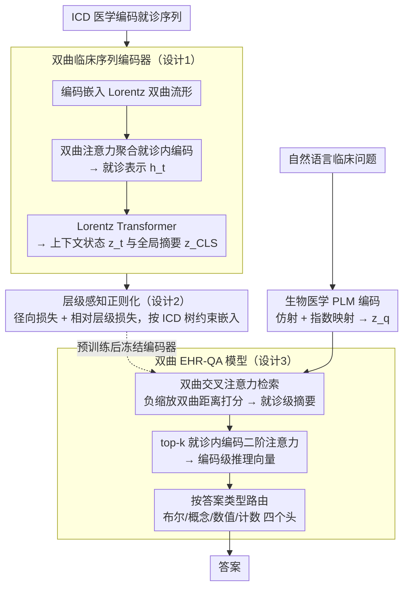

# HypEHR: Hyperbolic Modeling of Electronic Health Records for Efficient Question Answering

**会议**: ACL 2026 (Findings)  
**arXiv**: [2604.21027](https://arxiv.org/abs/2604.21027)  
**代码**: [https://github.com/yuyuliu11037/HypEHR](https://github.com/yuyuliu11037/HypEHR)  
**领域**: 医疗NLP
**关键词**: 电子病历问答, 双曲空间, Lorentz模型, ICD层级建模, 轻量化临床模型

## 一句话总结
本文提出 HypEHR，一个仅 22M 参数的洛伦兹双曲模型，将医学编码、就诊记录和问题嵌入双曲空间，通过层级感知正则化对齐 ICD 本体结构，在 MIMIC-IV 电子病历问答任务上接近 LLM 方法的效果。

## 研究背景与动机

**领域现状**：电子病历问答 (EHR-QA) 旨在回答关于患者纵向记录的自然语言临床问题。当前方法主要分三类：EHR 表示学习（序列/图模型）、Text-to-SQL 语义解析、以及基于 GPT-3.5/4 的检索增强 LLM 管线。

**现有痛点**：这些方法虽然准确，但计算开销大、在严格隐私约束下难以部署，且大多忽略了 EHR 数据中的强结构先验。LLM 管线参数量达万亿级别，难以在院内本地部署。

**核心矛盾**：医学编码和患者轨迹本质上是层级结构的（ICD 编码按章节→类块→类别→子类别组织），欧氏空间嵌入会扭曲这种树状结构，而现有方法未充分利用这一几何先验。

**本文目标**：构建一个紧凑的、与 EHR 内在几何一致的模型，用远少于 LLM 的参数在复杂问答任务上达到可比性能。

**切入角度**：双曲空间可以以任意低失真嵌入层级结构。之前的研究已经证明双曲嵌入可以改善医学编码层级建模，但最终的患者表示仍在欧氏空间建模。作者提出直接在双曲空间建模患者级表示。

**核心 idea**：用洛伦兹双曲流形嵌入 ICD 编码、就诊和问题，通过层级感知正则化对齐 ICD 本体，再用几何一致的交叉注意力和类型特定的指针头回答问题。

## 方法详解

### 整体框架

HypEHR 想回答一个问题：能不能不靠万亿参数的 LLM，用一个几何上"长得像 EHR"的小模型把电子病历问答做好。它的核心赌注是——医学编码和患者轨迹本质是层级树状的（ICD 按章节→类块→类别→子类别组织），而双曲空间天生能以极低失真嵌入树结构，所以整个模型从编码、就诊到问题全程留在洛伦兹双曲流形里建模。训练分两阶段：先在双曲空间预训练患者编码器（联合下次就诊预测和层级正则化），再冻结它、按答案类型（布尔/概念/数值/计数）训练四个轻量的问答头。全模型仅 22M 参数。

### 关键设计

**1. 双曲临床序列编码器：全程留在双曲空间，避免反复换坐标系丢掉层级结构**

如果在欧氏空间里嵌入 ICD 这种树状本体，树的指数级分支会被挤压扭曲、层级信息随之损失。HypEHR 把每个医学编码 $c$ 直接嵌入 Lorentz 双曲流形 $\mathbb{H}_L^d$，先用双曲注意力把同一次就诊内的编码嵌入聚合成就诊表示 $h_t$，再用多层 Lorentz Transformer（把自注意力、残差连接、归一化全部适配到 Lorentz 流形上）处理就诊序列，输出上下文化状态 $\{z_t\}_{t=1}^T$ 和全局摘要 $z_{\text{[CLS]}}$。关键在于"全程在双曲空间操作"：以往做法常在欧氏→双曲→欧氏之间来回转换，每转一次都损失几何信息，而这里一路留在流形上，表示能自然保持 ICD 的层级结构。

**2. 层级感知正则化：用两条几何约束把 ICD 本体的树形显式写进嵌入空间**

单靠下次就诊预测这个任务，模型并不会主动学到编码之间谁是谁的父节点。HypEHR 据此加了两条直接来自 ICD 代码树（章节→类块→类别→子类别）的约束：径向层级损失 $\mathcal{L}_{\text{rad}}$ 要求父节点嵌入的双曲范数小于子节点，也就是越深的诊断码离原点越远；相对层级损失 $\mathcal{L}_{\text{rel}}$ 用三元组约束让同祖先的编码彼此距离近于非同祖先的编码。两者并入联合目标：

$$\mathcal{L} = \mathcal{L}_{\text{diag}} + \lambda \mathcal{L}_{\text{hier}}$$

"深度—半径单调"加上"同族接近"这两条几何信号，正好把双曲空间"越远离原点、可用空间越大"的特性利用起来，让细粒度诊断码自然占据更大的表示空间，嵌入几何由此与 ICD 本体对齐。

**3. 双曲 EHR-QA 模型：让问题在同一个双曲空间里、按距离去检索患者表示**

患者编码器冻结后，关键是怎么把自然语言问题接进这套双曲表示。问题先由生物医学预训练语言模型编码成欧氏向量，再经仿射映射和指数映射投射到双曲空间得到 $z_q$。接着用双曲交叉注意力检索：注意力分数取负缩放双曲距离 $s_t = -\gamma\, d_{\mathbb{H}}(z_q, z_t)$，离问题越近的就诊得分越高，聚合出问题条件化的就诊级摘要 $z_{p|q}^{\text{visit}}$；再对得分最高的 top-$k$ 就诊内部的编码做二阶注意力，拿到编码级推理向量 $z_{p|q}^{\text{code}}$；最后按答案类型路由到对应的头输出答案。这里用双曲距离而非欧氏距离当注意力打分，是因为它天然能拉开层级中不同深度概念的间距，更贴合在复杂本体上做检索。

### 损失函数 / 训练策略

预训练用下次就诊诊断预测（二元交叉熵）加层级正则化的联合损失；QA 阶段冻结语言编码器和患者编码器，只训练答案类型特定的分类头，用标准交叉熵损失。总参数量仅 22M。

## 实验关键数据

### 主实验

| 模型 | EHRXQA (Acc%) | MIMIC-Instr (Acc%) |
|------|-------------|-------------------|
| RETAIN | 81.19 ± 1.95 | 65.91 ± 0.84 |
| NeuralSQL (GPT-5.2) | **95.97** ± 0.50 | 75.17 ± 0.73 |
| Llama-3 | 82.88 ± 1.38 | 70.90 ± 0.86 |
| Llemr | 87.25 ± 0.77 | **77.53** ± 0.54 |
| EHRAgent | 93.06 ± 1.09 | 74.16 ± 0.56 |
| **HypEHR (22M)** | 89.53 ± 0.60 | 76.02 ± 0.41 |

### 消融实验

| 配置 | EHRXQA | MIMIC-Instr |
|------|--------|-------------|
| w/o $\mathcal{L}_{\text{hier}}$ | 82.72 ± 3.41 | 70.38 ± 0.54 |
| w/o pretraining | 74.05 ± 4.76 | 68.12 ± 1.39 |
| EucEHR (欧氏空间) | 80.33 ± 1.14 | 69.88 ± 1.07 |
| **HypEHR** | **89.53** ± 0.60 | **76.02** ± 0.41 |

### 关键发现
- 患者编码器预训练是最关键的组件，去掉后 EHRXQA 下降 15.5 个百分点
- 同等预训练设置下，双曲模型 (HypEHR) 比欧氏模型 (EucEHR) 高出 9.2 个百分点 (EHRXQA) 和 6.1 个百分点 (MIMIC-Instr)
- 层级正则化虽然不是性能的主要贡献者，但在编码层级结构的显式建模上有显著效果
- 几何分析表明：Lorentz 模型的编码半径随 ICD 树深度单调递增，而欧氏模型的范数与深度只有弱且有噪声的关系

## 亮点与洞察
- 用 22M 参数接近万亿参数 LLM 的 EHR-QA 性能，凸显了结构先验（双曲几何 + ICD 层级）的威力。这种"用正确的归纳偏置换参数量"的思路在资源受限的临床场景尤为重要
- 径向层级损失的设计特别巧妙：利用双曲空间中"越远离原点空间越大"的性质，让更细粒度的诊断编码自然占据更大的表示空间
- 双曲交叉注意力机制可以迁移到任何需要在层级结构上做检索/注意力的场景，如知识图谱推理、分类体系导航

## 局限与展望
- 依赖预处理将答案分为四类固定格式（布尔/概念/数值/计数），引入额外工程开销，且无法处理开放式生成回答
- 双曲神经网络的计算复杂度高于欧氏对应物，且公共双曲几何库不够成熟，可能导致大规模训练不稳定
- 仅在 MIMIC-IV 去标识化数据上评估，未在真实临床部署环境中验证
- 作者明确强调该系统应作为辅助决策工具在人类监督下使用，不应作为自主临床智能体

## 相关工作与启发
- **vs NeuralSQL (GPT-5.2)**: NeuralSQL 利用 GPT-5.2 生成 SQL 查询，在 EHRXQA 上达到 96%，但依赖超大规模 LLM 且与 SQL 范式天然匹配。HypEHR 以不到 1/1000 的参数在非 SQL 范式下达到 89.5%
- **vs Llemr**: Llemr 是基于 LLM 的 EHR-QA 官方基线，在 MIMIC-Instr 上达到 77.5%。HypEHR 以 76% 接近其水平，但参数量和推理成本大幅降低
- **vs Lu et al. (2023)**: 该工作也用双曲嵌入建模医学编码层级，但最终的患者表示仍在欧氏空间。HypEHR 将双曲建模贯穿到患者级，是关键区别

## 评分
- 新颖性: ⭐⭐⭐⭐ 将双曲几何从编码级推进到患者级问答是自然的延伸，层级正则化设计优雅
- 实验充分度: ⭐⭐⭐⭐ 两个 QA 基准、四个临床预测任务、详细消融和几何分析
- 写作质量: ⭐⭐⭐⭐ 问题动机清晰，但双曲空间的技术细节对非专业读者门槛较高
- 价值: ⭐⭐⭐⭐ 对隐私敏感的临床场景提供了轻量化替代方案，几何先验的利用值得推广

<!-- RELATED:START -->

## 相关论文

- [\[ACL 2026\] Empathy Applicability Modeling for General Health Queries](empathy_applicability_modeling_for_general_health_queries.md)
- [\[ACL 2026\] Query Pipeline Optimization for Cancer Patient Question Answering Systems](query_pipeline_optimization_for_cancer_patient_question_answering_systems.md)
- [\[AAAI 2026\] Expert-Guided Prompting and Retrieval-Augmented Generation for Emergency Medical Service Question Answering](../../AAAI2026/medical_nlp/expert-guided_prompting_and_retrieval-augmented_generation_for_emergency_medical.md)
- [\[ACL 2026\] Efficient and Effective Internal Memory Retrieval for LLM-Based Healthcare Prediction](efficient_and_effective_internal_memory_retrieval_for_llm-based_healthcare_predi.md)
- [\[ACL 2025\] AfriMed-QA: A Pan-African, Multi-Specialty, Medical Question-Answering Benchmark Dataset](../../ACL2025/medical_nlp/afrimed_qa_pan_african.md)

<!-- RELATED:END -->
