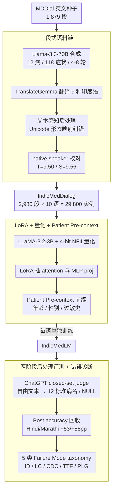

# IndicMedDialog: A Parallel Multi-Turn Medical Dialogue Dataset for Accessible Healthcare in Indic Languages

**会议**: ACL 2026  
**arXiv**: [2605.13292](https://arxiv.org/abs/2605.13292)  
**代码**: https://github.com/ShubhamKumarNigam/IndicMedDialog (有)  
**领域**: 医疗NLP
**关键词**: 印度语系医学对话、并行多语言数据集、LoRA 微调、临床诊断、Asha 翻译质量保证

## 一句话总结
本文构造 IndicMedDialog——首个覆盖英文+9 种印度语系（Assamese / Bengali / Gujarati / Hindi / Marathi / Punjabi / Tamil / Telugu / Urdu）的**平行多轮**医学诊断对话数据集（2,980 段对话 × 10 语 = 29,800 个实例），用 LLaMA-3.3-70B 合成对话 + TranslateGemma 翻译 + native speaker 校对 + 脚本感知 post-processing 修音/拼/字符间距；并基于 4-bit 量化 LLaMA-3.2-3B + LoRA 训出 IndicMedLM，在英文/印地语/马拉地语等 7/10 种语言上拿到 post-processed accuracy 最高，同时 95.3% 医学安全通过率，揭示了 5 类系统性 failure mode（ID/LC/CDC/TTF/PLG）。

## 研究背景与动机

**领域现状**：医学对话 AI 在症状评估和初诊建议上潜力很大，但现有系统多为单轮 QA + 英文中心。真正的临床诊断需要多轮 follow-up 来逐步缩小鉴别诊断空间，而 15 亿印度语系人群几乎没有可用的多轮医学对话数据。

**现有痛点**：(1) **单轮主导**：ChatDoctor 等系统假设单轮，无法模拟"医生连环问诊→鉴别诊断"过程；(2) **模板化数据集**：MDDial 提供了多轮英文鉴别诊断语料但用模板生成，语言多样性弱；(3) **多语言空白**：BiMediX 做了英文-阿拉伯双语，但九大印度语系完全缺平行数据；(4) **简单翻译不行**：现成 LLM 翻译对印度语系普遍存在音译错乱、词汇不准、字符间距错乱等系统性错误。

**核心矛盾**：要在低资源语言上部署可用的医学对话 AI，必须解决"高质量多轮临床对话语料 × 多语种平行 × 算力可负担"的三角约束——前者贵且涉及隐私，后两者技术门槛高。

**本文目标**：(a) 用合成 + 翻译 + 人工校对的混合 pipeline 构造首个 10 语并行多轮医学对话语料；(b) 基于 4-bit 量化小模型 + LoRA 训出能在普通硬件上跑的 IndicMedLM；(c) 引入可选 patient pre-context（年龄/性别/过敏史等）模拟真实问诊上下文；(d) 通过医生评估 + 错误 taxonomy 揭示 Indic 医学对话的真实失败模式。

**切入角度**：把 MDDial 作为种子语料 → LLM 扩合成丰富对话多样性 → TranslateGemma + 多 native speaker rater + 脚本感知后处理保障翻译可信 → LoRA + 量化让小模型可部署。

**核心 idea**：用"语料构造 + 小模型工程化部署 + 系统化错误诊断"三件套，撬开低资源印度语系医学 NLP 这块硬骨头。

## 方法详解

### 整体框架
分为数据构造、模型训练、错误分析三块：

1. **数据构造**：(i) 用 Llama-3.3-70B-Versatile (via Groq) 合成 1,101 段多轮诊断对话，覆盖 12 种疾病 / 118 种症状 / 4-8 轮对话，注入非确定性患者响应、重叠症状、模糊描述以贴近真实；与原 MDDial 1,879 段合并为 2,980 段；(ii) 用 TranslateGemma 把英文版翻译到 9 种印度语，结构化 prompt 保留临床语义；(iii) 脚本感知 post-processing 把音/拼/字符间距错误映射到目标语言最近正确形式；(iv) 每语 2 名 native speaker 独立打分（翻译质量 T、临床安全 S 各 10 分），均值 $\bar T = 9.50$、$\bar S = 9.56$。
2. **模型训练（IndicMedLM）**：基模 LLaMA-3.2-3B-Instruct + 4-bit NF4 量化 + LoRA（rank 16, α=16, dropout 0），LoRA 插入所有 attention proj 和 MLP proj；AdamW-8bit lr=$2\times 10^{-4}$，wd=0.001, bsz=8（2×4 grad acc），300 step + 5 warm，BF16/FP16，seed=3407；每个印度语单独训练，对话格式为 ShareGPT 风格的 human/gpt 交替；可选 patient pre-context 拼到对话前缀，使模型按年龄/性别/过敏等个性化提问。
3. **两阶段 post-processing 评测**：模型输出经常把正确诊断包裹在解释性长句里，原始 accuracy 会低估真实诊断能力；用 ChatGPT 作为 LLM judge，做"受限语义等价分类"——给定自由文本输出与 12 个标准疾病名，judge 必须从封闭集中选一个或返回 NULL（高于置信阈值时才映射），从而避免幻觉同时回收"对了但格式不对"的案例。

### 关键设计

**1. 合成 + 翻译 + 脚本感知后处理的三段式语料链：在没有真实临床多语对话的前提下，造出语义一致、临床合理、语言准确的 10 语平行语料**

低资源印度语系最大的拦路虎是「现成 LLM 直接翻译会大量吐出看起来像 Bengali、实际却乱拼的字符串」——音译错乱、词形误用、字符间距错位是系统性的。本文先用 Llama-3.3-70B 在 12 疾病 × 118 症状的 schema 约束下合成英文多轮诊断对话（控制 4-8 轮长度、注入症状重叠与模糊描述以贴近真实问诊），再用 TranslateGemma 翻成 9 种 Indic，关键的一环是其后的**脚本感知 post-processing**：它不依赖 LLM 二次润色，而是按目标语脚本的 Unicode 规则，把翻译产生的错乱形态（如 Bengali 字符间距、Hindi 词形误用）映射回最近的正确形式。

之所以要单独做这一步，是因为单靠 LLM 后处理无法稳定纠正脚本级错误，必须落到 Unicode 形态映射才靠谱。最后用每语 2 名 native speaker 对翻译质量 $T$ 与临床安全 $S$ 各打 10 分独立仲裁，得到 $\bar T = 9.50$、$\bar S = 9.56$——用真人评分而非模型自评作为质量上限，规避了「自己造数据又自己打分」的陷阱。

**2. LoRA + 4-bit 量化 + Patient Pre-context：让 3B 小模型在普通硬件上完成多轮个性化问诊**

医疗 AI 真正落地的痛点不是精度而是算力——乡镇诊所没有 GPU 集群，论文因此显式把「低算力」当成硬约束反推架构。基模选 LLaMA-3.2-3B-Instruct，先用 4-bit NF4 量化把显存压到消费级 GPU 可接受，再用 LoRA（rank 16）同时插到所有 attention proj 与 MLP proj 上——覆盖 MLP 是为了让语言表征和任务知识都能被调，而不只是浅层 attention。对话按 ShareGPT 格式组织、human=患者 / gpt=医生，角色边界清晰。

个性化则靠可选的 **patient pre-context**：把年龄、性别、过敏史、合并症、地理位置拼到对话前缀，让模型采症时跳过已知信息、把追问聚焦到差异化症状上。这条设计直接来自真实临床 workflow——医生不会重复问已经知道的信息，AI 也不该。每个印度语单独训练，AdamW-8bit lr=$2\times 10^{-4}$、wd=0.001、bsz=8（2×4 grad acc）、300 step + 5 warm、BF16/FP16、seed=3407。

**3. 两阶段后处理评测 + 5 类 Failure Mode taxonomy：既回收「对了但格式不对」的预测，又把「模型烂」拆成可定位的失败机制**

模型常把正确诊断包裹在印地/马拉地式的 hedging 长句里，raw accuracy 会严重低估真实能力（Hindi/Marathi raw 仅 19%/13%，post 直接到 73%/69%）。第一阶段用 ChatGPT 作 closed-set judge——给定自由文本输出与 12 个 canonical 疾病名，judge 只能从封闭集里选最语义等价的一个或返回 NULL，高于置信阈值才映射，从而在回收正确预测的同时不让 judge 幻觉新答案。

> ⚠️ cache 中 judge 标注为 "ChatGPT 5.3"，型号名以原文为准。

第二阶段把失败系统化成 5 类 FM，每类对应不同改进抓手：FM1 Instruction Drift（输出散文不带标签、部分可恢复，对应 Hindi/Marathi 的 +54pp 跳升）、FM2 Label Collapse（多病映射到同一假名，如 Bengali 把 5 类病全归到「肺感染」）、FM3 Cross-Domain Confusion（如冠心病→甲状腺炎）、FM4 Tokenization/Truncation Failure（Punjabi/Telugu 字符级截断，而 Devanagari 的 Hindi/Marathi 完全不受影响——证明瓶颈是 tokenizer 的 Unicode 覆盖而非数据量）、FM5 Paraphrase-over-Label Generation（输出疾病描述而非标准名，最易恢复）。这份 taxonomy 的价值在于把笼统的「准确率低」翻译成具体处方：FM4 该换 tokenizer，FM1/FM5 该加格式 reward 或后处理，而不是无脑加数据。

### 损失函数 / 训练策略
标准 causal LM SFT loss（无特殊 reward / KD）；每语单独训练同套超参，inference 时 temperature=0.1, top-p=0.95, max_new=128；evaluation 含 (i) 自动诊断准确率（raw vs post）；(ii) 三位 MBBS 在读医生做 1-5 Likert 评分 + binary safety，Krippendorff's α=0.81。

## 实验关键数据

### 主实验

10 种语言上的诊断准确率（%），Raw 是原始输出匹配，Post 是 LLM judge 语义等价回收后：

| 语言 | GEMMA Post | Tiny-AYA Post | LLaMA Base Post | **IndicMedLM Raw** | **IndicMedLM Post** |
|------|-------------|----------------|-------------------|----------------------|----------------------|
| English | 45.11 | 13.19 | 15.74 | 80.85 | **80.85** |
| Hindi | 25.10 | 13.19 | 11.06 | 19.15 | **72.76 (+53.6pp)** |
| Marathi | 9.36 | 5.11 | 11.50 | 13.19 | **68.51 (+55.3pp)** |
| Bengali | 19.57 | 5.96 | 11.50 | 25.11 | **58.72** |
| Urdu | 2.12 | 13.61 | 2.55 | 4.26 | **28.51** |
| Gujarati | 18.72 | **37.02** | 18.30 | 18.30 | 19.57 |
| Punjabi | 7.66 | 8.12 | 8.51 | 5.96 | **20.42** |
| Assamese | 7.66 | 8.08 | 3.83 | 5.96 | 5.96 |
| Tamil | 11.91 | 3.83 | 6.80 | 6.38 | 6.80 |
| Telugu | 6.38 | 0.00 | 4.68 | 1.28 | 5.96 |

IndicMedLM 在 7/10 语言上拿 post-processed accuracy 第一；Hindi/Marathi 的 raw→post 大跳跃（+53/+55pp）说明这两语的真实诊断能力被 raw 指标严重低估。

### 消融 / 专家评估（IndicMedLM 综合表现）

| 维度 | IndicMedLM |
|------|------------|
| Medical Safety Pass Rate | **95.3%** |
| Symptom Extraction (1-5) | 4.20 |
| Context Memory (1-5) | 4.40 |
| Diagnostic Correctness (1-5) | 4.10 |
| Conversational Flow (1-5) | 4.30 |
| Efficiency (1-5) | 4.00 |
| Inter-annotator Krippendorff α | 0.81 (strong) |
| Translation Quality (10-pt) | $\bar T = 9.50$ |
| Clinical Safety in Translation (10-pt) | $\bar S = 9.56$ |

### 关键发现
- **Hindi/Marathi 假性低分**：raw 才 19%/13%，post 直接到 73%/69%，说明模型确实学到了诊断知识但喜欢"用印地/马拉地式的 hedging 句子"包裹答案，metric artifact 而非能力缺失——直接 inform 后续 evaluation 协议必须配语义等价 judge。
- **疾病粒度方差极大**：Traumatic Brain Injury 在英文/印地 94.7%，在 Assamese/Tamil/Telugu/Urdu 完全 0%；Conjunctivitis 在 Punjabi（语言整体 20%）却 100%——证明语言整体准确率掩盖了高度异质的疾病-语言相关性，应按 (语言, 疾病) 维度分析风险。
- **Devanagari vs Gurmukhi/Telugu 的 tokenizer 鸿沟**：FM4 Truncation 只在 Punjabi/Telugu 出现，Hindi/Marathi 完全没有，证明问题在 LLaMA 基模的 Unicode tokenizer 覆盖而非训练数据量；这条结论给"为什么单纯加 Indic 数据救不了 Tamil/Telugu"提供了机械层面解释。
- **Bengali Label Collapse**：5 类病全映射成"肺感染"，是 majority-class bias 在语义 hypernym 上的体现，提示 SFT 标签分布需要平衡。
- **95.3% safety pass + 0.81 IAA**：医生评估 sample 中 1483/1556 dialog 安全，说明在合成 + LoRA 路线下医学安全风险已基本可控；强 IAA 也表明评测协议本身有效。

## 亮点与洞察
- **首个 10 语平行多轮医学对话语料**这一点本身就有巨大社区价值——填补 1.5B 人口的 NLP 资源空白；脚本感知 post-processing pipeline 是后续 Indic 翻译质量的可复用 trick。
- **5 类 FM taxonomy 是该领域第一份"诊断错误诊断"框架**——它把"模型烂"区分为格式/语义/学科/字符/换皮 5 个层次，每一类对应不同改进方案（FM1 加格式 reward、FM4 换 tokenizer、FM5 加 post-processing），是工程上极有用的导航图。
- **Post-processing recovery 揭示的"低资源语用习惯影响 metric"**是一条普适教训：当模型用目标语 idiomatic hedging 表达时，硬匹配会大幅低估能力——这在所有低资源 NLP 评测中都值得引以为戒。
- **patient pre-context 的引入**虽然简单，但把"医生不会重复问已知信息"这一临床直觉显式注入对话，是医疗对话 AI 工程化非常正确的一小步。
- **4-bit 量化 + LoRA 这条工程路径**专门为部署到资源受限地区设计——这呼应了论文使命（accessibility for underserved regions），并非纯学术 trade-off。

## 局限与展望
- 数据仍只覆盖 12 种疾病 / 118 种症状，离真实临床数千种疾病差距巨大；且全是合成 + 翻译，缺真实印度患者-医生对话作 ground truth。
- Assamese / Tamil / Telugu / Urdu 几乎完全失败（accuracy < 10%），主要瓶颈是基模 tokenizer 与 pretraining 数据分布；论文只指出问题但未实质解决——一个根本方案是换用印度语优化的基模（如 Sarvam-1）。
- 评测用 ChatGPT 作 judge，存在评估循环依赖（用闭源模型当 GT 校准开源模型）；专家评估只 sample 一小部分对话。
- 个人观察：(a) 多轮诊断的真正难点是"何时停止追问开始下诊断"，论文 4-8 轮硬截断未充分探索；(b) "可选 pre-context"在主表上未做有/无对照，无法量化其贡献；(c) 文化语境敏感性（如方言表达、性别禁忌话题）只在 safety pass rate 中粗略反映，未做细粒度分析。

## 相关工作与启发
- **vs MDDial (Macherla 2023)**：MDDial 是英文模板生成的多轮鉴别诊断；本文以其为种子，扩合成、扩多语、加 native verify，把模板 corpus 升级为可用的平行多语语料。
- **vs BiMediX (Pieri 2024)**：BiMediX 是英文-阿拉伯双语医学对话，本文把多语种数从 2 扩到 10，覆盖更稀缺的印度语系。
- **vs MedAidDialog (Nigam 2026)**：是同作者前作（覆盖部分印度语+阿拉伯），本文专精印度语系且做平行数据，错误 taxonomy 更系统。
- **vs ChatDoctor / Zhongjing / AMIE**：这些工作要么是英文单轮要么是中文多轮；本文证明"小模型 + LoRA + 量化 + 合成数据"在低资源多语场景也能做出可用的多轮诊断系统。
- **vs NoteChat (Wang 2024)**：NoteChat 由临床笔记生成对话，本文由疾病-症状 schema 生成对话，二者可互补——可以想象 future work 把笔记驱动 + schema 驱动两种合成路线结合做出更真实的低资源医学对话。

## 评分
- 新颖性: ⭐⭐⭐⭐ 数据集是首个，方法（合成 + 翻译 + 后处理 + 5-FM taxonomy）是工程组合而非颠覆性技术，但 social impact 角度很有原创性。
- 实验充分度: ⭐⭐⭐⭐ 10 语全表对比 + 12 疾病粒度分析 + 三医生 IAA 评估 + 五类 FM 系统化错误分析，覆盖面广；缺少 ablation（pre-context、post-processing 各自的增量贡献）。
- 写作质量: ⭐⭐⭐⭐ 数据-方法-错误三段式清晰，表格设计很好读；fontspec 标签在 cache 里残留较多影响阅读但不影响内容质量。
- 价值: ⭐⭐⭐⭐⭐ 直接服务 15 亿低资源人群，开源数据集 + 模型 + 训练代码，社区影响力强；五类 FM taxonomy 也对低资源医学 NLP 后续研究有方法学价值。

<!-- RELATED:START -->

## 相关论文

- [\[ICLR 2026\] ATPO: Adaptive Tree Policy Optimization for Multi-Turn Medical Dialogue](../../ICLR2026/medical_nlp/atpo_adaptive_tree_policy_optimization_for_multi-turn_medical_dialogue.md)
- [\[ACL 2026\] Region-Grounded Report Generation for 3D Medical Imaging: A Fine-Grained Dataset and Graph-Enhanced Framework](region-grounded_report_generation_for_3d_medical_imaging_a_fine-grained_dataset_.md)
- [\[NeurIPS 2025\] Shallow Robustness, Deep Vulnerabilities: Multi-Turn Evaluation of Medical LLMs](../../NeurIPS2025/medical_nlp/shallow_robustness_deep_vulnerabilities_multi-turn_evaluation_of_medical_llms.md)
- [\[ACL 2026\] MARCH: Multi-Agent Radiology Clinical Hierarchy for CT Report Generation](march_multi-agent_radiology_clinical_hierarchy_for_ct_report_generation.md)
- [\[ACL 2025\] VITAL: A New Dataset for Benchmarking Pluralistic Alignment in Healthcare](../../ACL2025/medical_nlp/vital_pluralistic_alignment_healthcare.md)

<!-- RELATED:END -->
