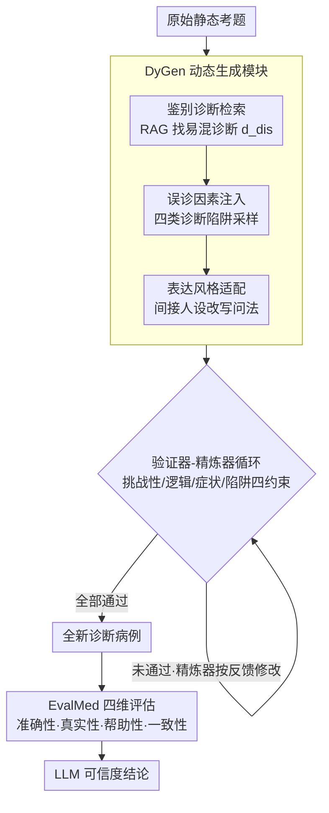

# Inflated Excellence or True Performance? Rethinking Medical Diagnostic Benchmarks with Dynamic Evaluation

**会议**: ACL 2026  
**arXiv**: [2510.09275](https://arxiv.org/abs/2510.09275)  
**代码**: [官方开源](https://arxiv.org/abs/2510.09275)  
**领域**: 医学NLP
**关键词**: 医学诊断基准, 动态评估, 数据污染, 诊断干扰项, LLM可信度

## 一句话总结

本文提出 DyReMe 动态医学诊断评估框架，通过 DyGen 模块生成包含鉴别诊断和误诊因素等临床干扰项的全新诊断案例，并通过 EvalMed 模块从准确性、真实性、帮助性和一致性四个维度评估 LLM，揭示现有静态基准高估了 LLM 的诊断能力——GPT-5 在 DyReMe 上准确率下降 8.25%，12 个 LLM 均暴露出显著的可信度不足。

## 研究背景与动机

**领域现状**：LLM 在医学诊断辅助方面展现出巨大潜力，能够分析临床案例、识别模式并辅助诊断决策。为评估其能力，基于医学考试的静态基准（如 MedBench、C-Eval）被广泛采用，测试题目在不同模型和时间点保持不变。

**现有痛点**：静态基准存在两大核心问题：(1) 数据污染导致能力高估——由于许多基准公开且静态，LLM 可能在训练中接触过测试题，高分可能反映曝光而非可泛化的推理能力；(2) 与真实场景不对齐——考试式基准采用标准化、规范的病例描述和仅关注准确率的评估协议，而真实患者查询往往不完整、使用日常语言、被自我诊断等因素干扰，可能误导临床决策。

**核心矛盾**：现有动态评估（如通过改写或加噪变换题目）虽然减少了数据污染，但变换通常是表面层级的，保留了底层临床设置，无法解决与真实世界的不对齐问题，且仍仅关注准确率。

**本文目标**：(1) 生成包含临床接地的干扰项（鉴别诊断+误诊因素）的全新诊断案例；(2) 建立超越准确率的多维可信度评估体系。

**切入角度**：将真实诊断中的四种误诊因素（锚定偏差、后验概率错误、注意力分散、症状过度估计）设计为四类诊断陷阱（自我诊断、干扰病史、外部噪声、症状错置），注入基准题目中模拟临床复杂性。

**核心 idea**：动态基准 = 鉴别诊断干扰 + 误诊因素陷阱 + 患者表达风格多样化 + 四维可信度评估。

## 方法详解

### 整体框架

DyReMe 要回答的问题是：静态医学基准上的高分，到底是真本事还是题目背过了？它的答案是把"出题"和"评分"都做成动态的。框架分两块协同：DyGen 负责把一道旧考题改造成全新的、带临床陷阱的病例，让模型没法靠记忆蒙混；EvalMed 则在改造后的题上从四个维度打分，不再只问"答对没有"。DyGen 内部是一条带反馈的流水线——原始题目先检索鉴别诊断、再注入误诊陷阱、再换上不同患者的说话方式，最后交给验证器-精炼器循环反复打磨直到合格。

### 关键设计

**1. DyGen 动态生成模块：把一道规范的旧考题改造成带临床陷阱的全新病例**

静态基准的两大软肋——题面被训练数据污染、且病例描述过于标准化——都源于"题目不变"。DyGen 用三步把题目彻底重写。第一步是鉴别诊断检索：用 RAG 为原始诊断 $d_{org}$ 找一个临床上容易混淆的相似诊断 $d_{dis}$（比如给"嗜铬细胞瘤"配上"肾上腺腺瘤"），制造诊断歧义。第二步是误诊因素注入：从四种诊断陷阱 $\mathcal{S}$（自我诊断、干扰病史、外部噪声、症状错置）里均匀采样一种，和鉴别诊断一起拼成误导性问题 $q_{trap} = \mathcal{T}_{trap}(q_{org}, s, d_{dis})$，对应真实诊断中的锚定偏差等认知陷阱。第三步是表达风格适配，用间接人设机制 $q_{per} = \mathcal{T}_{persona}(q_{trap}, b)$ 改写——注意它不是直接套一个人设身份（那会引入"矿工→尘肺病"这种因果泄漏），而是先抽取人设的表达特征（知识水平、清晰度、沟通风格），再用这些特征去重写问句，只换说法不换病因。三步走完，题目从"规范考题"变成了"真实患者那种不完整、带干扰、口语化的查询"。

**2. EvalMed 四维评估模块：不只看答没答对，还看这个回答可不可信**

只盯准确率，会放过 LLM 在真实诊室里最危险的几种毛病：照单全收患者带来的谣言、答得空洞没用、同一个病换种问法就改口。EvalMed 因此并行测四个维度。准确性是常规的 Top-1/3/5 诊断命中率。真实性专门往题里埋健康谣言（如"高血压影响骨骼"），看模型能不能识别并纠正，记为 $\text{Ver}(M) = \frac{1}{|\mathcal{Q}|}\sum_{q} \mathbb{I}_r(q, \hat{a})$。帮助性参照真实医疗平台的回答标准定义诊断依据、治疗建议、生活建议三条，用 RAG 搭一个评分知识库逐条核对覆盖度。一致性则把同一病例的多个变体喂进去，算诊断分布的归一化信息熵 $\text{Cons}(M) = \frac{1}{|\mathcal{P}|}\sum_{p_i}(1 - E_{p_i}/\log m)$——熵越低说明模型在不同表述下越稳定。四个维度合起来，才把"能不能放心交给它看病"量化了出来。

**3. 验证器-精炼器迭代循环：保证生成的题既足够刁钻又站得住脚**

LLM 直接生成的题目常有两类问题：逻辑自相矛盾，或陷阱设计得不合理（病不对症、陷阱形同虚设）。DyReMe 因此在生成末端加了一道闭环把关：验证器 $\mathcal{V}$ 沿挑战性、逻辑一致性、症状准确性、陷阱有效性四个维度评估候选题，全部通过才放行；只要有一项不达标，就交给精炼器 $\mathcal{R}$ 按反馈修改，再送回验证器，如此往复直到所有约束都满足。正是这道循环让动态生成的题在变难的同时不至于变"脏"。

### 损失函数 / 训练策略

DyReMe 不涉及模型训练。DyGen 用 GPT-4.1 作为生成器（生成温度 0.7，验证温度 0），从 DxBench 的 800 个案例扩展生成 3200 个问题；RAG 走火山引擎搜索 API 和抖音百科。为避免生成器"认出自己出的题"带来的自我识别偏差，评估时排除了 GPT-4.1。

## 实验关键数据

### 主实验

**静态 vs 动态基准的诊断准确率对比（Top-1/3/5 平均）**

| 模型 | 静态平均 | DyVal2 (Δ) | DyReMe (Δ) |
|------|---------|-----------|-----------|
| GPT-5 | 73.76 | 70.73 (-4.11%) | **67.67 (-8.25%)** |
| DeepSeek-V3 | 72.92 | 69.50 (-4.69%) | **65.26 (-10.51%)** |
| GPT-4o | 72.53 | 69.67 (-3.94%) | **64.74 (-10.75%)** |
| MedGemma-27B | 70.56 | 67.70 (-4.06%) | **62.97 (-10.76%)** |
| Qwen3-32B | 73.62 | 68.28 (-1.98%) | **63.85 (-8.34%)** |
| Qwen2.5-7B | 67.85 | 65.25 (-3.82%) | **57.86 (-14.71%)** |

**跨语言验证（英文 DDXPlus）**

| 模型 | DDXPlus | DyReMe | p值 |
|------|---------|--------|-----|
| GPT-4o | 85.10 | 77.18 | <0.05 |
| Qwen2.5-32B | 72.58 | 65.24 | <0.05 |

### 消融实验

**DyGen 组件消融（挑战性和多样性）**

| 配置 | 挑战性 | 表达多样性 | 诊断多样性 |
|------|-------|----------|----------|
| DyReMe (完整) | 最高 | 最高 | 最高 |
| w/o 诊断干扰项 | 显著下降 | 不变 | 显著下降 |
| w/o 患者表达风格 | 下降 | 显著下降 | 不变 |

### 关键发现

- DyReMe 对所有 LLM 都产生更大的性能下降，即使 GPT-5（强于生成器 GPT-4.1）也下降 8.25%，说明基准对前沿模型仍具挑战性
- 医学专用模型 WiNGPT2-9B 得分最低（31.8），表明当前医学适配可能捕获了医学事实但无法处理真实世界的干扰项和多样化表达
- 推理模型（o1/o1-mini）仅表现中等（37.0/36.7），因其训练侧重单一正确答案而非处理谣言或提供可操作信息
- 所有模型中 20-40% 的健康谣言未被纠正，存在信息传播风险；一致性普遍偏低，对输入上下文变化脆弱
- DyReMe 的可扩展性远优于现有动态方法——随 $k$ 增加 Self-BLEU 下降更慢，独特诊断数持续增长

## 亮点与洞察

- 将认知心理学中的误诊因素（锚定偏差等）系统性地转化为四类诊断陷阱，在评估设计层面建立了认知科学与 NLP 的桥梁
- 间接人设适配的设计很巧妙——提取表达特征而非直接使用人设身份，避免了"矿工→尘肺病"这类混淆因素的引入
- 四维评估体系对医学 AI 的实际部署有直接参考价值：不仅要看"答对没有"，还要看"能否纠正谣言"、"建议是否有用"、"回答是否稳定"

## 局限与展望

- 主要实验在中文数据集上进行，仅有一个英文跨语言验证，多语言场景需进一步扩展
- 仅关注文本诊断场景，未纳入医学影像、实验室检查等多模态输入
- 未涉及端到端临床工作流（纵向病史、多学科决策等），需要临床实验验证
- 自我偏差问题虽做了缓解但未完全消除，不同 LLM 作为生成器和评估器可能引入不同偏差

## 相关工作与启发

- **vs DyVal2**: DyVal2 通过加噪/改写进行动态评估，但变换是表面层级的，DyReMe 引入深层临床干扰项使性能下降为 DyVal2 的 2 倍
- **vs Self-Evolving**: 当扰动较弱时模型甚至可能在动态评估上得分高于静态基准（如 GPT-4o-mini），DyReMe 确保了一致的挑战性
- **vs MedBench/C-Eval**: 静态基准易受数据污染影响，DyReMe 通过动态生成全新案例从根本上解决此问题

## 评分

- 新颖性: ⭐⭐⭐⭐ 系统性地将临床误诊因素引入动态评估设计，四维评估框架有创新
- 实验充分度: ⭐⭐⭐⭐⭐ 12 个 LLM、多静态/动态基线、消融、可扩展性、跨语言、人类一致性研究
- 写作质量: ⭐⭐⭐⭐ 动机清晰，方法描述系统，但部分符号定义分散
- 价值: ⭐⭐⭐⭐⭐ 揭示了医学 LLM 评估的根本缺陷，为更真实的医学 AI 评估指明了方向

<!-- RELATED:START -->

## 相关论文

- [\[ACL 2026\] Beyond the Leaderboard: Rethinking Medical Benchmarks for Large Language Models](beyond_the_leaderboard_rethinking_medical_benchmarks_for_large_language_models.md)
- [\[ACL 2026\] CT-FineBench: A Diagnostic Fidelity Benchmark for Fine-Grained Evaluation of CT Report Generation](ct-finebench_a_diagnostic_fidelity_benchmark_for_fine-grained_evaluation_of_ct_r.md)
- [\[ACL 2026\] Can Continual Pre-training Bridge the Performance Gap between General-purpose and Specialized Language Models in the Medical Domain?](can_continual_pre-training_bridge_the_performance_gap_between_general-purpose_an.md)
- [\[ACL 2026\] Dr. Assistant: Enhancing Clinical Diagnostic Inquiry via Structured Diagnostic Reasoning Data and Reinforcement Learning](dr_assistant_enhancing_clinical_diagnostic_inquiry_via_structured_diagnostic_rea.md)
- [\[ACL 2026\] Learning Dynamic Representations and Policies from Multimodal Clinical Time-Series with Informative Missingness](learning_dynamic_representations_and_policies_from_multimodal_clinical_time-seri.md)

<!-- RELATED:END -->
