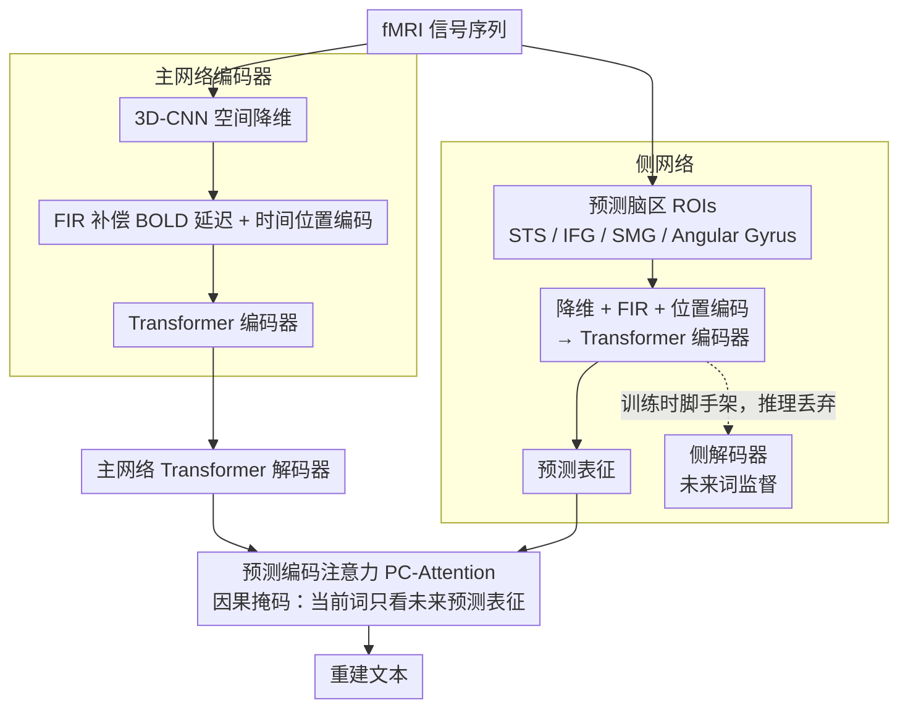

# Language Reconstruction with Brain Predictive Coding from fMRI Data

**会议**: ACL 2026  
**arXiv**: [2405.11597](https://arxiv.org/abs/2405.11597)  
**代码**: 无  
**领域**: 脑机接口 / 语言解码  
**关键词**: fMRI语言重建, 预测编码, 脑信号解码, 神经语言学, 侧网络

## 一句话总结

本文提出 PredFT，一个结合主网络（语言解码）和侧网络（脑预测编码表征）的端到端 fMRI-to-Text 解码模型，通过从大脑预测相关脑区（PTO 区域）提取前瞻性语义表征并融合到解码过程中，在 LeBel 数据集上 BLEU-1 达 34.95%（Sub-1），相比最强基线 MapGuide 提升 7.84 个百分点。

## 研究背景与动机

**领域现状**：从 fMRI 信号重建自然语言是理解人脑语言形成机制的重要窗口。近年研究利用预训练语言模型实现了开放词汇的 fMRI-to-Text 解码：Tang 等人用 GPT 生成语义候选再用脑信号选择匹配内容，Xi 等人将问题转化为序列到序列翻译。

**现有痛点**：现有研究专注于模型架构设计和语言模型利用，但忽略了一个关键的神经科学基础——自然语言在人脑中是如何编码的。具体来说，大脑在感知当前语音刺激时会自然地对未来内容进行多时间尺度的预测（预测编码理论），但这一信息从未被用于指导语言重建。

**核心矛盾**：脑信号中包含丰富的前瞻性预测信息，但现有解码模型仅利用了当前时刻的脑活动表征，浪费了大脑自然产生的预测信号。

**本文目标**：(1) 验证预测编码理论在 fMRI-to-Text 解码中的可行性；(2) 设计能有效利用脑预测表征的解码模型；(3) 分析不同脑区、预测距离和长度对解码性能的影响。

**切入角度**：预测编码理论指出大脑在听到语音时会自然预测未来词汇。Caucheteux 等人已证明如果用预测内容构建语言模型表征，语言模型激活与脑响应之间的线性映射会增强。这启发我们：能否从脑信号中提取预测表征来辅助语言重建？

**核心 idea**：设计双网络架构——主网络负责标准的 fMRI-to-Text 解码，侧网络从脑预测相关脑区（PTO 区域）提取前瞻性表征，通过 Predictive Coding Attention 将预测信息融合到解码过程中。

## 方法详解

### 整体框架

PredFT 想把神经科学里的"预测编码"——大脑在听语音时会自然预测接下来要说什么——这条信息引进 fMRI-to-Text 解码。它是端到端模型，由两条网络组成：主网络 $\mathcal{M}_\theta$（编码器-解码器）做标准的 fMRI 转文本，把 fMRI 序列编成时空特征再用 Transformer 解码器吐出文字；侧网络 $\mathcal{M}_\phi$（编码器-解码器）则从预测相关脑区里抽取"前瞻性"表征，其编码器输出 $H_{\phi_\text{Enc}}^M$ 被注入主网络辅助解码。训练时两网共同优化，推理时侧网络解码器被丢掉，只留它的编码器持续供给预测表征。

### 关键设计

**1. 主网络编码器：从带延迟的原始 fMRI 信号里抠出对齐好的时空特征**

fMRI 的麻烦在于 BOLD 信号有约 4-6 秒的延迟，直接用会让脑活动和语音错位。主网络编码器先做空间降维：对 4D 体积图像 $F_{i,j} \in \mathbb{R}^{w \times h \times d \times (k+1)}$ 用 $L$ 层 3D-CNN（含组归一化、ReLU、残差连接）逐步压成一维向量 $x_{i,j}^t \in \mathbb{R}^{d_m}$，对 2D 表面 fMRI 则直接线性降维。接着关键一步是用 FIR 模型 $g_t$ 补偿 BOLD 延迟，把 $k-k^*$ 个未来帧拼起来再线性融合，这一步的时间补偿对正确对齐脑活动和语音至关重要。最后加上时间位置编码送进 Transformer 编码器捕捉时序依赖。

**2. 侧网络：只从"会预测"的脑区里提取前瞻性语义表征**

预测信号不是全脑都有——作者的预测编码验证实验发现 PTO 区域的预测分数显著高于全脑或随机 ROIs，选对脑区才能拿到有效的预测信息。侧网络编码器 $\mathcal{M}_{\phi_\text{Enc}}$ 因此只接收预测相关 ROIs 序列 $R_{i,j}$（由 STS、IFG、SMG、Angular Gyrus 等脑区拼接），同样经全连接降维、FIR 补偿、位置编码后送进 Transformer 编码器，输出预测表征 $H_{\phi_\text{Enc}}^M$。它怎么学会"预测"？侧网络解码器以未来词 $V_j$（距离 $d$、长度 $l$ 的预测目标）为监督信号，用交叉熵迫使编码器把"接下来会说什么"编进表征里。这个解码器纯粹是训练时的脚手架，推理时整个丢弃，思路上接近知识蒸馏——辅助训练、推理不用。

**3. 预测编码注意力（PC-Attention）：让主网络解码当前词时只借未来的预测信号**

侧网络的预测表征要融进主网络才有用，但融的方式必须尊重"前瞻"这一本质。PredFT 在主网络 Transformer 解码器的每一层加一个 PC-Attention 模块，以解码器隐状态 $H_{\theta_\text{Dec}}^l$ 为 query，以侧网络编码器输出 $H_{\phi_\text{Enc}}^M$ 为 key 和 value。真正的巧思在注意力掩码：对文本片段 $u_j^t$ 里的每个 token，只允许它关注时间步 $t$ 之后的预测表征，把之前的全屏蔽掉——因为预测信息按定义应该来自"当下之后"的脑活动。这道因果掩码让当前词的解码只吃未来的预测信号，干净地对应了预测编码的前瞻语义。

### 损失函数 / 训练策略

端到端联合训练，总损失 $\mathcal{L} = \mathcal{L}_\text{Main} + \lambda \mathcal{L}_\text{Side}$。两条网络共享词嵌入层（梯度仅由主网络更新），各自用左到右自回归交叉熵。推理时丢掉侧网络解码器，仅留编码器提供预测表征。

## 实验关键数据

### 主实验

**LeBel 数据集 within-subject 解码（10 帧 = 20 秒）**

| 模型 | BLEU-1 | BLEU-4 | ROUGE1-F | BERTScore |
|------|--------|--------|---------|-----------|
| Tang's | 22.25 | 0.00 | 19.44 | 80.84 |
| BrainLLM | 24.18 | 1.11 | 21.16 | 83.26 |
| MapGuide | 27.11 | 1.54 | 24.83 | 82.66 |
| PredFT w/o SideNet | 27.91 | 1.29 | 26.82 | 81.35 |
| **PredFT** | **34.95** | **1.78** | **32.03** | 82.92 |

**Narratives 数据集 cross-subject 解码**

| 长度 | 模型 | BLEU-1 | ROUGE1-F | BERTScore |
|------|------|--------|---------|-----------|
| 10帧 | UniCoRN | 20.64 | 19.23 | 75.35 |
| 10帧 | **PredFT** | **24.73** | **19.53** | **78.52** |
| 40帧 | UniCoRN | 21.76 | 25.30 | 74.40 |
| 40帧 | **PredFT** | **27.80** | **25.96** | **78.63** |

### 消融实验

**ROIs 选择对解码性能的影响（LeBel 数据集）**

| ROIs 类型 | 说明 | 相对性能 |
|---------|------|---------|
| BPC（预测相关脑区） | STS, IFG, SMG, Angular Gyrus | **最优** |
| Whole（全脑） | 整个大脑皮层 | 次优 |
| Random（随机） | 随机选择脑区 | 最差 |

### 关键发现

- 侧网络贡献显著：PredFT 相比 w/o SideNet 在 Sub-1 上 BLEU-1 从 27.91 提升到 34.95（+7.04），证明脑预测信息对解码有实质帮助
- ROIs 选择至关重要：BPC 区域（PTO）一致优于全脑和随机 ROIs，验证了预测编码的脑区特异性
- 预测长度和距离存在最优区间：过短（$l=1,2$）或过长（$l=11,12$）的预测长度都不理想，中等长度（$l=6,7,8$）配合适当距离（$d=3-5$）效果最佳
- 被试内解码显著优于跨被试解码，所有模型在长文本生成（BLEU-3/4）上仍然困难

## 亮点与洞察

- 将神经科学的预测编码理论直接转化为模型设计是非常优雅的跨学科创新——侧网络的"辅助训练、推理丢弃"策略类似知识蒸馏
- PC-Attention 的因果掩码设计简洁有力——只让当前词关注未来的预测表征，完美对应预测编码的前瞻性质
- 预测编码验证实验本身就有独立价值——系统展示了脑区、预测距离和长度的交互关系

## 局限与展望

- 仅在 fMRI 数据上验证，其他脑信号模态（MEG、EEG）的适用性未探索
- 被试未预期的内容可能干扰大脑预测功能，影响解码效果
- 所有模型在长精确文本生成上仍有很大提升空间（BLEU-4 普遍低于 2%）
- 可扩展到视觉刺激的脑信号解码场景

## 相关工作与启发

- **vs Tang's**: Tang 用 GPT beam search 生成候选再选择，PredFT 是端到端解码，且利用了脑预测信息
- **vs UniCoRN**: UniCoRN 用 BART 的三阶段训练框架，PredFT 通过侧网络引入预测编码先验，在跨被试设置上 BLEU-1 提升 6+ 个百分点
- **vs BrainLLM**: BrainLLM 将 fMRI 嵌入与词嵌入拼接微调 Llama2，PredFT 通过独立的预测网络提供更有针对性的辅助信号

## 评分

- 新颖性: ⭐⭐⭐⭐⭐ 首次将预测编码理论系统化地应用于 fMRI-to-Text 解码，跨学科创新突出
- 实验充分度: ⭐⭐⭐⭐ 两个数据集、多被试、ROIs 分析和预测参数分析全面，但缺少人工评估
- 写作质量: ⭐⭐⭐⭐ 预测编码验证到模型设计的逻辑推导清晰流畅
- 价值: ⭐⭐⭐⭐ 为脑机接口领域提供了有理论支撑的新方法，验证了脑预测信息的实用价值

<!-- RELATED:START -->

## 相关论文

- [\[ACL 2025\] Aligning AI Research with the Needs of Clinical Coding Workflows: Eight Recommendations Based on US Data Analysis and Critical Review](../../ACL2025/medical_nlp/clinical_coding_eight_recommendations.md)
- [\[ACL 2026\] Ryze: Evidence-Enriched Data Synthesis from Biomedical Papers](ryze_evidence-enriched_data_synthesis_from_biomedical_papers.md)
- [\[ACL 2026\] Beyond the Leaderboard: Rethinking Medical Benchmarks for Large Language Models](beyond_the_leaderboard_rethinking_medical_benchmarks_for_large_language_models.md)
- [\[ACL 2026\] CURA: Clinical Uncertainty Risk Alignment for Language Model-Based Risk Prediction](cura_clinical_uncertainty_risk_alignment_for_language_model-based_risk_predictio.md)
- [\[ACL 2026\] RePrompT: Recurrent Prompt Tuning for Integrating Structured EHR Encoders with Large Language Models](reprompt_recurrent_prompt_tuning_for_integrating_structured_ehr_encoders_with_la.md)

<!-- RELATED:END -->
