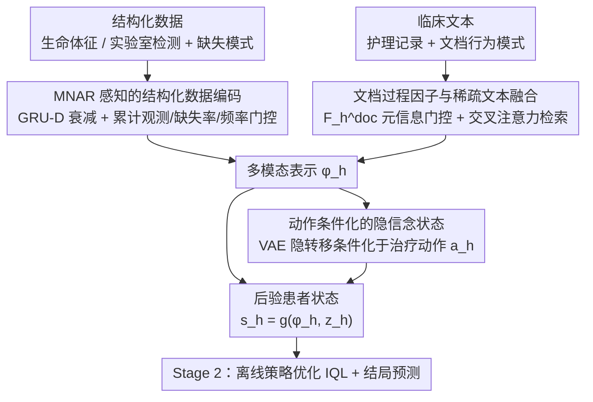

# Learning Dynamic Representations and Policies from Multimodal Clinical Time-Series with Informative Missingness

**会议**: ACL 2026 Findings  
**arXiv**: [2604.21235](https://arxiv.org/abs/2604.21235)  
**代码**: [GitHub](https://github.com/CausalMLResearch/OPL-MT-MNAR)  
**领域**: 医学NLP
**关键词**: 多模态临床时序, 信息性缺失, 离线强化学习, 贝叶斯滤波, ICU治疗策略

## 一句话总结
提出 OPL-MT-MNAR 框架，通过 MNAR 感知的多模态编码器 + 贝叶斯滤波隐状态 + 离线策略学习，从结构化数据和临床文本的"缺失模式本身携带的信息"中学习 ICU 患者动态表示，实现优于临床医生行为的脓毒症治疗策略（FQE 0.679 vs 0.528）。

## 研究背景与动机

**领域现状**：电子健康记录（EHR）包含结构化数据（生命体征、实验室检测）和临床文本（护理记录、报告），是学习患者动态表示以支持结果预测和序贯治疗决策的丰富数据源。离线 RL 在 ICU 脓毒症治疗中已有大量工作，但大多将临床观测当作预处理后的完整数据。

**现有痛点**：临床数据有两个关键特征被忽略：(1) **观测过程本身是信息性的**（informative missingness）——病情越重的患者被监测得越频繁，缺失模式反映了潜在健康状态，是 missing-not-at-random (MNAR)；(2) **不同模态的观测模式不同**——生命体征较常规、实验室检查需要下医嘱、文本记录取决于医生的文档行为，这些差异在患者轨迹中随时间演变。

**核心矛盾**：现有方法要么忽略缺失信息，要么只在结构化时序中处理缺失（如 GRU-D），没有在多模态+时序的联合设定下利用缺失模式作为信息信号。特别是临床文本的观测过程（何时写护理记录、记录频率如何变化）被完全忽视。

**本文目标**：构建一个显式利用多模态信息性缺失的患者表示学习框架，支持下游的离线治疗策略优化和结局预测。

**切入角度**：从 ICU 真实数据中发现三个强信号：(a) 病情越重监测越密集；(b) 高 acuity 患者更可能有文本更新；(c) 不同模态的时序可用性演变不同。这些观测模式包含关于患者状态的重要信息。

**核心 idea**：将观测过程（结构化数据的缺失模式 + 文本的文档行为模式）作为显式特征输入，通过 MNAR 感知编码 + 贝叶斯滤波 + 动作条件化隐状态构建患者表示。

## 方法详解

### 整体框架

这套框架的核心立场是"缺失即信号"：ICU 里病人被监测得多频繁、护理记录写得多勤，本身就反映了病情轻重，不该被当成噪声填补掉。OPL-MT-MNAR 分两阶段把这个信号用起来。Stage 1 学患者状态表示——先用一个 MNAR 感知的多模态编码器把结构化数据和临床文本（连同它们各自的缺失/文档模式）压成统一表示 $\phi_h$，再用变分推断的贝叶斯滤波维护一个隐信念状态 $z_h$，两者组合成后验患者状态 $s_h = g_\theta(\phi_h, z_h)$。Stage 2 拿 $s_h$ 去做离线策略优化（IQL）和结局预测。

### 关键设计

**1. MNAR 感知的结构化数据编码：把"被监测的频率"也当成特征喂进去**

标准的 GRU-D 只用时间间隔做衰减，丢掉了一条关键信息——病情越重的患者被测得越频繁，这种"观测频率"本身携带 acuity 信号，属于 missing-not-at-random。本文在 GRU-D 基础上把缺失模式显式化：累计观测次数、缺失率、窗口内观测频率这几个 MNAR 特征直接进 GRU 的门控更新。同时保留 GRU-D 的衰减机制——某变量长期缺失时，用学习到的衰减因子把它的值逐渐拉回经验均值。这样"什么时候测、测了多频繁"就不再被抹平，而是成了刻画患者状态的一部分。

**2. 文档过程因子与稀疏文本融合：先判断文本"有没有、新不新、密不密"，再决定怎么用它**

临床文本的可用性同样是内生的——高 acuity 患者的护理记录写得更频繁，"无文本""过时文本""密集更新"这几种状态即便底层内容相近，含义也完全不同。模型为此引入文档过程因子 $F_h^{doc}$：用 MLP 编码每一步的文本存在性、文本时效性、近期文档密度，再用 GRU 在时间上累积。文本内容侧则通过多头交叉注意力，由结构化表示当 query 去检索文本嵌入。最后由 $F_h^{doc}$ 控制一个门控，自适应地决定文本表示和结构化表示按什么比例融合。这样模型用的是文档的"行为元信息"来调权，而非直接拿文本内容定夺，把"何时记录"和"记录了什么"两路信号解耦开。

**3. 动作条件化的隐信念状态：让治疗历史的因果影响传得下去**

光有观测编码 $\phi_h$ 撑不起策略优化，因为 $\phi_h$ 只是"已记录观测"的确定性函数，里面没有动作的因果痕迹。本文用 VAE 参数化一个隐状态转移 $z_{h+1} \sim p_\theta(z_{h+1}|z_h, \phi_h, a_h)$，关键就在于转移函数条件化于治疗动作 $a_h$。作者还给了 Theorem 1 作硬支撑：如果隐状态转移不依赖动作，那么策略梯度里"当前动作对未来奖励"的梯度就为零——在终末奖励设定下，所有非终末步将完全收不到学习信号。正是这条隐状态通道把治疗动作的累积效应一步步传递进患者轨迹，策略才学得起来。

### 损失函数 / 训练策略

三阶段训练：(1) 预训练编码器，重构损失含四项（结构化值、缺失掩码 BCE、文本嵌入、文档过程因子），外加动力学一致性损失和 KL 正则化；(2) 冻结编码器训练 RL，用 IQL（双 Q + 期望分位数值函数 + 优势加权行为克隆）；(3) 联合微调。

## 实验关键数据

### 主实验（策略学习 FQE）

| 方法 | 信息 | MIMIC-III | MIMIC-IV | eICU |
|------|------|-----------|----------|------|
| AI Clinician | Model-free | 0.487 | 0.491 | 0.478 |
| DDPG+Clinician | Model-free | 0.529 | 0.538 | 0.524 |
| MedDreamer | Model-based | 0.583 | 0.591 | 0.579 |
| 临床医生行为 | Behavior | 0.528 | 0.521 | 0.534 |
| **OPL-MT-MNAR** | **MNAR+Text** | **0.679** | **0.634** | **0.604** |

### 消融实验（MIMIC-III Building Block Study）

| 配置 | FQE | 相对基线提升 |
|------|-----|------------|
| Baseline (MDP, no MNAR) | 0.507 | — |
| + Semi-MDP | 0.518 | +2.2% |
| + MNAR + DocProcess | **0.679** | **+33.9%** |
| + 全部 | 0.689 | +35.9% |

### 关键发现
- **MNAR 建模是最大贡献者**：显式 MNAR + 文档过程建模贡献了 +33.9% 的提升，远大于 Semi-MDP 的 +2.2%
- **文本对策略学习有实质价值**：结构化 only 为 0.574，加护理记录升至 0.624，全模态 0.679
- **高 acuity 患者获益最大**：高 SOFA(>10) 组临床医生 FQE 仅 0.192，本文方法达到 0.344
- **结局预测 AUROC 0.886**：优于 GRU-D (0.844) 和 MedDreamer (0.867)

## 亮点与洞察
- **"缺失即信号"的理念**非常精彩：不是去填补缺失值，而是将"什么被观测了、什么时候观测的、观测多频繁"直接作为特征。对任何不完整数据领域都有启发
- **动作条件化隐状态的理论必要性证明**（Theorem 1）为方法设计提供了严格的理论支撑
- **文档过程因子**只用观测过程的元信息，不直接用文本内容来调控融合权重，实现了"行为信号"和"内容信号"的解耦

## 局限与展望
- 依赖离线策略评估（FQE），未经前瞻性临床验证
- 动作空间离散化为 9 个、4 小时决策间隔，限制了精细化治疗控制
- 未记录的信息（如口头交流、床旁评估）仍可能造成未观测混淆
- 仅在美国 ICU 数据集上验证，跨国家/医疗体系泛化需进一步验证

## 相关工作与启发
- **vs GRU-D**: GRU-D 只处理结构化时序的时间间隔衰减，本文扩展到多模态 MNAR 并加入累计观测特征
- **vs MedDreamer**: MedDreamer 是 model-based RL，本文通过显式 MNAR 建模在不需要世界模型的情况下实现更高 FQE
- **vs Liang et al. (2025)**: 同一团队前作也建模信息性缺失但没有时序动态，本文加入贝叶斯滤波和动作条件化

## 评分
- 新颖性: ⭐⭐⭐⭐⭐ 多模态信息性缺失+文档行为建模+动作条件化隐状态的统一框架，原创性强
- 实验充分度: ⭐⭐⭐⭐⭐ 三个数据集、完整消融、acuity 分层分析、鲁棒性检验
- 写作质量: ⭐⭐⭐⭐⭐ 理论推导严谨，motivation 图表有说服力
- 价值: ⭐⭐⭐⭐ 对临床 AI 有实际意义，"缺失即信号"思路有广泛迁移价值

<!-- RELATED:START -->

## 相关论文

- [\[NeurIPS 2025\] Time-IMM: A Dataset and Benchmark for Irregular Multimodal Multivariate Time Series](../../NeurIPS2025/medical_nlp/time-imm_a_dataset_and_benchmark_for_irregular_multimodal_multivariate_time_seri.md)
- [\[ACL 2026\] RADS: Reinforcement Learning-Based Sample Selection Improves Transfer Learning in Low-resource and Imbalanced Clinical Settings](rads_reinforcement_learning-based_sample_selection_improves_transfer_learning_in.md)
- [\[ACL 2026\] Dr. Assistant: Enhancing Clinical Diagnostic Inquiry via Structured Diagnostic Reasoning Data and Reinforcement Learning](dr_assistant_enhancing_clinical_diagnostic_inquiry_via_structured_diagnostic_rea.md)
- [\[ACL 2026\] RA-RRG: Multimodal Retrieval-Augmented Radiology Report Generation with Key Phrase Extraction](ra-rrg_multimodal_retrieval-augmented_radiology_report_generation_with_key_phras.md)
- [\[AAAI 2026\] Learning Cell-Aware Hierarchical Multi-Modal Representations for Robust Molecular Modeling](../../AAAI2026/medical_nlp/learning_cell-aware_hierarchical_multi-modal_representations.md)

<!-- RELATED:END -->
