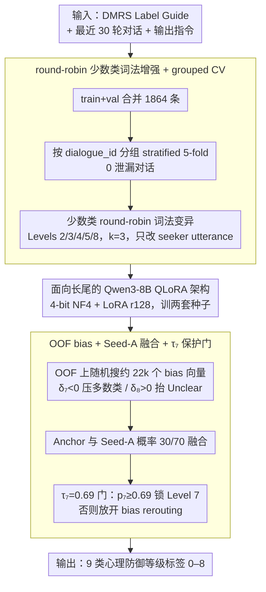

# LinguIUTics at PsyDefDetect: Iterative Imbalance-Aware Fine-tuning of Qwen3-8B for Psychological Defense Mechanism Classification

**会议**: ACL 2026 / BioNLP 2026  
**arXiv**: [2606.00647](https://arxiv.org/abs/2606.00647)  
**代码**: https://github.com/Shefwef/LingIUTics-PsyDefDetect-BIONLP26  
**领域**: 临床 NLP / 心理健康文本分类 / 类别不均衡学习  
**关键词**: 心理防御机制, 类别不均衡, QLoRA, 分组交叉验证, 后处理校准

## 一句话总结
这篇 PsyDefDetect 参赛系统通过 Qwen3-8B QLoRA、少数类词法增强、分组 5-fold 交叉验证、OOF logit bias 和多种子融合，把心理防御机制 9 分类的官方 macro F1 提升到 0.3917，排名 21 支队伍中的第 4。

## 研究背景与动机
**领域现状**：PsyDefDetect 2026 任务要求把心理支持对话中的 seeker utterance 分类到 DMRS 框架下的 9 个 psychological defense levels。该任务对临床 NLP 和心理健康对话系统有价值，因为防御机制能够反映用户如何处理压力、焦虑和冲突。

**现有痛点**：数据极度不均衡。论文给出的合并训练集有 1,864 条样本，其中 Level 7 High-Adaptive 占 51.9%，Level 8 Unclear 只有 1.5%，Level 7 与 Level 8 的比例约为 34.6 倍。官方指标是 macro F1，因此单纯优化 accuracy 会让模型坍缩到多数类。

**核心矛盾**：小型 encoder 和 zero-shot LLM 都难以识别稀有心理防御类别；直接 fine-tune 大模型又会因为类别不均衡和验证泄漏风险导致 leaderboard 泛化差。系统需要同时解决模型容量、少数类召回、验证可靠性和后处理校准。

**本文目标**：作者希望构建一个对少数类友好的 Qwen3-8B 微调系统，在不泄漏 dialogue group 的前提下获得可信 OOF 信号，并用后处理恢复稀有类 recall。

**切入角度**：论文采用迭代式工程路线：先尝试 MentalBERT、MentalRoBERTa、DeBERTa、RoBERTa 和 zero-shot LLM，发现 rare classes 仍为 0 或极低；随后转向 Qwen3-8B QLoRA，并逐步加入 weighted CE、label smoothing、round-robin augmentation、grouped CV、logit bias 和 ensemble。

**核心 idea**：在极端长尾临床文本分类中，模型容量只是必要条件，真正决定 leaderboard 的是 leakage-safe validation、少数类数据构造和面向 macro F1 的后处理校准。

## 方法详解

### 整体框架

这个参赛系统要解决的是一个极端长尾的临床文本分类问题：把心理支持对话里 seeker 的发言归到 DMRS 框架的 9 个心理防御等级。难点不在模型大小，而在数据——合并后的 1,864 条训练样本里 Level 7 占一半多、Level 8 只有 1.5%，官方又用 macro F1，逼着系统必须照顾稀有类。作者整条流水线就是围绕这点搭的：先做数据预处理与少数类增强，再训两套 grouped 5-fold 的 Qwen3-8B QLoRA，最后用 OOF 校准 + 多种子概率融合把稀有类的 recall 捞回来。每个组件都对着一个早期失败模式：encoder 容量不足、单 fold 泛化差、Level 7 吸引过强、Level 8 等稀有类 recall 近零。

输入侧，每条样本拼成三段：DMRS Label Guide、最近 30 轮对话上下文、输出指令，模型只需吐出 0–8 的整数标签。训练数据是 PsyDefConv 的 train+validation 合并（1,864 条，另有 472 条测试），源对话 200 个。关键的一步是用 dialogue_id 做 grouped stratified 5-fold，保证同一对话及其增强样本不会被拆到不同 fold——这直接决定了后面 OOF 信号可不可信。

### 关键设计

**1. 面向长尾的 Qwen3-8B QLoRA 架构：用更强的语义容量区分临床上相近的防御类别**

前期作者把 BERT 家族（MentalBERT、MentalRoBERTa、DeBERTa、RoBERTa）都试了一遍，validation macro F1 最高只有 0.314，而且 Class 3、5、8 反复掉到 0——encoder 的容量根本撑不住临床上语义重叠的细类。于是换成生成式的 Qwen3-8B 提供更强的语境理解，但 8B 模型在 24GB 卡上必须靠 PEFT 压成本：4-bit NF4 + double quant 把峰值显存从约 32GB 压到约 8GB，LoRA 挂在 q/k/v/o/gate/up/down/score 上，rank/alpha 为 128/256，dropout 0.1，可训练参数约 31M、只占 0.4%。容量上来了，硬件也还扛得住。

**2. round-robin 少数类词法增强 + grouped CV：在不泄漏对话的前提下把稀有类样本补厚**

稀有类样本太少，但又不能随便 paraphrase——防御机制标签恰恰藏在 utterance 的微妙措辞里，改重了标签就废了。作者的做法很克制：只对 Levels 2、3、4、5、8 做 $k=3$ 的 round-robin 词法变异（contraction + hedging、style shift + filler、hesitation markers 等模式），而且只改 seeker utterance、不动上下文，增强后少数类从 28–84 条提到 65–252 条。配套的 grouped CV 保证同源对话和它的增强副本落在同一 fold，论文报告 0 leaked dialogues，这样增强才不会变成偷看验证集。

**3. OOF bias + Seed-A 融合 + $\tau_7$ 保护门：在不伤多数类 precision 的前提下把少数类 recall 捞回来**

即便训练做对了，raw probability 还是会往 Level 7 倒。作者先在 Anchor 的 OOF 预测上随机搜索约 22,000 个 bias 向量，预测规则是 $\hat{y}=\arg\max_c[\log p_c+\delta_c]$，其中 $\delta_7<0$ 压多数类、$\delta_8>0$ 抬 Unclear。测试时再把 Anchor 和 Seed-A 两套 5-fold 模型的概率按 30/70 融合，$p_{blend}=0.30\,p_{anchor}+0.70\,p_{seedA}$。关键是那道 $\tau_7=0.69$ 的保护门：若 $p_{blend,7}\geq0.69$ 就直接锁定 Level 7，否则才放开 bias rerouting。这等于把“模型很确定是多数类”和“模糊样本”分开处理——确定的不动，模糊的才往少数类掰，既要 macro F1 的稀有类召回，又不至于把多数类误伤。

### 损失函数 / 训练策略
训练使用 inverse-square-root class weighting，权重 $w_c=(1/\sqrt{n_c})/\sum_i(1/\sqrt{n_i})$，例如 $w_8=1.67$、$w_5=1.29$、$w_7=0.28$，再叠 label smoothing $\epsilon=0.05$ 防止 Level 7 过早 logit saturation。优化器为 AdamW，学习率 $1.2\times10^{-4}$，weight decay 0.01，cosine annealing + 8% warmup，per-device batch size 2、gradient accumulation 8（有效 batch size 16），gradient clip 0.3，每 fold 10 epochs，最大序列长度 1024，bf16，硬件为 NVIDIA RTX 3090 Ti 24GB。

## 实验关键数据

### 主实验
最终系统在官方 positive-class leaderboard 上 macro F1 为 0.3917，排名 4/21。相较任务论文中的 Ministral-8B fine-tuned baseline 31.48 macro F1，提升 +7.7 绝对点，约 +24.4% 相对提升。

| 系统 | Acc. (%) | Macro F1 (%) |
|------|----------|--------------|
| GPT-5 zero-shot (task paper) | 52.75 | 19.53 |
| Gemini 2.5 Pro zero-shot | 56.36 | 25.99 |
| DeepSeek-V3.2 zero-shot (CoT) | 55.72 | 26.17 |
| Llama 3.1-8B fine-tuned | 62.92 | 30.51 |
| InternLM3-8B fine-tuned | 63.98 | 30.53 |
| Ministral-8B fine-tuned (SOTA) | 64.83 | 31.48 |
| Qwen3-8B LoRA baseline | 54.45 | 24.91 |
| Qwen3-8B LoRA + grouped CV + bias tuning | 58.43 | 35.48 |
| Qwen3-8B LoRA + SeedA ensemble + v2decode | 64.19 | 39.17 |

### 消融实验
消融显示，单个组件都不是银弹，但组合起来形成稳定提升。最终从 0.249 增至 0.392。

| 配置 | Macro F1 | 说明 |
|------|----------|------|
| R0: 1-fold, rr=64, no weighting | 0.249 | Qwen3-8B 早期 baseline |
| + 5-fold CV, rr=128 | 0.284 | 增大 LoRA rank 并引入 5-fold |
| + Weighted CE + label smoothing | 0.329 | 抑制多数类坍缩 |
| + Grouped-clean 5-fold | 0.355 | 对话级分组，降低 OOF-LB gap |
| + Data augmentation (RR-k3) | 0.355 | 数字未进一步提升，但辅助少数类稳定 |
| + Seed-A blend (30/70) + v2 decode | 0.392 | 最终提交策略 |

### 关键发现
- grouped-clean augmented run 的 OOF macro F1 为 0.3716，5 个 fold 的 macro F1 分别为 0.3804、0.3701、0.3899、0.3553、0.3326。
- per-class OOF 中 Level 8 “Unclear” 通过增强和 bias tuning 从近零提升到 F1=0.797；Level 7 High-Adaptive 仍保持 F1=0.709。
- 最终 blended system 的 per-label macro 汇总为 precision 0.431、recall 0.436、F1 0.426；官方 leaderboard 正类 macro F1 为 0.3917。
- Level 4 Minor Image-Distorting 和 Level 5 Neurotic 仍较难，F1 约 0.254 和 0.278，论文认为它们与多数类语言重叠较高。
- grouped CV 将 OOF-leaderboard gap 从 9.6 点降到 1.7-4.5 点，使后处理阈值调优更可信。

## 亮点与洞察
- 这篇系统论文的核心不是“换大模型就赢”，而是把长尾分类里的验证、增强、损失和解码全部串起来。Qwen3-8B baseline 只有 24.91 macro F1，真正拉升来自 grouped CV、weighted loss 和后处理。
- round-robin 词法增强非常克制，只改 seeker utterance 的表面形式，保留上下文和心理信号。对临床 NLP 来说，这比大幅 paraphrase 更稳，因为防御机制往往依赖微妙措辞。
- $\tau_7$ gate 是工程上很实用的设计：当模型对多数类非常确定时不强行校准，当多数类置信度不足时才把 logit bias 用于少数类 rerouting。
- 论文用完整 run log 展示从 R0 到 R10 的迭代路径，对 shared task 系统复现很友好，也能帮助读者理解哪些失败推动了后续设计。

## 局限与展望
- OOF bias vector 和 decode rule 是针对 PsyDefDetect 数据集校准的，迁移到新领域必须重新估计。
- grouped CV 能减少增强泄漏，但不能完全排除由相似对话主题或模板引起的泛化风险。
- 硬件限制使作者只做 8B 级别 PEFT，没有探索更大模型或更强 instruction-tuned clinical LLM。
- 数据增强只使用表面词法变换，未来可尝试更可靠的 paraphrase augmentation 或 label-preserving dialogue context augmentation。
- Level 4/5 等心理机制边界仍模糊，可能需要专家知识、更细粒度标签说明或 ordinal / hierarchy-aware loss。

## 相关工作与启发
- **vs BERT-family encoders**: MentalBERT、MentalRoBERTa、DeBERTa 和 RoBERTa 在稀有类上遇到容量瓶颈，本文用 Qwen3-8B 提供更强上下文理解。
- **vs zero-shot LLM**: Qwen3-8B、Llama 3.1-8B 和 Ministral-8B zero-shot 只有约 8-16% macro F1，说明单靠任务定义 prompt 不足以学习 DMRS 标签。
- **vs 普通 cross-entropy fine-tuning**: Ministral-8B fine-tuned 虽有 64.71% accuracy，但 macro F1 只有 14.74，说明 accuracy 在长尾心理分类中会误导模型选择。
- **对后续工作的启发**: 类似医疗或心理健康文本任务可以复用“grouped CV + 少数类保守增强 + OOF bias + majority gate”的范式，而不是只追求更大模型。

## 评分
- 新颖性: ⭐⭐⭐ 系统工程创新多于算法创新，但组合设计贴合任务痛点。
- 实验充分度: ⭐⭐⭐⭐ run log、消融、per-class 和官方对比都比较完整。
- 写作质量: ⭐⭐⭐⭐ 迭代过程清楚，表格信息密集但实用。
- 价值: ⭐⭐⭐⭐ 对长尾临床 NLP shared task 和小显存 QLoRA 参赛系统很有借鉴意义。

<!-- RELATED:START -->

## 相关论文

- [\[CVPR 2026\] Towards Efficient Medical Reasoning with Minimal Fine-Tuning Data](../../CVPR2026/medical_nlp/towards_efficient_medical_reasoning_with_minimal_fine-tuning_data.md)
- [\[ACL 2025\] CheXalign: Preference Fine-tuning in Chest X-ray Interpretation Models without Human Feedback](../../ACL2025/medical_nlp/chexalign_preference_finetuning.md)
- [\[ACL 2026\] RePrompT: Recurrent Prompt Tuning for Integrating Structured EHR Encoders with Large Language Models](reprompt_recurrent_prompt_tuning_for_integrating_structured_ehr_encoders_with_la.md)
- [\[ACL 2026\] Beyond Prompt: Fine-grained Simulation of Cognitively Impaired Standardized Patients via Stochastic Steering](beyond_prompt_fine-grained_simulation_of_cognitively_impaired_standardized_patie.md)
- [\[ACL 2026\] ProMedical: Hierarchical Fine-Grained Criteria Modeling for Medical LLM Alignment via Explicit Injection](promedical_hierarchical_fine-grained_criteria_modeling_for_medical_llm_alignment.md)

<!-- RELATED:END -->
