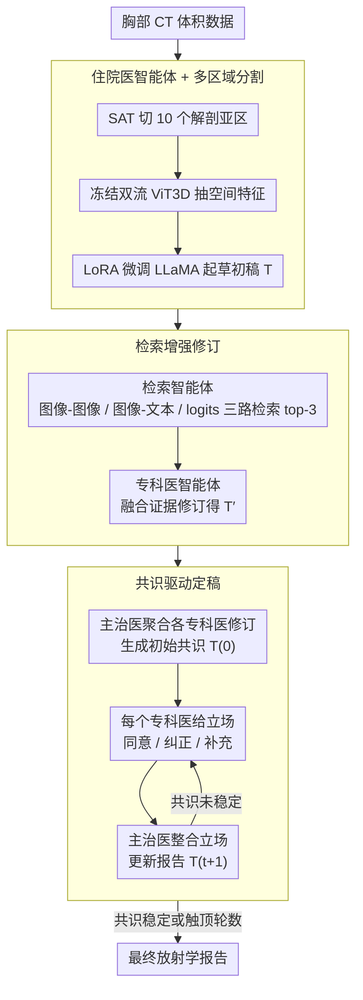

# MARCH: Multi-Agent Radiology Clinical Hierarchy for CT Report Generation

**会议**: ACL 2026  
**arXiv**: [2604.16175](https://arxiv.org/abs/2604.16175)  
**代码**: 无  
**领域**: 医学NLP
**关键词**: 多智能体, 放射学报告生成, 共识驱动, 检索增强, 3D CT

## 一句话总结

本文提出 MARCH，一个模拟放射科住院医-专科医-主治医层级协作流程的多智能体框架，通过三阶段（初始报告起草、检索增强修订、共识驱动定稿）生成 CT 报告，在 RadGenome-ChestCT 数据集上 CE-F1 达 0.399，比最佳基线 Reg2RG 的 0.253 提升 57.7%。

## 研究背景与动机

**领域现状**：自动化放射学报告生成是医学 AI 的重要方向。现有视觉-语言模型（VLM）已在 2D 胸片报告上取得进展，但 3D 体积数据（如胸部 CT）的报告生成仍处于早期阶段。

**现有痛点**：(1) 端到端"黑箱"模型缺乏临床工作流中的迭代验证和交叉核查机制，容易产生临床幻觉；(2) 3D CT 数据中异常发现稀疏，单一模型难以可靠检测所有病理；(3) 单读者模式（single-reader）固有的认知偏差无法被纠正。

**核心矛盾**：临床实践中，放射科通过住院医-专科医-主治医的层级审核流程降低误诊率，但现有自动化系统是单智能体的，缺乏这种多层验证机制。

**本文目标**：设计一个模拟放射科临床层级结构的多智能体框架，实现可解释、可验证的 CT 报告生成。

**切入角度**：借鉴放射科的 readout session 制度——住院医初读、专科医复审、主治医终审——将不同职责分配给不同 AI 智能体。

**核心 idea**：用多智能体层级结构替代单一端到端模型，通过检索增强和多轮共识讨论显著提升临床准确性。

## 方法详解

### 整体框架

MARCH 要解决的是 3D 胸部 CT 报告生成里的“单读者偏差”问题：端到端模型像一个独自看片、无人复核的医生，异常稀疏时容易漏诊或编造。作者把放射科真实的 readout session——住院医初读、专科医复审、主治医终审——直接映射成一条多智能体流水线。输入是胸部 CT 体积数据，输出是最终放射学报告，中间走三段：住院医智能体先起草初始报告；检索智能体调相似病例、专科医智能体据此修订；主治医智能体主持多轮共识讨论，多个专科医反复交换立场直到达成临床共识。

### 关键设计

**1. 住院医智能体 + 多区域分割：把稀疏异常逼到具体解剖区域再读**

3D CT 里的异常往往只占某个解剖亚区、且非常稀疏，全局编码一糊就漏。住院医智能体先用 SAT（Segment Anything with Text）把 CT 切成 10 个解剖亚区域（骨骼、乳腺等），再用冻结的双流 ViT3D（取自 RadFM 预训练）抽空间特征，最后由 LoRA 微调的 LLaMA-2-Chat-7B 生成文本草稿 $T = A_{res}(I; \theta_{res})$。先分区再读，等于强制模型逐块盯住局部解剖和病理实体，缓解了异常检测的稀疏性。

**2. 检索增强修订：给报告配一份“循证第二意见”**

单个生成模型会漏会幻觉，作者用检索补一个外部证据源。这里设计了三种互补的检索范式：图像到图像 / 图像到文本检索用 3D 视觉编码器找视觉相似的 CT 及其报告；logits 检索则用分类头预测 18 种临床异常的 logits 向量、找诊断谱相似的报告。每种各取 top-3，拼成结构化证据 $R = A_{ret}(I, D)$，交给专科医智能体融合后修订初稿 $T' = A_{fel}(T, R)$。这一步类比临床里查文献、对参考病例的过程，而检索带来的循证修订也是后面实验里贡献最大的一环。

**3. 共识驱动定稿：用多轮立场交换而非投票解决分歧**

多个专科医改出来的报告未必一致，简单投票会丢掉分歧里的信息。主治医智能体 $A_{att}$ 先聚合各专科医的修订生成初始共识 $T^{(0)}$；之后每一轮，每个专科医 $A_{fel,i}$ 审查当前共识并给出立场 $S_i^{(t)}$（同意 / 纠正 / 补充），主治医整合所有立场更新报告 $T^{(t+1)} = A_{att}(T^{(t)}, \{S_i^{(t)}\})$，迭代到共识稳定或触顶轮数。这正是真实 readout session 里“魔鬼代言人”机制的复刻——意见不一时靠讨论而非多数表决，临床上已被证明能压低误诊率。

### 一个完整示例：一例胸部 CT 怎么走完三段

拿一例带细微 pericardial effusion（心包积液）的胸部 CT 走一遍。住院医阶段：CT 先被切成 10 个解剖亚区，ViT3D 抽特征后 LLaMA 起草，但因为积液征象微弱，初稿可能只写了肺野、漏了心包。进入修订阶段：图像检索调出视觉相似的几例 CT、logits 检索按 18 类异常的诊断谱找回几份含心包异常的报告，专科医据这份证据把“心包积液”补进修订稿。定稿阶段：主治医聚合多个专科医的修订成初始共识，某个专科医对积液量级给出“纠正”立场、另一个补充随访建议，主治医整合后更新报告，几轮后共识稳定。最终报告把住院医单独读片时漏掉的低频异常补了回来——这也解释了为什么 MARCH 在 hiatal hernia、pericardial effusion 这类低频异常上提升尤其明显。

### 损失函数 / 训练策略

住院医智能体用 AdamW（lr=1e-5）训练 10 个 epoch，ViT3D 骨干冻结、LLaMA-2-Chat-7B 走 LoRA 微调。专科医和主治医智能体直接用 GPT-4.1/GPT-4o 作为 LLM 骨干（temperature=0），不额外训练。

## 实验关键数据

### 主实验

| 方法 | BLEU-1 | BLEU-4 | METEOR | ROUGE-L | CE-Precision | CE-Recall | CE-F1 |
|------|--------|--------|--------|---------|-------------|-----------|-------|
| R2GenPT | 0.433 | 0.242 | 0.399 | 0.323 | 0.340 | 0.066 | 0.110 |
| MedVInT | 0.443 | 0.246 | 0.404 | 0.326 | 0.377 | 0.148 | 0.212 |
| M3D | 0.436 | 0.245 | 0.400 | 0.326 | 0.407 | 0.090 | 0.148 |
| RadFM | 0.442 | 0.237 | 0.399 | 0.315 | 0.382 | 0.131 | 0.195 |
| Reg2RG | 0.473 | 0.249 | 0.441 | 0.367 | 0.423 | 0.181 | 0.253 |
| **MARCH** | **0.482** | **0.257** | **0.456** | **0.383** | **0.495** | **0.335** | **0.399** |

### 消融实验

| 配置 | BLEU-1 | BLEU-4 | METEOR | CE-F1 |
|------|--------|--------|--------|-------|
| Resident-only | 0.469 | 0.246 | 0.435 | 0.219 |
| SR-SA（单轮单智能体） | 0.476 | 0.250 | 0.447 | 0.332 |
| SR-MA（单轮多智能体） | 0.475 | 0.251 | 0.454 | 0.352 |
| MR-MA（多轮多智能体） | 0.479 | 0.255 | 0.456 | 0.362 |
| **MARCH（完整）** | **0.482** | **0.257** | **0.456** | **0.399** |

### 关键发现

- CE-F1 从 Resident-only 的 0.219 提升到完整 MARCH 的 0.399，提升 82%，主要来自检索增强（+0.113）和共识机制（+0.037）
- 检索增强对临床效能贡献最大（SR-SA vs Resident-only: CE-F1 +0.113），说明循证修订是减少幻觉的关键
- 不同 LLM 骨干（GPT-4.1-mini/GPT-4.1/GPT-4o/GPT-5）性能差异很小（CE-F1 0.391-0.399），表明框架设计比 LLM 能力更重要
- MARCH 在低频异常（如 hiatal hernia、pericardial effusion）上的检测提升尤为显著

## 亮点与洞察

- 将放射科层级协作流程直接映射为多智能体架构是优雅的设计——不是随意分配角色，而是对应临床中已验证有效的误诊防范机制
- 三种互补的检索范式（视觉、文本、logits）覆盖了不同类型的相似性，这种多模态检索组合可迁移到其他需要循证的医学 AI 任务
- 共识机制使用"立场"（同意/纠正/补充）而非简单投票，保留了分歧的信息量

## 局限与展望

- 依赖 GPT-4 系列作为推理骨干，成本高且不可部署在医院内部，未验证开源 LLM 的可行性
- 缺乏长期记忆机制，无法利用患者历史影像对比或从既往诊断错误中学习
- 仅在 RadGenome-ChestCT 上评估，未验证对其他解剖部位（如脑部、腹部）的泛化性
- 共识轮数需要预设上限，最优轮数的确定缺乏自适应机制

## 相关工作与启发

- **vs Reg2RG**: Reg2RG 使用区域引导的检索增强但仍是单智能体，MARCH 在其基础上增加多智能体共识，CE-F1 从 0.253 提升到 0.399
- **vs RadFM**: RadFM 是通用 3D 医学基础模型，单模型端到端生成，缺乏验证纠错机制
- **vs MedAgent**: 一般医学多智能体系统主要用于诊断和推荐，MARCH 是首个针对 3D 报告生成的多智能体框架

## 评分

- 新颖性: ⭐⭐⭐⭐ 临床层级结构到多智能体的映射自然且有意义
- 实验充分度: ⭐⭐⭐⭐ 消融完整，包含 LLM 骨干对比和逐异常分析
- 写作质量: ⭐⭐⭐⭐ 框架描述清晰，临床背景交代充分
- 价值: ⭐⭐⭐⭐ 为高风险医学 AI 提供了可解释的协作范式

<!-- RELATED:START -->

## 相关论文

- [\[ACL 2026\] CT-FineBench: A Diagnostic Fidelity Benchmark for Fine-Grained Evaluation of CT Report Generation](ct-finebench_a_diagnostic_fidelity_benchmark_for_fine-grained_evaluation_of_ct_r.md)
- [\[ACL 2025\] Automated Structured Radiology Report Generation](../../ACL2025/medical_nlp/automated_structured_radiology_report_generation.md)
- [\[ACL 2025\] Online Iterative Self-Alignment for Radiology Report Generation](../../ACL2025/medical_nlp/oisa_radiology_report_gen.md)
- [\[ACL 2026\] RA-RRG: Multimodal Retrieval-Augmented Radiology Report Generation with Key Phrase Extraction](ra-rrg_multimodal_retrieval-augmented_radiology_report_generation_with_key_phras.md)
- [\[ACL 2026\] SEMA-RAG: A Self-Evolving Multi-Agent Retrieval-Augmented Generation Framework for Medical Reasoning](sema-rag_a_self-evolving_multi-agent_retrieval-augmented_generation_framework_fo.md)

<!-- RELATED:END -->
