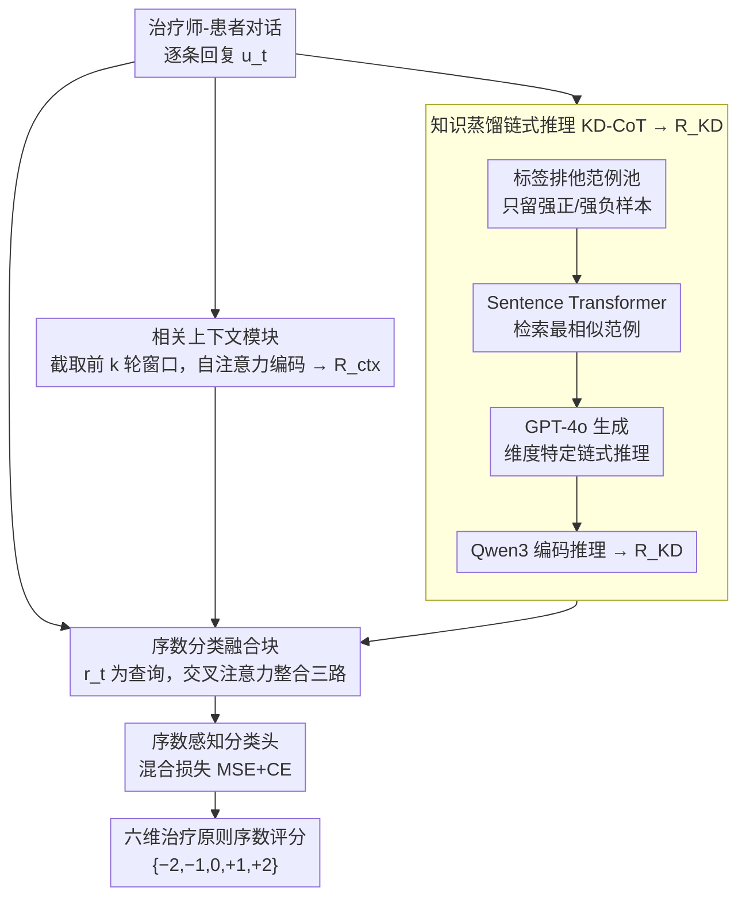

# Measuring What Matters!! Assessing Therapeutic Principles in Mental-Health Conversation

**会议**: ACL 2026  
**arXiv**: [2604.05795](https://arxiv.org/abs/2604.05795)  
**代码**: [https://github.com/](https://github.com/)  
**领域**: 医学NLP
**关键词**: 心理健康对话评估, 治疗原则对齐, 序数分类, 知识蒸馏, 链式推理

## 一句话总结
本文提出 CARE 框架和 FAITH-M 基准数据集，通过对话上下文编码与对比范例检索+知识蒸馏链式推理（KD-CoT），对 AI 生成的心理治疗对话进行六个治疗原则维度的细粒度序数评估，加权 F1 达 63.34，比最强基线 Qwen3 提升 64.26%。

## 研究背景与动机

**领域现状**：大语言模型在心理健康支持中的应用日益增多，从规则式聊天机器人到 ChatGPT 等先进 LLM，已有超过 80% 的心理健康求助者使用 LLM 而非临床验证工具。先前研究表明，普通受试者对 ChatGPT 生成的治疗回复的评价甚至与训练有素的临床医生相当。

**现有痛点**：现有评估方法主要依赖流畅性、同理心等表面指标，缺乏对核心治疗原则（如非评判性接纳、尊重自主权、情境适当性等）的结构化评估。多数方法采用通用指标或主观判断，而非临床扎实的评估框架。

**核心矛盾**：LLM 的语言流畅性掩盖了临床对齐的不足——表面看似"共情"的回复可能违反治疗原则（如过度指导、忽略患者自主权），而现有评估体系无法区分这些差异。

**本文目标**：(1) 定义针对六大治疗原则的细粒度序数评估任务；(2) 构建专家标注的基准数据集；(3) 提出超越提示工程的结构化评估框架。

**切入角度**：作者从心理咨询学理论出发，将治疗师回复的评估建模为多标签序数分类问题，每条回复在六个治疗维度上独立评分（-2 到 +2），并利用对话上下文和范例驱动的推理来模拟专家评判过程。

**核心 idea**：通过局部对话上下文编码 + 对比范例检索 + 知识蒸馏链式推理（KD-CoT）三者融合，让模型学会临床级别的序数治疗评估。

## 方法详解

### 整体框架
CARE 要解决的问题是：给定一段治疗师-患者对话，逐条评估治疗师回复 $u_t$ 在六个治疗原则维度上做得好不好，输出 $\{-2, -1, 0, +1, +2\}$ 的序数标签。它没有把单句话孤立地丢给分类器，而是让三路信号汇合后再判分——一路编码这句话所处的局部对话历史，一路把临床专家的推理逻辑蒸馏进来，最后一路用交叉注意力把两者和回复本身融在一起，送进一个序数感知的分类头。直观上这三路分别回答“这句话说在什么语境下”“一个有经验的治疗师会怎么推理”“综合起来该打几分”。

### 关键设计

**1. 相关上下文模块：同一句话在不同语境下可能合格也可能越界，先把语境喂进去**

治疗评估天然依赖上下文——一句“你应该多出门走走”接在患者刚倾诉孤独之后是恰当引导，接在患者表达自主意愿被否定之后却可能是越界指导。模块为每条回复 $u_t$ 截取前 $k$ 轮对话拼成窗口 $\{p_{t-k}, u_{t-k}, ..., p_t, u_t\}$，用编码器的自注意力捕捉“患者状态如何演变、治疗师干预如何回应”这条依赖链，输出上下文表示 $\mathbf{R}_{\text{ctx}}$。窗口不是越大越好：实验里 $k=2\sim3$ 最优，$k \geq 4$ 反而把无关的早期对话当噪声引入，拉低精度。

**2. 知识蒸馏链式推理（KD-CoT）：纯提示法在序数校准上会塌成“全打中性”，于是把专家推理蒸馏进来**

few-shot 直接问 GPT-4o 的毛病在于它分不清序数的细微差别，倾向把负面、中性样本一股脑归到中性类。KD-CoT 用“教师生成推理、学生编码蒸馏”的方式绕开它：先按每个治疗维度构建标签排他的范例池，只保留强正、强负样本，避免中间类污染；再用 Sentence Transformer 把测试样本嵌入后检索最相似的范例对；把检索到的范例交给 GPT-4o 生成维度特定的链式推理解释，最后用 Qwen3 把这段解释编码成知识表示 $\mathbf{R}_{\text{KD}}$。这样小模型学到的不只是“标签长什么样”，而是“为什么该打这个分”的推理轨迹。

**3. 序数分类融合块：交叉熵把“+2 误判成 -2”和“误判成 +1”罚得一样重，需要让损失感知序数距离**

融合时以回复嵌入 $r_t$ 为查询，$\mathbf{R}_{\text{ctx}}$ 与 $\mathbf{R}_{\text{KD}}$ 为键值，通过交叉注意力整合三路信号，再送入分类头。关键在损失：纯交叉熵把标签当无序类别，错得离谱和错一格惩罚相同，完全忽略 $-2$ 到 $+2$ 的序关系。CARE 改用混合损失

$$\mathcal{L} = \alpha \cdot \text{MSE}(\hat{y}, y) + \beta \cdot \text{CE}(\hat{y}, y)$$

MSE 项让预测值与真值的数值距离也进入惩罚（错得越远罚得越重），CE 项保证分类精度，两者各管一头。验证集上 $\alpha = \beta = 0.5$ 最优。

### 损失函数 / 训练策略
采用上面的混合序数损失，$\alpha = \beta = 0.5$。为保证公平比较，所有基线统一使用相同的上下文窗口（$k=2$）和损失函数。

## 实验关键数据

### 主实验

| 模型类别 | 模型 | Accuracy | Precision | Recall | F1w |
|---------|------|----------|-----------|--------|-----|
| 零样本 | GPT-4o | 31.09 | 36.19 | 31.09 | 30.49 |
| 编码器 | DeBERTa | 33.79 | 35.32 | 33.79 | 34.52 |
| 解码器 | Qwen3 | 45.47 | 45.10 | 45.38 | 38.56 |
| 解码器 | LLaMA 3.2 | 44.91 | 44.78 | 44.91 | 37.90 |
| **本文** | **CARE-Qwen3** | **63.30** | **64.05** | **62.65** | **63.34** |
| **本文** | **CARE-LLaMA 3.2** | **62.07** | **64.11** | **62.07** | **63.07** |
| 提升 | ΔBaseline(%) | ↑39.21% | ↑42.03% | ↑38.05% | **↑64.26%** |

### 消融实验

| 配置 | Acc | F1w | 说明 |
|------|-----|-----|------|
| CARE-Qwen3 完整 | 63.30 | 63.34 | 完整模型 |
| 去掉 KD-CoT (w/o label-context) | 57.08 | 57.20 | F1 掉 6.14 |
| 去掉范例检索 (w/o label-exclusive) | 53.81 | 53.08 | F1 掉 10.26 |
| 专家一致性（NJL） | - | 81.60% | 最高维度 |
| 专家一致性（RF） | - | 66.70% | 最低维度 |

### 关键发现
- KD-CoT 模块贡献最大，去掉后 F1 下降超 10 个百分点，说明结构化推理而非主干模型容量是性能提升的关键
- 上下文窗口 $k=2\sim3$ 最优，$k \geq 4$ 时性能下降，可能因引入无关对话噪声
- 跨数据集泛化测试（PTSD、CheeseBurger）中 CARE 仍显著优于基线，F1 提升 20+ 个百分点
- 错误主要集中在相邻序数类别之间（如 Mild Positive vs Strong Positive），符合序数分类的预期困难

## 亮点与洞察
- **对比范例+知识蒸馏的范式**非常巧妙：先用大模型（GPT-4o）作为"教师"生成推理轨迹，再用小模型编码蒸馏知识，实现了推理能力的迁移而非简单的标签模仿
- 将治疗评估从"流畅性/同理心"等粗粒度指标拓展到六个独立的临床维度，这种多维度序数评估的思路可迁移到任何需要细粒度质量评估的场景（如教育对话、客服质量评估）
- 混合序数损失（MSE+CE）是一个通用的技巧，可用于任何序数分类任务

## 局限与展望
- 仅覆盖六个治疗原则，未涉及文化适应性、创伤知情护理、危机干预等重要临床维度
- 基于单条回复级别的评估，无法建模跨会话的长期治疗联盟构建
- KD-CoT 依赖 GPT-4o 生成推理轨迹，部署成本较高
- 序数标签中间类别（Mild Positive/Negative）的标注本身存在主观性，模型在此区间的误分类难以完全避免

## 相关工作与启发
- **vs 通用同理心检测（Sharma et al. 2021）**: 他们关注同理心表达，本文关注全面的治疗原则对齐，同理心只是六个维度之一
- **vs ChatGPT 治疗评估（Hatch et al. 2025）**: 他们让人类评价 ChatGPT 回复，发现评价受表面质量驱动；本文用结构化框架替代主观判断

## 评分
- 新颖性: ⭐⭐⭐⭐ 任务定义新颖，KD-CoT 框架设计巧妙
- 实验充分度: ⭐⭐⭐⭐⭐ 15 个基线、跨数据集泛化、专家评估、消融全面
- 写作质量: ⭐⭐⭐⭐ 结构清晰，但部分实验细节需翻阅附录

<!-- RELATED:START -->

## 相关论文

- [\[ACL 2026\] Responsible Evaluation of AI for Mental Health](responsible_evaluation_of_ai_for_mental_health.md)
- [\[ACL 2026\] MHGraphBench: Knowledge Graph-Grounded Benchmarking of Mental Health Knowledge in Large Language Models](mhgraphbench_knowledge_graph-grounded_benchmarking_of_mental_health_knowledge_in.md)
- [\[ACL 2026\] MHSafeEval: Role-Aware Interaction-Level Evaluation of Mental Health Safety in Large Language Models](mhsafeeval_role-aware_interaction-level_evaluation_of_mental_health_safety_in_la.md)
- [\[AAAI 2026\] Voices, Faces, and Feelings: Multi-modal Emotion-Cognition Captioning for Mental Health Understanding](../../AAAI2026/medical_nlp/voices_faces_and_feelings_multi-modal_emotion-cognition_captioning_for_mental_he.md)
- [\[ICLR 2026\] CounselBench: A Large-Scale Expert Evaluation and Adversarial Benchmarking of LLMs in Mental Health QA](../../ICLR2026/medical_nlp/counselbench_llm_mental_health_qa.md)

<!-- RELATED:END -->
