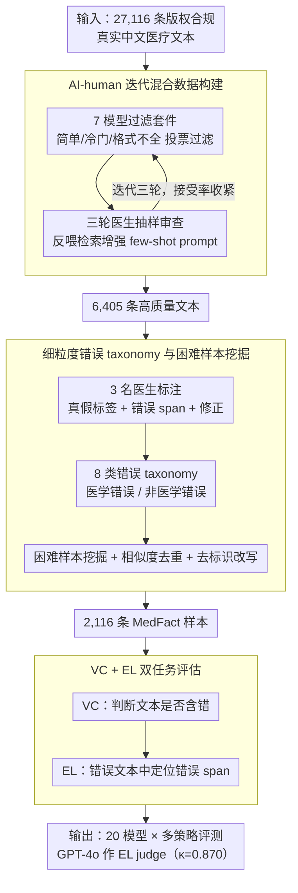

# MedFact: Benchmarking the Fact-Checking Capabilities of Large Language Models on Chinese Medical Texts

**会议**: ACL2026  
**arXiv**: [2509.12440](https://arxiv.org/abs/2509.12440)  
**代码**: 项目页 https://iflytek-medical-southchina.github.io/MedFact/  
**领域**: 医疗NLP
**关键词**: 中文医疗文本、事实核查、错误定位、医疗LLM评测、过度批判

## 一句话总结
MedFact 构建了一个覆盖真实中文医疗文本的专家标注事实核查 benchmark，并用 20 个 LLM 证明：当前模型较容易判断文本“有没有错”，但仍难以精确定位错误，RAG 有帮助，而多智能体和推理时扩展反而容易放大“过度批判”。

## 研究背景与动机
**领域现状**：医疗大模型已经进入临床问答、辅助诊断、患者评估、医学文本分类和医疗 RAG 等应用场景。真实系统常把互联网或内部医学文本接入检索增强生成流程，因此模型不仅要会回答医学考试题，还要能判断医学内容本身是否可靠。

**现有痛点**：已有医学评测大多集中在 QA、关系抽取或临床笔记纠错。VeriFact 使用合成临床文本，MEDEC 主要面向临床笔记错误检测，这些设置很难覆盖医疗百科、科普文章、问答社区、伪造医疗谣言等真实部署会遇到的文本形态。

**核心矛盾**：医疗事实核查既需要广覆盖的医学知识，又要求模型能把错误定位到具体片段。模型可能凭整体语气判断“这段有问题”，但把正确句子误判为错误来源；在医疗场景中，这类“对了结论、错了原因”的行为仍然不安全。

**本文目标**：作者希望构建一个未污染、真实、多样、难度分层的中文医疗事实核查数据集，并用它系统评估 LLM 的真假分类、错误定位、RAG 受益、推理策略副作用和跨语言表现。

**切入角度**：论文不从开放网页直接抓数据，而使用商业合作方未公开的医疗百科、医疗咨询平台、问答页和论坛内容，降低预训练污染风险；再用 AI 过滤、医生标注和困难样本挖掘，把 benchmark 做成真正能区分模型能力的测试集。

**核心 idea**：用“真实医疗文本 + 医生精标错误跨度 + 困难样本筛选”替代合成医疗纠错题，从而把医疗事实核查评测从粗粒度真假判断推进到细粒度错误定位。

## 方法详解
MedFact 本质上是一套 benchmark 构建与评测流程。它先从大规模真实中文医疗文本中筛出适合做事实核查的候选样本，再由医生判断文本是否正确、错误在哪里、应该如何修正，最后通过模型评测和困难样本筛选得到最终测试集。与普通 QA benchmark 不同，MedFact 的关键不是问模型一个医学问题，而是给模型一段可能带错的医学文本，让它同时完成“是否有错”和“错在何处”。

### 整体框架
输入是一批版权合规的真实中文医疗文本，共 27,116 条，来源包括内部医疗百科、医疗咨询平台、问答页面和用户论坛。系统先用 7 个强模型组成过滤套件，从“过于简单、过于冷门、格式不完整”等维度过滤文本；随后三轮医生反馈不断改进检索增强 few-shot 过滤提示，把候选池压缩到 6,405 条高质量文本。

在标注阶段，3 名持证医学专业人员为每条文本提供二元真假标签；若文本错误，还要标注精确错误 span 和建议修正。之后作者再做困难样本挖掘、相似样本去重和去标识化改写，最后由医生复核，得到 2,116 条 MedFact 样本。

评测阶段包含两个任务：Veracity Classification（VC）判断文本是否含有事实错误；Error Localization（EL）在错误文本中定位错误跨度。作者在 zero-shot、CoT、MedPrompt、RAG、MAD、MDAgents、budget forcing 等策略下评测 20 个模型，并用 GPT-4o 作为 EL 自动 judge；GPT-4o 与医生在随机 10% 样本上的 Cohen's $\kappa$ 为 0.870。

### 关键设计

**1. AI-human 迭代混合数据构建：从 2.7 万条真实文本里筛出既有医学含量、又适合评测事实核查的样本，且成本可控**

完全靠医生人工筛 27,116 条文本成本不现实，但完全靠模型又会保留大量低质量或带偏置的样本。本文让 7 个强模型组成过滤套件，按「过于简单、过于冷门、格式不完整（malformed）」等维度投票过滤，再用三轮医生抽样审查把误判样本反喂进「标准特异（standard-specific）的检索增强 few-shot prompt」——也就是针对每条过滤准则各自补上检索到的反例，让下一轮过滤更准。

这套迭代反馈的效果是可量化的：过滤接受率从首轮 67.69% 收紧到 37.00%、再到 23.62%，模型与医生的一致率同步升到 96.40%，候选池从 27,116 条压到 6,405 条高质量文本。它的好处是既保留了模型的可扩展性，又始终用医生判断校准方向，不至于跑偏。

**2. 细粒度错误 taxonomy 与困难样本挖掘：让 benchmark 不只测「粗略医学常识」，而是覆盖不同错误机制和难度层级**

医疗文本里的错误往往很微妙，如果不控制错误类型和难度，整个评测会被夸张谣言或简单常识题主导，测不出真实部署风险。本文先把错误分成医学错误与非医学错误两大类，再细分为概念、术语、时序、引用来源、偏见、一般事实等 8 类，保证错误机制多样。

更关键的是困难样本挖掘：作者移除所有模型都能轻易判对的样本，再用相似度过滤去重，最终从 6,405 条标注文本收敛到 2,116 个更能拉开模型差距的实例。这一步让 benchmark 的区分度集中在「模型容易自信犯错」的样本上，而非被一眼可辨的题目稀释。

**3. VC + EL 双任务评估：同时检查模型「知不知道文本有错」和「知不知道错在哪里」**

医疗事实核查中，单纯把整段标红远远不够——如果模型靠整体语气判断「这段有问题」、却把正确句子误指为错误来源，后续人审或自动修正都会被带偏，这种「对了结论、错了原因」在临床里依然不安全。因此评测拆成两层：Veracity Classification（VC）以含错文本为正类，算 Precision、Recall、F1，考察真假判断；Error Localization（EL）只在文本确被判为错误时启动，要求模型定位的错误 span 与 gold 错误来源匹配才算对。

两个任务用 GPT-4o 作 EL 自动 judge，与医生在随机 10% 样本上的 Cohen's $\kappa$ 达 0.870，说明自动评测足够可信。这种分层设计正是后面那些关键发现（EL 普遍弱于 VC、多智能体放大「过度批判」）能被干净测出来的前提。

### 损失函数 / 训练策略
本文不训练新模型，核心是 benchmark 构建和评测协议。推理设置包括 zero-shot 与 CoT prompting，并额外测试 MedPrompt、RAG、MAD、MDAgents 和 budget forcing。RAG 的知识库来自数据构建中保留下来的 6,405 条专家标注源文本；主要指标是 VC 与 EL 的 Precision、Recall、F1。

## 实验关键数据

### 主实验
| 模型 / 设置 | VC F1 | EL F1 | 关键信息 |
|--------|------|------|------|
| Human | 0.7521 | 0.7012 | 3 名医学专业人员平均表现 |
| XiaoYi zero-shot | 0.7126 | 0.6758 | 医疗专用模型中最强之一 |
| XiaoYi CoT | 0.7061 | 0.6858 | 论文报告的最高 EL F1 |
| Doubao-Seed-1.6-thinking zero-shot | 0.7139 | 0.6712 | 通用模型中表现很强 |
| Doubao-Seed-1.6-thinking CoT | 0.7050 | 0.6786 | CoT 提高 EL，但 VC 略降 |
| DeepSeek-R1 zero-shot | 0.6847 | 0.6051 | Recall 高，但定位仍弱 |

### 策略对比
| 模型 / 策略 | VC F1 | EL F1 | 现象 |
|------|------|------|------|
| DeepSeek-R1 | 0.6847 | 0.6051 | zero-shot 基线 |
| DeepSeek-R1 + RAG top-3 | 0.7369 | 0.6820 | 任务相关知识显著提升 |
| DeepSeek-R1 + MAD | 0.6829 | 0.6017 | Recall 上升但 Precision 下降 |
| DeepSeek-R1 + MDAgents | 0.6965 | 0.6233 | 有小幅提升，但过度批判仍明显 |
| XiaoYi | 0.7126 | 0.6758 | zero-shot 基线 |
| XiaoYi + RAG top-3 | 0.7484 | 0.7051 | 超过 human EL F1 的单项数值，但依赖同源 RAG |
| XiaoYi + MAD | 0.6996 | 0.6831 | 多智能体使 Precision 变差 |
| XiaoYi + MDAgents | 0.7059 | 0.6284 | EL F1 明显低于 RAG top-3 |

### 关键发现
- 数据集规模为 2,116 条，其中正确文本 1,058 条、含单一事实错误文本 1,058 条；错误样本中医学错误占 89.41%，概念错误最多，占 52.65%。
- 模型的 EL 始终弱于 VC，说明“判断有错”比“定位错误”容易得多；最高 EL F1 0.6858 仍低于 human 0.7012。
- RAG 的收益高度依赖检索源相关性。同源 top-3 RAG 能把 XiaoYi EL F1 提到 0.7051，但权威医学资料若不够贴合任务，反而可能降低 Recall。
- 多智能体和推理时扩展会产生“过度批判”：DeepSeek-R1 + MAD 的 VC Precision 从 0.5488 降到 0.5310，Recall 从 0.9101 升到 0.9565，说明它更倾向于把正确文本也判成错误。
- 跨语言实验显示英文翻译版上 F1 可提升，例如 Gemini 2.5 Pro 从 0.6223 到 0.6745，但高 Recall / 低 Precision 的过度批判趋势仍存在。

## 亮点与洞察
- MedFact 的价值在于把医疗事实核查拆成真假分类和错误定位两个层级。很多模型在 VC 上看起来已经接近可用，但 EL 结果揭示它们仍缺少细粒度医学知识。
- “过度批判”是这篇论文最有启发的发现之一。推理更长、多智能体更多，并不必然更安全；在事实核查里，额外 deliberation 可能不断生成牵强错误假设，最终牺牲 Precision。
- 同源 RAG 和权威 RAG 的对比很实用。医疗系统不能只把“权威资料”塞进检索库，还必须保证检索内容与待核查 claim 高度相关，否则模型可能被不匹配证据带偏。
- 数据构建中的困难样本挖掘值得迁移到其他高风险领域。法律、金融、药物安全等任务同样需要从“模型都会的题”转向“模型容易自信犯错的题”。

## 局限与展望
- MedFact 聚焦中文和中国医疗语境，结论不一定能直接推广到其他语言、医疗制度或临床规范。
- EL 使用 GPT-4o 作为自动 judge，虽然与医生一致性较高，但仍可能有偏见或不稳定；高风险样本未来应结合专家复核。
- benchmark 反映的是构建时的医学知识，随着指南和药物证据更新，部分事实标签可能过时，需要动态更新机制。
- 数据集虽然去标识化并限制研究用途，但错误医疗文本仍有被误用风险；未来发布应继续配合许可约束和安全说明。

## 相关工作与启发
- **vs VeriFact**: VeriFact 主要验证合成临床文本相对结构化 EHR 的事实性，MedFact 则使用真实中文医疗文本，覆盖更多写作风格和场景。
- **vs MEDEC**: MEDEC 面向临床笔记中的错误检测和修正，MedFact 更强调互联网与百科式医疗内容，适合评估医疗 RAG 和内容审核系统。
- **vs SimpleQA / OpenFactCheck**: 通用事实性 benchmark 能测开放域 factuality，但缺少医学术语、治疗边界和错误 span 标注；MedFact 把评测收紧到医疗知识密集任务。
- **启发**: 对高风险 RAG 系统来说，评测不能只看最终回答准确率，还应加入“证据是否相关”“是否过度质疑正确内容”“错误定位是否精确”等诊断指标。

## 评分
- 新颖性: ⭐⭐⭐⭐☆ 真实中文医疗事实核查与错误定位结合得很扎实，核心问题重要，但整体仍属于 benchmark 构建与系统评测。
- 实验充分度: ⭐⭐⭐⭐⭐ 20 个模型、多种 prompting / RAG / 多智能体策略、跨语言和污染分析都覆盖到了。
- 写作质量: ⭐⭐⭐⭐☆ 数据流程和错误分析清楚，部分大表信息密集，阅读时需要来回对照。
- 价值: ⭐⭐⭐⭐⭐ 对医疗 LLM、医疗 RAG 和事实核查系统都有直接参考价值，尤其提醒大家不要把“更会推理”简单等同于“更可靠”。

<!-- RELATED:START -->

## 相关论文

- [\[ACL 2026\] MHGraphBench: Knowledge Graph-Grounded Benchmarking of Mental Health Knowledge in Large Language Models](mhgraphbench_knowledge_graph-grounded_benchmarking_of_mental_health_knowledge_in.md)
- [\[ACL 2026\] Beyond the Leaderboard: Rethinking Medical Benchmarks for Large Language Models](beyond_the_leaderboard_rethinking_medical_benchmarks_for_large_language_models.md)
- [\[ACL 2026\] Text-Attributed Knowledge Graph Enrichment with Large Language Models for Medical Concept Representation](text-attributed_knowledge_graph_enrichment_with_large_language_models_for_medica.md)
- [\[ACL 2026\] RePrompT: Recurrent Prompt Tuning for Integrating Structured EHR Encoders with Large Language Models](reprompt_recurrent_prompt_tuning_for_integrating_structured_ehr_encoders_with_la.md)
- [\[ACL 2026\] MHSafeEval: Role-Aware Interaction-Level Evaluation of Mental Health Safety in Large Language Models](mhsafeeval_role-aware_interaction-level_evaluation_of_mental_health_safety_in_la.md)

<!-- RELATED:END -->
