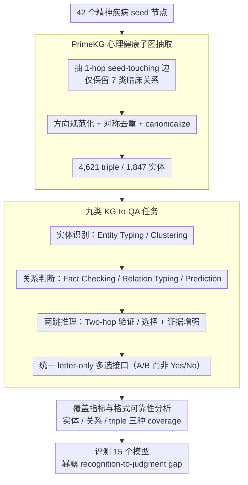

# MHGraphBench: Knowledge Graph-Grounded Benchmarking of Mental Health Knowledge in Large Language Models

**会议**: ACL2026  
**arXiv**: [2605.15589](https://arxiv.org/abs/2605.15589)  
**代码**: 无（cache 未给出开源仓库）  
**领域**: 医疗NLP
**关键词**: 心理健康、知识图谱、PrimeKG、关系判断、两跳推理

## 一句话总结
MHGraphBench 从 PrimeKG 的心理健康子图自动构造 9 类多选任务，发现 LLM 在实体识别上接近满分，但在药物-疾病关系判断、禁忌边界和两跳 KG 推理上仍明显不足。

## 研究背景与动机
**领域现状**：LLM 正被用于医疗与心理健康相关任务，包括临床问答、咨询辅助、诊断建议和知识检索。心理健康场景尤其依赖异构生物医学知识，例如疾病关联、药物适应症/禁忌症、表型、暴露因素和基因蛋白关系。

**现有痛点**：许多医学 benchmark 给出的是宽泛平均准确率，难以看出模型是否真正掌握心理健康相关的结构化知识。心理健康评测也常聚焦诊断、咨询质量或信任度，而不是可验证的知识图谱关系边界。

**核心矛盾**：模型可能会识别“焦虑症是疾病”“某药物是药物”，但这不代表它能判断某药物对某精神疾病是 indication、contraindication、off-label use 还是根本不在图中。这种从 recognition 到 structured judgment 的落差在医疗场景里很关键。

**本文目标**：作者希望构建一个 KG-grounded benchmark，用 PrimeKG 中可验证的心理健康子图来评估 LLM 的实体识别、关系判断、两跳推理、证据利用和图覆盖范围。

**切入角度**：论文不直接评估临床安全，而是把问题限定为“模型是否与一个 curated PrimeKG 心理健康切片一致”。这种边界让 benchmark 可复现、可解释，也避免把 KG 结果过度解读为真实临床建议。

**核心 idea**：从 42 个精神疾病 seed 节点出发抽取心理健康子图，并把 KG triples 自动转为多选 QA，用受控负采样和覆盖指标测量模型在结构化心理健康知识上的薄弱环节。

## 方法详解
MHGraphBench 的流程分为三步：先定义心理健康领域边界，再从 PrimeKG 抽取子图，最后从子图生成多选题。它的关键特点是所有答案都由 KG triple 支持，负例也通过类型匹配和“不在子图中”约束产生，因此每道题都能追溯回图结构。

### 整体框架
作者手工整理 44 个高精度精神疾病候选 seed，剔除 2 个不合适节点后保留 42 个最终 seed。基于这些 seed，从 PrimeKG 抽取 1-hop seed-touching edges，只保留 7 类临床相关关系：disease_protein、contraindication、indication、off-label use、disease_disease、disease_phenotype_positive 和 exposure_disease。经过方向规范化、对称关系去重和 canonicalization，最终得到 4,621 个唯一 triples、1,847 个实体和 7 类关系。

在 QA 生成阶段，系统把图事实转为 9 个任务族：Entity Typing、Entity Clustering、Fact Checking、Relation Typing、Relation Prediction、Two-hop Verification、Two-hop Selection，以及两个 evidence-augmented 两跳任务。所有任务都使用 letter-only multiple-choice interface，二分类任务也用 A/B 而非 Yes/No，以减少词面偏置。

### 关键设计

**1. PrimeKG 心理健康子图抽取：把开放的心理健康知识收成一个可复现、可追踪的边界**

心理健康相关知识太宽，直接问开放题根本无法核对答案对错，必须有结构化的 gold labels。本文从 42 个高精度精神疾病 seed 出发，在 PrimeKG 上抽 1-hop seed-touching 边，只保留 7 类临床相关关系（disease_protein、contraindication、indication、off-label use、disease_disease、disease_phenotype_positive、exposure_disease），并把关系方向固定成 disease→gene/protein、drug→disease、disease→disease 等 schema。

方向规范化之后，对 disease_disease 这种对称关系额外做字典序去重、再统一 canonicalization，最终得到 4,621 个唯一 triple、1,847 个实体。这样每一道题的正确答案都能回溯到一条具体的 KG 边，benchmark 因此可复现、可解释，而不是靠人对模型回答主观打分。

**2. 九类 KG-to-QA 任务：把单一准确率拆成实体识别、关系判断、短链推理三个层次，定位模型到底卡在哪**

一个总准确率很容易掩盖能力差异——模型可能「认识实体却不会判断关系」，但平均分看不出来。本文把图事实自动转成 9 个任务族：Entity Typing / Entity Clustering 测实体类型与聚类，Fact Checking 测某 triple 是否被子图支持，Relation Typing 测关系 schema，Relation Prediction 在 indication / contraindication / off-label use / none 之间分类，Two-hop Verification / Selection 则通过 Drug A→Disease B→Disease C 的二跳结构考组合推理，外加两个 evidence-augmented 两跳任务。

所有任务统一用 letter-only 多选接口，连二分类也用 A/B 而非 Yes/No，以削掉词面偏置。正是这套分层让论文能干净地测出「实体识别接近满分、关系判断和两跳推理明显塌陷」的 recognition-to-judgment gap，而这在单一准确率下是看不见的。

**3. 覆盖指标与格式可靠性分析：补上平均准确率说不清的图级知识覆盖，并把输出格式当成被测能力而非噪声**

采样题上的平均分有两个盲区：一是它只反映被抽到的题、不代表模型对整张图的掌握；二是多选评测里的低分可能根本不是知识缺失，而是模型吐不出一个合法选项字母。本文为此定义实体、关系、triple 三种 coverage——每个 triple 的得分由 head entity correctness、relation correctness、tail entity correctness 取平均，从图结构角度重新衡量模型强弱。

同时把「能否稳定输出单个可解析选项字母」单独记录为格式可靠性。这一步揭示了 accuracy 排名与 coverage 排名并不一致（某些模型采样题分高、图级覆盖却偏低），也把「输出不服从格式」从被忽略的噪声提升为一项真实的部署风险信号。

### 损失函数 / 训练策略
本文不训练模型，而是构建 benchmark 并评测 15 个模型。API 模型温度设为 0、最大 completion 长度 120，并用严格 parser 抽取单个选项字母；本地 Hugging Face 模型采用 forced-choice scoring，通过不同字母表面形式的 log-prob 最大值选答案。benchmark 生成使用固定随机种子 42。

## 实验关键数据

### 主实验
| 模型 | AvgE | RP | AvgS | AvgS+E | AvgAll* | 关键信息 |
|------|------|------|------|------|------|------|
| GPT-4.1 | 94.73 | 54.96 | 60.79 | 66.46 | 70.28 | 总体最强，证据增强后两跳最好 |
| GPT-5.2-chat | 94.07 | 58.63 | 57.88 | 64.33 | 69.32 | RP 单项最高 |
| GPT-4o | 94.62 | 53.55 | 58.16 | 65.12 | 69.10 | R1 最高 62.08 |
| GPT-5-mini | 95.12 | 57.28 | 55.04 | 62.55 | 68.38 | triple coverage 最高 |
| Qwen2.5-32B | 65.53 | 38.43 | 54.75 | 55.66 | 56.09 | 最强开源模型，但与 GPT 仍差距明显 |

### 消融实验
| 图级覆盖指标 | GPT-5-mini | GPT-4o | GPT-4.1 | GPT-5.2 | Qwen2.5-32B |
|------|------|------|------|------|------|
| CovAvg(E) | 77.81 | 77.36 | 77.91 | 63.92 | 61.47 |
| CovDeg(R) | 63.30 | 61.18 | 61.24 | 44.56 | 55.09 |
| Cov(T) | 65.27 | 64.77 | 63.57 | 54.97 | 52.31 |
| 与 AvgAll* 排名关系 | 覆盖最高 | 覆盖第二 | 准确率第一 | 准确率靠前但覆盖偏低 | 开源准确率第一但覆盖不领先 |

### 关键发现
- 顶级模型在 ET/EC 上很强：GPT 系列 ET 大多在 97% 到 98% 以上，AvgE 超过 94%，但 RP 最高只有 58.63%。
- recognition-to-judgment gap 很稳定。模型知道实体类型和关系 schema，并不代表能可靠区分 indication、contraindication、off-label use 和 none。
- 两跳推理仍难。GPT-4.1 的 AvgS 只有 60.79，远低于实体识别水平；证据增强能把它提升到 AvgS+E 66.46，但并非所有模型都受益。
- 证据增强不是万能药。Qwen2.5-32B 的 R1 从 50.50 提到 61.25，但 R2 从 59.00 掉到 50.08，说明短 KG snippets 可能帮助验证，却干扰选择。
- 禁忌关系是细粒度分析中最困难的关系之一，这与真实医疗风险高度相关。

## 亮点与洞察
- 这篇论文最好的地方是边界感很强：它不声称测试“真实临床安全”，而是测试模型与 curated KG slice 的一致性。这让评测结论更可解释。
- Avg accuracy 与 graph coverage 排名不一致很有启发。一个模型可能在采样题上表现好，但图级 coverage 不高；benchmark 不能只看总分。
- constrained multiple-choice 的格式可靠性被作者当作发现而不是噪声。医疗评测中，无法稳定输出可解析答案本身就是部署风险。
- KG-grounded negative sampling 很适合做结构化医学评测，但“子图中没有”不能等同于现实世界中为假，这一点作者反复强调，避免了常见误读。

## 局限与展望
- benchmark 继承了 PrimeKG 和子图抽取策略的覆盖限制，不能代表完整精神医学知识、长期患者语境或个体化治疗决策。
- 所有标签都相对于抽取的 KG 子图成立；医学指南更新后，部分边可能过时或不完整。
- 作者没有对采样题、负例和 evidence snippets 做额外专家验证，因此结果依赖 KG 质量和任务生成规则。
- 多选格式会把知识能力和输出格式服从能力混在一起；对某些模型，低分可能部分来自解析失败或选项偏置。
- 未来可以把 KG-grounded 评测与更接近真实临床流程的 case-based evaluation 结合，但仍需保留可验证证据链。

## 相关工作与启发
- **vs HealthBench / MedQA**: 这些 benchmark 更偏临床问答或健康对话质量，MHGraphBench 聚焦心理健康 KG 结构判断。
- **vs 心理健康咨询/诊断 benchmark**: 相关工作测诊断、咨询或 trustworthiness，本文测的是可验证生物医学关系边界。
- **vs DRKG / PrimeKG 应用研究**: 以往 KG 多用于下游发现和推理，本文把 PrimeKG 子图转为 LLM benchmark，并加入覆盖分析。
- **启发**: 医疗 LLM 评测应该拆出“识别、关系判断、短链推理、证据整合、格式可靠性”几个维度，否则平均分容易掩盖安全关键弱点。

## 评分
- 新颖性: ⭐⭐⭐⭐☆ KG-to-QA 不是全新方向，但心理健康 PrimeKG 子图、九任务设计和覆盖指标组合很扎实。
- 实验充分度: ⭐⭐⭐⭐☆ 15 个模型、任务分组、证据增强和覆盖分析较完整，但缺少专家复核和更多 KG 来源。
- 写作质量: ⭐⭐⭐⭐☆ 边界说明清楚，指标定义严谨；表格较密，阅读成本略高。
- 价值: ⭐⭐⭐⭐☆ 对心理健康 LLM 结构化评测很有价值，尤其适合定位模型在药物关系和两跳推理上的风险。

<!-- RELATED:START -->

## 相关论文

- [\[ACL 2026\] Text-Attributed Knowledge Graph Enrichment with Large Language Models for Medical Concept Representation](text-attributed_knowledge_graph_enrichment_with_large_language_models_for_medica.md)
- [\[ACL 2026\] MHSafeEval: Role-Aware Interaction-Level Evaluation of Mental Health Safety in Large Language Models](mhsafeeval_role-aware_interaction-level_evaluation_of_mental_health_safety_in_la.md)
- [\[ACL 2026\] MedFact: Benchmarking the Fact-Checking Capabilities of Large Language Models on Chinese Medical Texts](medfact_benchmarking_the_fact-checking_capabilities_of_large_language_models_on_.md)
- [\[ICLR 2026\] CounselBench: A Large-Scale Expert Evaluation and Adversarial Benchmarking of LLMs in Mental Health QA](../../ICLR2026/medical_nlp/counselbench_llm_mental_health_qa.md)
- [\[ACL 2026\] Responsible Evaluation of AI for Mental Health](responsible_evaluation_of_ai_for_mental_health.md)

<!-- RELATED:END -->
