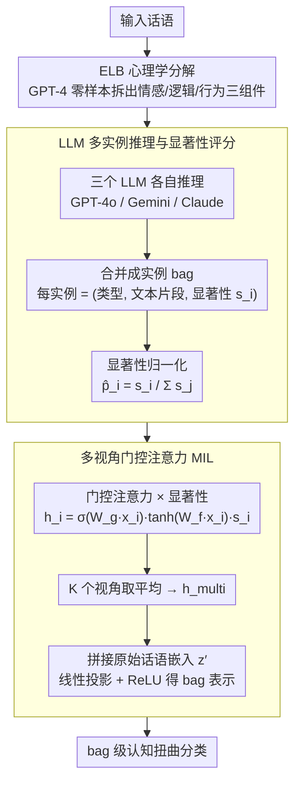

# Multi-View Attention Multiple-Instance Learning Enhanced by LLM Reasoning for Cognitive Distortion Detection

**会议**: ACL 2026  
**arXiv**: [2509.17292](https://arxiv.org/abs/2509.17292)  
**代码**: [GitHub](https://github.com/cocoboldongle/MVACD)  
**领域**: 医学NLP
**关键词**: 认知扭曲检测, 多实例学习, LLM推理, 心理学分解, 门控注意力

## 一句话总结

本文提出将话语分解为情感-逻辑-行为（ELB）三组件并用 LLM 推理多个认知扭曲实例，然后通过多视角门控注意力 MIL 框架进行 bag 级分类，在韩语（KoACD）和英语（Therapist QA）数据集上均优于 LLM 直接推理基线。

## 研究背景与动机

**领域现状**：认知扭曲（如全有全无思维、过度泛化、个人化归因等）与焦虑、抑郁等心理健康疾病密切相关，自动检测认知扭曲是心理健康 NLP 的重要任务。近年 LLM 已被应用于该任务，如 DoT 框架用结构化提示提升可解释性。

**现有痛点**：(1) 大多数方法将话语作为单一无结构输入处理，返回整体预测，忽略了不同认知扭曲可能源自话语的不同心理维度（情感/逻辑/行为）；(2) 单一话语中常常共现多种认知扭曲，但不同类型之间的语义相似性导致专家间标注一致性低；(3) LLM 直接推理的准确性不够——GPT-4o 在 KoACD 上 F1 仅 0.325。

**核心矛盾**：认知扭曲的检测需要同时处理两个问题——一是从话语的不同心理维度（情感、逻辑、行为）中精确定位扭曲表达，二是聚合多个可能共存的扭曲实例做出最终判断。现有方法要么只做整体分类，要么只做 LLM 推理，两者都不充分。

**本文目标**：(1) 将话语结构化分解为心理学基础组件（ELB）以提供更丰富的推理上下文；(2) 将 LLM 推理的每个扭曲实例建模为 MIL 中的实例，实现表达级别的细粒度分类。

**切入角度**：结合 CBT（认知行为疗法）的认知三角理论将话语分解为情感-逻辑-行为，利用 LLM 的推理能力生成多个扭曲候选实例（含类型、文本片段、显著性分数），然后用 MIL 框架进行有监督的 bag 级分类。

**核心 idea**：将认知扭曲检测建模为多实例学习问题——话语是 bag，LLM 推理出的每个扭曲表达是 instance，用多视角门控注意力聚合实例级特征做最终预测。

## 方法详解

### 整体框架

认知扭曲检测要回答的是：一段话里有没有、有哪种认知扭曲（如全有全无思维、过度泛化）。难点在于一句话常同时藏着好几种扭曲，且它们分别源自不同的心理维度。本文不把话语当成一团无结构文本直接分类，而是先把它拆成情感-逻辑-行为（ELB）三个心理学组件喂给 LLM，让多个 LLM 各自推理出若干“扭曲实例”（每个带类型、文本片段、显著性分数），再把这堆实例当成一个 bag，用多视角门控注意力的多实例学习（MIL）框架聚合出 bag 级判断。一句话是 bag，每个被推理出来的扭曲表达是 instance——这就是把检测重述成 MIL 的核心视角。

### 关键设计

**1. ELB 心理学分解：不同扭曲源自不同心理维度，先把话语按维度拆开，LLM 才好定位**

把话语当单一输入时，模型很难说清扭曲到底从哪冒出来的——“我什么都做不好”主要是逻辑层面的过度泛化，“一定是我的错”则牵涉情感和行为的个人化归因。本文借 CBT 的认知三角（Beck, 1979），把“思维”改称“逻辑”以强调推理性质，用 GPT-4 零样本提示为每条话语独立生成情感、逻辑、行为三个组件，连同原文一起作为下游 LLM 推理的输入。维度拆开后 LLM 能更精确地锚定扭曲的来源，实验也显示 ELB 把标签缺失率从 10.89% 降到 8.93%。

**2. LLM 多实例推理与显著性评分：单个 LLM 会漏掉某些扭曲类型，用多 LLM 集成 + 显著性把候选铺全、把置信度带下去**

三个 LLM（GPT-4o、Gemini 2.0 Flash、Claude 3.7 Sonnet）各自独立处理 ELB 增强后的话语，每个输出若干实例 $x_i = (\text{type}_i, \text{text}_i, s_i)$，其中显著性分数 $s_i$ 由 LLM 直接给出，表示该实例的相对重要性。所有 LLM 的实例合并成一个 bag，分数归一化为 $\hat{p}_i = s_i / \sum_j s_j$。多模型集成提高了扭曲类型的覆盖率（避免单模型盲区），而归一化后的显著性分数等于把 LLM 的“置信度”显式注入下游 MIL 分类器，让聚合时知道哪些实例更该被听。

**3. 多视角门控注意力 MIL：单一视角的注意力只盯住部分实例，用多视角并融回全局话语补回遗漏**

每个实例嵌入先经门控注意力算权重

$$h_i = \sigma(W_g \cdot x_i) \cdot \tanh(W_f \cdot x_i) \cdot s_i$$

门控结构（sigmoid 门 × tanh 特征）让模型能选择性放大相关实例，再乘上显著性 $s_i$ 把 LLM 置信度叠加进来。$K$ 个独立视角各算一套注意力、取平均得到 $h_\text{multi}$，避免单视角只关注一小撮实例；最后与转换后的原始话语嵌入 $z'$ 拼接，过线性投影和 ReLU 得到 bag 表示。融回原始话语是为了补上实例级推理可能丢掉的全局语境。

### 损失函数 / 训练策略

标准多类交叉熵损失。学习率从 0.0005 线性衰减至 0.00001，验证损失 10 轮未改善则早停。实例用 all-MiniLM-L12-v2 编码为 384 维向量，所有实验重复 10 次取均值±标准差。

## 实验关键数据

### 主实验

| 方法 | KoACD Val F1 | KoACD Test F1 | Therapist QA Val F1 | Therapist QA Test F1 |
|------|-------------|-------------|-------------------|-------------------|
| Baseline (无ELB无显著性) | 0.504 | 0.473 | 0.410 | 0.340 |
| ELB only | 0.519 | 0.483 | 0.438 | 0.378 |
| Salience only | 0.518 | 0.486 | 0.428 | 0.360 |
| **ELB + Salience** | **0.529** | **0.505** | **0.460** | **0.394** |
| GPT-4o (直接推理) | - | 0.325 | - | 0.332 |
| DoT (GPT-4) | - | 0.346 | - | - |

### 消融实验

| 分析维度 | 结果 |
|----------|------|
| ELB 效果 | 使缺失率从 10.89% 降至 8.93%，改善标签覆盖 |
| 分类型 F1 | "应该陈述"最高（0.852），"情感推理"最低（0.297） |
| LLM 基线 | 三个 LLM 直接推理 F1 均低于 MIL 框架 |

### 关键发现

- ELB 分解 + 显著性分数的组合效果最好，两者各有独立贡献但 ELB 贡献更大
- 语义歧义高的扭曲类型（如情感推理、过度泛化）F1 较低，跨数据集一致
- 本框架（0.505/0.394）显著超过 GPT-4o 直接推理（0.325/0.332）和 DoT（0.346）
- "应该陈述"在韩语数据上 F1 高达 0.852 但英语仅 0.460——语言风格差异显著

## 亮点与洞察

- 将 CBT 认知三角融入 NLP 流水线是心理学理论与技术方法的优雅结合——ELB 分解使模型的推理过程更贴合临床实践
- MIL 框架的引入允许模型在实例级别追踪预测来源，提供了 attribution-based 的可解释性
- 多 LLM 集成推理避免了单一模型的盲区，提高了扭曲类型覆盖率

## 局限与展望

- ELB 组件未经心理学专家独立验证，提取错误可能传播到下游
- 不同扭曲类型的实例数量差异大（"跳到结论"19.5% vs "正面折扣"2.9%），可能导致注意力偏向高频类型
- 依赖商业 LLM（GPT-4、Claude），可移植性和隐私保护受限
- 未提供自然语言解释——可解释性限于归因层面

## 相关工作与启发

- **vs DoT (Chen et al.)**: DoT 用结构化提示提升 LLM 可解释性但仍是单一输入单一输出；本文将推理结果分解为多个实例并用 MIL 聚合
- **vs 传统 MIL-NLP**: 之前 MIL 在 NLP 中的实例定义在句子/段落级别，本文首次将 LLM 推理的表达作为实例
- **vs 零样本 LLM 检测**: LLM 直接推理 F1 远低于有监督 MIL 框架，说明纯 LLM 推理在精细分类任务上仍有差距

## 评分

- 新颖性: ⭐⭐⭐⭐ 心理学理论+LLM+MIL 的组合框架新颖，但单个组件都是已有技术
- 实验充分度: ⭐⭐⭐⭐ 双语评估、消融分析充分，但数据规模较小
- 写作质量: ⭐⭐⭐⭐ 框架描述清晰，但部分细节在附录中
- 价值: ⭐⭐⭐⭐ 为心理健康 NLP 提供了更精细的检测范式

<!-- RELATED:START -->

## 相关论文

- [\[ACL 2026\] Eliciting Medical Reasoning with Knowledge-enhanced Data Synthesis: A Semi-Supervised Reinforcement Learning Approach](eliciting_medical_reasoning_with_knowledge-enhanced_data_synthesis_a_semi-superv.md)
- [\[ACL 2026\] BioHiCL: Hierarchical Multi-Label Contrastive Learning for Biomedical Retrieval with MeSH Labels](biohicl_hierarchical_multi-label_contrastive_learning_for_biomedical_retrieval_w.md)
- [\[ACL 2026\] From Answers to Arguments: Toward Trustworthy Clinical Diagnostic Reasoning with Toulmin-Guided Curriculum Goal-Conditioned Learning](from_answers_to_arguments_toward_trustworthy_clinical_diagnostic_reasoning_with_.md)
- [\[ACL 2026\] MultiDx: A Multi-Source Knowledge Integration Framework towards Diagnostic Reasoning](multidx_a_multi-source_knowledge_integration_framework_towards_diagnostic_reason.md)
- [\[ACL 2026\] CURE-Med: Curriculum-Informed Reinforcement Learning for Multilingual Medical Reasoning](cure-med_curriculum-informed_reinforcement_learning_for_multilingual_medical_rea.md)

<!-- RELATED:END -->
