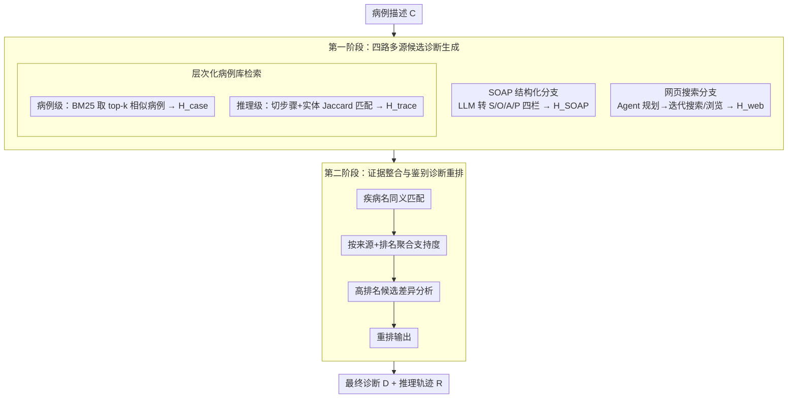

# MultiDx: A Multi-Source Knowledge Integration Framework towards Diagnostic Reasoning

**会议**: ACL 2026 Findings  
**arXiv**: [2604.24186](https://arxiv.org/abs/2604.24186)  
**代码**: https://github.com/Applied-Machine-Learning-Lab/ACL2026-MultiDx  
**领域**: 医学NLP
**关键词**: 多源知识整合, 鉴别诊断, 医疗推理, RAG, Agent

## 一句话总结
MultiDx 将网页检索、SOAP 结构化病例、相似病例库和细粒度推理片段检索合成一个两阶段诊断推理框架，先从多路证据生成候选疾病，再通过疾病匹配、投票和鉴别诊断重排，最终在 MedCaseReasoning 与 DiReCT 上同时提升诊断命中率和推理召回。

## 研究背景与动机
**领域现状**：医疗诊断推理不只是给出一个疾病名，而是要根据主诉、体征、检验、影像和病程变化形成可核查的临床推理链。近两年大模型已经被用于 MedQA、PubMedQA 和病例问答，也出现了 MedAgents、MDAgents、ConfAgents、OpenAI-DR 这类多 Agent 或检索增强框架。

**现有痛点**：单靠 LLM 内部知识时，模型容易在罕见病、最新诊疗知识或复杂多系统病例上知识不足；单靠静态知识库时，知识覆盖和更新速度又受限。更麻烦的是，很多方法只看最终答案是否正确，忽略诊断过程是否符合临床习惯，导致结果难以被医生验证。

**核心矛盾**：诊断推理需要两种能力同时成立：一方面要有足够全面且动态的医学知识，另一方面要能把分散证据组织成标准的鉴别诊断过程。现有方法通常只强调“找更多知识”或“让模型多思考”，但缺少一个把多源候选诊断转化为临床式差异分析的显式整合层。

**本文目标**：作者希望让模型先像医生一样列出可疑疾病，再围绕这些候选疾病比较支持证据和反证，输出带有推理轨迹的最终诊断。这个目标可以拆成三个子问题：如何把自由文本病例转成更稳定的临床结构，如何从外部知识中取回对当前病例真正有用的证据，如何把多路候选结果统一成一个可解释的鉴别诊断结论。

**切入角度**：论文观察到临床诊断天然是多视角的：同一个病例可以从病历结构、相似病例、相似推理步骤和最新医学网页资料中得到不同线索。单一路径可能偏，但多路径之间的共识和冲突反而是鉴别诊断的重要信号。

**核心 idea**：用“多源候选诊断生成 + 显式鉴别诊断整合”代替单次问答式诊断，让 LLM 先收集不同视角的疾病列表，再在统一候选空间里做同义疾病匹配、证据聚合和临床重排。

## 方法详解
MultiDx 是一个训练无关的两阶段框架，重点不在微调某个医疗模型，而在组织诊断推理流程。输入是病例描述 $C$，输出最终诊断 $D$ 和推理路径 $R$：第一阶段从四个知识源各自产生候选疾病列表，第二阶段把这些候选和证据整合成最终排名与解释。

### 整体框架
第一阶段（Multi-source Knowledge-guided Diagnosis Generation）围绕同一个病例并行调用四类信息源：网页搜索得 $H_{web}$，SOAP 结构化病例得 $H_{SOAP}$，相似病例检索得 $H_{case}$，相似推理片段检索得 $H_{trace}$，每一路都输出一个带证据说明的疑似疾病列表。第二阶段（Evidence Integration and Differential Diagnosis）让 LLM 接收原病例和四路候选，先把“myocardial infarction / heart attack”这类同义疾病统一成标准名，再统计每个疾病被哪些来源支持、在各来源里排第几，最后比较高置信候选之间的临床证据，输出最终诊断和推理轨迹。

这条流程有清晰的临床对应：第一阶段相当于医生先列出“疑似诊断清单”，第二阶段相当于做“鉴别诊断”。所以 MultiDx 不是简单把多个 Agent 的答案投票，而是把候选疾病背后的证据也一起纳入重排。

### 关键设计

**1. 四路多源候选诊断生成：单一知识源各有盲区，用四个互补视角同时铺开候选**

诊断对知识覆盖特别敏感：只靠 LLM 内部知识容易在罕见病和最新诊疗上翻车，只靠静态库又更新慢。MultiDx 让四路并行互补——SOAP 分支先用 LLM 把自由文本病例转成 Subjective/Objective/Assessment/Plan 四栏（原始病例没给的 Assessment、Plan 显式标空），再生成 $H_{SOAP}$，解决输入杂乱；病例库分支用 BM25 从 MedCaseReasoning 训练集检索 top-k 相似病例拼进 prompt 生成 $H_{case}$，提供少样本临床范式；推理片段分支把历史推理链切成步骤、用 SciSpacy 抽生物医学实体，按 Jaccard 相似度 $|E_C \cap E_{i,j}| / |E_C \cup E_{i,j}|$ 找到与当前病例实体最相关的推理片段生成 $H_{trace}$，做细粒度证据对齐；网页分支让 Agent 先规划查询、工具和检索步数，再迭代搜索、浏览、抽取并更新内部记忆生成 $H_{web}$，补动态知识和罕见病信息。四者互补，比单一 RAG 或单一多 Agent 讨论更稳。

**2. 层次化病例库检索：只检索整篇病例会被无关病史带偏，只检索短片段又丢上下文，于是两层都要**

作者把病例库表示为 $\mathcal{G}=\{(C_i,R_i,D_i)\}_{i=1}^{N}$，分两层检索。第一层以整篇病例为单位，用 BM25 找相似病例，保留“完整案例模式”；第二层以推理句为单位，把每条推理链拆成编号步骤、对每步抽医学实体，再与输入病例实体做集合相似度匹配，取出“局部证据逻辑”。两层结果分别进入不同 prompt，形成病例级候选和推理级候选。这样既不会因为整篇病史里的无关细节被误导，也不会因为只看片段而丢掉完整临床上下文，召回和可解释性同时受益。

**3. 证据整合与鉴别诊断重排：简单数票会漏掉证据强弱，让模型显式做鉴别诊断**

如果只按“被几个来源提到”投票，就处理不了医学同义词、证据冲突，以及“某疾病出现次数少但证据更强”的情况。MultiDx 要求 LLM 完成四步：疾病名匹配 → 按来源和排名聚合支持度 → 对高排名疾病做差异分析 → 输出最终重排列表和简短理由。形式上模型据 $C, H_{web}, H_{SOAP}, H_{case}, H_{trace}$ 生成 $(R, D)$，$R$ 是临床式解释、$D$ 是最终疾病列表。显式比较候选疾病对症状、检查、排除证据的拟合度，比单纯数票更接近真实临床决策——实验里鉴别诊断相对简单投票把 H@1/H@5/H@10 从 0.403/0.552/0.604 提到 0.420/0.577/0.617。

### 一个完整示例：一例复杂 CNS 病例
拿论文里的中枢神经系统复杂病例走一遍，能看清两阶段怎么协作。第一阶段四路并行各给一份疑似清单：PCNSL（原发性中枢神经系统淋巴瘤）、转移性疾病、神经结节病、感染性脑膜炎等候选被不同来源排在不同位置——网页分支可能更看重感染性病因，病例库分支可能更看重转移瘤，没有哪一路能单独定案。进入第二阶段，模型先把同义疾病名归一，再统计每个候选被哪几路支持、各自排第几，然后对排名靠前的几个做差异分析：逐一比较它们对该病例影像、脑脊液、病程证据的拟合度，权衡支持与排除证据。最终 MultiDx 把 primary CNS lymphoma 排到第一，并给出与专家推理相近的排除逻辑——这正是“先把候选列全、再逐一鉴别”相比一次性作答的价值所在。

### 损失函数 / 训练策略
MultiDx 不引入新的可训练参数，主要依赖 prompt、检索和工具调用流程。实验用 DeepSeek-R1 官方 API 作主 backbone，所有 Agentic baseline 保持同一 backbone 以公平比较；层次化检索默认取 top 10 相似病例和 top 10 推理路径，医学实体抽取用 SciSpacy 0.5.5。训练集只用来构建病例数据库而非微调：MedCaseReasoning 的 13,092 个训练病例作检索库，评估时因算力限制随机抽 300 个 MedCaseReasoning 测试样本、50 个 DiReCT 样本。网页搜索为降低数据泄漏屏蔽了 PubMed、Hugging Face 等来源；DiReCT 已是标准临床笔记格式，实验时省略 SOAP 模块。

## 实验关键数据

### 主实验
论文在两个诊断推理数据集上评估：MedCaseReasoning 用 Reasoning Recall 衡量推理链覆盖，用 H@1/H@5/H@10 衡量正确诊断是否出现在前 k 个预测中；DiReCT 也使用同样指标。所有带 * 的 MultiDx 结果为三次随机运行平均，论文报告 t-test 下 $p<0.05$。

| 数据集 | 方法 | Reasoning Recall | H@1 Acc. | H@5 Acc. | H@10 Acc. | 关键结论 |
|--------|------|------------------|----------|----------|-----------|----------|
| MedCaseReasoning | DeepSeek-R1 | 0.648 | 0.360 | 0.419 | 0.442 | 强 backbone，但候选召回不足 |
| MedCaseReasoning | MedAgents | 0.641 | 0.344 | 0.458 | 0.471 | 多专家讨论带来一定提升 |
| MedCaseReasoning | OpenAI-DR | 0.557 | 0.416 | 0.553 | 0.602 | 强 agentic baseline，准确率高但推理召回偏低 |
| MedCaseReasoning | MultiDx | **0.662** | **0.420** | **0.577** | **0.617** | 四项指标均最好，H@5/H@10 优势最明显 |
| DiReCT | DeepSeek-R1 | 0.473 | 0.293 | 0.413 | 0.473 | 迁移到临床笔记后性能下降 |
| DiReCT | Self-refinement | 0.662 | 0.300 | 0.466 | 0.586 | 推理召回强，H@10 接近 MultiDx |
| DiReCT | OpenAI-DR | 0.586 | 0.297 | 0.452 | 0.479 | 整体不如 Self-refinement |
| DiReCT | MultiDx | **0.665** | **0.333** | **0.503** | **0.587** | 在小样本 DiReCT 上仍保持最佳或并列最佳 |

从主结果看，MultiDx 的主要收益不是只把 top-1 提高一点，而是显著扩大正确诊断进入候选列表的概率。在 MedCaseReasoning 上，相比 DeepSeek-R1，H@5 从 0.419 提到 0.577，H@10 从 0.442 提到 0.617；相比 OpenAI-DR，H@5/H@10 也分别提升 0.024/0.015。这说明多源证据整合特别适合“先列全，再鉴别”的诊断任务。

### 消融实验
消融实验把 DeepSeek-R1 作为基础模型，分别只加入一种知识增强，再与完整 MultiDx 比较。

| 配置 | H@1 | H@5 | H@10 | Reasoning Recall | 说明 |
|------|-----|-----|------|------------------|------|
| DeepSeek-R1 | 0.360 | 0.419 | 0.442 | 0.648 | 无外部知识增强 |
| w/ SOAP | 0.379 | 0.467 | 0.502 | 0.638 | 仅结构化病例，准确率提升但推理召回略降 |
| w/ web search | 0.416 | 0.553 | 0.602 | 0.460 | 准确率最强的单模块，推理轨迹覆盖不足 |
| w/ related case | 0.393 | 0.489 | 0.523 | 0.634 | 相似病例对 seen disease 更有帮助 |
| w/ related trace | 0.386 | 0.520 | 0.576 | 0.573 | 推理片段比完整病例更利于候选召回 |
| MultiDx | **0.420** | **0.577** | **0.617** | **0.662** | 多源融合同时改善准确率和推理召回 |

最有意思的是 web search 单模块在 H@1/H@5/H@10 上已经很强，但 Reasoning Recall 从 0.648 降到 0.460，说明实时网页知识能帮助找到疾病名，却未必生成与专家标注一致的临床推理链。完整 MultiDx 能把网页的知识覆盖、病例库的临床范式和 SOAP 的结构化输入结合起来，所以最终 Recall 反而最高。

### 泛化、整合策略与成本分析
作者还做了三个补充实验：换 backbone、区分 seen/unseen 疾病、比较简单投票和鉴别诊断整合。

| 实验设置 | 对比项 | H@1 | H@5 | H@10 | Recall | 观察 |
|----------|--------|-----|-----|------|--------|------|
| Qwen3-14B backbone | Qwen3-14B | 0.284 | 0.295 | 0.295 | 0.638 | 基础模型候选召回很弱 |
| Qwen3-14B backbone | MedAgents | 0.362 | 0.377 | 0.384 | 0.572 | 多 Agent 提升有限 |
| Qwen3-14B backbone | MultiDx | **0.399** | **0.556** | **0.601** | **0.679** | 说明框架收益不依赖单一 backbone |
| Seen diseases | DeepSeek-R1 | 0.459 | 0.520 | - | - | 训练病例库内疾病较容易 |
| Seen diseases | MultiDx | **0.504** | **0.710** | - | - | 多源整合显著提高候选覆盖 |
| Unseen diseases | DeepSeek-R1 | 0.300 | 0.366 | - | - | 罕见或未见疾病更难 |
| Unseen diseases | MultiDx | **0.338** | **0.448** | - | - | 网页知识和多源互补改善泛化 |
| Stage 2 strategy | simple vote | 0.403 | 0.552 | 0.604 | - | 只数票会漏掉证据强弱 |
| Stage 2 strategy | differential diagnosis | **0.420** | **0.577** | **0.617** | - | 显式鉴别诊断优于简单投票 |

计算成本方面，MultiDx 的端到端平均延迟约 8.46 分钟，总 token 约 20,000，与 Self-refinement 的 5.3 分钟/18,398 tokens 和 OpenAI-DR 的 8.0 分钟大致同量级。Stage 1 的四个分支可以并行执行，因此实际等待时间主要受最慢的 web search 和 related trace 影响。作者也指出，如果场景对延迟敏感，可以关闭 web search 或 related trace，把耗时降到约 2 分钟，但会牺牲一部分性能。

### 关键发现
- **多源融合比单模块更稳**：web search 是准确率最强的单一增强源，但完整 MultiDx 才能同时拿到最高 H@k 和最高 Reasoning Recall。
- **鉴别诊断不是装饰模块**：附录中 simple vote 的 H@1/H@5/H@10 为 0.403/0.552/0.604，而 differential diagnosis 为 0.420/0.577/0.617，说明 Stage 2 的临床比较确实比投票更有效。
- **病例检索存在噪声-覆盖权衡**：case retrieval 的 k 从 2 增到 10 时 H@1 提高到 0.393，但 H@5/H@10 并非单调上升，说明更多相似病例会增加候选疾病覆盖，也可能引入不相关证据。
- **unseen disease 仍然受益**：在未出现在病例库的疾病上，MultiDx 的 H@1/H@5 达到 0.338/0.448，高于 DeepSeek-R1 的 0.300/0.366，证明它不是只靠记忆训练库病例。
- **病例分析验证了整合逻辑**：在 CNS 复杂病例中，四路模块把 PCNSL、转移性疾病、神经结节病、感染性脑膜炎等候选列在不同位置；MultiDx 最终将 primary CNS lymphoma 排到第一，并给出和专家推理相近的排除逻辑。

## 亮点与洞察
- **把诊断任务拆成“候选生成”和“鉴别诊断”非常自然**：很多医疗 LLM 方法把输出疾病名当作终点，而 MultiDx 把候选疾病列表视作中间对象。这个设计让模型有机会比较多个看似合理的疾病，而不是在一次生成中仓促定案。
- **SOAP 的价值不是带来外部知识，而是降低输入噪声**：它只是重排病例信息，却能提升 H@k，说明医疗推理中“信息组织形式”本身就是能力瓶颈。类似思想可以迁移到法律、金融风控等高度结构化推理任务。
- **推理片段检索比普通病例 RAG 更贴近诊断过程**：疾病诊断常常由某个关键体征或检查结果触发，整篇相似病例未必相似。按推理步骤抽实体再检索，相当于从历史病例中取出可复用的局部临床逻辑。
- **Stage 2 提醒我们不要迷信投票**：多源系统中，来源数量不是证据强度的充分条件。一个来源少但证据贴合度高的候选疾病，可能比三个泛泛相关的候选更可信。
- **这个框架很适合做可控降级**：在高风险或复杂病例中开启所有模块，在低风险或高并发场景中只开 SOAP + related case，可以形成性能、成本和可解释性的可调节组合。

## 局限与展望
- **外部知识质量会直接影响诊断质量**：作者也承认，如果网页搜索结果或检索病例含有噪声，MultiDx 的候选列表可能被污染。尤其在医疗场景中，网页信息的权威性、时效性和适用人群都需要更严格过滤。
- **两阶段设计仍然是解耦流程**：第一阶段各模块独立生成候选，第二阶段再整合，这可能导致早期漏掉的关键疾病无法在后续恢复。未来可以探索联合规划，让 Stage 2 反向要求 Stage 1 针对冲突点补检索。
- **实验样本规模偏小**：MedCaseReasoning 只随机评估 300 个测试样本，DiReCT 只有 50 个样本。虽然三次运行和统计检验提高了可信度，但真实部署前仍需要更大规模、多中心、跨科室的验证。
- **推理质量评估仍依赖现有标注**：Reasoning Recall 能衡量是否覆盖专家推理步骤，却不完全等价于临床正确性。某些病例可能存在多条合理推理路径，单一 gold trace 会低估模型的替代解释。
- **安全性和责任边界尚未充分讨论**：论文主要报告准确率、召回和成本，没有系统分析 hallucination、过度诊断、漏诊风险、人机协作界面和医生复核机制。这些是医疗 AI 走向真实场景时必须补上的部分。

## 相关工作与启发
- **vs MedAgents / MDAgents**: MedAgents 让多个 LLM 扮演专科医生讨论，MDAgents 根据任务复杂度动态分配 Agent；MultiDx 的区别在于它不只是“多人讨论”，而是显式引入 SOAP、病例库、推理片段和网页搜索四种知识源，并在最终阶段做疾病同义匹配与鉴别诊断。优势是证据来源更丰富、输出更可追溯；劣势是流程更长、成本更高。
- **vs ConfAgents / Medaide / MMedAgent-RL**: 这些方法强调静态数据库、多 Agent 协作或从数据库中学习医疗知识。MultiDx 更强调动态知识补充，尤其通过 web search 处理罕见病或知识更新问题。它启发后续医疗 RAG 不应只做“检索文档 + 生成答案”，还要区分病例级、推理步骤级和实时资料级证据。
- **vs OpenAI-DR / deep research agents**: OpenAI-DR 代表通用深度研究式 Agent，能通过工具链处理复杂推理；MultiDx 把类似思路专门嵌入诊断工作流，并用 SOAP 和鉴别诊断约束输出。它的启发是：通用 Agent 很强，但垂直领域仍需要把工具调用组织成符合专业流程的结构。
- **对其他任务的启发**: 论文的方法可以迁移到法律判例分析、金融审计、科研问答等任务：先从多源证据生成候选结论，再对候选结论做同义合并、支持度聚合和反证比较。关键不是简单增加检索源，而是设计一个能处理证据冲突的整合阶段。

## 评分
- 新颖性: ⭐⭐⭐⭐☆ 多源检索、SOAP 和鉴别诊断单独看并不陌生，但组合成贴合临床流程的两阶段诊断框架很扎实。
- 实验充分度: ⭐⭐⭐⭐☆ 主实验、消融、跨 backbone、seen/unseen、成本和病例分析都覆盖了，但测试样本规模和真实临床验证仍偏有限。
- 写作质量: ⭐⭐⭐⭐☆ 方法线索清楚，表格信息密度高，附录 prompt 和病例分析有助复现；不足是部分公式和变量在 arXiv HTML 中排版略混乱。
- 价值: ⭐⭐⭐⭐⭐ 对医疗 LLM 的实用启发很强：诊断系统需要多源证据、标准流程和可核查推理，而不是只追求最终答案命中。

<!-- RELATED:START -->

## 相关论文

- [\[ACL 2026\] SEMA-RAG: A Self-Evolving Multi-Agent Retrieval-Augmented Generation Framework for Medical Reasoning](sema-rag_a_self-evolving_multi-agent_retrieval-augmented_generation_framework_fo.md)
- [\[ACL 2026\] Dr. Assistant: Enhancing Clinical Diagnostic Inquiry via Structured Diagnostic Reasoning Data and Reinforcement Learning](dr_assistant_enhancing_clinical_diagnostic_inquiry_via_structured_diagnostic_rea.md)
- [\[ACL 2026\] Beyond the Individual: Virtualizing Multi-Disciplinary Reasoning for Clinical Intake via Collaborative Agents](beyond_the_individual_virtualizing_multi-disciplinary_reasoning_for_clinical_int.md)
- [\[ACL 2026\] Eliciting Medical Reasoning with Knowledge-enhanced Data Synthesis: A Semi-Supervised Reinforcement Learning Approach](eliciting_medical_reasoning_with_knowledge-enhanced_data_synthesis_a_semi-superv.md)
- [\[ACL 2026\] From Answers to Arguments: Toward Trustworthy Clinical Diagnostic Reasoning with Toulmin-Guided Curriculum Goal-Conditioned Learning](from_answers_to_arguments_toward_trustworthy_clinical_diagnostic_reasoning_with_.md)

<!-- RELATED:END -->
