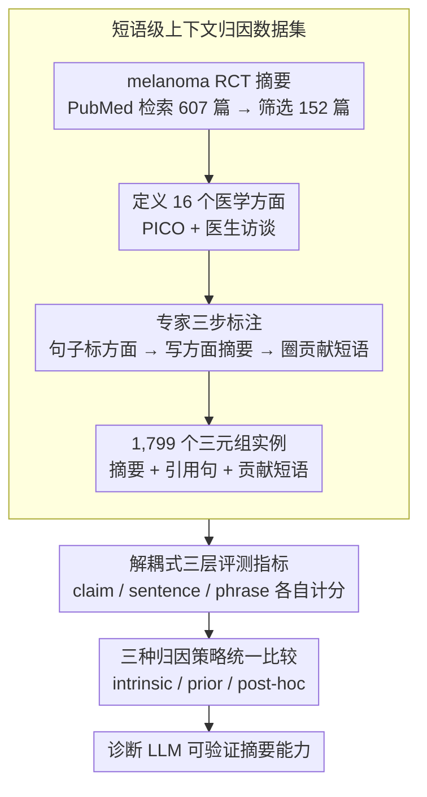

# PCoA: A New Benchmark for Medical Aspect-Based Summarization With Phrase-Level Context Attribution

**会议**: ACL2026  
**arXiv**: [2601.03418](https://arxiv.org/abs/2601.03418)  
**代码**: https://github.com/chubohao/PCoA  
**领域**: 医学NLP / 医学摘要 / 可溯源生成  
**关键词**: 医学方面摘要, 短语级归因, RCT摘要, 可验证摘要, LLM评测

## 一句话总结
PCoA 构建了一个面向随机对照试验摘要的医学方面级摘要基准，把每条方面摘要同时对齐到支撑句子和贡献短语，并用 claim、citation、phrase 三层指标系统评测 LLM 在可验证医学摘要上的能力。

## 研究背景与动机
**领域现状**：医学证据综合通常需要阅读大量随机对照试验（RCT）摘要，再按 Participants、Intervention、Comparator、Outcomes 等临床方面抽取关键信息。
传统摘要任务多生成一段通用摘要，而医学读者常常只关心某个方面，例如治疗方案、主要终点、随访时间或不良事件。
因此，方面级摘要比通用摘要更适合临床证据比较和系统综述整理。

**现有痛点**：LLM 已经能生成较流畅的医学摘要，但在高风险医疗场景里，流畅并不等于可信。
如果摘要里的一句话没有清楚指向原文依据，读者仍然要回到长文本中重新检索证据。
已有 context attribution 方法往往只给文档级、段落级或整句级 citation，这会让核验粒度过粗，尤其难判断摘要中的具体数值、药物名、剂量和 endpoint 是否真的来自原文。

**核心矛盾**：医学摘要需要同时满足“压缩信息”和“可审计证据”两个目标。
压缩得越强，越容易丢掉来源；引用得越粗，读者又难以快速定位摘要里的具体事实。
这篇论文认为，真正可用的医学方面摘要不应只回答“写了什么”，还要回答“每个关键信息从哪一句、哪几个短语来”。

**本文目标**：作者把任务拆成三个相互绑定的输出：给定一篇 RCT 摘要和一个医学方面，系统需要生成方面摘要、给出支撑该摘要的原文句子，并标出这些句子里真正贡献摘要内容的短语。
这样一来，评测对象不再只是摘要文本本身，而是摘要质量、句子级 citation 质量和短语级 evidence alignment 的联合能力。

**切入角度**：论文选择 melanoma 相关 RCT 摘要作为标注来源，因为 RCT 是循证医学中的核心证据形态，摘要结构相对稳定，而且公开可得。
作者进一步基于 PICO 框架和医生访谈定义 16 个医学方面，使 benchmark 既覆盖经典 PICO 信息，也包含 funding、registration、blinding 等临床研究报告中常见但容易被忽略的方面。

**核心 idea**：用“方面摘要 + 支撑句 + 贡献短语”的三元标注，替代只看生成摘要的粗粒度评测，从而把医学摘要的可验证性推进到短语级。

## 方法详解
PCoA 本质上不是一个新模型，而是一个新任务、新数据集和新评测框架的组合。
它把医学方面摘要任务定义成一个带证据链的生成问题：模型不能只输出一段漂亮摘要，还必须同时告诉读者摘要由哪些原文句子支撑，以及句子中的哪些短语直接贡献了摘要内容。
这种设计很适合医学 NLP，因为医学事实经常由具体实体、数值、剂量、时间和 endpoint 组成，短语级证据比整段 citation 更接近临床读者的核验需求。

### 整体框架
整个工作可以分成四个阶段。

第一阶段是数据来源筛选。
作者从 PubMed 检索 melanoma 相关随机对照试验摘要，初筛 607 篇，最终保留 152 篇。
筛选条件包括近十年发表、英文论文、RCT 类型、聚焦 melanoma，并且发表在 JCR Q1 或 Q2 期刊。
论文只使用摘要而不是全文，原因是摘要公开可得，且通常已经包含主要临床方面的信息。

第二阶段是医学方面体系定义。
作者基于医生访谈和 PICO 框架定义 16 个方面：Objective、Participants、Intervention、Comparator、Outcomes、Findings、Medicines、Treatment Duration、Primary Endpoints、Secondary Endpoints、Follow-Up Duration、Adverse Events、Randomization、Blinding、Funding、Registration。
每个方面都有最低报告要求，例如 Intervention 要包含给药方案，Outcomes 要包含 endpoint 和数值，Registration 要包含注册号。
这一步让标注者知道“什么信息算完整”，也让后续评测有一致语义边界。

第三阶段是专家标注。
两名医学学生在自建在线系统中完成三步标注。
他们先给每个原文句子分配一个或多个相关医学方面，也允许句子不属于任何方面。
然后，标注者基于对应方面的句子写出方面摘要。
最后，他们从已选句子中标出 contributory phrases，要求这些短语以原形或变体进入摘要。
最终数据集包含 1,799 个方面级实例，每个实例都有 summary、cited sentences 和 contributory phrases 三部分。

第四阶段是模型评测。
给定文章 $d=[c_1,c_2,\cdots,c_n]$ 和目标方面 $a$，系统要输出生成摘要 $sum'$、引用句集合 $\mathcal{C}'$ 和贡献短语集合 $\mathcal{P}'$。
评测框架分别衡量摘要是否覆盖关键事实、引用句是否真正支撑摘要、短语是否来自引用句且能对应摘要内容。
作者用 Mistral-Large-2411 做 claim decomposition，用 TRUE 做 entailment 判断，用 NLTK 做短语 tokenization。

### 关键设计

**1. 短语级上下文归因数据集：把摘要、支撑句、贡献短语拧成一条可查的证据链**

医学摘要的错误往往不在整段，而在具体短语——药物剂量写错、随访月份记反、终点名称张冠李戴、注册号对不上，只给文档级或整段 citation，读者根本没法高效定位这些事实。PCoA 因此不满足于让模型写一段方面摘要，而是给每条摘要显式挂上两层证据：先对每篇 RCT 摘要做句子级方面标注（一句可属多个方面，也可不属任何方面），再基于相应句子写出方面摘要，最后从这些句子里圈出真正进入摘要的 contributory phrases，要求它们以原形或变体出现在摘要中。

这样得到的每个实例都是 summary、cited sentences、contributory phrases 三元组，整套数据共 1,799 个方面级实例。证据结构比普通摘要数据集细一个量级，核验粒度直接落到临床读者真正会盯的那几个数字和实体上。

**2. 解耦式三层评测指标：把“摘要写错”“引用找错”“短语没对齐”分开打分**

一个模型完全可能摘要写得齐全却引错句子，也可能引对了句子却没抽出关键短语——若用一个 ROUGE 或整体分混在一起，这些性质不同的失败会被互相掩盖。PCoA 把评测拆成三层各自独立计分。摘要层用 claim recall 和 claim precision：先把参考摘要和生成摘要都分解成 atomic subclaims，再用 NLI 判断两边是否互相蕴含；句子层用 sentence recall/precision，要求一条引用句既落在参考引用集里、又能支撑生成摘要的至少一个 claim；短语层用 phrase recall/precision，要求贡献短语落在“参考短语 ∩ 生成短语 ∩ 引用句 ∩ 生成摘要”的有效交集中。

三层解耦的价值在于诊断性：同样一个 0.6 的总分，可能是摘要差、也可能是短语对齐差，而这两种失败在高风险医疗场景里的后果完全不同，解耦指标能直接把责任归到具体环节。

**3. 三种归因策略的统一比较：回答“证据该在生成前、生成中还是生成后绑定”**

PCoA 不只想做一个排行榜，更想回答可溯源生成的一个工程问题——证据和摘要的绑定时机。它用同一份数据和同一套指标横向比较三条 context attribution 路线：intrinsic 让模型一次性吐出摘要、引用句和短语；prior 先检索相关句子和贡献短语，再只基于这些证据写摘要；post-hoc 先写摘要，再回头为摘要补引用句和短语。

三种策略对应三种把幻觉关进笼子的工程姿势，而实验里 prior 在 citation 和 phrase 两层明显更稳（先把生成空间约束到可核验证据上），post-hoc 最弱（第一步的过度推断会污染后续找证据）。这个对比让 benchmark 的结论从“谁分高”升级成“可溯源摘要该怎么搭”。

### 损失函数 / 训练策略
本文没有训练专用模型，实验重点是 zero-shot benchmarking。
所有 LLM 使用共享 prompt 模板，在 intrinsic 设定下直接根据 RCT 摘要和目标方面输出 summary、sentences、key phrases。
prior 设定被拆成两步：先提示模型找出方面相关句子并抽取贡献短语，再提示模型只根据这些证据写摘要。
post-hoc 设定也被拆成两步：先写方面摘要，再根据摘要回查原文句子和短语。
大模型调用温度设为 0.7，作者通过 commercial APIs 评测 LLaMA3.1-70B-Instruct、Mistral-Large-2411、DeepSeek-V3-0324 和 GPT-4o，完整评测成本约 23.6 美元。

## 实验关键数据

### 主实验
主实验先在 intrinsic context attribution 设置下比较四个 LLM。
指标分为三组：C-R/C-P/C-F1 衡量摘要 claim 质量，S-R/S-P/S-F1 衡量引用句质量，P-R/P-P/P-F1 衡量贡献短语质量。

| 模型 | C-F1 | S-F1 | P-F1 | 主要观察 |
|------|------|------|------|----------|
| LLaMA3.1-70B | 0.605 | 0.650 | 0.538 | recall 较高，但 precision 偏低 |
| DeepSeek-V3 | 0.659 | 0.672 | 0.539 | 摘要层最佳，引用层并列最佳 |
| Mistral-Large | 0.651 | 0.655 | 0.574 | 短语层最佳，C-P 和 P-P 更强 |
| GPT-4o | 0.621 | 0.672 | 0.539 | 引用层并列最佳，格式遵循稳定 |

从表中可以看到，没有一个模型在三层指标上全面领先。
DeepSeek-V3 的 claim recall 达到 0.757，说明它更擅长覆盖参考摘要中的事实。
Mistral-Large 的 phrase precision 为 0.522、P-F1 为 0.574，是短语层表现最好的模型。
四个模型普遍 recall 高于 precision，说明它们倾向于多写、多引、多抽，带来冗余或不完全正确的内容。

作者还检查了输出格式遵循情况。
DeepSeek-V3 和 GPT-4o 都达到 100% 模板合规。
LLaMA3.1 在 1,799 个输出中有 33 个格式偏离，需要人工修正。
Mistral-Large 只有 1,609 个输出符合模板，另有 99 个无效响应被排除。
这说明在结构化医学摘要任务里，格式稳定性本身也是可部署性的一部分。

### 消融实验
论文没有传统模块消融，而是把三种上下文归因策略作为核心对比实验。
这个对比相当于回答：证据是在摘要前筛选、摘要时一并生成，还是摘要后补齐，哪一种更可靠。

| 归因策略 | C-F1 | S-F1 | P-F1 | 说明 |
|----------|------|------|------|------|
| Intrinsic | 0.630 | 0.670 | 0.540 | 一次性生成摘要、引用句和短语 |
| Prior | 0.660 | 0.700 | 0.610 | 先找句子和短语，再基于证据写摘要 |
| Post-hoc | 0.620 | 0.580 | 0.480 | 先写摘要，再回查证据 |

prior 策略在 citation 和 phrase 两层优势最明显，S-F1 达到 0.700，P-F1 达到 0.610。
intrinsic 策略的 S-F1 为 0.670、P-F1 为 0.540，说明让模型边写边引用可行，但仍容易混入不支撑摘要的句子。
post-hoc 策略表现最弱，尤其 S-F1 只有 0.580，P-F1 只有 0.480。
原因很直观：如果第一步摘要已经加入了无关或过度推断的信息，第二步再找证据时会被这些多余 claim 牵着走。

### 关键发现
- **数据质量较高**：人工评估从 completeness 和 conciseness 两个维度检查 summary、citation、phrase，16 个方面平均分都超过 4.6 分；标注一致性也较强，within-one rate 为 97.4%，exact match rate 为 92.1%，MAE 为 0.109。
- **复杂上下文显著拉低性能**：当参考摘要中的 subclaim 数、引用句数或贡献短语数增加时，DeepSeek-V3 的相关指标整体下降，说明当前 LLM 对多事实、多证据医学摘要仍不稳定。
- **不同医学方面难度差异很大**：Intervention 和 Outcomes 因为信息密集，整体更难；Blinding、Funding、Registration 往往表达简短明确，因此更容易被模型正确抽取。
- **Findings 是明显难点**：在 DeepSeek-V3 的方面拆分结果中，Findings 的 C-F1 为 0.382、S-F1 为 0.205、P-F1 为 0.092，说明综合性结论比结构化字段更难被准确归因。
- **先证据后摘要更稳**：case study 中，prior 策略先锁定句子 [2] 和 [4] 以及剂量短语，再生成 intervention 摘要，C-F1、S-F1、P-F1 都达到 1.0；post-hoc 策略则把安全性、耐受性等无关信息也拉进来，导致证据链变脏。

## 亮点与洞察
- **把“可验证摘要”落到短语级**：很多 attribution benchmark 只关心引用是否相关，但 PCoA 要求引用句中的关键短语也能对上摘要内容，这更接近医生核验具体事实的方式。
- **评测框架比单一生成指标更有诊断性**：claim、sentence、phrase 三层指标能分辨“摘要写错”“引用找错”“短语没对齐”三种不同失败，而这些失败在医疗应用中的风险完全不同。
- **prior attribution 的结论很有工程启发**：先检索证据再生成摘要，相当于把 LLM 的自由生成空间约束到可核验上下文里，比事后补 citation 更容易控制幻觉。
- **16 个方面让任务更贴近真实临床阅读**：PICO 之外加入 Funding、Registration、Blinding 等方面，使 benchmark 不只是抽治疗和结局，还覆盖评价 RCT 可信度所需的信息。
- **格式合规被显式报告很实用**：结构化输出任务经常被忽视的痛点是模型不按模板回答；本文报告错误响应并手工处理，让 benchmark 的可复现实验细节更透明。

## 局限与展望
- **数据范围仍然较窄**：PCoA 只覆盖 melanoma 相关 RCT 摘要，虽然适合控制标注范围，但结论是否能迁移到其他疾病、观察性研究或全文临床论文仍需验证。
- **摘要而非全文限制了证据密度**：RCT 摘要公开可得且结构清晰，但许多细节只存在于全文方法和结果部分，未来可以扩展到 full-text evidence attribution。
- **评测依赖自动分解和 NLI 模型**：claim decomposition 使用 Mistral-Large-2411，entailment 使用 TRUE，这些评估器自身的错误会传递到最终指标。
- **短语指标偏词面匹配**：phrase recall 和 precision 类似 ROUGE-1，主要看 token overlap，没有充分处理同义改写、词序变化和语义等价表达。
- **标注规模不算大**：152 篇文章和 1,799 个实例足以做细粒度评测，但若要训练鲁棒模型，还需要更大规模、多疾病、多语言的数据。
- **未来方向**：可以把 prior attribution 做成检索增强生成管线，先用专门证据抽取模型锁定 aspect-specific evidence，再用医学 LLM 进行受约束摘要生成，并引入语义级 phrase matching 作为评测补充。

## 相关工作与启发
- **vs PICO extraction**: 传统 PICO 抽取主要识别 Participants、Intervention、Comparator、Outcome 等字段，PCoA 则进一步要求生成自然语言摘要并提供句子与短语证据，因此更接近临床读者最终消费的信息形态。
- **vs FactPICO**: FactPICO 关注 RCT 摘要事实性，PCoA 的差异在于把事实核验细化到 citation 和 contributory phrase，让评测不只判断摘要是否 factual，还判断证据链是否可追踪。
- **vs DocLens**: DocLens 使用 claim-level recall 和 precision 评估摘要覆盖与准确性，PCoA 借鉴这一思想，但扩展到医学方面级摘要，并额外加入句子级和短语级归因指标。
- **vs intrinsic self-citation**: 自引用式生成能让模型边生成边给证据，但 PCoA 的实验显示这种方式仍会混入无效 citation；先筛证据再生成的 prior 路线更适合高风险医学场景。
- **启发**：如果要做临床摘要系统，pipeline 不应只优化最终摘要分数，而应把“证据选择、短语抽取、摘要生成、证据核验”拆成可观察模块，让错误能被定位和修正。

## 评分
- 新颖性: ⭐⭐⭐⭐☆ 提出短语级上下文归因的医学方面摘要 benchmark，任务定义比普通摘要和普通 citation 更细。
- 实验充分度: ⭐⭐⭐⭐☆ 数据质量、模型比较、方面拆分和归因策略对比都较完整，但疾病范围和模型训练实验仍有限。
- 写作质量: ⭐⭐⭐⭐☆ 结构清晰，方法和指标定义完整，实验结论直接；部分表格从 PDF/HTML 转写后阅读略费劲。
- 价值: ⭐⭐⭐⭐⭐ 对医学可验证摘要、RAG 摘要评测和 citation-aware generation 都很有参考价值，尤其适合作为高风险领域摘要系统的诊断基准。

<!-- RELATED:START -->

## 相关论文

- [\[ACL 2025\] CSTRL: Context-Driven Sequential Transfer Learning for Abstractive Radiology Report Summarization](../../ACL2025/medical_nlp/cstrl_context-driven_sequential_transfer_learning_for_abstractive_radiology_repo.md)
- [\[ACL 2026\] RA-RRG: Multimodal Retrieval-Augmented Radiology Report Generation with Key Phrase Extraction](ra-rrg_multimodal_retrieval-augmented_radiology_report_generation_with_key_phras.md)
- [\[ACL 2026\] MHSafeEval: Role-Aware Interaction-Level Evaluation of Mental Health Safety in Large Language Models](mhsafeeval_role-aware_interaction-level_evaluation_of_mental_health_safety_in_la.md)
- [\[ACL 2026\] CT-Flow: Orchestrating CT Interpretation Workflow with Model Context Protocol Servers](ct-flow_orchestrating_ct_interpretation_workflow_with_model_context_protocol_ser.md)
- [\[ACL 2025\] VITAL: A New Dataset for Benchmarking Pluralistic Alignment in Healthcare](../../ACL2025/medical_nlp/vital_pluralistic_alignment_healthcare.md)

<!-- RELATED:END -->
