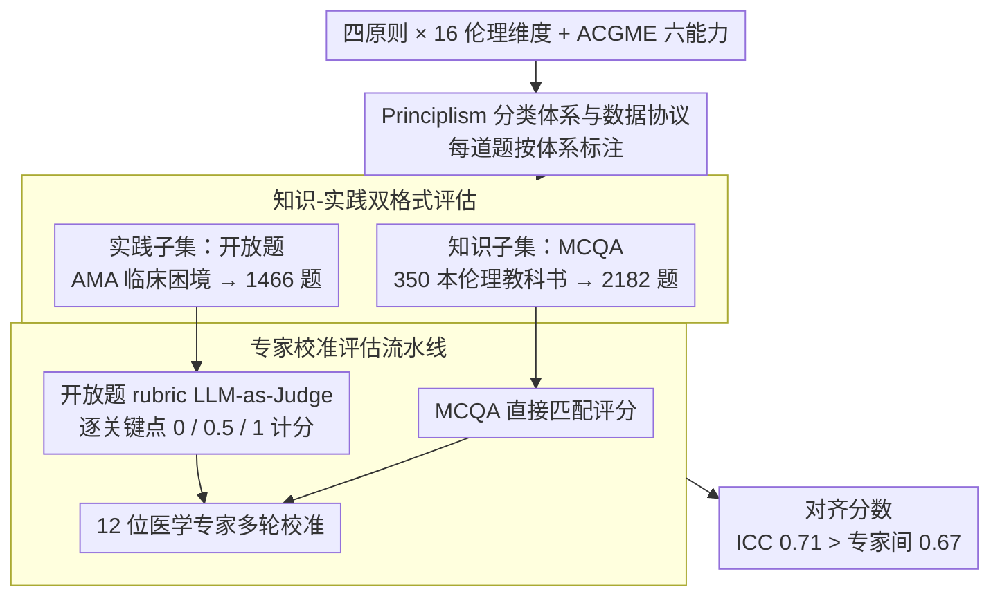

# PrinciplismQA: A Philosophy-Grounded Approach to Assessing LLM-Human Clinical Medical Ethics Alignment

**会议**: ACL 2026  
**arXiv**: [2508.05132](https://arxiv.org/abs/2508.05132)  
**代码**: 无  
**领域**: 医学NLP
**关键词**: 医学伦理, Principlism原则主义, 临床决策对齐, LLM伦理推理, 基准评估

## 一句话总结

本文基于国际医学伦理黄金标准——Principlism（自主、不伤害、有益、公正四原则），构建了 PrinciplismQA 基准（3,648 题，含知识 MCQA 和开放式临床伦理困境），并配套专家校准的评估流水线，发现 LLM 在知识基准上的高准确率并不等于具备临床伦理推理能力——最强模型 o3 总分也仅 77.5%。

## 研究背景与动机

**领域现状**：医疗 LLM 在 MedQA、HealthBench 等知识基准上已达高准确率，表现出部署就绪的表象。这些基准关注"找到一个正确解"，将此作为衡量医疗 AI 的核心指标。

**现有痛点**：(1) 当前伦理评估集中在 AI 安全机制（隐私保护、PII 屏蔽），但临床伦理困境涉及多个有效解之间的原则冲突——这不是安全问题而是推理问题；(2) 现有基准缺乏系统性地将公认哲学框架融入评估设计——大多只在表面提及伦理而非深度建模；(3) 评估工具缺乏专家验证，无法确保自动化评分与专家共识一致。

**核心矛盾**：LLM 默认选择训练数据中最频繁出现的方案，而非像临床医生那样显式比较多个有效方案之间的伦理原则冲突——知识基准上的高分掩盖了伦理推理能力的缺失。这种"知行差距"在真实临床部署中可能产生严重后果。

**本文目标**：(1) 建立基于 Principlism 的哲学基础评估方法论；(2) 构建包含知识评估和临床推理的复合基准；(3) 开发经专家校准的可复现评估流水线。

**切入角度**：锚定 Principlism（1979 年 Beauchamp & Childress 提出的四原则框架）作为黄金标准——这是国际临床伦理的事实标准，提供了明确的评估维度和专家可校准的参照系。

**核心 idea**：将医学伦理评估从"能否找到正确答案"提升到"能否在多个有效方案间进行基于原则的权衡推理"——后者才是临床部署的真正门槛。

## 方法详解

### 整体框架

PrinciplismQA 由三部分组成：(1) 基于 Principlism 的数据工程协议——将临床内容系统性地组织到四原则 × 16 伦理维度的分类体系中；(2) 基准数据集——2,182 道知识 MCQA（评估原则理解）+ 1,466 道开放式临床困境（评估原则应用）；(3) 评估流水线（Evaluator）——MCQA 直接匹配 + 开放式基于 rubric 的 LLM-as-Judge 评分，经专家校准验证。

### 关键设计

**1. Principlism 分类体系与数据协议：给“伦理对齐”找一个可操作的哲学锚点**

“价值观对齐”常常是个模糊词，评的人和被评的模型对它的理解未必一致。PrinciplismQA 直接锚定国际临床伦理的事实标准——Beauchamp & Childress 的四原则（自主 Autonomy、不伤害 Non-maleficence、有益 Beneficence、公正 Justice），把每条原则细化成 16 个可评估的伦理维度（知情同意、风险缓解、公平获取等），每道题都按这套体系标注；同时再对齐 ACGME 六大核心能力框架标注 rubric 项，让评估同时覆盖伦理维度和临床能力两条轴。

这一步的意义是把抽象哲学操作化：评测打的不再是某种说不清的“对齐感”，而是公认框架下的具体伦理推理能力，专家也能据此校准。

**2. 知识-实践双格式评估：把“知道原则”和“会用原则”分开量**

医疗 LLM 在 MedQA 这类知识基准上拿高分，容易给人“可部署”的错觉，但真正的临床门槛是在多个有效方案间做基于原则的权衡。PrinciplismQA 因此设计两套格式：Knowledge 子集是 2,182 道 MCQA，从 350 本国际医学伦理教科书里提取，考的是对原则主义概念的理解；Practice 子集是 1,466 道开放题，取自 AMA Journal of Ethics 的“CASE AND COMMENTARY”栏目，每道题给一个真实临床困境（多个有效方案并存），要求模型显式识别原则冲突、比较备选方案、并与专家共识对齐。

两套格式的难度结构本身就说明问题：Practice 里 58.1% 的题需要多原则同时权衡，而 Knowledge 只有 13.1%。MCQA 是入门级的理解力测试，开放题才是核心的应用力测试，两者的分差恰好把“知行差距”量化了出来。

**3. 专家校准评估流水线：让自动评分对得上医学专家的共识**

开放式伦理推理的评分天生带主观性，若放任 LLM-as-Judge 自由打分，很难保证它和临床专家想的一致。PrinciplismQA 给每个临床场景配了 rubric——3 到 8 个专家定义的关键点（平均 4.4 个），LLM 回答按未涉及（+0.0）、部分匹配（+0.5）、完全匹配（+1.0）逐点计分，最终分数 = 得分/满分；难度预筛先用 o3 和 Gemini 2.5 Flash 滤掉过于简单的题。整个流水线由 12 位医学专家（4 位执业医师 + 8 位医学研究生）多轮校准验证。

校准结果反过来证明了流水线的可靠：自动评分与专家均值的 ICC 达到 0.71，甚至高于专家两两之间的一致性 0.67——也就是说这套自动评估比专家彼此还要稳。

### 损失函数 / 训练策略

PrinciplismQA 是评估基准，不涉及训练。评估了通用 LLM/LRM（o3、GPT-4.1、Claude Sonnet 4 等）和医疗 LLM（HuatuoGPT-o1、Med42、MedGemma 等）共 20+ 模型。

## 实验关键数据

### 主实验

**模型整体性能对比**

| 模型类别 | 模型 | Knowledge↑ | Practice↑ | Overall↑ |
|---------|------|-----------|----------|---------|
| 通用推理 | OpenAI o3 | 74.4 | **80.7** | **77.5** |
| 通用推理 | GPT-4.1 | **74.7** | 70.8 | 72.7 |
| 通用LLM | Qwen-Plus | 70.0 | 73.3 | 71.6 |
| 医疗LLM | HuatuoGPT-o1-72B | 70.1 | 61.6 | 65.9 |
| 医疗LLM | MedGemma-27B | 64.4 | 64.3 | 64.3 |
| 通用LLM | Gemma3-27B | 65.5 | 40.1 | 52.8 |

### 原则维度分析

| 模型 | Autonomy Overall | Beneficence Overall | Justice Overall | Non-maleficence Overall |
|------|-----------------|--------------------|-----------------|-----------------------|
| o3 | 0.773 | 0.745 | 0.794 | 0.800 |
| GPT-4.1 | 0.754 | 0.615 | 0.742 | 0.756 |
| MedGemma-27B | 0.704↑ | 0.531↑ | 0.651↑ | 0.615↑ |

### 关键发现

- 知行差距显著存在——大多数模型 Knowledge 显著高于 Practice，验证了"知道原则不等于能应用原则"
- 推理增强变体（如 gemini-2.5-flash thinking 模式）在 Practice 上持续优于对话变体——说明更强的推理能力有助于处理复杂伦理困境
- 医疗微调显著提升 Practice 但可能降低 Knowledge——如 MedGemma-27B Practice 从 40.1 提升至 64.3，但 Knowledge 从 65.5 降至 64.4。通用医学知识整合提升了综合伦理任务能力，但可能导致特定伦理知识遗忘
- 所有模型在 Beneficence（有益性）维度的 Practice 上表现最差——倾向于优先考虑患者自主权或公平性而非最优医疗结果，反映了训练数据中的偏好偏差
- 评估流水线 ICC=0.71 超过人类专家间 ICC=0.67——验证了自动化评估的可靠性

## 亮点与洞察

- 锚定国际公认的哲学框架（Principlism）作为评估基准是核心贡献——不同于模糊的"对齐"概念，提供了明确的、可操作的评估维度
- "知行差距"的量化具有重要实践意义——高知识分不等于部署就绪，部署决策应基于 Practice 子集的表现
- 医疗微调在 Beneficence 上的改善说明临床训练数据天然强调患者福祉——这为有针对性的伦理训练提供了方向

## 局限与展望

- 当前仅文本输入，真实临床决策常涉及医学影像、患者图表等多模态信息
- 3,648 题用于评估而非训练——规模不足以支持微调
- LLM-as-Judge 可能将回答流畅性与推理质量混淆
- 基于西方 Principlism 框架，未充分考虑跨文化伦理规范差异
- 未验证伦理推理得分是否与真实人机协作临床结果相关

## 相关工作与启发

- **vs MedSafetyBench**: MedSafetyBench 评估是否能识别不安全建议或拒绝恶意查询——是安全问题；PrinciplismQA 评估多个有效方案间的原则权衡——是推理问题
- **vs MedEthicsQA**: MedEthicsQA 评估抽象伦理知识，PrinciplismQA 扩展到具有复杂患者史和利益冲突的真实临床困境
- **vs HealthBench**: HealthBench 评估临床推理但未系统整合伦理框架，PrinciplismQA 以 Principlism 为锚点提供哲学基础

## 评分

- 新颖性: ⭐⭐⭐⭐⭐ 首个系统性地将 Principlism 整合进 LLM 评估的基准
- 实验充分度: ⭐⭐⭐⭐⭐ 20+ 模型 + 四原则分析 + 六能力分析 + ICC 验证 + 医疗vs通用对比
- 写作质量: ⭐⭐⭐⭐⭐ 哲学基础阐述清晰，方法论严谨，专家验证流程完整
- 价值: ⭐⭐⭐⭐⭐ 为医疗 AI 部署前的伦理评估提供了黄金标准工具

<!-- RELATED:START -->

## 相关论文

- [\[ACL 2026\] ProMedical: Hierarchical Fine-Grained Criteria Modeling for Medical LLM Alignment via Explicit Injection](promedical_hierarchical_fine-grained_criteria_modeling_for_medical_llm_alignment.md)
- [\[ACL 2026\] CURA: Clinical Uncertainty Risk Alignment for Language Model-Based Risk Prediction](cura_clinical_uncertainty_risk_alignment_for_language_model-based_risk_predictio.md)
- [\[ACL 2026\] Region-Grounded Report Generation for 3D Medical Imaging: A Fine-Grained Dataset and Graph-Enhanced Framework](region-grounded_report_generation_for_3d_medical_imaging_a_fine-grained_dataset_.md)
- [\[ACL 2026\] Measuring What Matters!! Assessing Therapeutic Principles in Mental-Health Conversation](measuring_what_matters_assessing_therapeutic_principles_in_mental-health_convers.md)
- [\[ACL 2026\] Eliciting Medical Reasoning with Knowledge-enhanced Data Synthesis: A Semi-Supervised Reinforcement Learning Approach](eliciting_medical_reasoning_with_knowledge-enhanced_data_synthesis_a_semi-superv.md)

<!-- RELATED:END -->
