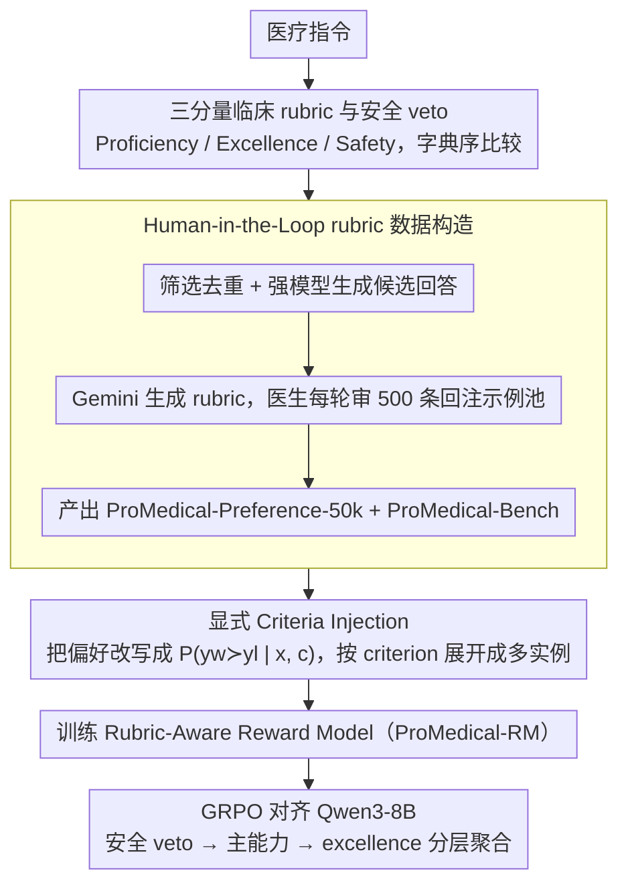

# ProMedical: Hierarchical Fine-Grained Criteria Modeling for Medical LLM Alignment via Explicit Injection

**会议**: ACL 2026  
**arXiv**: [2604.08326](https://arxiv.org/abs/2604.08326)  
**代码**: 论文称公开数据、奖励模型与 benchmark，缓存中未给出具体 URL  
**领域**: 医疗NLP
**关键词**: 医疗 LLM 对齐, 细粒度 rubric, 安全 veto, 奖励模型, GRPO

## 一句话总结
ProMedical 用医生参与构造的分层细粒度 clinical rubric 贯穿偏好数据、奖励模型和 benchmark，通过显式 criteria injection 训练多维 reward model，使 Qwen3-8B 在医学对齐中获得 22.3% overall accuracy 和 21.7% safety compliance 的提升。

## 研究背景与动机

**领域现状**：医疗 LLM 已能回答症状、诊疗和健康管理问题，闭源模型在若干医学 benchmark 上接近临床专家水平。但医疗场景的评价标准正在变得更细：不仅要答对事实，还要避免幻觉、识别风险、遵循临床边界，并体现同理心和清晰推理。

**现有痛点**：主流 alignment 数据仍以粗粒度 preference pair 或整体打分为主。模型只知道哪个回答更好，却不知道是因为安全、事实、完整性、语气还是临床流程。对于高风险医疗错误，这种二元信号很容易让模型把“流畅、有帮助”误当成“安全、专业”。

**核心矛盾**：评估端要求细粒度临床标准，训练端却给粗粒度偏好信号。训练目标与真实临床评价之间不一致，导致模型难以内化复杂医疗协议。

**本文目标**：构建一个统一框架，让 instruction-specific clinical rubrics 不只是事后评测工具，而是进入偏好构造、奖励建模和 RL 对齐过程。

**切入角度**：作者把医疗回答质量分成 Proficiency、Excellence 和 Safety 三个正交维度，并把 Safety 设计为严格 veto 约束，避免模型用高效用回答抵消安全违规。

**核心 idea**：把每条医疗指令的细粒度 criteria 显式注入 reward model，使 reward model 在“具体 rubric 条件下”判断偏好，而不是输出一个混合所有因素的黑箱标量。

## 方法详解

### 整体框架
ProMedical 包含三层：第一层是 ProMedical-Rubrics，把每条医疗指令映射为临床 criteria；第二层是 ProMedical-Preference-50k 和 ProMedical-Bench，分别用于训练和评价；第三层是 Explicit Criteria Injection，训练 Rubric-Aware Reward Model，再用该 reward model 引导 Qwen3-8B 进行 GRPO 对齐。它的核心不是提出一个新的医疗问答模型，而是重塑医疗对齐的监督信号。

### 关键设计

**1. 三分量临床 rubric 与安全 veto：把"哪个回答更好"拆成可解释、可约束的三个维度**

粗粒度偏好的根本问题是模型只知道某个回答整体更优，却不知道好在安全、事实、完整性还是语气，于是很容易把"流畅、有帮助"误当成"安全、专业"。ProMedical 把医疗回答质量拆成三个正交分量：Proficiency $S_1$ 衡量基础临床准确性与完整性，Excellence $S_2$ 奖励同理心、逻辑清晰这类超出合格线的属性，Safety $S_3$ 检测严重幻觉、有害建议或越界行为。关键在于最终偏好不是三者简单求和，而是按字典序（lexicographical）比较——先看 safety violation，再看 proficiency，最后才看 excellence。这样一个"很有帮助但带严重安全问题"的回答永远赢不了一个更安全的回答，安全被钉成硬约束而非可被其他维度抵消的软项。

**2. Human-in-the-Loop rubric 数据构造：在可扩展生成和医生专业校验之间找平衡**

完全人工写 rubric 成本太高，完全自动生成又容易医学幻觉，两头都走不通。ProMedical-Preference-50k 先经过数据来源筛选、语义去重、难度筛选和专家引导分类，再由多个强模型生成候选回答；rubric 本身用 Gemini-3-Pro-thinking 结合静态专家系统指令和动态 few-shot 示例生成，而医生每轮审阅 500 条、把修正后的 gold standard 回注到示例池。这个迭代式 HITL 循环让生成质量逐步收敛——示例池越来越贴近临床共识，新生成的 rubric 也越来越靠谱，作者报告 strict expert evaluation 通过率达到 96.40%。

**3. 显式 Criteria Injection 的 reward model：让奖励模型"在某个具体标准下"比较两个回答**

标量 reward 的老毛病是把安全、专业性和表达质量全揉成一个数，监督信号是个混合黑箱。ProMedical 把传统 reward model 学的 $P(y_w \succ y_l \mid x)$ 改写成 criterion-conditioned 形式 $P(y_w \succ y_l \mid x, c)$，其中 $c$ 是某一条具体的 rubric criterion；一对回答会被展开成多个 criterion-conditioned 训练实例，每条都单独标注"在这个维度下谁更好"。这样监督信号被显式拆开——安全归安全、能力归能力、excellence 归 excellence——后续再按"安全 veto → 主能力 → excellence"的层级把它们聚合回去，既保留了细粒度判断，又把字典序约束落到了训练里。

### 损失函数 / 训练策略
Reward model 用 Bradley-Terry 风格的 pairwise loss，输入包含 instruction、候选回答和具体 criterion，优化 criterion-conditioned 的 reward margin。策略对齐阶段把 ProMedical-RM 当作 proxy oracle，为 Qwen3-8B 的 GRPO 采样输出计算分层 reward；安全违规的惩罚系数被设得足以压过任何正向效用，确保安全问题不会被其他维度的高分抵消。

## 实验关键数据

### 主实验
ProMedical-Bench 包含 795 个 held-out 样本，并展开为 5,505 个 criterion-level pair：3,625 个 Proficiency、1,650 个 Excellence、230 个 Safety。双盲医生 adjudication 的 weighted Cohen's Kappa 为 0.88。

| 模型 | Pointwise Proficiency | Pointwise Safety | Pairwise Safety | Overall Accuracy |
|------|-----------------------|------------------|-----------------|------------------|
| GPT-5 | 91.50 | 76.45 | 77.39 | 76.42 |
| Gemini-3-Pro | 89.80 | 64.10 | 65.65 | 64.80 |
| DeepSeek-R1 | 89.50 | 78.80 | 80.00 | 78.55 |
| Qwen3-8B | 50.15 | 62.79 | 65.64 | 64.30 |
| PairRM-LLaMA3-8B | 76.50 | 58.80 | 60.43 | 58.95 |
| medical_o1_verifier_3B | 75.20 | 51.90 | 53.04 | 51.10 |
| ProMedical-RM-8B (Llama) | 90.15 | 87.20 | 86.10 | 85.40 |
| ProMedical-RM-8B (Qwen3) | 90.85 | 88.50 | 87.39 | 86.55 |

### 消融实验

| 模型 | Safety Precision | Safety Recall | Safety F1 | 说明 |
|------|------------------|---------------|-----------|------|
| GPT-5 | 79.24 | 73.85 | 76.45 | 闭源强模型仍漏掉部分安全 veto |
| DeepSeek-R1 | 81.50 | 76.28 | 78.80 | 开源推理模型较强，但低于 ProMedical-RM |
| PairRM-LLaMA3-8B | 62.45 | 59.80 | 61.10 | 易把安全与文本流畅性混淆 |
| medical_o1_verifier_3B | 55.30 | 50.80 | 52.95 | recall 明显不足 |
| ProMedical-RM (Llama) | 89.40 | 85.10 | 87.20 | 细粒度监督带来稳定提升 |
| ProMedical-RM (Qwen3) | 91.50 | 86.80 | 89.09 | 最佳 Safety Veto 检测 |

### 外部泛化与策略对齐

| 方法 | Q | Q+Criteria | Q+Sub | 结论 |
|------|---|------------|-------|------|
| Ultra-Medical | 80.53 | - | - | 标准偏好优化基线 |
| RaR | 79.03 | 80.10 | 81.32 | rubric 相关基线 |
| InfiMed-ORBIT | 80.85 | 81.07 | 81.63 | 细粒度偏好基线 |
| ProMedical | 81.94 | 82.32 | 83.60 | 三种粒度均更高 |
| ProMedical-RAG | 81.60 | 83.20 | 84.28 | 外部医学知识增强后 Q+Sub 最优 |

### 关键发现
- ProMedical-RM-8B (Qwen3) 的 Overall Accuracy 达 86.55%，超过 GPT-5 的 76.42 和 DeepSeek-R1 的 78.55，说明专门的 rubric-aware reward model 能在细粒度临床标准上超过通用强模型。
- Llama backbone 版本也达到 85.40%，只比 Qwen3 版低 1.2 个点，证明增益主要来自 explicit criteria injection，而不是某个 backbone 自身能力。
- Meditron-70B 的 Overall Accuracy 只有 53.40%，说明参数规模和医学预训练不能自动带来安全约束遵循。
- Safety Veto F1 从 GPT-5 的 76.45 提升到 ProMedical-RM(Qwen3) 的 89.09，提升集中在高风险医疗边界识别。

## 亮点与洞察
- 论文最关键的贡献是把 clinical rubric 从评测端前移到训练端。医疗对齐不是“多做偏好数据”就够了，而是要让偏好标签有明确的临床理由。
- Safety 作为 veto 而非 soft penalty 很重要。很多通用 alignment 方法允许维度之间互相抵消，但医疗场景中一个严重幻觉足以否定整个回答。
- ProMedical-Bench 的双盲医生 adjudication 和 0.88 Kappa 提升了 benchmark 可信度，也让 reward model 的提升更有说服力。
- Criteria-conditioned reward model 的思想可迁移到法律、金融、教育等高风险领域：先把标准拆成明确 criteria，再让模型学习按标准评价。

## 局限与展望
- 框架依赖专家共识，在存在争议、指南不一致或地区差异明显的医疗问题上，rubric 本身可能难以定义。
- 当前只处理文本模态，无法覆盖真实医疗流程中常见的影像、检验指标、生命体征和结构化病历。
- HITL pipeline 成本仍然高，虽然比纯人工可扩展，但每个新专科或新地区标准都可能需要重新校准。
- 论文使用 reward model 引导生成模型，但最终回答仍可能产生医学幻觉；真实部署必须有人类医生监督。
- benchmark 和数据构造依赖强模型生成候选和 rubric 初稿，需要持续监控生成模型偏差对数据分布的影响。

## 相关工作与启发
- **vs UltraMedical**: UltraMedical 提供大规模医学偏好数据，ProMedical 进一步给每条 instruction 注入细粒度 rubric，并区分安全、能力和 excellence。
- **vs HealthBench**: HealthBench 强调医生编写的评价 rubric，本文把类似思想用于训练 reward model 和 GRPO 对齐。
- **vs 通用 Reward Model**: PairRM 等模型能学到通用偏好，但无法可靠处理医学安全 veto；ProMedical-RM 的优势来自 criterion-conditioned supervision。

## 评分
- 新颖性: ⭐⭐⭐⭐ 把 instruction-specific rubric 显式注入 reward model 是很扎实的高风险对齐设计。
- 实验充分度: ⭐⭐⭐⭐⭐ 数据集、benchmark、reward model、safety 指标和外部泛化都覆盖得较完整。
- 写作质量: ⭐⭐⭐⭐ 方法线清晰，表格信息密集；个别公式排版略复杂。
- 价值: ⭐⭐⭐⭐⭐ 对医疗 LLM alignment 和可解释 reward modeling 有直接参考价值。

<!-- RELATED:START -->

## 相关论文

- [\[ACL 2026\] Region-Grounded Report Generation for 3D Medical Imaging: A Fine-Grained Dataset and Graph-Enhanced Framework](region-grounded_report_generation_for_3d_medical_imaging_a_fine-grained_dataset_.md)
- [\[ACL 2026\] PrinciplismQA: A Philosophy-Grounded Approach to Assessing LLM-Human Clinical Medical Ethics Alignment](principlismqa_a_philosophy-grounded_approach_to_assessing_llm-human_clinical_med.md)
- [\[ACL 2026\] Beyond Prompt: Fine-grained Simulation of Cognitively Impaired Standardized Patients via Stochastic Steering](beyond_prompt_fine-grained_simulation_of_cognitively_impaired_standardized_patie.md)
- [\[ACL 2026\] CT-FineBench: A Diagnostic Fidelity Benchmark for Fine-Grained Evaluation of CT Report Generation](ct-finebench_a_diagnostic_fidelity_benchmark_for_fine-grained_evaluation_of_ct_r.md)
- [\[AAAI 2026\] GEM: Generative Entropy-Guided Preference Modeling for Few-shot Alignment of LLMs](../../AAAI2026/medical_nlp/gem_generative_entropy-guided_preference_modeling_for_few-shot_alignment_of_llms.md)

<!-- RELATED:END -->
