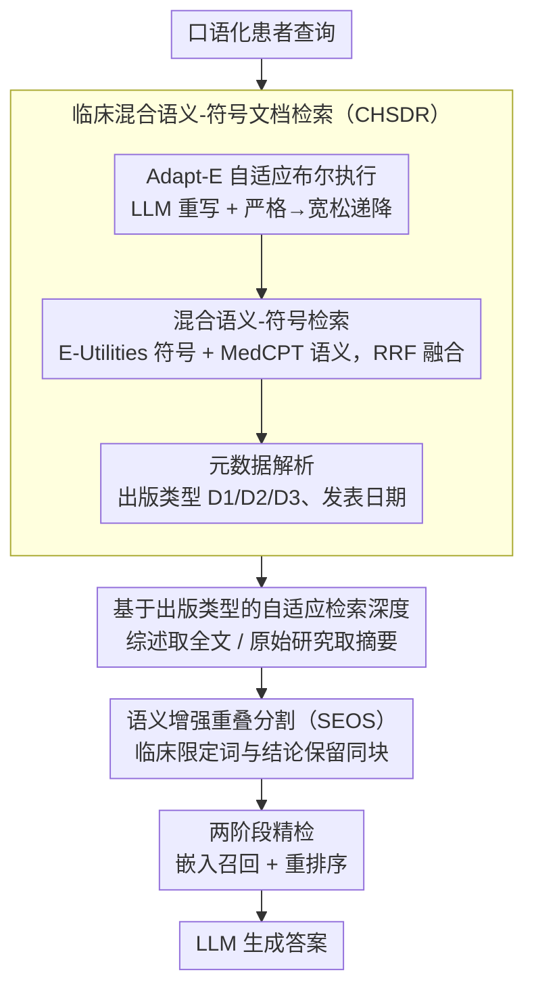

# Query Pipeline Optimization for Cancer Patient Question Answering Systems

**会议**: ACL 2026  
**arXiv**: [2412.14751](https://arxiv.org/abs/2412.14751)  
**代码**: 无  
**领域**: 医疗NLP
**关键词**: 癌症问答, RAG 查询流水线, 混合检索, 语义分割, 元数据感知

## 一句话总结

本文提出 CoMeta，一个面向癌症患者问答（CPQA）的三层可控元数据感知 RAG 框架，通过临床混合语义-符号文档检索（CHSDR）融合 E-Utilities 实时布尔搜索与 MedCPT 语义检索，配合语义增强重叠分割（SEOS）防止上下文碎片化，在 CMMQA 数据集上将 Claude-3-Haiku 的回答准确率提升 5.24%（vs CoT）和约 3%（vs naive RAG）。

## 研究背景与动机

**领域现状**：LLM 在医学问答中展现出潜力，但幻觉问题危及患者安全。RAG 通过将输出锚定于外部证据来缓解幻觉，现有医学 RAG 系统主要采用密集检索范式，使用领域特定嵌入模型（如 MedCPT）在离线索引上进行向量相似度搜索。高级策略如混合搜索、自适应检索和递归搜索本质上都是基于静态索引的优化。

**现有痛点**：(1) 陈旧性-语义困境：标准查询流水线（Dense 或 BM25）基于静态、元数据盲的索引，有检索过时证据的风险；而 E-Utilities 等实时元数据感知接口对非正式患者查询语义脆弱；(2) 检索深度悖论：综述文章需要全文检索以捕获高层治疗综合，但原始研究通常仅需摘要检索以避免方法学噪声——大多数流水线对所有文章类型统一检索深度；(3) 上下文碎片化：先验的编码器无关分割（固定长度或词汇级）切断了临床限定词（如特定突变标准）与治疗声明的关联，产生看似有证据支撑但缺少关键约束的推荐。

**核心矛盾**：现有系统被迫在语义鲁棒性（静态索引）和检索可控性（实时接口）之间取舍，无法同时满足癌症QA 对时效性、元数据感知和语义完整性的三重需求。

**本文目标**：设计一个专门面向 CPQA 的 RAG 框架，在三个维度实施可控性：(1) 抗陈旧性-语义困境的鲁棒性；(2) 基于出版类型的元数据感知自适应检索深度；(3) 使用编码器感知分割保护临床逻辑的关系完整性。

**切入角度**：不是进一步优化静态索引流水线，而是将 E-Utilities 作为实时、元数据感知的稀疏后端整合到 RAG 系统中——这种设计与先前的 RAG 优化正交且互补。

**核心 idea**：通过融合 E-Utilities 实时布尔搜索和语义检索实现"符号-语义互补"，结合出版类型自适应深度和编码器感知的语义分割，构建端到端可控的癌症 QA 流水线。

## 方法详解

### 整体框架

CoMeta 采用分层查询流水线设计，分为文档级和段落级两层。文档级用 CHSDR 做混合检索并解析元数据，据此对综述/原始研究分流出不同的检索深度；段落级用 SEOS 做语义感知分割，再经两阶段（嵌入召回+重排序）精检送进 LLM。整条链路在检索生命周期的每一步都实施可控性。

### 关键设计

**1. 临床混合语义-符号文档检索（CHSDR）：用实时布尔搜索的可控性补静态索引的时效性，又用语义检索补布尔搜索的脆弱**

陈旧性-语义困境的两难在于：标准 Dense/BM25 流水线建在静态、元数据盲的索引上，有检索到过时证据的风险；而 E-Utilities 这类实时元数据接口虽然时效好，却对非正式的患者口语查询非常脆弱。CHSDR 把两者拼起来打。先做**自适应布尔查询执行（Adapt-E）**：一个 LLM 重写器对患者查询做纠错、规范化、意图分析、临床抽象（映射为 PICO 元素）、布尔表达式和时间约束生成，再按严格度递降执行——严格布尔 → 临床抽象 → 宽松布尔——一直放松到检索回足够文档为止，从根上解决"一查就 Zero-Hit"。再做**混合语义-符号检索**：用 Reciprocal Rank Fusion (RRF) 把 E-Utilities 的符号搜索和 MedCPT 的语义检索两路结果融合，两路都返回 PMID 作为统一文档键，谁漏的另一边能补上。检索时顺手做**元数据利用**：解析 E-Utilities XML 里的出版类型（D1: PubMed 摘要 / D2: PMC 综述全文 / D3: 非综述 PMC 论文）、发表日期和摘要可用性，为后面的自适应深度留好钩子。

**2. 基于出版类型的自适应检索深度：综述取全文、原始研究只取摘要，化解检索深度悖论**

综述文章需要全文才能捕获跨研究的高层治疗综合，原始研究却往往只需摘要、取全文反而引入方法学噪声——可大多数流水线对所有文章类型用同一个检索深度。承接 CHSDR 解析出的出版类型（D1/D2/D3），CoMeta 在段落检索前就按类型分流深度。这一分流由实验数据校准：PMC 综述文章在 Top-5 证据中的占比增幅（$0.10 \to 0.12$）超过其他 PMC 论文（$0.28 \to 0.32$），且把综述并进来（D1+D2）能把准确率从 44.00% 抬到 46.00%，而再加入非综述全文（D1+D2+D3）准确率持平却拖低了 Precision/Recall/F1。于是综述拿全文、原始研究只用摘要，让噪声进不来又不漏掉真正综合性的证据。

**3. 语义增强重叠分割（SEOS）：在切块时别把临床限定词和它修饰的治疗结论切散**

证据进入段落层后，先验的编码器无关分割（固定长度或词汇级）会把"某特定突变标准"这类临床限定词和它约束的治疗声明切到两块里，产出看似有证据、其实丢了关键约束的危险推荐。SEOS 受 TextTiling 启发但做了三处关键改造：(a) 用领域特定的密集嵌入替代词袋表示，才接得住医学术语和话语关系——TextTiling 的词汇重叠在高同义词、语义转换复杂的生物医学文献里会直接失效；(b) 用一个目标 token 预算反推最优分区数 $N$，选 Top-$N$ 个语义最小值点当断点，而不是依赖脆弱的相似度阈值；(c) 按断点处的语义连续性自适应决定句子重叠量，把未解决的语义依赖保留住，相邻块的标识符还被显式存下来，允许跨段恢复上下文。这套设计本质上是把"分块大小与编码器性能的交互"考虑进了切分，而不是拍一个固定窗口了事。

### 一个完整示例：一条口语化癌症问句怎么走完流水线

设来访问题是口语化的"我妈得了 EGFR 突变的肺癌，奥希替尼还有用吗？"。直接丢给 E-Utilities 的纯布尔搜索大概率 Zero-Hit（叙述型查询语义太松）。Adapt-E 先把它重写成规范形式、抽出 PICO（P: EGFR 突变 NSCLC，I: 奥希替尼），生成严格布尔表达式去查；若严格布尔查不够，退到临床抽象、再退到宽松布尔，直到拿回足够 PMID。同时 MedCPT 语义检索另跑一路，RRF 融合两路结果，把符号搜索漏掉的相关综述也召回。元数据解析发现命中里既有 PMC 综述（D2）又有原始研究（D3），于是综述走全文、原始研究只留摘要送进段落层。段落层用 SEOS 切块时，把"EGFR 突变"这个限定词和"奥希替尼疗效"的结论留在同一块、不切散，最后两阶段（嵌入+重排序）精检出最相关的几段交给 LLM 生成答案。整条链路里每一步都在做可控性，而不是把所有文章一刀切、一种深度处理。

### 损失函数 / 训练策略
CoMeta 是推理时框架，不涉及模型训练。数据上从 HealthSearchQA 和 MIRAGE 基准通过 MeSH 术语过滤构建 CMMQA（520 个癌症相关问题），并用 Llama-3-70B 把问题重写成临床叙述变体；检索评估用有金标注引用的 PubMedQA 和 BioASQ，段落检索评估用从 PubMed 摘要、PMC 全文和医学教科书生成的合成 QA 对。

## 实验关键数据

### 主实验

**CMMQA 整体性能（Claude-3-Haiku）**

| 方法 | MMLU | MedQA | MedMCQA | PMQA | BioASQ | Avg |
|------|------|-------|---------|------|--------|-----|
| LLM + CoT | 78.26 | 68.60 | 65.59 | 45.00 | 80.49 | 67.15 |
| Naive RAG | 82.61 | 67.44 | 65.59 | 56.67 | 81.71 | 69.48 |
| CoMeta | 82.61 | **69.77** | **68.82** | **65.00** | 81.71 | **72.39** |

**CHSDR 消融（文档检索性能）**

| 方法 | BioASQ Hit@10 (标准) | BioASQ Hit@10 (叙述) | PubMedQA Hit@10 (标准) | PubMedQA Hit@10 (叙述) |
|------|---------------------|---------------------|----------------------|----------------------|
| E-utils | 52.44 | 1.22 | 41.67 | 0.00 |
| Adapt-E | 65.85 | 50.00 | 48.33 | 8.33 |
| MedCPT | 63.41 | 41.46 | 10.00 | 3.33 |
| Hybrid | **80.49** | **60.98** | 46.67 | **10.00** |

### 消融实验

**SEOS vs 固定分割策略（段落检索准确率 %）**

| 分割策略 | PubMedBERT | BM25 | MedCPT |
|---------|-----------|------|--------|
| 512 (Overlap 0) | 46 | 20 | 22 |
| 512 (Overlap 32) | 52 | 18 | 24 |
| 512 (Overlap 128) | 42 | 16 | 22 |
| SEOS (本文) | **54** | **36** | **38** |

**Zero-Hit 失败率对比**

| 数据集-设置 | E-utils | Adapt-E (本文) |
|-----------|---------|--------------|
| PubMedQA – Standard | 22/60 | 0/60 |
| PubMedQA – Narrative | 55/60 | 0/60 |
| BioASQ – Standard | 18/82 | 0/82 |
| BioASQ – Narrative | 76/82 | 0/82 |

### 关键发现

- CHSDR 的混合检索在 BioASQ 上 Hit@10 从 E-utils 的 52.44% 提升至 80.49%，语义检索成功召回符号搜索遗漏的相关文档
- Adapt-E 的自适应查询执行将 Zero-Hit 失败从 PubMedQA 叙述设置的 55/60 降至 0/60，实现了检索鲁棒性的质变
- SEOS 在所有检索器上均优于固定分割策略，BM25 上的优势最为显著（20% → 36%），说明语义感知分割对不同检索范式都有效
- PMC 综述文章的检索价值显著高于非综述 PMC 论文——加入综述提升准确率 2%，进一步加入非综述全文则降低 F1
- CoMeta 的平均 2.91% 准确率提升低估了实际贡献：在检索构成瓶颈的 PubMedQA 上提升 8.33%，在检索已饱和的 MMLU/BioASQ 上因天花板效应无法体现

## 亮点与洞察

- 将 E-Utilities 从传统的布尔搜索工具重新定位为 RAG 系统的实时元数据感知后端，这一设计范式与现有 RAG 优化正交且互补
- "自适应查询执行"策略（严格→宽松递降）是一个简洁但非常实用的工程创新，彻底解决了 Zero-Hit 问题
- 对"为什么平均准确率低估贡献"的系统分析（天花板效应、检索鲁棒性盲区、证据时效性盲区）展现了深入的实验思考

## 局限与展望

- 主要在癌症 QA 领域验证，虽然作者论证这是一般医学 QA 的子集，但向其他医学子领域的泛化需要进一步验证
- 未与新兴的高级语义分割策略进行比较
- 数据集规模（520 个问题）相对有限，可能不足以捕捉所有临床场景的多样性
- 依赖 NCBI E-Utilities 的实时可用性，在某些部署环境中可能受限
- 未来方向包括自适应检索机制（动态决定是否检索及如何检索）和更广泛的骨干模型验证

## 相关工作与启发

- **vs MedRAG/Self-BioRAG**: 这些系统优化静态索引上的检索策略，CoMeta 引入实时元数据感知后端，是正交的设计维度
- **vs 纯 E-Utilities**: E-Utilities 对非正式查询语义脆弱（55/60 Zero-Hit），CoMeta 的 LLM 重写器和自适应执行彻底解决了这一问题
- **vs TextTiling**: TextTiling 使用词袋表示和固定阈值，在生物医学文献的高同义词环境中失效；SEOS 用密集嵌入和目标预算替代

## 评分

- 新颖性: ⭐⭐⭐⭐ 将 E-Utilities 整合为 RAG 实时后端是新颖的设计范式，SEOS 是对分割方法的有意义改进
- 实验充分度: ⭐⭐⭐⭐ 覆盖多个医学 QA 数据集、详细消融和检索器-重排器组合分析，但数据集规模有限
- 写作质量: ⭐⭐⭐⭐ 问题定义清晰（三个困境），分析深入，但部分章节结构略显冗长
- 价值: ⭐⭐⭐⭐ 为医学 RAG 提供了实用的查询流水线优化方案，对临床应用有直接参考价值

<!-- RELATED:START -->

## 相关论文

- [\[ACL 2026\] HypEHR: Hyperbolic Modeling of Electronic Health Records for Efficient Question Answering](hypehr_hyperbolic_modeling_of_electronic_health_records_for_efficient_question_a.md)
- [\[ACL 2025\] ArgHiTZ at ArchEHR-QA 2025: A Two-Step Divide and Conquer Approach to Patient Question Answering for Top Factuality](../../ACL2025/medical_nlp/arghitz_at_archehr-qa_2025_a_two-step_divide_and_conquer_approach_to_patient_que.md)
- [\[AAAI 2026\] Expert-Guided Prompting and Retrieval-Augmented Generation for Emergency Medical Service Question Answering](../../AAAI2026/medical_nlp/expert-guided_prompting_and_retrieval-augmented_generation_for_emergency_medical.md)
- [\[ACL 2025\] Follow-up Question Generation for Enhanced Patient-Provider Conversations](../../ACL2025/medical_nlp/follow-up_question_generation_for_enhanced_patient-provider_conversations.md)
- [\[ACL 2025\] AfriMed-QA: A Pan-African, Multi-Specialty, Medical Question-Answering Benchmark Dataset](../../ACL2025/medical_nlp/afrimed_qa_pan_african.md)

<!-- RELATED:END -->
