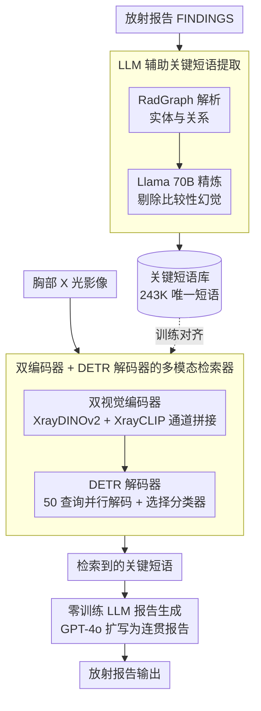

# RA-RRG: Multimodal Retrieval-Augmented Radiology Report Generation with Key Phrase Extraction

**会议**: ACL 2026  
**arXiv**: [2504.07415](https://arxiv.org/abs/2504.07415)  
**代码**: [GitHub](https://github.com/deepnoid-ai/RA-RRG)  
**领域**: 医学NLP
**关键词**: 放射报告生成, 检索增强生成, 关键短语提取, 幻觉抑制, 多视图

## 一句话总结
提出 RA-RRG 框架，通过 LLM 从放射报告中提取临床关键短语并构建检索库，给定胸部 X 光影像后检索相关短语并输入 LLM 生成报告，无需 LLM 微调即可有效抑制幻觉，仅需 18 GPU 小时训练，在 CheXbert 指标上达到 SOTA。

## 研究背景与动机

**领域现状**：自动化放射报告生成（RRG）是减轻放射科医生工作负担的重要方向。多模态 LLM（如 LLaVA-Rad、MAIRA）已展示了从胸部 X 光直接生成报告的能力，但需要大量计算资源和大规模微调数据。

**现有痛点**：(1) MLLM 方法训练成本高（>200 GPU 小时），限制了临床部署；(2) 检索增强方法（如 CXR-RePaiR）检索的是完整句子或报告，但放射报告中多个发现常共现于同一句子中，朴素检索可能引入与当前影像无关甚至矛盾的信息；(3) 报告中常包含与先前检查的比较性陈述（如"unchanged"、"improved"），在单图像设置下这些构成"比较性幻觉"。

**核心矛盾**：检索增强方法需要足够细粒度的检索单元来避免共现信息污染，但过细的分割又会丢失临床上下文。需要在粒度和信息完整性之间找到平衡。

**本文目标**：设计一种无需 LLM 微调的检索增强 RRG 框架，能够检索细粒度的、无幻觉的临床关键短语，并生成准确的放射报告。

**切入角度**：利用 RadGraph 提取报告的知识图谱结构，再用 LLM 将其精炼为最小临床有意义的短语，同时显式排除比较性表述。

**核心 idea**：用 LLM 精炼 RadGraph 输出为无幻觉关键短语 → 训练多模态检索器匹配影像与短语 → 用 LLM 将检索到的短语扩展为连贯报告，全程不微调 LLM。

## 方法详解

### 整体框架
RA-RRG 分为三个阶段：(1) 关键短语提取——用 RadGraph 解析报告结构后，LLM（Llama 70B）将其精炼为去除比较性幻觉的关键短语；(2) 多模态检索器训练——使用双视觉编码器（XrayDINOv2 + XrayCLIP）提取视觉特征，DETR 解码器输出语义嵌入，与 MPNet 文本嵌入对齐；(3) 报告生成——将检索到的短语输入 GPT-4o 生成连贯报告，无需 LLM 微调。

### 关键设计

**1. LLM 辅助关键短语提取：把报告切到“最小临床有意义”的粒度，顺手剔掉幻觉源**

检索增强 RRG 的老问题是检索单元的粒度——检索整句会把同句里共现的无关发现一起拖进来，检索单实体又会丢掉临床语境；更麻烦的是报告里大量“unchanged”“improved”这类比较性表述，在单图像设置下根本无据可依，是典型的“比较性幻觉”来源。RA-RRG 的做法是两步联合：先用 RadGraph 解析报告 FINDINGS 部分的实体与关系得到 RadGraph 短语，再把 RadGraph 输出和原始报告一起喂给 Llama 70B 精炼为关键短语，并在这一步显式排除比较性陈述。

之所以要两者联合而不是单用其一，是因为纯 RadGraph 输出容易碎成零散图结构、又不处理比较性幻觉，纯 LLM 处理原始文本则可能漏掉领域特定的临床细节——两路信息互补。最终训练集平均每张图像关联 7.16 个关键短语，去重后共 243,064 个唯一短语，构成后续检索的短语库。

**2. 双编码器 + DETR 解码器的多模态检索器：把“一图对多发现”当成集合预测来做**

一张胸片对应的是多个独立发现，单一视觉编码器既难兼顾自监督的细粒度特征又难兼顾跨模态对齐特征。RA-RRG 视觉侧把 XrayDINOv2（自监督特征）和 XrayCLIP（视觉-语言对齐特征）按通道拼接，得到互补的视觉表示；再用 DETR 解码器并行解码 $N=50$ 个查询嵌入，每个查询经一个选择分类器判断是否激活，语义嵌入则由三层 FFN 生成。文本侧用冻结的 MPNet 编码关键短语，并加入 NEFTune 风格噪声抑制过拟合。

用 DETR 式集合预测而非逐句检索，正是看中它天然契合“一图对多短语”的结构：50 个查询各自去认领一个发现，激活与否由分类器决定，避免了把固定数量的检索结果硬塞给每张图。训练靠匈牙利匹配把预测嵌入和真值短语对齐，再叠加短语匹配损失与批内语义对比损失共同优化。

**3. 零训练 LLM 报告生成：让 GPT-4o 只做语言组织、不碰临床判断**

MLLM 路线生成报告动辄需要 200+ GPU 小时微调，是临床落地的硬成本。RA-RRG 干脆不微调任何 LLM：把检索到的关键短语连同任务指令一起交给 GPT-4o，让它把碎片化短语扩写成连贯报告。由于短语在第一步已经过幻觉过滤，LLM 在这里只承担语言组织的活、不需要再做临床判断，幻觉风险被前移消化掉了。

同一框架还能无缝扩到多视图：正位和侧位各自检索短语后合并输入即可，无需改动生成端。整条流水线因此只训练 DETR 解码器一处，全程把 LLM 当现成工具用，训练量压到 18 GPU 小时。

### 损失函数 / 训练策略
总损失 $\mathcal{L} = \sum_b \mathcal{L}_{PM}(y^b, \hat{y}^b) + \lambda \mathcal{L}_{SC}(E)$，其中短语匹配损失 $\mathcal{L}_{PM}$ 使用匈牙利算法分配 + distribution-balanced 分类损失 + 余弦相似度损失。批内语义对比损失 $\mathcal{L}_{SC}$ 采用 CLIP 风格的对称交叉熵，使用软目标避免惩罚语义相近的非匹配对。$\lambda = 0.1$。视觉和文本编码器参数冻结，仅训练 DETR 解码器。

## 实验关键数据

### 主实验
MIMIC-CXR 单视图 RRG（FINDINGS section）：

| 类型 | 模型 | CheXbert micro-F1 | RadGraph F1 | ROUGE-L |
|------|------|--------------------|-------------|---------|
| 生成 | LLaVA-Rad | 57.3 | - | 30.6 |
| 生成 | M4CXR | 58.1 | 21.7 | 28.4 |
| 检索 | MCA-RG | - | - | 30.0 |
| **检索** | **RA-RRG** | **62.3** | **24.3** | **30.7** |

### 消融实验

| 配置 | CheXbert micro-F1 | RadGraph F1 |
|------|--------------------|-------------|
| 仅 RadGraph 短语 | 59.1 | 22.8 |
| LLM 关键短语 (无比较性过滤) | 60.5 | 23.4 |
| LLM 关键短语 (含比较性过滤) | **62.3** | **24.3** |
| 单编码器 (仅 CLIP) | 58.7 | 22.1 |
| 双编码器 (CLIP + DINOv2) | **62.3** | **24.3** |

### 关键发现
- 比较性幻觉过滤贡献显著（micro-F1: 60.5 → 62.3），证明排除"unchanged/improved"等表述的必要性
- 双编码器融合比单编码器提升 3.6% micro-F1，DINOv2 和 CLIP 特征互补
- RA-RRG 仅需 18 GPU 小时训练（vs MLLM >200 GPU 小时），在 CheXbert 指标上超越所有 MLLM
- 框架自然扩展到多视图 RRG，多视图结果进一步提升

## 亮点与洞察
- 关键短语作为检索单元的设计在粒度上找到了很好的平衡——比句子更细避免共现污染，比实体更粗保留临床语境。这个设计可以推广到任何需要细粒度检索的领域
- LLM 在两个阶段分别承担不同角色：提取阶段做知识精炼（Llama 70B），生成阶段做语言组织（GPT-4o），两个阶段都不需要微调，最大化了 LLM 的即用价值
- 比较性幻觉的显式定义和处理是很有实际价值的贡献——这类幻觉在放射学中普遍存在但被此前的方法忽视

## 局限与展望
- 依赖商业 API（GPT-4o）进行报告生成，成本和隐私问题限制临床部署
- RadGraph 本身可能在复杂报告上产生不完整的图结构
- 关键短语检索的召回率受限于训练集的短语覆盖——罕见发现可能无匹配短语
- 未来可以用开源 LLM 替代 GPT-4o，或将检索器与小型生成模型端到端训练

## 相关工作与启发
- **vs CXR-RePaiR**: 检索完整报告/句子，存在共现信息污染；RA-RRG 检索最小临床短语，更精确
- **vs MAIRA-1/LLaVA-Rad**: 这些 MLLM 需要大规模微调，RA-RRG 通过检索+冻结 LLM 实现更低成本

## 评分
- 新颖性: ⭐⭐⭐⭐ 关键短语提取 + 双编码器检索 + 零训练 LLM 生成的组合有创新
- 实验充分度: ⭐⭐⭐⭐ 在两个数据集上全面评估，消融充分，包含幻觉分析
- 写作质量: ⭐⭐⭐⭐ 方法描述清晰，架构图直观
- 价值: ⭐⭐⭐⭐ 为资源受限场景下的放射报告生成提供了实用方案

<!-- RELATED:START -->

## 相关论文

- [\[ACL 2026\] MARCH: Multi-Agent Radiology Clinical Hierarchy for CT Report Generation](march_multi-agent_radiology_clinical_hierarchy_for_ct_report_generation.md)
- [\[ACL 2026\] HeteroRAG: A Heterogeneous Retrieval-Augmented Generation Framework for Medical Vision Language Tasks](heterorag_a_heterogeneous_retrieval-augmented_generation_framework_for_medical_v.md)
- [\[ACL 2026\] SEMA-RAG: A Self-Evolving Multi-Agent Retrieval-Augmented Generation Framework for Medical Reasoning](sema-rag_a_self-evolving_multi-agent_retrieval-augmented_generation_framework_fo.md)
- [\[ACL 2025\] Automated Structured Radiology Report Generation](../../ACL2025/medical_nlp/automated_structured_radiology_report_generation.md)
- [\[ACL 2025\] Online Iterative Self-Alignment for Radiology Report Generation](../../ACL2025/medical_nlp/oisa_radiology_report_gen.md)

<!-- RELATED:END -->
