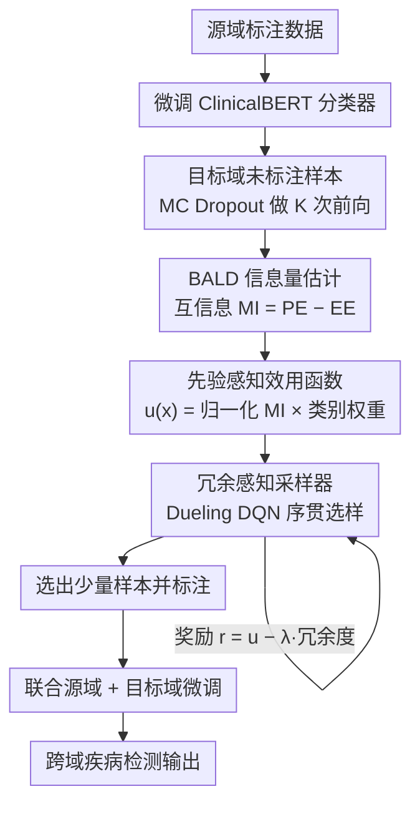

# RADS: Reinforcement Learning-Based Sample Selection Improves Transfer Learning in Low-resource and Imbalanced Clinical Settings

**会议**: ACL 2026 Findings  
**arXiv**: [2604.20256](https://arxiv.org/abs/2604.20256)  
**代码**: [https://github.com/Wei-0808/RADS](https://github.com/Wei-0808/RADS)  
**领域**: 医学NLP
**关键词**: 强化学习, 样本选择, 迁移学习, 类别不平衡, 临床NLP

## 一句话总结
本文提出 RADS（Reinforcement Adaptive Domain Sampling），一种基于强化学习的样本选择策略，在极端低资源和类别不平衡的临床场景下，通过智能选择少量目标域样本进行标注和联合微调，显著提升跨域疾病检测的迁移效果。

## 研究背景与动机

**领域现状**：临床文本的 NLP 任务严重依赖高质量标注数据，但医学领域的标注成本极高（需要专业医生参与），且许多疾病条件稀有，导致正例样本极度匮乏。迁移学习是应对低资源场景的主要策略，通过在源域训练后迁移到目标域来减少标注需求。

**现有痛点**：传统的主动学习方法（如不确定性采样和多样性采样）在极端低资源和类别不平衡条件下表现不佳。不确定性采样容易选择分布边缘的离群点而非真正有信息量的样本；多样性采样仅优化单一指标，无法同时考虑样本的信息量和冗余度。此外，临床报告的异质性很大（CT 报告、PET 报告、细胞学报告等使用的术语和表达方式差异巨大），进一步增加了跨域迁移的难度。

**核心矛盾**：在标注预算极为有限（如仅能标注 5 个样本）的情况下，如何从未标注的目标域中选出最有价值的样本，使得联合微调后模型在源域和目标域都能表现良好。

**本文目标**：设计一种同时考虑信息量、类别平衡和样本多样性的自适应样本选择策略。

**切入角度**：作者将样本选择问题建模为一个序贯决策问题，用强化学习 agent 来学习最优的选择策略，从而能自适应地平衡信息量、类别比例和冗余度。

**核心 idea**：用 Dueling DQN 训练一个样本选择 agent，该 agent 在 BALD 互信息的指导下，结合先验感知效用函数和冗余惩罚机制，从目标域中选择最优样本子集进行标注和微调。

## 方法详解

### 整体框架
RADS 框架分为三个阶段：（1）活跃学习器训练：在源域上微调 ClinicalBERT 分类器，然后通过 MC dropout 对目标域的未标注样本计算不确定性信号；（2）先验感知效用计算：结合 BALD 互信息分数和伪标签类别权重，构建同时考虑信息量和类别平衡的效用函数；（3）RL 采样器训练：用 Dueling DQN 学习一个选择策略，在最大化效用的同时惩罚冗余选择。最后用选出的少量样本联合源域一起微调，得到能同时适应两域的检测模型。

### 关键设计

**1. 基于 MC Dropout 的 BALD 信息量估计：用模型内部的分歧而非单纯的"拿不准"来挑样本**

传统不确定性采样在域偏移下经常选到分布边缘的离群点——它们看起来"拿不准"，但对模型其实没什么用。RADS 改用 BALD 互信息：保持 dropout 激活，对每个目标域样本做 $K$ 次随机前向传播，得到预测分布的熵 $\mathrm{PE}(x)$ 和各次预测的平均熵 $\mathrm{EE}(x)$，两者之差就是互信息 $\mathrm{MI}(x) = \mathrm{PE}(x) - \mathrm{EE}(x)$。

这个差值的意义是把不确定性拆成了两层：$\mathrm{PE}$ 高说明模型整体没把握，但如果各次随机前向的预测高度一致（$\mathrm{EE}$ 也高），那只是样本本身模糊的数据不确定性（aleatoric），换个标签也救不了；只有当各子模型之间彼此分歧大、$\mathrm{MI}$ 才高，这才是模型"没见过、值得标注"的认知不确定性（epistemic）。RADS 只挑高 $\mathrm{MI}$ 的样本，自然避开了那些标了也学不到东西的离群点。

**2. 先验感知效用函数（Prior-Aware Utility）：在信息量之上再压一层类别平衡**

光看信息量在极端不平衡下会翻车——最有信息量的样本可能清一色都是正例（或都是负例），选出来反而加剧偏斜。RADS 先用伪标签估计目标域的正类先验 $\hat{\pi}_+$，再算一个类别权重 $w_+ = \rho / \mathrm{clip}(\hat{\pi}_+)$，把它乘到归一化互信息上得到最终效用 $u(x) = \widetilde{\mathrm{MI}}(x) \cdot w_{y(x)}$。稀有类因为先验小、$\mathrm{clip}(\hat{\pi}_+)$ 小，权重被抬高，于是在同等信息量下更容易被选中。超参数 $\rho$ 就是那个旋钮，控制"偏向稀有类"和"偏向高信息量"之间的权衡，一个标量就能直接迁到任何低资源分类任务上。

**3. 基于 Dueling DQN 的冗余感知采样器：把样本选择变成序贯决策，自然地避开冗余**

前两步只能逐个给样本打分，看不到样本之间的相互关系——两个 $u(x)$ 都很高但内容几乎重复的样本，独立评估时会被同时选中，浪费掉本就稀缺的标注预算。RADS 把选样建模成一个序贯决策过程交给 RL agent：状态向量包含样本的均值对数概率、预测熵、BALD 分数和当前预算使用率，每选一个样本的奖励为

$$r_t = u(x_t) - \lambda \cdot \mathrm{Red}(x_t, S_t)$$

其中冗余度 $\mathrm{Red}(x_t, S_t)$ 用 $x_t$ 与已选集合 $S_t$ 在预测表示空间里的最近邻距离来衡量——离已选样本越近，惩罚越重。用 Dueling DQN 架构学习 Q 函数、配 $\epsilon$-greedy 探索，agent 在选第 $t$ 个样本时能"回头看"已经选了什么，动态调整标准，于是冗余被压在奖励里被自动规避，而不是靠事后去重补救。

### 损失函数 / 训练策略
活跃学习器使用标准交叉熵在源域上训练；RL 采样器使用 TD 损失训练 Dueling DQN，配合经验回放缓冲和目标网络。选出样本后，联合源域和标注后的目标域样本对 ClinicalBERT 进行微调。

## 实验关键数据

### 主实验（CHIFIR → PIFIR 迁移，选 5 个样本）

| 策略 | PIFIR F1 | PIFIR ROC-AUC | CHIFIR F1 | 迁移差距 ΔF1 |
|------|----------|---------------|-----------|-------------|
| Random | 0.639 | 0.813 | 0.746 | — |
| Uncertainty | 0.545 | 0.830 | 0.824 | 0.278 |
| Diversity | 0.638 | 0.809 | 0.800 | 0.162 |
| BatchBALD | 0.849 | 0.783 | 0.500 | -0.349 |
| **RADS** | **0.871** | **0.833** | **0.750** | **-0.121** |

### 消融实验

| 配置 | 关键指标 | 说明 |
|------|---------|------|
| RADS 完整 | F1=0.871, AUC=0.833 | 完整模型 |
| 去掉冗余惩罚 | 接近 Uncertainty 水平 | 冗余惩罚对多样性至关重要 |
| 去掉先验感知 | 类别偏斜加剧 | 不平衡条件下必需 |
| Full-shot (标注全部目标域) | F1=0.900 | 上界，RADS 仅用 5 个样本接近 |

### 关键发现
- RADS 仅用 5 个标注样本就达到了 F1=0.871，接近全标注的上界（0.900），远优于其他主动学习方法
- 传统不确定性采样在类别不平衡下严重退化（F1 仅 0.545），因为它倾向于选择分布边缘的离群点
- BatchBALD 虽然在目标域 F1 高（0.849），但严重牺牲了源域性能（CHIFIR F1 降至 0.500），迁移差距最大
- RADS 是唯一一个在目标域和源域都保持良好性能的方法，实现了真正的双域适应

## 亮点与洞察
- **将样本选择建模为 RL 问题**非常巧妙——相比贪心的主动学习方法，RL agent 可以在全局视角下优化选择子集的整体效用，自然地平衡信息量、类别比例和多样性
- **先验感知效用函数**的设计简洁而有效，用一个超参数 $\rho$ 就能控制类别平衡的程度，可以直接迁移到任何低资源分类任务
- 在表示空间中计算冗余度的方法值得借鉴——不直接比较原始文本，而是在 MC dropout 的预测分布空间中衡量样本间的距离

## 局限与展望
- 实验数据集规模较小（CHIFIR 283 份、PIFIR 201 份），在更大规模数据集上的效果有待验证
- RL 采样器的训练本身需要额外的计算成本和调参工作，在某些场景下可能不如简单方法划算
- 目前仅验证了二分类任务（疾病有/无），多分类场景下先验感知效用函数的设计需要扩展
- 可以考虑将 RL agent 的选择策略在多个迁移任务之间共享，进一步摊薄训练成本

## 相关工作与启发
- **vs Uncertainty Sampling**: 不确定性采样只考虑单一指标，在不平衡和域偏移下容易选到离群点；RADS 通过多信号融合和 RL 优化避免了这个问题
- **vs BatchBALD**: BatchBALD 通过联合互信息选择批次，理论上考虑了样本间依赖，但缺乏类别平衡机制，导致源域性能严重退化
- **vs LM-DPP**: DPP 同时建模不确定性和多样性，但其固定权重方案不如 RL 的自适应策略灵活

## 评分
- 新颖性: ⭐⭐⭐⭐ RL 驱动的样本选择在主动学习中并非全新，但与先验感知效用和冗余惩罚的组合设计有新意
- 实验充分度: ⭐⭐⭐⭐ 对比了 6 种基线，多方向迁移实验完整，但数据集规模偏小
- 写作质量: ⭐⭐⭐⭐ 方法部分形式化清晰，实验分析详细
- 价值: ⭐⭐⭐⭐ 在医学低资源NLP中具有实际应用价值，方法可推广到其他领域

<!-- RELATED:START -->

## 相关论文

- [\[ACL 2026\] Dr. Assistant: Enhancing Clinical Diagnostic Inquiry via Structured Diagnostic Reasoning Data and Reinforcement Learning](dr_assistant_enhancing_clinical_diagnostic_inquiry_via_structured_diagnostic_rea.md)
- [\[ACL 2026\] Eliciting Medical Reasoning with Knowledge-enhanced Data Synthesis: A Semi-Supervised Reinforcement Learning Approach](eliciting_medical_reasoning_with_knowledge-enhanced_data_synthesis_a_semi-superv.md)
- [\[ACL 2026\] CURE-Med: Curriculum-Informed Reinforcement Learning for Multilingual Medical Reasoning](cure-med_curriculum-informed_reinforcement_learning_for_multilingual_medical_rea.md)
- [\[ACL 2026\] Learning Dynamic Representations and Policies from Multimodal Clinical Time-Series with Informative Missingness](learning_dynamic_representations_and_policies_from_multimodal_clinical_time-seri.md)
- [\[ACL 2025\] CSTRL: Context-Driven Sequential Transfer Learning for Abstractive Radiology Report Summarization](../../ACL2025/medical_nlp/cstrl_context-driven_sequential_transfer_learning_for_abstractive_radiology_repo.md)

<!-- RELATED:END -->
