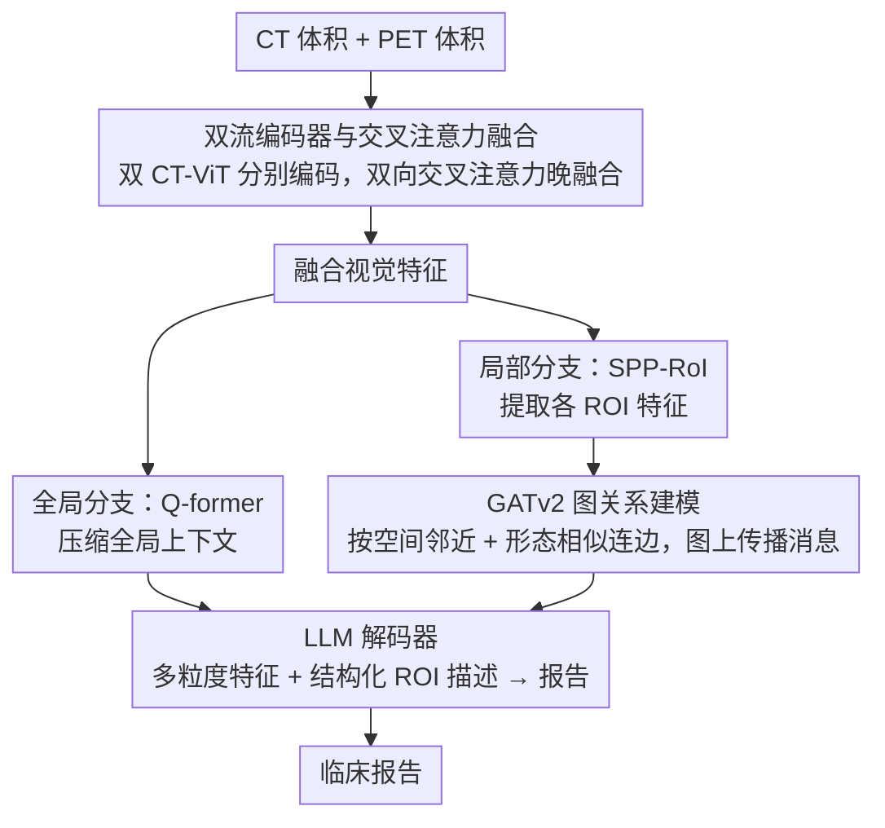

# Region-Grounded Report Generation for 3D Medical Imaging: A Fine-Grained Dataset and Graph-Enhanced Framework

**会议**: ACL 2026  
**arXiv**: [2604.18145](https://arxiv.org/abs/2604.18145)  
**代码**: 有（GitHub，论文接收后公开）  
**领域**: 医学NLP
**关键词**: PET/CT报告生成, ROI标注, 图神经网络, 3D医学影像, 低资源语言

## 一句话总结
本文提出首个带有细粒度 ROI 标注的 3D PET/CT 数据集 VietPET-RoI（越南语），以及模拟放射科医生诊断流程的层次化报告生成框架 HiRRA，通过图神经网络建模 ROI 间的空间-形态学关系，BLEU-4 提升 19.7%，临床指标 RoIQ 提升 45.8%。

## 研究背景与动机

**领域现状**：视觉-语言模型在医学报告自动生成领域取得了显著进展，但针对 3D PET/CT 的报告生成仍处于早期阶段。现有模型的准确率不理想，容易产生严重的幻觉（hallucination），距离临床实际需求还有很大差距。

**现有痛点**：当前的 PET/CT 报告生成模型采用端到端范式——将整个 3D 体积直接映射为文本报告。这种"黑盒"策略忽略了 PET/CT 数据的内在复杂性。在实际临床中，放射科医生的诊断流程是：先系统性地识别特定的感兴趣区域（ROI），评估每个 ROI 的属性（大小、密度、SUVmax 等），分析 ROI 间的空间和生理关系，最后综合所有发现才撰写报告。此外，现有数据集要么只有分割标注没有报告，要么只有报告没有 ROI 级别的标注，尤其缺乏低资源语言（如越南语）的数据。

**核心矛盾**：端到端模型缺乏临床工作流的归纳偏置，无法学习"从区域级发现到诊断结论"的推理过程；同时缺少带有 ROI 级别标注的训练数据来支撑分区域学习。

**本文目标**：（1）构建首个带有细粒度 ROI 标注的 3D PET/CT 数据集；（2）设计模拟放射科医生诊断流程的层次化框架。

**切入角度**：作者观察到放射科医生的诊断本质上是一个层次化过程——先局部分析再全局综合。因此需要同时提供全局体积特征和局部 ROI 特征，并建模 ROI 间的依赖关系（如相邻病灶可能暗示局部侵犯，远处具有相似代谢模式的病灶可能提示转移）。

**核心 idea**：用双流编码器分别提取 CT（解剖）和 PET（代谢）特征，再通过 GATv2 图神经网络建模 ROI 间的空间-形态学关系，最终将全局和局部多粒度特征注入 LLM 生成报告。

## 方法详解

### 整体框架
HiRRA 由三个核心模块组成：（1）双流编码器：分别处理 CT 和 PET 体积，通过交叉注意力融合后得到视觉特征；（2）层次化特征提取器：全局上下文分支通过 Q-former 压缩全局信息，局部上下文分支通过 SPP-RoI 提取 ROI 特征并用 GATv2 建模 ROI 间关系；（3）LLM 解码器：接收多粒度特征和结构化 ROI 描述作为提示，生成临床报告。

### 关键设计

**1. 双流编码器与交叉注意力融合：让 CT 管解剖、PET 管代谢，各自吃透再融**

如果一上来就把 CT 和 PET 拼在一起喂给单个编码器，模态特征会过早混在一起、互相淹没——CT 捕捉的组织边界和器官形态，跟 PET 量化的葡萄糖代谢活动本是两类互补信息，糊在一起反而都学不好。HiRRA 用两个独立的 CT-ViT 3D 编码器分别提取 $F_{CT}$ 和 $F_{PET} \in \mathbb{R}^{B \times N \times D}$，到了高层才用双向交叉注意力做跨模态融合：

$$\tilde{F}_{CT} = F_{CT} + \text{CA}(F_{CT}, F_{PET})$$

PET 那一支同理，最后取平均并经多尺度金字塔网络得到融合表示。这样 CT 提供"病灶在哪、长什么样"的定位与形态，PET 提供"这块组织代谢是否异常"的功能信号，分流到晚融合既保住了各模态的特性，又在融合层让二者互相校正。

**2. GATv2 图关系建模：把孤立的 ROI 连成一张能推理转移与侵犯的关系图**

逐个分析 ROI 会漏掉临床上最关键的线索——相邻的两个病灶可能暗示局部侵犯，相隔很远但代谢模式相似的病灶则可能提示转移，这些都是"ROI 之间"的关系，单看任一个区域都看不出来。HiRRA 以 ROI 为节点建图，边按两个标准连：空间邻近度（质心几何距离 $d_{ij} < \tau_d$）和形态学相似度（特征余弦相似度 $s_{ij} > \tau_s$）。边特征同时编码空间关系（距离、相对方向、体积比）和形态学关系（相似度、CT/PET 平均强度），再用 GATv2 的注意力机制在图上传播消息。于是"空间相邻"和"代谢相似"这两类临床关系被显式建进了表示里，模型能据此把分散的发现关联成局部侵犯或远处转移的推断。

**3. 临床评估指标（RoI Coverage 和 RoI Quality Index）：从临床正确性而非词汇重叠来量报告质量**

BLEU/ROUGE 只衡量词面重叠，一份措辞漂亮但把病灶定位写错的报告照样能拿高分，这在临床上是危险的误导。HiRRA 配套提出两个区域级指标：RoI Coverage 先用匈牙利匹配把预测 ROI 和真实 ROI 配对，算出 Precision/Recall/F1，衡量"该报的区域报全了没有"；RoI Quality Index（RoIQ）则对匹配上的 ROI 对做属性级评估：

$$\text{RoIQ} = \sqrt{S_{\text{region}} \cdot S_{\text{lesion}}} \times \frac{1}{|\mathcal{A}|}\sum_k S_k$$

这里对解剖区域得分 $S_{\text{region}}$ 和病灶类型得分 $S_{\text{lesion}}$ 取几何均值，是个有意为之的非线性惩罚——只要核心属性（定位或病灶类型）错了一项，几何均值就被拉到很低，无法靠其余次要属性的高分把整体补回来。这就保证了 RoIQ 反映的是"诊断对不对"，而不是"句子像不像"。

### 损失函数 / 训练策略
采用四阶段渐进训练：Stage 1 用 CLIP 对比学习预训练双流编码器；Stage 2 冻结编码器和 LLM，训练 Q-former 对齐视觉-语言；Stage 3 引入局部上下文模块（SPP-RoI + GATv2），冻结前两阶段参数；Stage 4 用 LoRA（$r=16, \alpha=32$）端到端微调。

## 实验关键数据

### 主实验

| 方法 | BLEU-4 | ROUGE-L | BERT | 正确ROI数 | RoI F1 | RoIQ |
|------|--------|---------|------|----------|--------|------|
| MedM-VL | 31.69 | 50.00 | 91.92 | 62/416 | 14.16 | 23.24 |
| M3D-LaMed | 44.30 | 64.39 | 85.90 | 193/416 | 39.83 | 36.31 |
| HiRRA (No RoI) | 52.48 | 66.51 | 95.13 | 187/416 | 37.58 | 33.89 |
| **HiRRA** | **62.80** | **69.66** | **95.79** | **223/416** | **42.47** | **56.86** |
| 提升 Δ% | +19.7% | +4.7% | +0.7% | +15.5% | +6.6% | **+45.8%** |

### 消融实验

| 配置 | 关键指标 | 说明 |
|------|---------|------|
| HiRRA 完整 | RoIQ=56.86 | 完整模型 |
| 去掉 ROI 标注（No RoI） | RoIQ=33.89 | ROI 级监督贡献最大，RoIQ 降 22.97 |
| 单 CT 编码器 | 性能下降 | 缺少 PET 代谢信息 |
| 单 PET 编码器 | 性能下降更多 | 缺少 CT 解剖结构信息 |

### 关键发现
- RoI 级别标注对临床指标的提升最为显著——RoIQ 从 33.89 提升到 56.86（+45.8%），说明细粒度的区域监督是减少幻觉的关键
- 所有现有 VLM 在越南语上表现极差（BLEU-4 接近 0），说明低资源语言的医学 AI 严重滞后
- GATv2 图关系建模对转移性疾病的诊断帮助最大，因为它可以关联远处具有相似代谢模式的病灶
- 双模态融合比单模态有明显优势，CT 提供定位、PET 提供功能信息，缺一不可

## 亮点与洞察
- **ROI 级别标注策略**将报告生成从"端到端黑盒"转变为"先分析后综合"的可解释范式，这一思路可以迁移到其他 3D 医学影像报告生成任务
- **RoIQ 指标设计**非常精妙——通过几何均值对核心属性施加非线性惩罚，确保解剖定位或病灶类型的错误不能被其他属性的高分掩盖。这种层次化评估思路可以推广到任何需要评估结构化输出质量的任务
- 四阶段渐进训练策略巧妙地平衡了各模块的学习——从全局对齐到局部细化再到端到端调优

## 局限与展望
- 数据集规模较小（200 患者、600 样本、1960 个 ROI），限制了模型的泛化能力
- 目前仅支持越南语，需要扩展到更多语言以验证框架的通用性
- ROI 标注依赖 8 名核医学医生的手动标注，成本较高，难以大规模扩展
- 可以考虑引入自动 ROI 检测模块替代手动标注，实现端到端的自动化
- 未来可以探索将 ROI 级别的推理过程显式化，提供更详细的诊断解释

## 相关工作与启发
- **vs M3D-LaMed**: M3D-LaMed 是通用 3D 医学 VLM，但缺乏 ROI 级别的监督，在临床指标上远逊于 HiRRA（RoIQ 36.31 vs 56.86）
- **vs ViMed-PET**: ViMed-PET 提供了越南语 PET/CT 报告数据，但只有全局报告标注，没有 ROI 级别的细粒度标注
- **vs CT2Rep**: CT2Rep 限于全局 CT-only 的报告映射，不支持 PET 模态和 ROI 级别推理

## 评分
- 新颖性: ⭐⭐⭐⭐⭐ 首个带有 ROI 级别标注的 3D PET/CT 数据集，图增强框架设计新颖
- 实验充分度: ⭐⭐⭐⭐ 多基线对比、消融分析和临床评估指标完整，但数据集规模偏小
- 写作质量: ⭐⭐⭐⭐ 结构清晰，临床动机阐述充分
- 价值: ⭐⭐⭐⭐⭐ 数据集和评估指标对医学影像 AI 社区有重要推动作用

<!-- RELATED:START -->

## 相关论文

- [\[ACL 2026\] CT-FineBench: A Diagnostic Fidelity Benchmark for Fine-Grained Evaluation of CT Report Generation](ct-finebench_a_diagnostic_fidelity_benchmark_for_fine-grained_evaluation_of_ct_r.md)
- [\[ACL 2026\] ProMedical: Hierarchical Fine-Grained Criteria Modeling for Medical LLM Alignment via Explicit Injection](promedical_hierarchical_fine-grained_criteria_modeling_for_medical_llm_alignment.md)
- [\[ACL 2026\] Text-Attributed Knowledge Graph Enrichment with Large Language Models for Medical Concept Representation](text-attributed_knowledge_graph_enrichment_with_large_language_models_for_medica.md)
- [\[ACL 2026\] MHGraphBench: Knowledge Graph-Grounded Benchmarking of Mental Health Knowledge in Large Language Models](mhgraphbench_knowledge_graph-grounded_benchmarking_of_mental_health_knowledge_in.md)
- [\[ACL 2026\] MARCH: Multi-Agent Radiology Clinical Hierarchy for CT Report Generation](march_multi-agent_radiology_clinical_hierarchy_for_ct_report_generation.md)

<!-- RELATED:END -->
