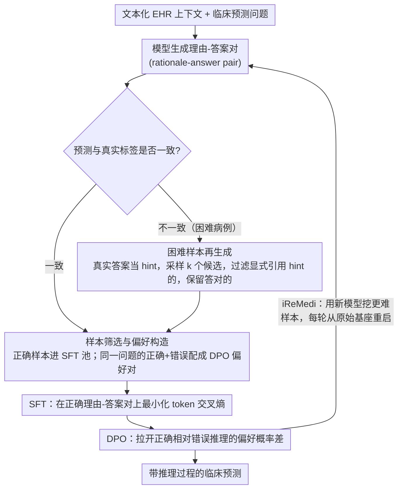

# ReMedi: Reasoner for Medical Clinical Prediction

**会议**: ACL 2026 Findings  
**arXiv**: [2605.01474](https://arxiv.org/abs/2605.01474)  
**代码**: 未见公开代码  
**领域**: 医学临床预测 / EHR 建模 / 医学大语言模型  
**关键词**: 电子健康记录、临床预测、推理微调、偏好优化、困难样本再生成

## 一句话总结
ReMedi 将 EHR 临床预测改写成“理由-答案”生成与偏好学习问题，通过带真实结局提示的困难样本再生成、SFT 和 DPO 让医学 LLM 学会更细粒度地解释患者风险，在 MIMIC-IV 三类预测任务上相对 KARE 最高带来 19.9 个 F1 点提升。

## 研究背景与动机
**领域现状**：电子健康记录包含诊断、用药、检查和住院轨迹，是死亡风险、再入院和住院时长预测的重要数据来源。近年的方法开始把 EHR 转成文本，让医学 LLM 直接阅读患者历史，或者用医学知识图谱、检索增强、知识蒸馏来补充领域知识。

**现有痛点**：这些方法往往把重点放在“补知识”上，却假设模型已经会解释复杂 EHR 上下文。实际临床预测并不是简单事实问答，模型需要区分病情严重程度、治疗轨迹和慢病风险等细微差别；如果只让模型输出标签，它很容易学到偏向阳性或过度保守的模式。

**核心矛盾**：临床预测既需要可解释的推理链，又需要最终标签准确；但直接生成推理链并不能保证推理与答案一致，而昂贵的专家标注也难以覆盖大量 EHR 样本。论文的关键矛盾是：如何利用已有的真实结局标签，低成本地构造能训练模型推理能力的监督和偏好数据。

**本文目标**：作者希望让模型在不依赖专有教师模型和预定义医学本体的情况下，从困难病例中自动生成高质量理由，并把正确理由、错误理由和最终答案之间的关系转化为可优化的训练信号。

**切入角度**：真实临床结局本身可以作为“提示”帮助模型反向解释困难病例。只要在数据构造阶段使用标签提示，在训练前过滤掉显式泄露提示的内容，就能把标签变成推理数据生成器，而不是推理时的作弊信息。

**核心 idea**：用“困难样本 + 真实标签提示”生成更可靠的 rationale-answer pair，再用 SFT/DPO 训练医学 LLM，使其预测结果和推理过程同时对齐。

## 方法详解
ReMedi 不去改 EHR 编码器，而是在 LLM 后训练阶段重塑“读病例、找风险、给结论”的推理习惯：先让模型自己为每条 EHR 问题生成推理和预测，用真实标签筛出做对的样本喂 SFT；再专门回到答错的困难病例上，借真实结局当提示诱导更合理的解释；最后把正确与错误回答配成对走 DPO。

### 整体框架
输入是一条经过文本化处理的患者 EHR 上下文和一个临床预测问题，输出是带推理过程的预测答案。整条流水线分三步走：先让模型对训练集问题生成 rationale-answer pair；再针对答错或难以回答的样本做带标签提示的再生成；最后把正确推理样本用于 SFT、把同一问题上的正确与错误回答配对后用于 DPO。在此之上作者还提出 iReMedi，把这套三阶段流程迭代执行多轮——每轮用上一轮训练好的模型当数据生成器，但训练时始终从原始基座重新初始化，避免多轮自训练把噪声越滚越大。

### 关键设计

**1. 基于真实结局的样本筛选与偏好构造：把现成的 EHR 标签直接变成监督信号和偏好信号**

临床预测的标签（死亡、再入院、住院时长）本来就有，但逐条标注“为什么会这样”的推理链却极贵。这个设计干脆让标签来当推理质量的过滤器：给定问题 $q_i$ 和真实答案 $a_i$，生成模型先输出理由 $\hat r_i$ 与答案 $\hat a_i$；只要 $\hat a_i = a_i$，这条 rationale-answer pair 就进 SFT 数据集；而当同一个问题上既采到正确输出又采到错误输出时，就把正确的当 preferred、错误的当 dispreferred，凑成一条 DPO 偏好数据。如此一来，训练信号不再只盯最终标签，还顺带约束了答案背后的解释，而额外标注成本几乎为零。

**2. 困难样本再生成：把算力集中砸在模型当前答错的边界病例上**

容易样本对模型几乎没有边际收益，真正卡住模型的是那些会混淆再入院风险、死亡风险或住院时长的复杂病例。这个设计专门回收答错的样本：把真实答案当 hint 传回模型做 label rationalization，每条样本重复采样 $k$ 个候选，只保留既能给出正确答案、理由里又没有显式提到 hint 的那些，持续补进 SFT 和 DPO 数据池。标签提示降低了早期弱模型写出高质量解释的门槛，而“理由不得显式引用 hint”的过滤规则又堵住了“因为提示告诉我答案了”这种泄露捷径，逼模型把推理真正落到病例本身。

**3. SFT/DPO 与迭代式 iReMedi：先模仿正确推理，再拉开正确与错误推理的概率差**

光靠 SFT，模型容易学到表面模式——理由看着像样、答案却错。所以 ReMedi 分两段走：SFT 在正确 rationale-answer pair 上最小化 token 交叉熵，先把“会推理”的样子教会；DPO 再在 SFT 模型之上优化正确输出相对错误输出的偏好，显式惩罚那些“看似有道理但结论错”的推理。iReMedi 则把整套流程滚成多轮，每轮用更新后的模型挖出更难的样本喂给下一轮，但每轮训练都从原始基座重启，让模型一步步逼近更难的分布，而不是被初代模型的生成质量一次性锁死。

### 损失函数 / 训练策略
实验以 HuatuoGPT-o1-7B 为基座模型，使用 TRL、Transformers、DeepSpeed 和 Flash-Attention2 微调。学习率为 $5e^{-6}$，AdamW 优化器，batch size 为 16。训练数据来自 MIMIC-IV，按 0.8/0.1/0.1 划分训练、验证和测试集。SFT 阶段最小化正确理由和答案的 token 交叉熵；DPO 阶段最大化正确理由-答案相对错误理由-答案的偏好比。

## 实验关键数据

### 主实验
作者在 MIMIC-IV 上评估三类临床预测：死亡预测、15 天内再入院预测、住院时长预测。每个任务保留 10,000 个样本级别的数据；死亡任务含 2,701 个死亡结局和 7,299 个存活结局，再入院任务正负各 5,000，住院时长为四分类且各类 2,500。

| 方法 | 死亡 Acc/F1 | 再入院 Acc/F1 | 住院时长 Acc/F1 | 主要结论 |
|------|-------------|----------------|------------------|----------|
| Few-shot HuatuoGPT-o1-7B | 75.2 / 73.9 | 52.2 / 41.8 | 31.4 / 24.6 | 提示式推理仍明显不足 |
| SFT | 88.9 / 88.3 | 69.2 / 66.4 | 39.9 / 36.6 | 直接监督微调有帮助，但住院时长仍弱 |
| KARE | 95.9 / 95.5 | 81.2 / 81.3 | 40.4 / 35.9 | 强基线，依赖结构化医学知识和蒸馏 |
| ReMedi | 97.7 / 97.6 | 90.5 / 90.4 | 55.6 / 55.5 | 相比 KARE 在三任务均有提升 |
| iReMedi | 97.8 / 97.6 | 91.5 / 91.4 | 56.1 / 55.8 | 迭代训练进一步提升再入院与住院时长 |

### 消融实验
论文重点在再入院任务上分析 DPO、迭代训练和 STaR 式自训练的贡献。

| 配置 | Acc | F1 | TPR | TNR | 说明 |
|------|-----|----|-----|-----|------|
| ReMedi | 90.5 | 90.4 | 80.6 | 100.0 | 完整三阶段流程 |
| ReMedi w/o DPO | 84.4 | 84.4 | 85.3 | 83.6 | 去掉偏好优化后整体下降，尤其 TNR 不稳定 |
| iReMedi | 91.5 | 91.4 | 83.8 | 100.0 | 迭代版本最佳 |
| iReMedi w/o DPO | 86.8 | 86.8 | 83.7 | 89.9 | 迭代有益，但 DPO 仍关键 |
| STaR | 59.1 | 53.2 | 96.1 | 23.4 | 泛化自训练不适合该临床预测场景 |

作者还人工检查 reasoning 与 prediction 的一致性。在再入院任务中，KARE 的平均一致性为 60.0%（人工）/52.0%（Gemini 评估），ReMedi 达到 92.5%/90.0%。这说明 ReMedi 的提升不只是标签更准，也让解释和最终结论更一致。

### 关键发现
- 最强提升来自困难样本再生成和 DPO 的组合：困难样本提供更有信息量的训练点，DPO 则压低错误推理的偏好概率。
- 住院时长任务提升最大，ReMedi 相对 KARE 提升 15.2 个 Acc 点和 19.6 个 F1 点，说明它对多分类、细粒度风险判断尤其有效。
- 提示式 LLM 在再入院任务上常出现高 TPR、低 TNR，即倾向于把风险判得过高；ReMedi 的 case study 显示它能更细致地区分“稳定慢病”与“真正高风险慢病”。

## 亮点与洞察
- ReMedi 的巧妙之处在于把标签从“最终监督”变成“推理数据生成的脚手架”。真实结局只在训练数据构造中用作 hint，经过过滤后不进入推理文本，从而提高样本质量又降低标签泄露风险。
- 论文没有引入复杂的医学知识库，而是证明后训练策略本身就能显著改善 EHR 预测。这对资源有限的医疗场景很重要，因为构建本体和检索系统通常比微调更难维护。
- alignment 分析很有价值：医学预测中“解释看起来合理但答案不一致”会直接影响可信度。ReMedi 把 reasoning-prediction alignment 当作可观察目标，为临床 LLM 评价提供了一个比准确率更贴近部署风险的维度。
- 方法可迁移到其他带真实标签但缺少推理标注的任务，例如 ICU 干预预测、药物不良反应预测、保险理赔风险建模等。

## 局限与展望
- 论文承认 ReMedi 仍会出现少量理由和预测不一致，说明过滤规则和 DPO 偏好还不能完全保证解释忠实性。
- 实验集中在有明确标签的临床预测任务，尚未验证开放式临床问答、诊疗计划生成或多模态医学决策。
- 基座主要是 HuatuoGPT-o1-7B，未系统研究 70B 以上模型是否仍需要相同强度的再生成和偏好优化。
- 人工评估只覆盖 reasoning-prediction alignment，没有请临床专家严格评估每条理由是否医学上正确，这限制了临床可信度结论。
- 如果未来用于真实医疗系统，需要加入不确定性估计、专家复核和数据漂移监控，不能只依赖单一预测标签。

## 相关工作与启发
- **vs KARE**: KARE 通过医学知识蒸馏和结构化医学图谱增强推理，ReMedi 则用标签引导的自生成理由和 DPO 直接塑造预测推理能力；前者知识依赖更强，后者扩展和部署更轻。
- **vs STaR**: STaR 用模型自生成理由进行迭代自训练，但在临床预测中表现很差；ReMedi 的差别在于只针对困难样本使用真实结局提示，并用偏好数据约束错误理由。
- **vs RAG 医疗 LLM**: RAG 解决外部知识覆盖问题，ReMedi 解决 EHR 上下文解释问题；二者可以互补，例如先检索指南知识，再用 ReMedi 式偏好训练保证结论与理由一致。
- **启发**: 对于有标签但缺少解释的高风险任务，可以考虑“标签提示生成解释 + 泄露过滤 + 偏好优化”的路线，比直接让模型在最终标签上 SFT 更能训练可解释决策。

## 评分
- 新颖性: ⭐⭐⭐⭐☆ 将 label rationalization、困难样本和 DPO 组合到 EHR 预测中，思路不复杂但场景适配很到位。
- 实验充分度: ⭐⭐⭐⭐☆ 主实验、消融、alignment 和 case study 都较完整，但临床专家评价和大模型扩展还不够。
- 写作质量: ⭐⭐⭐⭐☆ 方法流程清晰，表格信息充分，部分实现细节如提示模板和采样策略可再展开。
- 价值: ⭐⭐⭐⭐⭐ 对医疗 LLM 的“准确预测 + 解释一致”很有实际意义，尤其适合低专家标注成本的临床预测任务。

<!-- RELATED:START -->

## 相关论文

- [\[ACL 2026\] CURA: Clinical Uncertainty Risk Alignment for Language Model-Based Risk Prediction](cura_clinical_uncertainty_risk_alignment_for_language_model-based_risk_predictio.md)
- [\[ACL 2026\] Efficient and Effective Internal Memory Retrieval for LLM-Based Healthcare Prediction](efficient_and_effective_internal_memory_retrieval_for_llm-based_healthcare_predi.md)
- [\[ACL 2026\] PrinciplismQA: A Philosophy-Grounded Approach to Assessing LLM-Human Clinical Medical Ethics Alignment](principlismqa_a_philosophy-grounded_approach_to_assessing_llm-human_clinical_med.md)
- [\[ACL 2026\] Beyond the Individual: Virtualizing Multi-Disciplinary Reasoning for Clinical Intake via Collaborative Agents](beyond_the_individual_virtualizing_multi-disciplinary_reasoning_for_clinical_int.md)
- [\[ACL 2026\] Learning Dynamic Representations and Policies from Multimodal Clinical Time-Series with Informative Missingness](learning_dynamic_representations_and_policies_from_multimodal_clinical_time-seri.md)

<!-- RELATED:END -->
