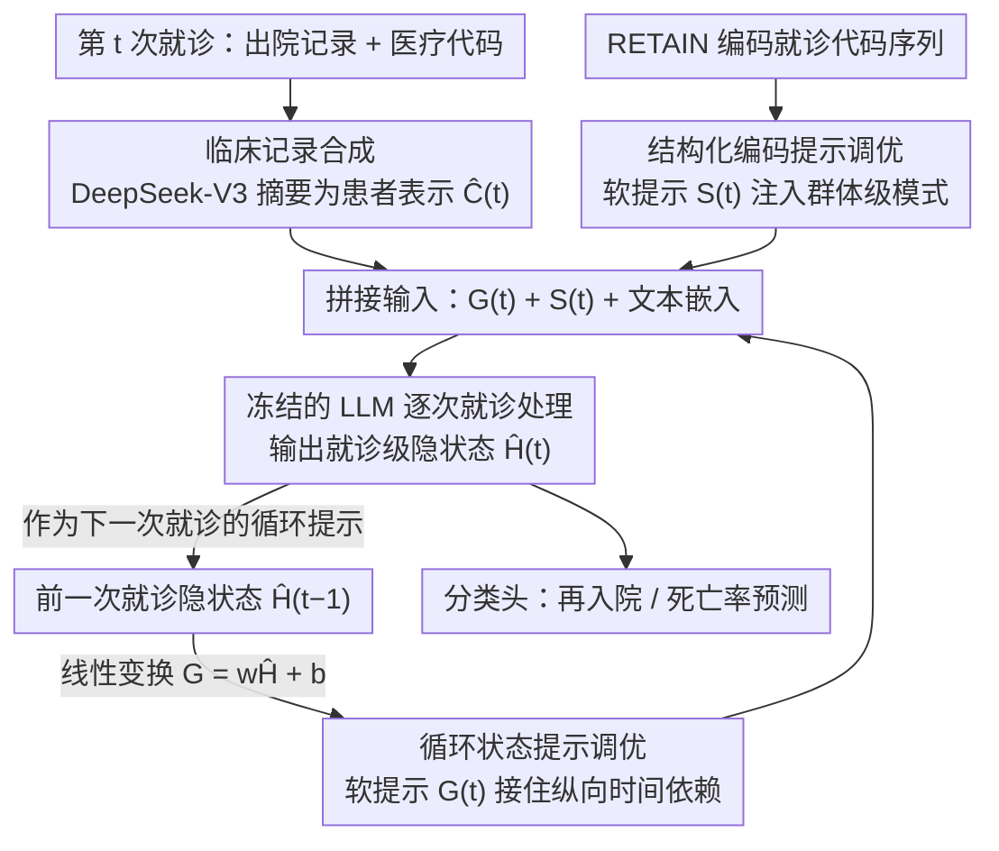

# RePrompT: Recurrent Prompt Tuning for Integrating Structured EHR Encoders with Large Language Models

**会议**: ACL 2026  
**arXiv**: [2604.17725](https://arxiv.org/abs/2604.17725)  
**代码**: [https://github.com/KU-AI4H/RePrompT](https://github.com/KU-AI4H/RePrompT)  
**领域**: 医学NLP
**关键词**: 电子健康记录, 提示调优, 循环状态传播, 结构化编码器, 临床预测

## 一句话总结
本文提出 RePrompT，一种时间感知的 LLM 框架，通过循环提示调优（将前一次就诊的隐状态作为下一次就诊的软提示）和结构化编码提示调优（注入群体级 EHR 编码器的嵌入）两种互补机制，在 MIMIC-III/IV 上的再入院和死亡率预测任务上一致超越 EHR 基线和 LLM 基线。

## 研究背景与动机

**领域现状**：电子健康记录（EHR）包含患者多次就诊的诊断、用药、手术等纵向信息，是临床决策支持的重要数据源。大语言模型在 EHR 挖掘任务（如死亡率预测、再入院预测）上展现了潜力，但在处理结构化 EHR 信号时仍面临两个核心挑战。

**现有痛点**：第一个挑战是时间结构丢失。将纵向 EHR 数据线性化为纯文本（"Visit 1: ... Visit 2: ..."）时，时间依赖和临床代码的离散身份会被模糊化。虽然可以用分隔符标记就诊边界，但 LLM 本质上将输入视为单一文档，缺乏对就诊间时间依赖的显式建模机制。第二个挑战是缺乏群体级信息。传统的 EHR 预测模型（如 RETAIN、GRAM）在患者群体上联合训练，学习一个共享的、任务对齐的表示空间，能发现疾病共现、纵向进展等群体级模式。而 LLM 在每个患者上独立推理（case-isolated），缺乏利用其他相似患者信息来辅助预测的机制。

**核心矛盾**：LLM 擅长从文本中提取丰富的上下文信息，但缺乏对纵向时间结构的建模能力和群体级知识的利用能力；结构化 EHR 编码器擅长时间建模和群体级模式发现，但表示能力有限。如何结合两者的互补优势是核心问题。

**本文目标**：设计一种轻量化的框架，在不修改 LLM 架构的前提下，将结构化 EHR 编码器的时间和群体级信息注入 LLM。

**切入角度**：提示调优（prompt tuning）允许在不改变 LLM 参数的情况下注入外部信息——只需将外部信息编码为可训练的软提示向量即可。

**核心 idea**：用两种互补的软提示机制增强 LLM：（1）循环提示将前一次就诊的 LLM 隐状态传递到当前就诊，显式建模纵向依赖；（2）结构化编码提示将群体训练的 EHR 编码器（RETAIN）的嵌入注入 LLM，引入群体级模式。

## 方法详解

### 整体框架
RePrompT 的目标是把结构化 EHR 编码器擅长的“时间结构 + 群体模式”补进只会读文本的 LLM，而且全程不动 LLM 的参数。它由三个模块串起来：先用 DeepSeek-V3 把每次就诊冗长的出院记录和结构化医疗代码压成简洁的患者摘要；再让 LLM 逐次就诊处理，把前一次就诊的隐状态经线性变换当作当前就诊的软提示，显式接住纵向依赖；同时用群体训练的 RETAIN 编码器把结构化 EHR 序列编码成稠密表示，作为另一组软提示注入。最终喂给 LLM 的输入，是循环提示 $G_{i,t}$、结构化提示 $S_{i,t}$ 和文本嵌入三部分的拼接。

### 关键设计

**1. 临床记录合成：先把冗长嘈杂的原始记录提炼成干净摘要，再进 LLM**

原始出院记录又长又满是模板套话，直接灌给 LLM 既挤占上下文窗口又引入噪声。这个设计在最前面加一道预处理：用 DeepSeek-V3 对每次就诊的出院记录和对应医疗代码做摘要，删掉模板段落和冗余，产出统一格式的患者表示 $\hat{C}_{i,t}$。这样后面两组软提示和文本嵌入对齐到的，是一份信噪比更高的患者历史。

**2. 循环状态提示调优（State-Recurrent Prompt Tuning）：用 RNN 式的隐状态传递，显式建模就诊之间的时间依赖**

把多次就诊线性拼成一段文本喂给 LLM，会让模型把整份病历当成单一文档，就诊边界和先后顺序都被抹平。这个设计反其道而行：让 LLM 每次只处理一次就诊，处理完抽出最后一层的 token 级隐状态 $H_{i,t}$，平均池化得到就诊级隐状态 $\hat{H}_{i,t}$，再经线性变换 $G_{i,t+1} = w_t \hat{H}_{i,t} + b_t$ 生成下一次就诊的软提示。于是 LLM 处理第 $t+1$ 次就诊时，手里就攥着前 $t$ 次浓缩成的“记忆”，信息像 RNN 的隐状态一样一步步往后传，而不是指望注意力自己从一大段拼接文本里还原时序。

**3. 结构化编码提示调优（Struct-Encoded Prompt Tuning）：把群体训练的 EHR 编码器知识当软提示喂进去**

LLM 对每个患者都是 case-isolated 地独立推理，看不到“别的相似患者长什么样”，自然学不到疾病共现、用药模式这类群体级规律。这个设计请来在患者群体上训练好的 RETAIN（具有双层注意力和循环建模能力）：它把就诊级的医疗代码序列 $\{V_{i,j}\}_{j=1}^t$ 编码成稠密表示 $S_{i,t} \in \mathbb{R}^{P \times D}$，直接作为软提示注入 LLM。这相当于在每个患者的输入里塞进一份“群体参考”，让单患者推理也能借上群体统计的力。

### 一个完整示例：一位三次就诊的患者
假设患者有三次就诊。第 1 次就诊时还没有历史，LLM 只读摘要 $\hat{C}_{i,1}$ 和 RETAIN 给的结构化提示 $S_{i,1}$，处理完吐出隐状态 $\hat{H}_{i,1}$；到第 2 次就诊，这个 $\hat{H}_{i,1}$ 经线性变换变成循环提示 $G_{i,2}$，和当次摘要 $\hat{C}_{i,2}$、结构化提示 $S_{i,2}$ 拼在一起喂进去，模型此刻已经“记得”第一次的病情；第 3 次就诊同理接住 $\hat{H}_{i,2}$。最终在第 3 次就诊的隐状态上接分类头输出再入院或死亡率预测——预测此刻依据的，是被循环提示一路压缩传递下来的完整就诊轨迹，而非一段被拍平的拼接文本。

### 损失函数 / 训练策略
使用 Binary Cross-Entropy 损失进行二分类/多标签分类。可训练参数包括：RETAIN 编码器、循环状态的线性变换层、输出分类头。LLaMA 模型在训练和推理过程中保持冻结。使用 LLM2Vec 框架的 Llama 3.1 1B 作为嵌入提取器。

## 实验关键数据

### 主实验（与 EHR 基线对比）

| 模型 | MIMIC-IV 再入院 AUROC | MIMIC-IV 死亡率 AUROC | MIMIC-III 再入院 AUROC | MIMIC-III 死亡率 AUROC |
|------|---------------------|---------------------|---------------------|---------------------|
| RETAIN | 0.670 | 0.601 | 0.660 | 0.608 |
| StageNet | 0.656 | 0.664 | 0.676 | 0.633 |
| ARCI | 0.663 | 0.611 | 0.652 | 0.618 |
| **RePrompT** | **0.706** | **0.673** | **0.688** | **0.646** |

### 消融实验

| 配置 | MIMIC-IV 再入院 AUROC | MIMIC-IV 死亡率 AUROC | 说明 |
|------|---------------------|---------------------|------|
| RePrompT 完整 | 0.706 | 0.673 | 完整模型 |
| 去掉两个模块 | 0.673 | 0.635 | 基线水平 |
| 去掉循环提示 | 0.693 | 0.642 | 循环提示贡献更大 |
| 去掉结构化编码 | 0.698 | 0.665 | 结构化编码也有贡献 |
| 去掉 DeepSeek 摘要 | 0.685 | 0.640 | 摘要预处理也有帮助 |

### 关键发现
- RePrompT 在所有数据集和任务上一致优于所有 EHR 基线和 LLM 基线，AUROC 提升约 3-7 个百分点
- 循环状态提示的贡献大于结构化编码提示——去掉循环提示后 AUROC 降低更多，说明纵向时间依赖建模是最关键的
- 与 LLM 基线的比较尤为惊人：Zero-shot LLM（GPT-5）AUROC 仅 0.512（再入院），RePrompT 达到 0.706，差距巨大
- 在不同 EHR 编码器的对比中，RETAIN 表现最好，Transformer 编码器反而最差——因为 Transformer 在建模时序就诊依赖时不如 RNN 有效
- DeepSeek 摘要预处理虽然有帮助，但去掉后 RePrompT 仍优于 RETAIN，证明性能提升主要来自框架设计而非摘要质量

## 亮点与洞察
- **循环提示调优**的设计非常优雅——它将 RNN 的序贯处理思想引入 LLM 的提示空间，使 LLM 能像 RNN 一样逐步处理时序数据。这个思路可以迁移到任何需要处理时序文档的 LLM 应用
- **将 EHR 编码器作为软提示注入 LLM** 提供了一种通用的"专家知识注入"范式——任何领域特定的编码器都可以通过这种方式与 LLM 融合，无需修改 LLM 本身
- Transformer 在 EHR 时序建模上不如 RNN 这一发现很有启发性——位置编码不足以替代 RNN 的显式时序传递

## 局限与展望
- 目前仅验证了 Llama 3.1 1B 作为基础模型，更大规模的 LLM 可能有不同表现
- 使用 DeepSeek-V3 做摘要预处理引入了额外的依赖和成本
- 软提示数 $P=10$ 是超参，论文未充分讨论不同值的影响
- 可以考虑将循环提示扩展为多尺度——不仅传递最近一次就诊的信息，还传递更长时间跨度的聚合信息
- 未来可以探索将方法扩展到多标签药物推荐等更复杂的临床预测任务

## 相关工作与启发
- **vs RETAIN**: RETAIN 仅用结构化代码序列，缺乏文本理解能力；RePrompT 通过 LLM 引入了对出院记录的深层语义理解，同时保留了 RETAIN 的群体级模式
- **vs COCONUT**: COCONUT 也使用软 token 进行推理，但缺乏显式的时间结构建模，在 EHR 时序任务上表现不如 RePrompT
- **vs Zero-shot GPT-5**: 即使是最强的通用 LLM 在 EHR 预测上也远逊于领域特化的方法，说明结构化医学知识的注入不可或缺

## 评分
- 新颖性: ⭐⭐⭐⭐ 循环提示调优和结构化编码提示的组合设计有新意，但各单独组件（提示调优、RNN 状态传递）并非全新
- 实验充分度: ⭐⭐⭐⭐⭐ 两个数据集、两个任务、8 个 EHR 基线 + 3 个 LLM 基线、多层消融和编码器对比，非常充分
- 写作质量: ⭐⭐⭐⭐ 框架图清晰，动机阐述充分，消融分析详尽
- 价值: ⭐⭐⭐⭐ 提供了一种轻量化且有效的 LLM-EHR 融合范式，对临床 AI 有实际指导意义

<!-- RELATED:START -->

## 相关论文

- [\[ACL 2026\] Text-Attributed Knowledge Graph Enrichment with Large Language Models for Medical Concept Representation](text-attributed_knowledge_graph_enrichment_with_large_language_models_for_medica.md)
- [\[ACL 2026\] Beyond the Leaderboard: Rethinking Medical Benchmarks for Large Language Models](beyond_the_leaderboard_rethinking_medical_benchmarks_for_large_language_models.md)
- [\[ACL 2026\] MedFact: Benchmarking the Fact-Checking Capabilities of Large Language Models on Chinese Medical Texts](medfact_benchmarking_the_fact-checking_capabilities_of_large_language_models_on_.md)
- [\[ACL 2026\] MHGraphBench: Knowledge Graph-Grounded Benchmarking of Mental Health Knowledge in Large Language Models](mhgraphbench_knowledge_graph-grounded_benchmarking_of_mental_health_knowledge_in.md)
- [\[ICML 2026\] MedCase-Structured: A Text-to-FHIR Dataset for Benchmarking Diagnostic Reasoning in Clinically Realistic EHR Settings](../../ICML2026/medical_nlp/medcase-structured_a_text-to-fhir_dataset_for_benchmarking_diagnostic_reasoning_.md)

<!-- RELATED:END -->
