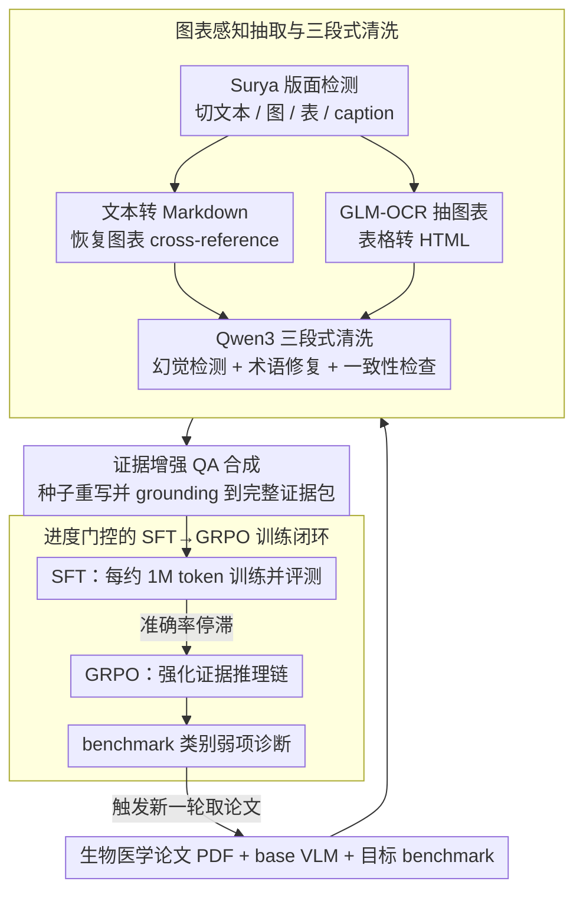

# Ryze: Evidence-Enriched Data Synthesis from Biomedical Papers

**会议**: ACL2026  
**arXiv**: [2606.00902](https://arxiv.org/abs/2606.00902)  
**代码**: https://github.com/Chivier/Ryze  
**领域**: 医疗NLP
**关键词**: 生物医学VLM, 证据增强数据合成, 科学PDF理解, 图表感知OCR, GRPO

## 一句话总结
Ryze 将生物医学论文 PDF 自动转成保留图表、caption、结构化抽取和引用段落的证据增强 QA 数据，并用进度门控的 SFT+GRPO 训练 BioVLM-8B，在 LAB-Bench 上以 48.0% weighted accuracy 超过 Qwen3-VL-8B base 12.6 个百分点、超过 GPT-5.2 3.8 个百分点。

## 研究背景与动机
**领域现状**：通用 VLM 已经能处理日常图文任务，但科研论文理解不是普通图文问答。生物医学论文里的答案往往分散在多栏正文、图注、坐标轴、图例、多行表头和正文中对图表的解释里，模型需要把这些证据链同时读出来，才能回答实验设计、序列分析、protocol tracing 或文献综合问题。

**现有痛点**：领域 VLM 的瓶颈不只是模型规模，而是训练数据。专家标注的生物医学 QA 成本高、覆盖窄，直接复用 PubMedQA 或 MedQA 又会丢掉视觉和结构化证据；通用 OCR / Markdown 转换工具容易把基因名、化学式、图表数值和 figure/table 引用识别错，后续合成的 QA 会继承这些错误。

**核心矛盾**：科研问答需要“证据完整性”，而常见数据合成 pipeline 只保留局部文本或 figure-caption pair。缺少 referring prose、表格结构和图表 annotation 时，训练样本看似有答案，实则训练模型记浅层模式，不能学会跨元素的 evidence-grounded reasoning。

**本文目标**：作者想解决一个系统问题：给定一批开放获取的生物医学 PDF、一个 base VLM 和目标评测 benchmark，能否在不依赖人工标注的情况下，自动生成高质量领域 QA 数据，并把 Qwen3-VL-8B 这类 8B 级模型训练成可本地部署的 BioVLM。

**切入角度**：Ryze 的关键观察是，科学文档数据合成的最小单位不应是“文本片段”或“图片-caption”，而应是完整证据包：视觉元素、caption、抽取出的结构、正文中引用它的段落，以及经过术语修复和一致性检查后的上下文。

**核心 idea**：用证据增强的科学文档抽取与 QA 合成替代普通文本合成，再用 SFT 注入领域知识、用 GRPO 强化复杂证据推理。

## 方法详解
Ryze 是一个端到端 workflow，而不是单一模型结构。它从原始 PDF 出发，先做图表感知抽取和清洗，再基于完整证据包生成 QA，随后用进度门控策略决定何时从 SFT 切换到 GRPO，最后把评测暴露出的薄弱类别反馈回数据生成环节。

### 整体框架
输入包括一批生物医学论文 PDF、base VLM（论文中使用 Qwen3-VL-8B）和一个目标评测 benchmark（LAB-Bench）。Ryze 先将 PDF 切成文本块、figure、table 和 caption，并恢复正文里的 figure/table cross-reference；然后为每个问题检索关联证据，生成带完整 evidence 的 QA；接着按约 1M token 的增量反复合成、SFT、评测，当 SFT 提升停滞后切换到 GRPO；最后通过 benchmark category 的弱项诊断触发新一轮 paper 搜索和数据增强。

### 关键设计

**1. 图表感知抽取与三段式清洗：先把 PDF 变成可信的结构化证据库，再谈合成**

生物医学论文里一个被认错的基因名、一个读偏的坐标轴数值，都会顺着 pipeline 污染后面所有 QA，因此 Ryze 在抽取阶段就把"可信度"当成第一目标。它先用 Surya 做 layout detection，把页面切成文本、图、表、caption 等区域，文本区域转成保留章节结构的 Markdown，并修复正文里"Table 1 / Figure 3"这类 cross-reference，让每个视觉元素都和它的 caption、引用它的段落绑在一起；图和表交给 GLM-OCR 做 chart/table-aware extraction，表格转成保留合并单元格和多行表头的 HTML，而不是拍平成纯文本。

最后一道是用 Qwen3 做三段式清洗——hallucination detection、领域术语修复、跨元素一致性检查。先把结构和术语校准好，数据合成才不会把 OCR 错误放大成模型"学到的知识"；这也是后面消融里换成通用 OCR（Marker / DeepSeek OCR）会在 ChartQA 上掉最多 -7.8pp 的根本原因。

**2. 证据增强 QA 合成：让每道题都能回溯到原始论文的视觉与文本证据**

普通合成 pipeline 常常只留局部文本或 figure-caption pair，训练样本看似有答案，模型却只记住浅层模式。Ryze 的问题种子有两个来源：原始论文里的一般领域问题，以及从目标 benchmark 抽象出的技能类别（chart interpretation、protocol tracing、literature synthesis 等）。它不抄 benchmark 的题目和答案，而是用 Qwen3-VL-235B 对这些粗粒度技能做重写和多样化，再把每个答案严格 grounding 到源 PDF corpus 检索出的视觉元素、caption、OCR annotation、HTML 表格和 referring paragraphs 上。

这套做法更像 curriculum-aware active learning：benchmark 只负责告诉系统"该覆盖哪些能力"，不交出具体题目或答案。既能定向补强 LAB-Bench 相关能力，又把直接数据泄漏的风险压低——代价是泛化性最终仍要靠完全没参与 curriculum 设计的 held-out benchmark 来背书。

**3. 进度门控的 SFT→GRPO 训练闭环：用评测停滞当信号，自动从堆数据切到强化推理**

如果一味堆 SFT token，饱和之后再加的样本基本是重复劳动，预算就浪费了。Ryze 每合成约 1M token 数据就训一个 SFT checkpoint 并评测，一旦准确率连续停滞，就判定 SFT 已饱和，冻结数据、转成 RL 格式，改用 GRPO 训练模型生成更连贯的 reasoning chain。分工很清楚：SFT 阶段吸收术语、常识和基础生物概念，GRPO 阶段强化需要跨图表、表格、caption 和正文推断的复杂任务。

实验也印证了这个切换的价值——SFT-only 就已经追平 GPT-5.2（43.7 vs 44.2），但真正反超的那部分增益主要来自 GRPO，说明"先把事实记住、再学会依据证据推理"比单纯加合成样本更划算。

### 损失函数 / 训练策略
训练分为 LoRA SFT 和 GRPO 两段。SFT 在文本 QA 与视觉 QA batch 间交替，使模型同时吸收正文术语和图表证据。GRPO 不依赖单独 reward model，而是把已经累积的 evidence-enriched SFT 数据转换成可强化推理链的数据格式，重点提升需要跨图表、表格、caption 和正文推断的任务。所有训练配置使用相同 token budget：SFT 为 8,051,591 tokens，GRPO 为 1,584,412 tokens；实验硬件为 AMD EPYC 7313P CPU 和 4 张 NVIDIA RTX A6000 48GB。

## 实验关键数据

### 主实验
LAB-Bench 含 1,967 个样本、8 个生物学类别。BioVLM-8B 从 Qwen3-VL-8B 出发，在 weighted average 上达到 48.0%，相对 base 提升 +12.6pp，相对 GPT-5.2 提升 +3.8pp。

| 类别 | Qwen3-VL-8B | GPT-5.2 | BioVLM-8B (SFT only) | BioVLM-8B |
|------|-------------|---------|----------------------|-----------|
| Cloning | 24.2 | 36.4 | 34.5 | 38.4 |
| DbQA | 31.2 | 41.7 | 44.7 | 48.9 |
| FigQA | 24.7 | 36.5 | 31.8 | 35.2 |
| LitQA2 | 38.7 | 45.7 | 58.2 | 65.5 |
| ProtocolQA | 38.3 | 65.7 | 68.1 | 72.3 |
| SeqQA | 43.4 | 47.0 | 39.5 | 42.8 |
| SuppQA | 24.8 | 48.8 | 40.9 | 44.2 |
| TableQA | 34.0 | 36.9 | 40.3 | 45.6 |
| Weighted Avg | 35.4 | 44.2 | 43.7 | 48.0 |

### 消融实验
Ryze 同时验证了数据源、OCR pipeline 和跨模型泛化。下面保留最能说明机制的几组数字。

| 配置 | 关键指标 | 说明 |
|------|----------|------|
| BioVLM-8B 完整模型 | 48.0 weighted accuracy | SFT 后再经 GRPO，是最终结果 |
| BioVLM-8B (SFT only) | 43.7 weighted accuracy | 已基本追平 GPT-5.2 的 44.2，但缺少最终推理增益 |
| PubMedQA SFT | 26.6 weighted accuracy | 同 token budget 下远低于证据增强数据 |
| MedQA SFT | 29.0 weighted accuracy | 说明现成 QA 数据不能替代科学文档 evidence package |
| Ours OCR pipeline | ChartQA 75.8 | 图表密集任务上明显优于通用 OCR |
| Without OCR / Marker / DeepSeek OCR | ChartQA 68.0 / 69.3 / 69.1 | 替换通用抽取会带来最高约 -7.8pp 下降 |

### 关键发现
- Ryze 的最大收益来自保留完整证据链：在 LitQA2、TableQA、DbQA 上分别比 GPT-5.2 高 +19.8pp、+8.7pp、+7.2pp。
- GPT-5.2 仍在 FigQA、SeqQA、SuppQA 上领先，说明 BioVLM 的视觉理解和序列分析还不是全面优势。
- 同一套 evidence-enriched SFT 数据迁移到其他 base model 也有提升：Qwen2.5-7B 从 33.1 到 35.1，LLaMA-3.2 从 31.3 到 34.4，Gemma-2 从 31.8 到 33.5，Qwen3-VL-8B 从 35.4 到 43.7。
- 成本低是本文的系统亮点：OCR+cleansing 约 $18，QA synthesis 约 $143，SFT 约 $24，GRPO 约 $12，总计低于 $200。

## 亮点与洞察
- 这篇论文最有价值的地方不是提出一个新的 VLM backbone，而是把“科学文档证据包”定义成数据合成的核心对象。对于科研任务，数据格式本身就是模型能力的上限。
- 进度门控很实用：它避免把预算浪费在 SFT 饱和后的重复样本上，而把后半段计算转向 GRPO，让模型学会在已有 evidence 上推理。
- 论文对 benchmark contamination 的边界说得比较清楚：使用的是能力类别而非题目/答案。这种做法适合很多领域定制模型，但最终仍需要额外 held-out benchmark 来证明泛化。
- Ryze 的 pipeline 对小实验室很友好。低于 $200 的训练成本、8B 模型和本地部署能力，使它比闭源 API 更适合隐私敏感的实验记录、内部报告或未公开论文。

## 局限与展望
- 当前实验只覆盖 biology / biomedicine，作者虽然提到正在扩展到 climate change、geoscience 和 civil engineering，但这些领域的结果还没有系统报告。
- BioVLM-8B 在 FigQA、SeqQA、SuppQA 仍落后 GPT-5.2，说明视觉细节、序列分析和支持性证据定位还需要更强的 multimodal RL 或更好的视觉抽取。
- 进度门控策略在更大模型上的 scaling behavior 尚不清楚。8B 模型上的 SFT 饱和点和 GRPO 收益，未必能直接迁移到 32B 或 70B 模型。
- 数据生成参考了 LAB-Bench 的粗粒度技能类别，虽然没有使用具体题目和答案，但未来最好在完全未参与 curriculum 设计的 benchmark 上验证。

## 相关工作与启发
- **vs LLaVA-Med / PMC-VQA**: 这些工作多使用医学图像或 figure-caption 数据来适配 VLM，Ryze 则强调 caption、图表结构和正文 referring prose 的绑定，适合更细粒度的科学论文推理。
- **vs PubMedQA / MedQA SFT**: 现成 QA 数据更像文本知识注入，Ryze 的数据来自原始 PDF 的完整证据包；同 token budget 下 PubMedQA 和 MedQA 明显落后，说明数据结构比数据来源名义上是否“医学”更重要。
- **vs 通用 OCR/文档解析工具**: Marker、DeepSeek OCR 等更关注通用转换质量，Ryze 面向科研论文中的图表和 cross-reference 设计，特别适合 chart/table-heavy 的训练数据构建。
- **启发**: 对其他科学领域可以复用同一范式：先定义领域里的 evidence package，再做任务感知合成，最后用弱项反馈驱动数据增量，而不是直接把 PDF 切块喂给 LLM。

## 评分
- 新颖性: ⭐⭐⭐⭐☆ 系统设计很强，核心创新在证据增强数据合成和进度门控训练，而不是单一模型结构。
- 实验充分度: ⭐⭐⭐⭐☆ 主实验、数据源对比、OCR 消融、跨模型泛化和成本分析都较完整，但跨领域验证仍缺。
- 写作质量: ⭐⭐⭐⭐☆ 动机和系统流程清楚，实验数字集中，benchmark leakage 边界也有主动讨论。
- 价值: ⭐⭐⭐⭐⭐ 对科研 VLM 适配很实用，尤其适合低成本、本地部署和隐私敏感的领域模型训练。

<!-- RELATED:START -->

## 相关论文

- [\[ACL 2026\] Eliciting Medical Reasoning with Knowledge-enhanced Data Synthesis: A Semi-Supervised Reinforcement Learning Approach](eliciting_medical_reasoning_with_knowledge-enhanced_data_synthesis_a_semi-superv.md)
- [\[ACL 2025\] Query-driven Document-level Scientific Evidence Extraction from Biomedical Studies](../../ACL2025/medical_nlp/urca_biomedical_evidence_extraction.md)
- [\[ICLR 2026\] MedAgentGym: A Scalable Agentic Training Environment for Code-Centric Reasoning in Biomedical Data Science](../../ICLR2026/medical_nlp/medagentgym_agentic_training_biomedical.md)
- [\[ACL 2026\] Faithfulness vs. Safety: Evaluating LLM Behavior Under Counterfactual Medical Evidence](faithfulness_vs_safety_evaluating_llm_behavior_under_counterfactual_medical_evid.md)
- [\[ACL 2026\] Language Reconstruction with Brain Predictive Coding from fMRI Data](language_reconstruction_with_brain_predictive_coding_from_fmri_data.md)

<!-- RELATED:END -->
