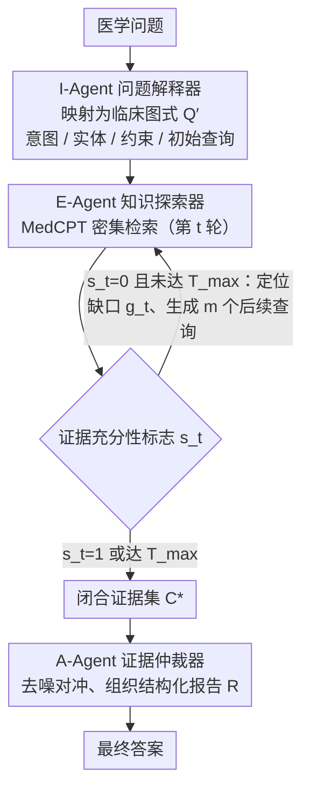

<!-- 由 src/gen_stubs.py 自动生成 -->
# SEMA-RAG: A Self-Evolving Multi-Agent Retrieval-Augmented Generation Framework for Medical Reasoning

**会议**: ACL 2026 Findings  
**arXiv**: [2605.17101](https://arxiv.org/abs/2605.17101)  
**代码**: 无  
**领域**: 医疗NLP
**关键词**: 医学问答, 多智能体RAG, 自演化检索, 证据链构建, 临床推理

## 一句话总结
提出 SEMA-RAG，一种自演化多智能体 RAG 框架，通过三个专职智能体（解释器、探索器、仲裁器）模拟临床推理的分阶段工作流，在 5 个医学 QA 基准上平均超越最强基线 +6.46 个准确率点。

## 研究背景与动机
**领域现状**: RAG 被广泛用于缓解医学问答中 LLM 的幻觉和知识过时问题，但现有 RAG 主要采用单轮静态检索范式。

**现有痛点**: (1) 问题到查询的转换缺乏临床语义解读，隐含约束难以显式化；(2) 检索缺乏充分性反馈机制，难以形成可靠的证据链；(3) 将解释、探索、裁决三种异质任务耦合在单一推理链中，认知负荷过高。

**核心矛盾**: 单轮静态 RAG 相当于要求临床医生在收到初始病历后立即同时分析、检索、评估和诊断，无法随新证据调整推理——与多阶段临床推理过程严重错配。

**本文目标**: 重构 RAG 工作流以匹配临床分阶段推理：将单轮查询扩展为多轮迭代探索，每轮检索后评估证据充分性并决定下一步行动。

**切入角度**: 任务解耦 + 角色专业化——将解释、探索、裁决分配给三个专职智能体协作完成。

**核心 idea**: 三智能体分工（I-Agent 解释 → E-Agent 充分性驱动的自演化检索 → A-Agent 证据仲裁），通过闭环证据链构建提升医学 RAG 可靠性。

## 方法详解

### 整体框架
SEMA-RAG 由三个角色智能体组成，共享同一底层 LLM，仅通过角色提示区分：(1) I-Agent 将原始问题映射为结构化临床图式；(2) E-Agent 基于证据充分性驱动的自演化检索循环逐轮积累证据；(3) A-Agent 对收敛证据集进行仲裁并输出最终答案。

### 关键设计

**1. I-Agent（问题解释器）：先把题目读成结构化临床图式，再去检索**

医学问题里的关键约束常常是隐含的——"住院第 7 天"暗示的是院内感染，直接拿原句去检索很容易把这层语义漏掉。I-Agent 的职责就是把非结构化问题映射成一个图式元组 $Q' = \langle o_{\text{int}}, o_{\text{ent}}, o_{\text{cons}}, q_{\text{init}} \rangle$，分别对应临床意图、医学实体、临床约束和初始检索查询，再线性化拼接成检索入口。把隐含约束显式写出来，后面几轮检索才有明确的对齐目标，而不是在原始问句的模糊语义上打转。

**2. E-Agent（知识探索器）：用证据充分性驱动多轮自演化检索，凑齐证据再停**

单轮静态检索没法保证覆盖所有关键约束，相当于逼临床医生看完初始病历就立刻下诊断。E-Agent 把检索做成闭环：每轮检索（用 MedCPT 做密集检索）之后评估一个充分性标志 $s_t \in \{0,1\}$；若 $s_t=0$ 说明证据不足，就定位证据缺口 $g_t$，据此生成 $m$ 个针对性的后续查询 $\mathcal{Q}_{t+1}$ 进入下一轮；直到 $s_t=1$ 或触及上限 $T_{\max}$ 才终止，沉淀出闭合证据集 $C^*$。

这个"缺口识别 → 定向补检"的早停机制是框架的核心增益来源——消融里去掉 E-Agent 在 MedQA-US 上掉了 6.37，是三个 agent 里最大的。它也比固定轮次迭代更省：用更少 token 就把证据凑齐，而不是无脑跑满预算还可能引入噪声。

**3. A-Agent（证据仲裁器）：对收敛证据做去噪、对冲，输出可追溯的判断**

多轮检索攒下来的证据往往冗余甚至互相矛盾，直接喂给模型答题反而干扰判断。A-Agent 专门做仲裁：从证据集里去重去噪，识别一致与冲突，把支持/反驳线索组织成结构化报告 $R$，再基于报告做离散答案选择 $\tilde{y} = \text{Agent}_A(\text{Pmt}_{\text{ans}}, [Q, R])$。把"整合证据"单独拆成一个角色，模型才有一个稳定的判断基础，而不是在矛盾证据里随机摇摆。

### 一个完整示例：一道"住院第 7 天发热"的题怎么走完三个 agent

以一道隐含院内感染线索的题为例：I-Agent 先把它解析成图式——意图是"鉴别诊断"、实体是"发热 + 住院第 7 天"、约束显式写成"院内（nosocomial）场景"，并据此生成初始查询 $q_{\text{init}}$。E-Agent 第 1 轮检索回来后判定 $s_1=0$：证据只覆盖了社区获得性感染，缺口 $g_1$ 是"院内病原谱与导管相关感染"，于是生成 $m=3$ 个后续查询补检；第 2 轮拿到针对性证据后 $s_2=1$，在 $T_{\max}=2$ 轮内收敛出证据集 $C^*$。A-Agent 再把这批证据去重、对冲掉社区感染的干扰项，组织成报告 $R$ 后选出答案。整套流程平均 4.8 次 LLM 调用、3.4 次检索、9.5s 延迟，token 消耗 19488——比 i-MedRAG 的固定 3 轮（21517 token）更省，准确率却高出 15.17%。

### 损失函数 / 训练策略
- 无需训练：三个智能体共享底层 LLM，仅通过角色提示区分
- 默认超参：$T_{\max}=2$，$k=16$（Top-k 检索），$m=3$（每轮后续查询数）
- I/E-Agent 温度设为 1.0，A-Agent 温度设为 0.0（确定性输出）

## 实验关键数据

### 主实验（5 个基准 × 5 个 LLM 骨干，准确率 %）

| 方法 | MMLU-Med | MedQA-US | MedMCQA | PubMedQA* | BioASQ | 平均 |
|------|---------|---------|--------|----------|--------|------|
| deepseek-v3.1 + CoT | 88.15 | 77.53 | 71.69 | 38.40 | 80.10 | 71.17 |
| deepseek-v3.1 + MedRAG | 88.61 | 77.14 | 67.99 | 44.60 | 78.48 | 71.36 |
| deepseek-v3.1 + i-MedRAG | 85.86 | 74.78 | 65.65 | 50.60 | 80.58 | 71.49 |
| **deepseek-v3.1 + SEMA-RAG** | **91.46** | **89.95** | **75.09** | **59.20** | **82.85** | **79.71** |
| gemini-2.0-flash + CoT | 58.22 | 65.12 | 41.33 | 40.20 | 68.45 | 54.66 |
| **gemini-2.0-flash + SEMA-RAG** | **80.99** | **90.42** | **71.60** | **59.20** | **88.19** | **78.08** |

### 消融实验（deepseek-v3.1，MedQA-US / PubMedQA*）

| 配置 | MedQA-US | PubMedQA* |
|------|---------|----------|
| w/o I-Agent | 85.47 | 54.20 |
| w/o E-Agent | 83.58 | 50.80 |
| w/o A-Agent | 86.49 | 53.60 |
| **完整 SEMA-RAG** | **89.95** | **59.20** |

### 关键发现
- 去除 E-Agent 导致最大性能下降（MedQA-US 下降 6.37），证实自演化检索是核心增益来源
- 查询宽度 $m$ 的消融：$m=1$ → 86.72%，$m=2$ → 89.00%，$m=3$ → 89.95%，收益递减
- 探索深度 $T_{\max}$ 在 2-3 轮时性能最佳，超过后可能引入噪声
- 效率对比：SEMA-RAG 平均 4.8 次 LLM 调用 / 3.4 次检索 / 9.5s 延迟，token 消耗 19488（vs i-MedRAG 的 21517），但准确率高出 15.17%

## 亮点与洞察
- 三智能体架构精确模拟临床推理的分阶段工作流（解释→探索→裁决），任务解耦思想具有普适性
- 充分性驱动的早停机制比固定轮次迭代（如 i-MedRAG 的 3 轮）更高效——用更少 token 达到更高准确率
- 在 gemini-2.0-flash 上提升最为显著（平均 +23.42），说明框架对较弱模型的增强效果更强
- 案例分析生动展示了如何通过结构化解释 → 缺口识别 → 定向检索形成可靠证据链

## 局限与展望
- 评估局限于基准测试环境，未在真实临床工作流（如纵向 EHR 推理）中验证
- 框架依赖检索语料库的质量和覆盖范围：关键证据缺失或过时时，自演化循环仍可能收敛到不完整证据
- 充分性判断标准尚未针对选项级可分离性或生成式完备性优化
- 多轮推理的额外开销虽优于固定步骤基线，但仍高于单轮方法

## 相关工作与启发
- MedRAG / MedCPT 提供了医学领域的检索基础，SEMA-RAG 在其上构建多轮闭环
- i-MedRAG 开创了迭代医学 RAG 但缺乏充分性反馈，SEMA-RAG 的自演化机制是关键改进
- 多智能体协作（CAMEL / MetaGPT / MedAgents）思想可推广到其他需要多阶段推理的高风险领域
- 自演化检索的 gap detection + targeted follow-up 模式可启发非医学领域的复杂 RAG 系统设计

## 评分
- 新颖性: ⭐⭐⭐⭐ 任务解耦 + 充分性驱动的自演化检索是清晰的创新点
- 实验充分度: ⭐⭐⭐⭐⭐ 5 个基准 × 5 个 LLM 骨干 × 完整消融 + 效率分析 + 案例研究
- 写作质量: ⭐⭐⭐⭐ 公式化表述严谨，临床推理类比直观
- 价值: ⭐⭐⭐⭐⭐ 在医学 QA 上取得显著且一致的提升，框架思想具有广泛适用性

<!-- RELATED:START -->

## 相关论文

- [\[ACL 2026\] HeteroRAG: A Heterogeneous Retrieval-Augmented Generation Framework for Medical Vision Language Tasks](heterorag_a_heterogeneous_retrieval-augmented_generation_framework_for_medical_v.md)
- [\[ACL 2026\] MultiDx: A Multi-Source Knowledge Integration Framework towards Diagnostic Reasoning](multidx_a_multi-source_knowledge_integration_framework_towards_diagnostic_reason.md)
- [\[ACL 2026\] MARCH: Multi-Agent Radiology Clinical Hierarchy for CT Report Generation](march_multi-agent_radiology_clinical_hierarchy_for_ct_report_generation.md)
- [\[ACL 2025\] Towards Omni-RAG: Comprehensive Retrieval-Augmented Generation for Large Language Models in Medical Applications](../../ACL2025/medical_nlp/omni_rag_medical.md)
- [\[ACL 2026\] RA-RRG: Multimodal Retrieval-Augmented Radiology Report Generation with Key Phrase Extraction](ra-rrg_multimodal_retrieval-augmented_radiology_report_generation_with_key_phras.md)

<!-- RELATED:END -->
