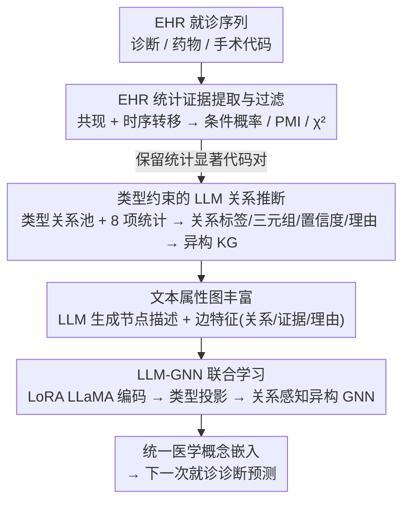

# Text-Attributed Knowledge Graph Enrichment with Large Language Models for Medical Concept Representation

**会议**: ACL 2026  
**arXiv**: [2604.13331](https://arxiv.org/abs/2604.13331)  
**代码**: 无  
**领域**: 医疗NLP
**关键词**: 医学概念表示, 知识图谱, LLM-GNN联合学习, 电子健康记录, 文本属性图

## 一句话总结

本文提出 CoMed，一种 LLM 赋能的图学习框架，通过结合 EHR 统计证据和类型约束 LLM 推理构建全局医学知识图谱，再用 LLM 生成节点描述和边理由丰富为文本属性图，最终联合训练 LoRA 微调的 LLaMA 编码器和异构 GNN 学习统一的医学概念嵌入，在 MIMIC-III/IV 上显著提升诊断预测性能。

## 研究背景与动机

**领域现状**：EHR 挖掘中学习高质量的医学概念表示（诊断/药物/手术代码的嵌入）是临床预测的基础。现有方法主要利用医学本体的层级结构（如 ICD 的父子关系）或有限的跨类型语义（如 UMLS）来构建知识图谱指导表示学习。

**现有痛点**：(1) 现有本体中跨类型依赖关系（如诊断-药物治疗关系、药物-手术关联）大量缺失或不完整；(2) 丰富的临床语义通常以文本形式存在但难以与 KG 结构集成；(3) 无约束的 LLM 提示可能产生看似合理但无支撑的边，且输出不一致。

**核心矛盾**：LLM 编码了广泛的生物医学知识，但用于临床建模的 KG 推断必须保持证据基础、类型感知和全局一致性——需要在 LLM 的语义丰富性与 EHR 的实证支撑之间取得平衡。

**本文目标**：构建一个临床可解释且有实证支撑的异构 KG，并学习融合文本语义和图结构的统一医学概念嵌入。

**切入角度**：先从 EHR 中提取统计显著的代码对作为候选关系，再用 LLM 在类型约束和证据条件下推断语义关系类型——"统计过滤 + LLM 推断"的双保险策略。

**核心 idea**：EHR 统计证据提供实证基础，LLM 提供语义解释和关系类型——两者互补构建 KG，然后通过 LLM-GNN 联合学习融合文本和结构信息。

## 方法详解

### 整体框架

CoMed 分四步：(1) 从 EHR 中提取共现和时序转移统计，保留统计显著的代码对；(2) 用类型约束的 LLM 提示为每对代码推断有向关系类型、置信度和理由；(3) 用 LLM 生成节点描述和边特征把 KG 丰富成文本属性图（text-attributed graph）；(4) 联合训练 LoRA 微调 LLaMA-1B 编码器和异构 GNN 学习概念嵌入。

### 关键设计

**1. EHR 统计证据提取与过滤：先从数据里挖出有实证支撑的候选关系**

纯靠 LLM 推断关系容易幻觉出"看似合理但无支撑"的边，所以 CoMed 让数据先开口。它对每对代码计算三种统计量——平滑后的条件概率、PMI 关联度，以及卡方独立性检验的 p 值，并同时在两种设置下统计：同一次住院内的共现，以及跨次就诊的时序转移。低支持度、低关联、非显著（$p>0.05$）的代码对直接过滤掉。

这一步的意义在于把候选边的标准从"临床上说得通"收紧到"在本数据集里确实被观测到"，等于给后续 LLM 推断划定了一个有实证地基的候选池，而不是让模型在整个生物医学知识空间里自由发挥。

**2. 类型约束的 LLM 关系推断：让 LLM 在类型和证据双重约束下给关系定性**

光有统计共现还不知道两个代码到底是什么关系，但放开手让 LLM 推断又会冒出"诊断治疗诊断"这种语义不通的边。CoMed 为每种代码类型组合（dx-dx、rx-dx、px-dx 等）预先定义候选关系池（causes、treats、diagnostic_of 等），再用结构化 prompt 把代码标识、频率、8 项统计指标连同指标说明一起喂给 LLM，让它返回关系标签、有向三元组、置信度分数和一段 50–60 词的临床推理。

类型约束挡住了语义不合理的关系，证据条件则逼 LLM 把临床知识和统计信号一起综合，而不是凭空联想。临床专家对随机抽取的 50 条边打出平均 4.84/5 的评分，说明这套"统计过滤 + 类型约束推断"的双保险确实产出了高质量、可解释的边。

**3. 文本属性图丰富：把符号化的 KG 升级成带临床语义的图，才喂得动下游图学习**

到这一步的 KG 只有"代码节点 + 关系类型"的骨架，GNN 在上面做消息传递时读不到任何临床语义，这也是论文标题"文本属性知识图谱丰富"要解决的核心问题。CoMed 用 LLM 当作高覆盖的医学知识库，把 KG 丰富成文本属性图（text-attributed graph）：节点侧，对每个诊断/药物/手术代码用类型特定 prompt 生成一段聚焦临床的描述（典型表现、适应症、在诊疗中的角色与关键注意点），挂为节点的文本属性；边侧，把上一步得到的关系标签、置信度、自由文本理由，连同 8 项 EHR 统计指标一起拼成边特征向量。

这一步是连接"符号化 KG"和"语义编码"的桥梁——没有节点描述，后面的 LLaMA 编码器就没有可读的文本输入；没有边特征，GNN 在消息传递时也用不上边上的关系类型和实证信号。正是它让 KG 同时具备了"图的关系表达力"和"LLM 的语义丰富性"。

**4. LLM-GNN 联合学习（CoMed）：让文本语义和图结构在训练里互相补位**

GNN 擅长在图上聚合结构信息，却读不懂长文本描述；LLM 能编码丰富语义，却用不上全局的关系约束——两者各有盲区。CoMed 把它们端到端拼起来：LoRA 微调的 LLaMA-1B 编码节点描述得到文本嵌入，经类型特定的线性投影映射到 GNN 空间，异构 GNN 再在 KG 上做关系感知的消息传递，输出最终概念嵌入。

训练里还有一个针对医学代码长尾分布的细节：两阶段 LoRA 更新调度。早期走"最少更新优先"保证覆盖面，后期再混合低频和高频代码，解决 mini-batch 训练中罕见代码更新不足的问题。这也是消融里罕见诊断标签（0–25% 频率）能从 40.60 提升到 47.67（+7.07）的关键——KG 关系让罕见概念得以借用关联概念的信息。

### 损失函数 / 训练策略

使用多标签交叉熵损失训练下一次就诊诊断预测任务。CoMed 作为即插即用的概念编码器集成到标准 EHR 模型中端到端训练。

## 实验关键数据

### 主实验

**MIMIC-III 诊断预测性能对比**

| 方法 | AUPRC | F1 | Acc@15 |
|------|-------|-----|--------|
| Base Transformer | 41.00 | 33.16 | 47.20 |
| GRAM | 41.70 | 34.60 | 48.60 |
| LINKO | 44.91 | 38.20 | 52.30 |
| GraphCare | 43.35 | 35.46 | 52.76 |
| **CoMed** | **47.21** | **42.28** | **54.20** |

### 消融实验

**即插即用分析（CoMed 集成到不同 backbone）**

| Backbone | 无 CoMed | 有 CoMed | 提升 |
|----------|---------|---------|------|
| Transformer | 41.00 | 47.21 | +6.21 |
| RETAIN | ~40 | ~46 | +6 |
| GRAM | 41.70 | ~47 | +5 |

### 关键发现

- CoMed 在 MIMIC-III 上 AUPRC 从 41.00 提升到 47.21（+6.21），在所有 baseline 中排名第一
- 对罕见诊断标签（0-25% 频率）提升尤为显著——从 40.60 到 47.67（+7.07），因为 KG 关系帮助罕见概念借用关联概念的信息
- CoMed 作为即插即用概念编码器在多个 backbone 上都一致提升
- 临床专家对 LLM 推断边的评分 4.84±0.29/5，验证了 KG 的临床有效性
- MIMIC-IV 上同样有一致提升，证明跨数据集泛化性

## 亮点与洞察

- "统计过滤 + LLM 推断"的双保险 KG 构建策略确保了关系的实证支撑和语义合理性的双重保障
- 两阶段 LoRA 更新调度巧妙解决了医学代码长尾分布导致的训练不均衡问题
- 对罕见诊断的大幅提升具有重要临床意义——罕见疾病往往是最难预测也最需要关注的

## 局限与展望

- LLM 生成的节点描述和关系推理可能包含细微的幻觉或偏差
- 仅在诊断预测任务上评估，未验证在药物推荐、再入院预测等任务上的效果
- KG 构建依赖目标数据集的统计量，不同医院的 EHR 可能产生不同的 KG
- LLaMA-1B 的文本编码能力有限，更大的 LLM 可能带来更好的嵌入

## 相关工作与启发

- **vs GRAM**: GRAM 仅用 ICD 层级结构，CoMed 引入跨类型关系和文本语义——AUPRC +5.51
- **vs GraphCare**: 后者用外部医学 KG 但不与 EHR 数据对齐，CoMed 通过统计过滤确保实证支撑
- **vs LINKO**: 后者用链接预测构建 KG 但不融合文本语义，CoMed 的 LLM-GNN 联合学习更全面

## 评分

- 新颖性: ⭐⭐⭐⭐ EHR 统计 + LLM 推断的 KG 构建思路和 LLM-GNN 联合学习框架新颖
- 实验充分度: ⭐⭐⭐⭐⭐ MIMIC-III/IV × 多 baseline + 即插即用分析 + 临床专家验证
- 写作质量: ⭐⭐⭐⭐ 方法流程清晰，每步设计有明确动机
- 价值: ⭐⭐⭐⭐⭐ 即插即用概念编码器对 EHR 研究社区价值高

<!-- RELATED:START -->

## 相关论文

- [\[ACL 2026\] MHGraphBench: Knowledge Graph-Grounded Benchmarking of Mental Health Knowledge in Large Language Models](mhgraphbench_knowledge_graph-grounded_benchmarking_of_mental_health_knowledge_in.md)
- [\[ACL 2026\] Beyond the Leaderboard: Rethinking Medical Benchmarks for Large Language Models](beyond_the_leaderboard_rethinking_medical_benchmarks_for_large_language_models.md)
- [\[ACL 2026\] RePrompT: Recurrent Prompt Tuning for Integrating Structured EHR Encoders with Large Language Models](reprompt_recurrent_prompt_tuning_for_integrating_structured_ehr_encoders_with_la.md)
- [\[ACL 2026\] Region-Grounded Report Generation for 3D Medical Imaging: A Fine-Grained Dataset and Graph-Enhanced Framework](region-grounded_report_generation_for_3d_medical_imaging_a_fine-grained_dataset_.md)
- [\[ACL 2026\] MedFact: Benchmarking the Fact-Checking Capabilities of Large Language Models on Chinese Medical Texts](medfact_benchmarking_the_fact-checking_capabilities_of_large_language_models_on_.md)

<!-- RELATED:END -->
