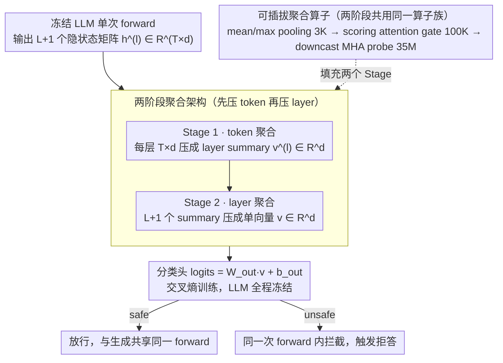

# A BERTology View of LLM Orchestrations: Token- and Layer-Selective Probes for Efficient Single-Pass Classification

**会议**: ACL 2026  
**arXiv**: [2601.13288](https://arxiv.org/abs/2601.13288)  
**代码**: 无公开仓库  
**领域**: 模型压缩 / LLM 效率  
**关键词**: probing, 隐状态复用, 安全分类, 单次前向, BERTology

## 一句话总结
把 production LLM 的 token×layer 隐状态张量当成可挖掘资源，用「先压 token、再压 layer」的两阶段聚合 probe 在同一次 forward 里完成安全/情感分类，35M 可训练参数即可逼近独立 guard 模型，省掉一次额外的 LLM 调用。

## 研究背景与动机
**领域现状**：生产环境下的 LLM 服务通常不是单模型，而是「serving LLM + 一堆辅助分类器（safety / policy / jailbreak / retrieval filter）」的编排架构。每个辅助模型都要单独训练、部署，并在每次请求时额外跑一遍前向，显存和延迟都成倍上升。

**现有痛点**：复用 serving LLM 计算的两类方法（如 MULI 用 first-token logits、ShieldHead 用最后一层 hidden state、OmniGuard 用某固定层）都把「读出位置」写死，只挑一个 token 或一层。但 BERTology 研究反复证明 transformer 各层编码不同抽象（低层句法、高层语义），把读出位置固定就是浪费了分布在深度上的信号。

**核心矛盾**：信息是分布式存在于整个 $L \times T \times d$ 隐状态张量里的，而 logit-only 或 single-layer probe 等于先把张量降到 1D 再做分类，这一步压缩就把判别信号丢掉了。

**本文目标**：把 moderation/NLU 分类问题重新形式化为「在整个 token×layer 张量上的表征选择问题」，让 probe 自己学出哪些 token、哪些 layer 最判别。

**切入角度**：把 LLM 当作冻结的特征提取器，在它的 forward 内部「捎带」做分类，所以分类和生成共享同一次 KV/注意力计算，几乎不增加延迟。

**核心 idea**：「两阶段聚合 = 先 token-level 内聚成 layer 摘要，再 layer-level 内聚成单向量」，用同一个聚合算子族（pooling / scoring gate / MHA）插在两个阶段，参数量从 3K 到 35M 可调。

## 方法详解

### 整体框架
给定冻结的 decoder-only LLM，输入 prompt 经 $T$ 个 token 后产生 $L+1$ 个隐状态矩阵 $\mathbf{h}^{(l)} \in \mathbb{R}^{T \times d}$（含 embedding 层）。Probe $C_\theta$ 的流水线是：

1. **Stage 1 (token agg)**：对每一层 $l$，用算子 $\mathcal{A}^{(l)}_\text{token}$ 把 $T \times d$ 压成 $\mathbf{v}^{(l)} \in \mathbb{R}^d$，得到 $L+1$ 个 layer summary。
2. **Stage 2 (layer agg)**：用 $\mathcal{A}_\text{layer}$ 把 $L+1$ 个 summary 再压成单个 $\mathbf{v} \in \mathbb{R}^d$。
3. **分类头**：$\text{logits} = \mathbf{W}_\text{out} \mathbf{v} + \mathbf{b}_\text{out}$，交叉熵训练，LLM 全程冻结。

推理时分类与生成共享同一次 forward；若被判为 unsafe，编排层可在任何 token 流出前直接拦截，再调用 serving LLM 生成 contextual 拒答（无需额外调一次模型）。

### 关键设计

**1. 两阶段聚合架构：把三维张量拆成两步一维 reduce，绕开参数爆炸**

如果直接把 $L \times T \times d$ 的隐状态张量喂给一个轻量分类器，光是这个三维输入到类别的映射就要上百万参数，长 prompt 下 $T$ 一大更扛不住。本文的做法是把读出拆成两段串联的一维汇总：第一段（Stage 1）在每层内部沿 token 维把 $T \times d$ 压成一个 layer summary $\mathbf{v}^{(l)} \in \mathbb{R}^d$，第二段（Stage 2）再在 $L+1$ 个 summary 之间汇总成单向量 $\mathbf{v}$。两段复用同一算子族，架构上保持统一。

关键在于 Stage 2 的 layer-level 聚合本质上是让模型自己学一组 task-specific 的层权重 $\alpha_l$，等于把 BERTology「不同层编码不同抽象」的直觉变成了一个可学习的「软层选择」——既保留了分布在深度上的判别信号，又因为先压 token 再压 layer，参数量从 $O(T \cdot L \cdot d)$ 降到 $O(L \cdot d)$，对长 prompt 天然可扩展。

**2. Scoring attention gate：用一条线性打分代替 softmax-attention，100K 参数买到 task-aware 选择能力**

mean/max pooling 太钝，对所有 token / layer 一视同仁，丢掉了「哪些位置更判别」的信息；而上完整的 attention 又太贵。Scoring gate 取中间路线：对每个 token / layer 向量 $\mathbf{X}[i, :]$ 只算一个标量重要性分数 $s_i = \tanh(\mathbf{w}^\top \mathbf{X}[i, :])$，padding 位置置 $-\infty$，softmax 归一化后得权重 $\alpha_i$，输出 $\mathbf{v} = \sum_i \alpha_i \mathbf{X}[i, :]$。Stage 1 每层用一个独立 gate，Stage 2 共享一个 gate，总参数仅 $(L+2)d$。

这一条线性投影比 MHA 少两到三个数量级的参数，却比 pooling 多了「按任务挑重点」的能力，正好卡在 expressive 与 cost 的甜蜜点上——实验里它只用 ~100K 参数就把 F1 拉到比 logit-only 的 MULI 高约 3 个点。

**3. Downcast MHA probe：用多头自注意力顶满表达力上限，再靠激进降采样把参数压到 35M**

scoring gate 是对每个位置独立打分，捕捉不到 token 之间、layer 之间的交互关系，表达力到顶了。MHA probe 用多头自注意力补上这一点，但代价是参数会暴涨，于是把 QKV 投影维度从 $d$ 激进降采样到 $d_\text{inner} \in \{d/16, d/32\}$ 再分 $H$ 个头，单头算 $\text{Attn}_h(\mathbf{Q}_h, \mathbf{K}_h, \mathbf{V}_h) = \text{softmax}(\mathbf{Q}_h \mathbf{K}_h^\top / \sqrt{d_\text{head}}) \mathbf{V}_h$，拼回 $d$ 维后再做 mean/max pool。两阶段共 $L+2$ 个 MHA 模块，总参数 $(L+2) \cdot 4 d \cdot d_\text{inner}$，约 35M，底层调 PyTorch `scaled_dot_product_attention` 直接吃 FlashAttention 的优化。

这 35M 既是 probe 的表达力上限，也仍比一个数 billion 参数的独立 guard model 小一个数量级——实验里它在 ToxicChat 上以 22 倍参数效率追平了 780M 的独立 T5 分类器。

### 损失函数 / 训练策略
LLM 参数全程冻结，仅训练 probe 头 $\theta$；目标函数为标准 cross-entropy。所有 backbone（Llama-3.2-3B-Instruct、GPT-OSS-20B、Qwen3-30B-A3B）共享同一架构模板，独立训练各自的 probe。

## 实验关键数据

### 主实验：ToxicChat 安全分类（F1 / AUPRC，括号数字为 added params M）

| Backbone | 方法 | F1 (%) | AUPRC | 额外参数 (M) | 是否需额外 LM 调用 |
|----------|------|--------|-------|-------------|-----|
| - | ToxicChat-T5-large (独立分类器) | 82.2 | 0.885 | 780 | 是 |
| - | MULI (logit-only reuse) | 77.8 | 0.829 | 0.13 | 否 |
| Llama-3.2-3B | Direct pooling | 73.53 ± 0.68 | 0.812 | 0.003 | 否 |
| Llama-3.2-3B | Scoring attention | 80.49 ± 1.17 | 0.854 | 0.10 | 否 |
| Llama-3.2-3B | **Multi-head self-attn** | **84.51 ± 0.43** | **0.898** | 35 | 否 |
| GPT-OSS-20B | Multi-head self-attn | 86.17 ± 0.51 | 0.915 | 27 | 否 |
| Qwen3-30B-A3B | Multi-head self-attn | 83.76 ± 0.9 | — | — | 否 |

MHA probe 在所有三个 backbone 上都超过 MULI (+6 F1+)，并以 ~35M 参数追平 780M 独立 T5 模型的 F1，是 22 倍参数效率。

### 消融：聚合算子家族

| 配置 | F1 (Llama-3.2-3B) | 参数量 (M) | 说明 |
|------|-------------------|------------|------|
| Direct pooling (mean/max) | 73.53 | 0.003 | 无 learnable，仅作为 baseline |
| Scoring attention gate | 80.49 | 0.10 | 加 token/layer 重要性打分，+7 F1 |
| Multi-head self-attn (downcast) | 84.51 | 35 | 完整表达力上限，再 +4 F1 |
| w/o layer 聚合（仅最后一层） | 接近 ShieldHead 基线 | — | 损失分布式信号 |
| w/o token 聚合（仅 first-token） | 接近 MULI | — | 损失 token 维度信息 |

### 关键发现
- 三种算子在 3 个 backbone 上排序一致（pooling < scoring < MHA），说明「token+layer 联合读出」的收益是架构无关的，不是 Llama 的偶然性质。
- MHA probe 在 GPT-OSS-20B 上 F1 反而更高（86.17 vs 84.51），印证「大模型 hidden state 包含更多信号」的假设，能被 probe 提取出来。
- 35M 参数的 MHA probe 已接近独立 780M T5 分类器（差 ~0.01 AUPRC），但省了一次额外 LM call，端到端延迟接近纯生成的服务延迟。
- Scoring attention gate 是性能/参数 trade-off 甜点，仅 100K 参数即在 F1 上比 MULI 高 ~3 个点。

## 亮点与洞察
- **「BERTology meets production」是个被忽视的切入角度**：把十年前对 transformer 各层抽象层级的研究直接搬到 deployment 场景，重新提示「不要随便挑一层做读出」。这种 retrofit 性质的方法对已经上线的 LLM 服务尤其有价值，不需要重新对齐模型。
- **两阶段分解避免维度乘爆炸**：直接学一个 $T \cdot L \cdot d \to C$ 的分类器会有上百万参数，两阶段先压一个维度再压另一个，参数从 $O(TLd)$ 降到 $O(L \cdot d)$，可迁移到其他 hidden-state probing 任务（如事实检测、毒性归因）。
- **「same forward pass」是端到端 latency 的关键卖点**：很多 reuse-computation 工作都强调参数效率，但忽略了多调一次 LLM 的延迟成本；本文把 probe 物理上接到生成 forward 上，做到真正的零额外推理 cost。
- **可推广到 MoE 架构**：在 GPT-OSS-20B（MoE）和 Qwen3-30B-A3B（A3B 激活）上验证有效，说明读出 hidden state 的思路与具体路由策略无关。

## 局限与展望
- 实验主要在英文安全/情感任务上做，没有覆盖多语言或更复杂的多标签 policy 分类。
- Probe 训练数据需要带标签（与 standalone classifier 同样的标注成本），论文省的只是部署侧的额外 LM call，不是标注成本。
- 35M 参数的 MHA probe 虽然比 guard model 小很多，但仍需要把所有 $L+1$ 层的 hidden state 保留在内存中做聚合，KV cache 之外多了一份 $O(LT d)$ 显存压力，在超长上下文下不平凡。
- 没有讨论对抗鲁棒性：如果攻击者知道 probe 接在 hidden state 上，能否通过 prompt 微扰精确攻击某一层 token 让 probe 失效？是 future work。
- 未来可探索 probe 与 router 联合训练（让 MoE 也学着把判别信号往 probe 选中的层 / token 上聚）。

## 相关工作与启发
- **vs MULI (logit-only)**: MULI 在 first-token logits 上训稀疏分类器，参数仅 0.13M 但只读最后一层 + 一个位置；本文用 35M 参数读全张量，F1 +7 个点。代价是参数多 250 倍，但仍比独立 guard 小一个数量级。
- **vs ShieldHead / OmniGuard (single-layer probe)**: 它们固定读最后一层 hidden state；本文把「读哪一层」也学出来，layer-level scoring gate 充当 soft layer selector，避免了人为挑选层的偏差。
- **vs Standalone guard (Llama-Guard / ToxicChat-T5)**: Guard models 是独立 LLM，需要单独 forward 一遍（额外秒级延迟、数 GB VRAM）；本文 probe 是「免费」的，几乎不动用额外计算资源。
- **vs EAGLE-3 (多层 feature fusion for speculative decoding)**: EAGLE-3 也证明融合多层比仅用 top layer 强，但在草稿生成任务；本文把这个思路扩到分类任务，验证了多层融合的普适性。

## 评分
- 新颖性: ⭐⭐⭐⭐ 把 BERTology 与 production LLM 编排结合，思路自然但角度新；两阶段聚合架构是干净的 contribution。
- 实验充分度: ⭐⭐⭐⭐ 三个 backbone + dense/MoE 架构 + 安全/情感两类任务，覆盖较全；缺多语言和对抗鲁棒。
- 写作质量: ⭐⭐⭐⭐ 动机推导清晰（BERTology → representation selection → 两阶段聚合），公式与表格组织规范。
- 价值: ⭐⭐⭐⭐ 对 LLM serving 工程实践有直接价值，省一次额外调用就能上线，落地门槛低。

<!-- RELATED:START -->

## 相关论文

- [\[ACL 2026\] Adaptive Layer Selection for Layer-Wise Token Pruning in LLM Inference](adaptive_layer_selection_for_layer-wise_token_pruning_in_llm_inference.md)
- [\[ICLR 2026\] A Fano-Style Accuracy Upper Bound for LLM Single-Pass Reasoning in Multi-Hop QA](../../ICLR2026/model_compression/a_fano-style_accuracy_upper_bound_for_llm_single-pass_reasoning_in_multi-hop_qa.md)
- [\[CVPR 2026\] SelecTKD: Selective Token-Weighted Knowledge Distillation for LLMs](../../CVPR2026/model_compression/selectkd_selective_token-weighted_knowledge_distillation_for_llms.md)
- [\[NeurIPS 2025\] Single-Teacher View Augmentation: Boosting Knowledge Distillation via Angular Diversity](../../NeurIPS2025/model_compression/single-teacher_view_augmentation_boosting_knowledge_distillation_via_angular_div.md)
- [\[CVPR 2026\] One Layer's Trash is Another Layer's Treasure: Adaptive Layer-wise Visual Token Selection in LVLMs](../../CVPR2026/model_compression/one_layers_trash_is_another_layers_treasure_adaptive_layer-wise_visual_token_sel.md)

<!-- RELATED:END -->
