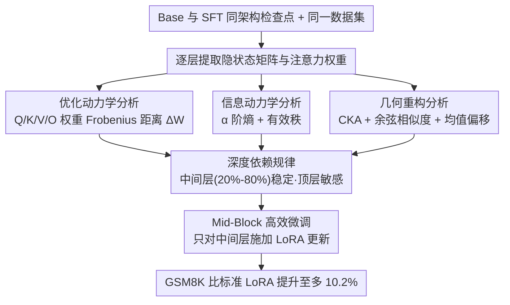

# A Layer-wise Analysis of Supervised Fine-Tuning

**会议**: ACL 2026  
**arXiv**: [2604.11838](https://arxiv.org/abs/2604.11838)  
**代码**: [GitHub](https://github.com/lshowway/base)  
**领域**: 模型压缩  
**关键词**: 监督微调, 逐层分析, 参数高效微调, 灾难性遗忘, LoRA

## 一句话总结
通过信息论、几何和优化三个视角对 1B-32B 模型的 SFT 进行逐层分析，发现指令跟随能力集中在中间层（20%-80%），而非均匀分布，据此提出 Mid-Block Efficient Tuning 策略，选择性更新中间层，在 GSM8K 上比标准 LoRA 提升高达 10.2%。

## 研究背景与动机

**领域现状**：监督微调（SFT）是将 LLM 对齐到人类意图的基石方法。研究表明仅需约 1000 条精选样本就能将基础模型转化为指令跟随 agent。现有研究已经揭示 SFT 主要是重新校准注意力模式和调整风格化 token 分布，本质上是一种"表面层"适应。

**现有痛点**：当前参数高效微调方法（如 LoRA）在所有层上均匀应用更新，隐含假设所有层对对齐贡献相同。但这一假设是次优的——不同层可能有完全不同的功能角色。更关键的是，均匀更新可能将参数预算浪费在不敏感的层上，同时导致敏感层更新不充分。

**核心矛盾**：我们知道 SFT 期间"什么在变"（注意力模式、token 分布），但不知道"哪里在变"——这些变化在模型深度上的分布是怎样的？哪些层对指令跟随能力是关键的？

**本文目标**：(1) 系统性地揭示 SFT 引起的逐层变化模式；(2) 识别对任务适应最关键的层区间；(3) 基于分析洞察提出更高效的微调策略。

**切入角度**：综合使用信息论指标（熵、有效秩）、几何指标（CKA、余弦相似度）和优化指标（权重变化量），跨 1B-32B 模型规模进行系统性的层级剖析。

**核心 idea**：SFT 的有效对齐是"架构局部化"的而非均匀分布的——中间层（20%-80%）是知识整合的稳定基底，顶层是灾难性遗忘的主要源头，因此应集中更新中间层。

## 方法详解

### 整体框架
构建 Base 模型和 SFT 模型的逐层表征分析管道：给定同一架构的 Base 和 SFT 检查点，对同一数据集提取每层的隐状态矩阵与注意力权重，然后分别从优化动力学、信息动力学、几何重构三个角度量化层间差异。三个视角汇合出一致的「中间层（20%-80%）稳定、顶层敏感」规律，并据此落地出 Mid-Block 高效微调策略——只对中间层施加 LoRA 更新。

### 关键设计

**1. 优化动力学分析：直接从参数空间读出 SFT 的「作用力」打在哪几层**

要回答「哪里在变」，最直接的就是看参数本身动了多少。本文对第 $l$ 层注意力模块的所有投影矩阵（Q/K/V/O）定义 $\Delta \mathcal{W}^{(l)}$ 为 Base 与 SFT 模型间的 Frobenius 距离，$\Delta \mathcal{W}^{(l)}$ 越高说明该层被改得越激进。这个视角能把 SFT 的「力」在深度上的分布画出来，从而验证是否存在梯度衰减导致的层间不均匀更新——后面实验里 $\Delta \mathcal{W}$ 呈现 J 形轨迹（早期层 ~0.05、越接近输出越大 >0.10），正是靠这个指标量出来的。

**2. 信息动力学分析：用熵和有效秩盯住表征空间的信息容量被压了多少**

参数变了不等于信息容量变了，所以第二个视角换到表征空间，用基于矩阵的 $\alpha$ 阶熵和有效秩量化每层信息密度在 SFT 前后的变化。其中 Prompt 熵刻画一条序列内部的 token 级信息密度，Dataset 熵刻画样本之间的多样性，有效秩则衡量表征空间真实被用到的维度。这一组指标是用来检验信息瓶颈假说的——SFT 是否在迫使模型压缩通用的预训练特征、以换取对下游任务约束的拟合。

**3. 几何重构分析：判断 SFT 是只把表征空间转了个向，还是把它整体搬了家**

光知道信息量变了还不够，得知道空间结构是怎么变的。这一视角用三个互补的几何量：CKA 衡量 Base 与 SFT 在每层的全局结构相似性，余弦相似度衡量方向上的重定向，均值偏移衡量表征是否被整体搬运到向量空间的新区域。三者一起能区分「仅旋转」和「根本性重构」两种情况，并把参数空间的变化（视角 1）和表征空间的变化（视角 3）串成一条因果链——实验里 CKA 在浅层稳定（>0.98）、在最后约 20% 层急剧下降，正是这条链的关键一环。

**4. Mid-Block 高效微调（Mid-Block Efficient Tuning）：把分析结论变成一条可落地的层选择策略**

前三个视角汇合出同一个结论——中间层（20%-80%）是知识整合的稳定基底，顶层则是参数剧烈重塑、灾难性遗忘的高发区。Mid-Block 把这个洞察直接变成微调策略：冻结边缘层，只对中间层施加 LoRA 低秩更新，把有限的参数预算精准投在适应最稳健的区段，而非像标准 LoRA 那样所有层一视同仁。需要说明的是，本文把它定位为「由分析驱动的概念验证」，目的是反过来佐证深度依赖规律，而不是去和 QLoRA、AdaLoRA 这类 PEFT 方法竞争——因此特意用标准 LoRA 当主基线，以隔离「层深选择」这单一变量的效果。即便如此，在 GSM8K（OLMo2-7B）上它把准确率从标准 LoRA 的 28% 提到 37.5%（+10pp），印证了「精准投放」胜过「广撒网」。

### 验证实验设计

论文通过三个互补的验证实验建立因果关系：(1) **逐层探针**：在每个中间层的输出上直接预测下一个 token，观察任务能力的"休眠→涌现"模式；(2) **逐层权重变化**：追踪 LoRA 微调后每层的 L2 更新幅度；(3) **逐层交换**：将 Base 模型的特定层块替换为 SFT 对应层（反之亦然），观察性能变化。

## 实验关键数据

### 主实验（Mid-Block Efficient Tuning vs Standard LoRA, GSM8K Accuracy）

| 模型 | Standard LoRA | Mid-Block (最优) | 提升 |
|------|--------------|-----------------|------|
| OLMo2-1B | 0.19 | 0.21 (01100) | +10.5% |
| OLMo2-7B | 0.28 | 0.375 (01000) | +33.9% |
| OLMo2-13B | 0.27 | 0.30 (01110) | +11.1% |
| OLMo2-32B | 0.29 | 0.32 (01100) | +10.3% |

### 消融实验（层段选择，OLMo2-7B, GSM8K）

| 层段配置 | Accuracy | 说明 |
|---------|----------|------|
| 10000 (底层20%) | ~0.22 | 最差，远低于基线 |
| 01000 (中上层) | 0.375 | **最优**，超基线 10pp |
| 00010 (中下层) | ~0.27 | 接近基线 |
| 00001 (顶层20%) | ~0.135 | 极差，仅映射层无法独立工作 |
| 11111 (全层) | 0.28 | 标准 LoRA 基线 |

### 关键发现
- **深度依赖模式在所有模型规模（1B-32B）上一致**：CKA 在浅层稳定（>0.98），在最后约 20% 层急剧下降
- **逐层探针呈现"休眠→涌现"模式**：OLMo2-32B 中前 50 层准确率近零，最后 14 层急剧上升到 0.60
- **权重变化呈 J 形轨迹**：早期层变化极小（~0.05），越接近输出层变化越大（>0.10）
- **最优中间层 vs 最差边缘层的性能差距经常超过 20%**，证实了层选择的关键性
- **层交换实验呈倒 U 型**：替换边缘层导致性能下降，替换中间层可轻微提升

## 亮点与洞察
- **三视角分析的互补性**是本文方法论上的亮点：信息论视角看"信息量变了多少"，几何视角看"空间结构变了多少"，优化视角看"参数变了多少"，三者互相验证形成完整证据链
- **"中间层是知识整合的稳定基底，顶层是灾难性遗忘的主要源头"**这一发现具有广泛的实践意义——可以指导 LoRA 的层选择策略、冻结策略、以及多任务微调时的层分配
- **Mid-Block 策略以更少参数获得更好性能**，说明"精准投放"比"广撒网"更有效，这对参数高效微调领域有启发

## 局限与展望
- 仅在标准 dense decoder-only 架构上验证，未扩展到 MoE 或 encoder-decoder 架构
- 仅聚焦于 SFT 阶段，未考察 RLHF/DPO 后的层级动力学变化
- Mid-Block 的 20%-80% 范围是经验性选择，缺乏自适应的层边界确定方法
- 评测任务以数学推理（GSM8K）为主，在其他任务类型上的泛化性有待验证
- 可以探索结合 AdaLoRA 等自适应方法，让模型自动学习每层的最优 rank 分配

## 相关工作与启发
- **vs Standard LoRA**: LoRA 在所有层均匀应用低秩更新，浪费了参数预算。本文证明集中在中间层效果更好
- **vs Layer-wise Pruning 文献**: 剪枝研究关注"哪些层可以移除"，本文关注"哪些层应该更新"，两者互补
- **vs Surface Alignment Hypothesis**: 本文提供了该假说的层级细化——表面对齐不是均匀发生在所有层，而是集中在特定深度

## 评分
- 新颖性: ⭐⭐⭐⭐ 分析视角全面，但核心发现（顶层变化大）在直觉上不意外
- 实验充分度: ⭐⭐⭐⭐ 跨 1B-32B 多模型验证，但下游评测任务偏少
- 写作质量: ⭐⭐⭐⭐ 结构清晰，图表丰富，但公式偏多
- 价值: ⭐⭐⭐⭐ 对 PEFT 实践者有直接指导意义，Mid-Block 策略简单有效

<!-- RELATED:START -->

## 相关论文

- [\[ACL 2026\] Adaptive Layer Selection for Layer-Wise Token Pruning in LLM Inference](adaptive_layer_selection_for_layer-wise_token_pruning_in_llm_inference.md)
- [\[ACL 2026\] LEAP: Layer-wise Exit-Aware Pretraining for Efficient Transformer Inference](leap_layer-wise_exit-aware_pretraining_for_efficient_transformer_inference.md)
- [\[CVPR 2026\] One Layer's Trash is Another Layer's Treasure: Adaptive Layer-wise Visual Token Selection in LVLMs](../../CVPR2026/model_compression/one_layers_trash_is_another_layers_treasure_adaptive_layer-wise_visual_token_sel.md)
- [\[ICLR 2026\] ABBA-Adapters: Efficient and Expressive Fine-Tuning of Foundation Models](../../ICLR2026/model_compression/abba-adapters_efficient_and_expressive_fine-tuning_of_foundation_models.md)
- [\[ACL 2026\] Rethinking Parameter Sharing for LLM Fine-Tuning with Multiple LoRAs](rethinking_parameter_sharing_for_llm_fine-tuning_with_multiple_loras.md)

<!-- RELATED:END -->
