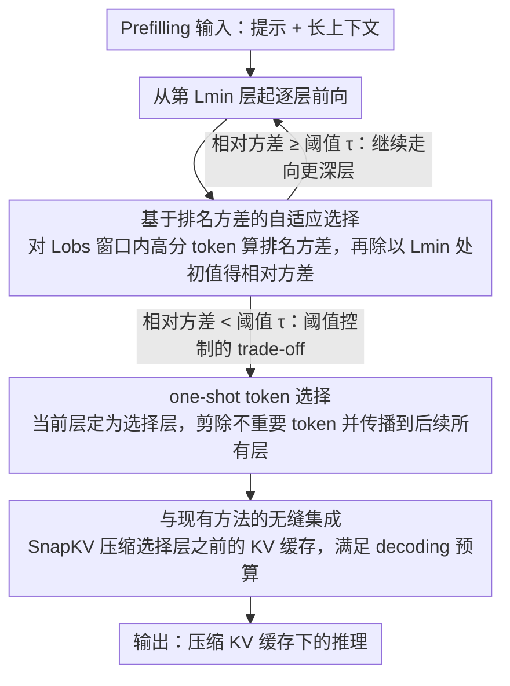

# Adaptive Layer Selection for Layer-Wise Token Pruning in LLM Inference

**会议**: ACL 2026 Findings  
**arXiv**: [2601.07667](https://arxiv.org/abs/2601.07667)  
**代码**: [GitHub](https://github.com/TANIGUCHIREI/ASL)  
**领域**: Model Compression / KV Cache Optimization  
**关键词**: KV缓存压缩, 自适应层选择, 注意力剪枝, 长上下文推理, 无训练方法

## 一句话总结

提出ASL（Adaptive Selection Layer），通过监控token注意力分数排名的方差来自适应确定KV缓存剪枝的层位置，在困难任务上显著优于固定层选择方法，同时保持无需训练。

## 研究背景与动机

**领域现状**：KV缓存是LLM推理的主要内存瓶颈，层级token剪枝（在特定层选择重要token子集并剪除其余）是主流的压缩方案。

**现有痛点**：现有层级剪枝方法（如FastKV、GemFilter）使用预定义的固定选择层——这种设计对简单任务（如QA）有效，但在困难任务（如KV检索）上严重退化。原因是困难任务中问题与上下文的语义相似度高，早期层难以区分相关token。

**核心矛盾**：固定选择层面临根本性的trade-off——早选节省计算但损失精度，晚选保持精度但减少内存节省。不同任务的最优选择层差异巨大。

**本文目标**：设计一种自适应方法，根据任务难度自动确定最佳token选择层。

**切入角度**：观察到注意力分数排名在不同任务中收敛到稳定子集的速度不同——简单任务在中间层即稳定，困难任务需要更深层才稳定。

**核心 idea**：监控token排名的方差作为"注意力聚焦度"的指标，当方差降到阈值以下时触发token选择。

## 方法详解

### 整体框架

ASL在prefilling阶段运行：从第 $L_{min}$ 层开始，在每 $L_{obs}$ 个连续层上计算pooled注意力分数的排名方差，再除以 $L_{min}$ 处的初始方差得到相对方差。当相对方差低于用户指定阈值 $\tau$ 时，把当前层定为选择层、执行one-shot token选择，并把选中的token传播到后续所有层。后续可与SnapKV等方法联合优化decoding阶段。

### 关键设计

**1. 基于排名方差的自适应选择：让「在哪层选 token」跟着任务难度自己走**

固定选择层的根本毛病在于不看任务——简单任务在浅层就能区分相关 token，困难任务（如 KV 检索）问题与上下文语义太像，浅层根本分不开。ASL 的核心是把「注意力是否已经聚焦」量化出来当触发信号：先算 pooled 注意力分数 $PA = \text{pool}(\text{softmax}(\frac{\mathbf{q}_w \mathbf{k}_c + \mathbf{m}_w}{\sqrt{d}}))$，再对连续 $L_{obs}$ 层上的 token 排名计算方差，方差小就意味着这几层关注的 token 子集已经稳定下来。

之所以盯排名方差而不是原始注意力分数，是因为前者更稳健：它不在乎某个 token 拿到的具体分值是多少，只关心「哪些 token 被关注」这件事是否还在变。等方差稳定了再做 one-shot 选择，简单任务自然在中间层（~15 层）就触发，困难任务则被推到更深层（~25 层以上）才触发。

**2. 阈值控制的自适应 trade-off：把「精度还是省内存」收敛成用户能调的一个旋钮**

早选省计算但掉精度，晚选保精度但少省内存，这个 trade-off 没有放之四海皆准的最优点。ASL 把它暴露成单一阈值 $\tau$：相对方差一降到 $\tau$ 以下就触发选择，$\tau$ 越高越早选（更快、可能损精度），$\tau$ 越低越晚选（更精确、更慢）。比起让工程师对每个任务手动去试选择层，一个连续可调的旋钮在不同精度-速度需求的场景间切换要实用得多——实验里阈值扫描也确实给出平滑过渡而非突变。

**3. 与现有方法的无缝集成：ASL 只接管「在哪层选」，其余阶段交给已有方法**

ASL 是一个正交改进，针对的是 prefilling 阶段的层选择这一环，因此可以直接替换现有方法里写死的固定选择层组件，而不必重写整条流水线。典型组合是 ASL 负责 prefilling（确定选择层）、SnapKV 负责 decoding（压缩选择层之前的 KV 缓存），两者各管一段；也可以与 GemFilter 搭成两遍策略。正因为它只动「选层」这一处，所以能以即插即用的方式嫁接到多种已有 KV 压缩管道上。

### 损失函数 / 训练策略

ASL完全无需训练，仅在推理时运行。两个超参数 $L_{min}$ 和 $L_{obs}$ 分别控制起始监控层和观察窗口大小。

## 实验关键数据

### 主实验

| 方法 | KV检索(困难) | QA(简单) | NIAH | 内存占用 |
|------|------------|---------|------|--------|
| FastKV(固定层) | 严重退化 | 强 | 中等 | 低 |
| GemFilter(固定层) | 退化 | 强 | 中等 | 低 |
| ASL(自适应) | 显著提升 | 保持 | 提升 | 可比 |

### 消融实验

| 配置 | 关键指标 | 说明 |
|------|---------|------|
| 阈值敏感性 | 平滑过渡 | 不同阈值产生连续的精度-速度trade-off |
| 跨任务适应性 | InfiniteBench 10任务 | 不同任务自动选择不同深度的层 |
| 256K上下文 | 有效工作 | 长上下文场景同样适用 |

### 关键发现
- 简单任务（QA）注意力在中间层（~15层）即稳定，困难任务（KV检索）需要到更深层（~25层以上）
- ASL在困难任务上大幅超越固定层方法，同时在简单任务上保持相当性能
- 相对方差是有效的"任务难度探针"——无需预先知道任务类型即可自适应

## 亮点与洞察
- 将"什么时候选"的问题从超参数调优转化为自动检测，显著提升了实用性
- 观察驱动的方法设计——从注意力模式的跨层演化规律出发，逻辑链条清晰
- 完全无需训练，开箱即用，且与现有方法正交可组合

## 局限与展望
- 当前仅在Llama 3.1 8B上验证，需要在更多模型架构上测试
- 监控排名方差有一定计算开销（尽管很小），在极端低延迟场景可能需要优化
- 阈值的最优值仍需用户根据场景选择
- 未来可探索progressive版本——在多个自适应选择的层逐步剪枝

## 相关工作与启发
- **vs FastKV/GemFilter**: 用自适应选择替代固定层，从根本上解决任务敏感性问题
- **vs PyramidKV/DynamicKV**: 这些方法自适应分配预算但不自适应选择层，两者互补
- **vs SnapKV**: ASL优化prefilling阶段的层选择，SnapKV优化decoding阶段的token保留，可组合使用

## 评分
- 新颖性: ⭐⭐⭐⭐ 排名方差作为任务难度探针的想法简洁有效
- 实验充分度: ⭐⭐⭐⭐ 多benchmark、多上下文长度的全面评估
- 写作质量: ⭐⭐⭐⭐⭐ 观察→动机→方法→验证的逻辑链条非常清晰
- 价值: ⭐⭐⭐⭐ 对LLM长上下文推理优化有直接实用价值

<!-- RELATED:START -->

## 相关论文

- [\[CVPR 2026\] One Layer's Trash is Another Layer's Treasure: Adaptive Layer-wise Visual Token Selection in LVLMs](../../CVPR2026/model_compression/one_layers_trash_is_another_layers_treasure_adaptive_layer-wise_visual_token_sel.md)
- [\[ACL 2026\] LEAP: Layer-wise Exit-Aware Pretraining for Efficient Transformer Inference](leap_layer-wise_exit-aware_pretraining_for_efficient_transformer_inference.md)
- [\[ACL 2026\] A Layer-wise Analysis of Supervised Fine-Tuning](a_layer-wise_analysis_of_supervised_fine-tuning.md)
- [\[ACL 2026\] DASH-KV: Accelerating Long-Context LLM Inference via Asymmetric KV Cache Hashing](dash-kv_accelerating_long-context_llm_inference_via_asymmetric_kv_cache_hashing.md)
- [\[ACL 2026\] A BERTology View of LLM Orchestrations: Token- and Layer-Selective Probes for Efficient Single-Pass Classification](a_bertology_view_of_llm_orchestrations_token-_and_layer-selective_probes_for_eff.md)

<!-- RELATED:END -->
