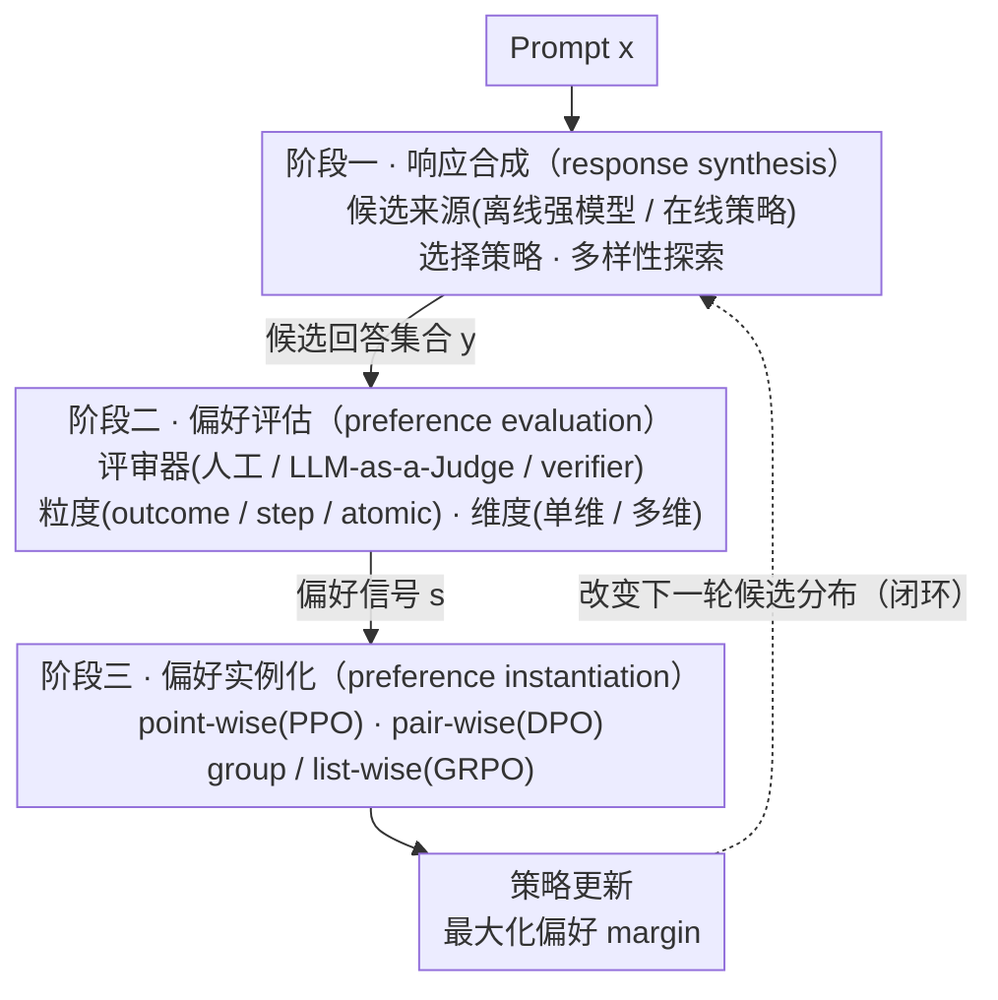

# Alignment Tuning for Large Language Models: A Data-Centric Lens on Alignment Data Pipelines

**会议**: ACL 2026 Findings  
**arXiv**: [2605.26442](https://arxiv.org/abs/2605.26442)  
**代码**: 无公开代码 / 不适用（综述论文）  
**领域**: LLM 对齐 / 对齐数据管线  
**关键词**: 对齐调优、偏好数据、RLHF、DPO、数据中心 AI

## 一句话总结
这篇论文把 LLM alignment tuning 重新解释为一个动态的数据管线设计问题：模型最终学到什么，不只取决于 PPO、DPO、GRPO 这类优化算法，更取决于候选回答如何生成、偏好如何评估、偏好信号又如何实例化为训练目标。

## 研究背景与动机
**领域现状**：大语言模型早期的性能提升主要来自参数规模、架构和优化算法的扩展，但随着 scaling 的边际收益变小，研究重心开始转向数据质量。已有数据中心研究更多讨论预训练语料、SFT 数据混合和静态数据过滤，默认“数据”是一个已经给定的集合。

**现有痛点**：alignment tuning 中的数据并不是静态语料。偏好数据来自 prompt、当前策略模型生成的候选回答、人工或模型评审、以及后续训练目标之间的循环交互。同一个 prompt 下，候选回答的来源、评审器的偏差、反馈粒度和损失形式都会改变最终的优化信号；如果仍然只把问题看成“筛一个更干净的数据集”，就解释不了 reward hacking、mode collapse、alignment tax、在线自博弈不稳定等现象。

**核心矛盾**：优化算法经常被当作 alignment 失败或成功的主因，但算法本身只消费已经构造好的偏好信号。真正的瓶颈在于数据管线给优化器提供了怎样的行为覆盖、偏好边界和关系结构：候选回答太窄，强评审器也没有可区分的对象；评审信号太粗，复杂推理就无法做 credit assignment；多目标偏好被压成一个 scalar，安全性和有用性的 trade-off 就会被掩盖。

**本文目标**：作者希望建立一个统一视角，把 alignment tuning 拆成可分析、可组合、可诊断的三个阶段：response synthesis、preference evaluation、preference instantiation。这样既能整理已有方法，也能给实践者一个按资源约束和任务复杂度选择管线配置的框架。

**切入角度**：论文从“alignment data 是优化信号的来源”这个观察出发。与其问某个 loss 是否更强，不如先问这个 loss 看到的候选行为空间、偏好标签和偏好结构是否可靠。这个角度有希望，是因为它能把离线/在线偏好学习、LLM-as-a-Judge、过程奖励、DPO/GRPO/list-wise 目标等看似分散的工作放到同一个数据生成与信号传递链条里。

**核心 idea**：用“数据管线共同构造优化信号”替代“单个算法决定 alignment 效果”的叙事，把对齐调优设计成 response synthesis、preference evaluation 和 preference instantiation 的协同优化问题。

## 方法详解
这篇论文不是提出一个新的训练算法，而是提出一个分析框架。它先回顾 alignment tuning 的基础目标：给定 prompt $x$ 和模型回答 $y$，理想策略需要最大化人类偏好奖励，同时通过 KL 项约束新策略不要远离参考策略。PPO、DPO、GRPO 都可以被看成在不同形式的偏好信号上调整策略，但这些算法并不自动保证偏好信号本身是好的。

作者进一步把 alignment data formalize 成一个结构化样本集合：每个样本包含 prompt $x$、由 synthesis 策略 $\mathcal{S}$ 生成的一组候选回答 $\mathbf{y}$，以及由 evaluator $\mathcal{E}$ 产生的偏好信号 $\mathbf{s}$。换句话说，alignment data 不是简单的 $(x, y)$，而是由“生成什么候选、怎么判断候选、如何把判断变成训练信号”共同产生的优化对象。

在这个视角下，alignment optimization 可以理解为 margin alignment：模型策略诱导出的隐式偏好边界，需要和数据管线产生的显式偏好边界一致。若候选回答没有足够差异，margin 就弱；若评审器有偏差，margin 就歪；若实例化方式把多维偏好压成单值，margin 就丢失结构。论文的主要方法就是围绕这些 margin 的来源，系统梳理管线三阶段的设计空间和相互作用。

### 整体框架
整体 pipeline 有三个阶段。

第一阶段是 **response synthesis**，即为每个 prompt 生成候选回答集合。这里决定 alignment 能看到哪些行为，也就是 behavioral support。关键问题包括：回答来自离线强模型还是当前在线策略？是否用 margin 或 uncertainty 选择更有信息量的样本？是否主动保留多样性，防止模型只学会少数高概率风格？

第二阶段是 **preference evaluation**，即给候选回答分配偏好信号。早期 RLHF 依赖人工偏好，现在大量工作使用 LLM-as-a-Judge、verifier、rubric 或 multi-agent debate 来降低标注成本。论文强调，评估不仅有“谁来打分”的问题，还有“打多细”和“按几个维度打”的问题：outcome-level 适合短回答，step-level 更适合数学和代码，atomic-level 更适合长文事实性与安全性；单维 reward 容易引入 alignment tax，多维 rubric 则更能保留价值冲突。

第三阶段是 **preference instantiation**，即把评估结果转成优化器能消费的训练信号。point-wise 方法给单个回答打分或二值标签；pair-wise 方法构造 $(x, y_w, y_l)$ 的偏好对，是 DPO 系列的主流形式；group-wise / list-wise 方法利用一组候选的相对排序，适合高方差推理任务和多候选比较。

这三个阶段不是线性独立的。response synthesis 限定 evaluation 的上限；evaluation 的粒度和维度决定 instantiation 能建模什么；instantiation 更新策略后，又会改变下一轮 synthesis 的候选分布。因此 alignment tuning 更像闭环控制系统，而不是一次性数据清洗。

### 关键设计

**1. 三阶段数据中心 taxonomy：把对齐失败的归因从"loss 写错了"改成"管线哪一段信号被污染"**

人们习惯把 alignment 的好坏挂在 PPO/DPO/GRPO 这些算法名字上，可算法只是消费已经构造好的偏好信号，真正决定信号质量的是它前面那条数据链。论文沿着这条链把每一阶段再切细：response synthesis 拆成 response source、selection strategy、creative exploration；preference evaluation 拆成 adjudicator type、judgement granularity、objective dimensionality；preference instantiation 拆成 point-wise、pair-wise、group-wise/list-wise，并用 Table 5 沿这些维度给 41 个代表方法归位。

这套坐标系的价值在于，它能把很多"看起来是 loss 的锅"还原成管线错配。用 outcome-level 的二值标签去喂 token-level 的偏好目标，本质是监督粒度不够细；用离线强模型的回答训练当前的弱策略，会引入 distribution shift；把安全性和有用性压进同一个标量 reward，则直接掩盖了二者的 Pareto trade-off。换句话说，诊断时该先定位是哪一段信号出了问题，而不是急着换优化器。

**2. 从数据构造解释优化信号：把抽象的"人类偏好"落到管线实际给出的候选集和偏好结构上**

对齐的学习目标常被说成"对齐人类偏好"，但模型从没见过真实偏好，它见到的只有数据。论文把 alignment data 形式化为 $\mathcal{D}=\{(x, \mathbf{y}, \mathbf{s})\}$，其中候选 $\mathbf{y}$ 来自 synthesis 策略、偏好信号 $\mathbf{s}$ 来自 evaluator；训练时模型最大化的不是真实偏好，而是这些样本诱导出的偏好 margin。PPO 用 point-wise reward、DPO 用 pair-wise contrast、GRPO 用 group-relative baseline，归根到底都是在不同结构的偏好数据上校准这条 margin。

这一抽象解释了"为什么单改 loss 经常不管用"：synthesis 阶段只产出平庸或高度雷同的候选，DPO 再强也只能学到一条软弱的边界；evaluator 带着长度、位置或模型家族偏置，优化器就会把这些偏差当成真实偏好照单全收；instantiation 过早把多维信号压成单值，模型则会沿最容易优化的那一维投机。margin 的覆盖、保真和结构，全在算法之前就被数据决定了。

**3. 面向约束的实践指南：把分类表翻译成"什么预算配什么管线"的可操作选型**

光有 taxonomy 还停在描述层面，论文进一步在 Table 2-4 分别给出 synthesis、evaluation、instantiation 三阶段的"约束→策略"映射，并在 Appendix B / Table 6 把它们拼成端到端的场景配置。比如低预算 general chat 适合离线数据 + 预标注/启发式评估 + reference-free pair-wise 目标；复杂推理适合多 rollout + step-level verifier + group-wise 训练；安全合规则离不开 red-teaming prompt、多维评价和 multi-objective 优化。

它的立场是不追求一个通吃算法，而是强调组件要彼此匹配：哪里缺数据就补 on-policy synthesis，哪里评价难就提高 granularity，哪里显存紧张就绕开 reward/reference model，哪里目标冲突就别把 reward scalarize。最优配置本就随数据可得性、任务复杂度和算力预算漂移，所以"选管线"才是比"选 loss"更前置的决策。

### 损失函数 / 训练策略
本文没有提出新的损失函数，但把主流训练策略放在同一个信号结构里解释。

PPO 代表 point-wise reward maximization：先训练 reward model $r_\phi(x,y)$，再最大化 reward 并用 KL 项约束策略漂移。它的优势是能直接使用标量奖励，缺点是需要 reward model 和稳定的 RL 更新，容易受 reward hacking 影响。

DPO 代表 pair-wise preference optimization：不显式训练 reward model，而是用偏好对 $(x, y_w, y_l)$ 直接提高 preferred response 相对于 rejected response 的似然比。它降低了系统复杂度，但依赖高质量偏好对，也可能在强 contrastive 更新下带来过拟合、熵下降和探索收缩。

GRPO 代表 group-wise optimization：对同一 prompt 采样多个候选，用组内平均 reward 作为 baseline，让优于组平均的回答概率上升。它适合 reasoning 场景中 $N>1$ 的多 rollout 比较，可以降低方差并避免单独 value network，但仍然依赖可靠的 verifier 或 reward 信号。

论文的训练策略建议可以概括为：先根据任务和资源确定 candidate coverage，再匹配评价粒度，最后选择能保留相应偏好结构的优化目标。也就是说，loss 不是起点，而是前两阶段数据设计的最后承载形式。

## 实验关键数据
这篇论文是综述/框架论文，没有报告新的模型训练实验、benchmark SOTA 数值或传统消融实验。因此这里不把 taxonomy 表误写成 empirical accuracy，而是整理论文给出的可核查结构性结果和设计结论。

### 主结果
| 论文证据 | 规模 / 数量 | 具体含义 | 对实践的启发 |
|---------|-------------|----------|--------------|
| 三阶段框架 | 3 个阶段 | response synthesis、preference evaluation、preference instantiation | 诊断 alignment 失败时先定位是哪一段信号被污染或压缩 |
| Table 1 | 6 条设计原则 | 管线定义优化信号、覆盖优先、评估保真度设上限、粒度支持 credit assignment、保留偏好结构、闭环设计 | 把“换 loss”扩展为“联合设计数据生成、评价和目标” |
| Table 2-4 | 3 张阶段级决策表 | 分别对应 synthesis、evaluation、instantiation 的资源约束与推荐策略 | 低预算、复杂推理、安全合规等场景不应共用同一 pipeline |
| Table 5 | 41 个代表方法 | 按 response source、selection、creative exploration、judgement granularity、objective dimensionality、instantiation 分类 | PPO/DPO/GRPO 等方法可以被视为同一数据管线设计空间中的不同点 |
| Table 6 | 5 类部署场景 | 低预算聊天、复杂推理、开放创作、安全合规、冷启动适配 | 给出了端到端组件组合，而不是孤立推荐单个算法 |

### 消融实验
论文没有传统 ablation，但第 7 节给出了类似“设计变量消融”的结构性分析：如果某个阶段选择不当，会怎样限制后续阶段。

| 设计变量 | 若处理不当 | 论文给出的后果 | 对应改进方向 |
|---------|------------|----------------|--------------|
| Response source | 离线强模型数据与当前策略分布不匹配 | off-policy bias、value estimation 偏移 | policy-aware reweighting，或转向在线 self-play |
| Candidate diversity | 候选回答过于相似或过早 mode collapse | evaluator 无法产生有效 preference margin，优化梯度变弱 | diversity sampling、creative exploration、DivPO/CRPO 类方法 |
| Evaluation granularity | 复杂推理只用 outcome-level 标签 | 无法定位中间步骤错误，credit assignment 粗糙 | step-level verifier、process reward、atomic-level supervision |
| Objective dimensionality | 多目标偏好被压成单一 scalar | alignment tax、reward hacking、helpfulness/safety trade-off 被掩盖 | rubric、多维 reward、multi-objective optimization |
| Instantiation form | 用过粗的 point-wise 信号表达复杂关系 | 排序结构和组内归一化信息丢失 | pair-wise、group-wise 或 list-wise 目标 |

### 关键发现
- **评估保真度是上限**：如果 LLM-as-a-Judge 存在长度偏置、位置偏置或 self-preference bias，下游优化会学习这些偏差，而不是学习真实人类偏好。
- **覆盖先于优化**：alignment 只能在 synthesis 阶段采样到的行为空间内发生；候选空间越窄，越容易出现 brittle alignment 和后续探索枯竭。
- **闭环比开环更符合现实**：在线 alignment 中，当前 loss 改变策略熵和输出分布，进而改变下一轮训练数据；固定数据、固定评审器、固定 reward 的开环假设很容易失效。
- **不同任务需要不同粒度**：短文本偏好可以用 outcome-level 比较；数学、代码、agentic workflow 更需要 step/trajectory-level 信号；长文事实性和安全性更适合 atomic-level 监督。
- **无单一最优算法**：低显存时 SimPO/ORPO 这类 reference-free pair-wise 方法更实用；高方差推理中 GRPO/list-wise 方法更自然；安全合规场景则需要多维评价和约束优化。

## 亮点与洞察
- **把“数据质量”从静态语料推进到动态管线**：许多数据中心 LLM 工作讨论预训练/SFT 数据，而本文指出 alignment 数据会随策略变化而变化。这一点很关键，因为它把 alignment failure 从单次数据清洗问题变成闭环系统设计问题。
- **用 margin 统一 PPO、DPO、GRPO 的信号来源**：论文没有停留在算法罗列，而是强调不同优化目标只是消费不同结构的偏好信号。这个视角能帮助读者判断什么时候应该改采样，什么时候应该改评审，什么时候才该改 loss。
- **taxonomy 对实践很友好**：三阶段框架能直接落到工程决策，比如预算低时减少在线生成和 reference model，推理任务中增加多 rollout 和 verifier，安全场景中避免单 reward scalarization。这比单纯列 survey 更有操作性。
- **跨阶段相互作用讲得清楚**：response synthesis、evaluation、instantiation 不是独立模块，而是互相限制。尤其是“实例化方式会反过来改变下一轮 synthesis 分布”这个闭环观点，对理解 DPO 后多样性下降、GRPO rollout 分布变化等现象很有帮助。

## 局限与展望
- **缺少实证验证**：论文主要是 taxonomy 和原则总结，没有在统一 benchmark 上比较不同 pipeline 配置，也没有证明某条实践指南在固定任务上稳定优于另一条。
- **方法覆盖会快速过期**：alignment tuning 发展很快，尤其是 reasoning RL、agentic alignment、多模态 reward、自动化 judge 校准等方向，Table 5 的 41 个方法只能代表写作时的截面。
- **分类边界有重叠**：很多新方法同时改变 synthesis、evaluation 和 instantiation。强行放进单个表格字段时，可能会弱化它们的系统性创新。
- **对评审器可靠性的解决仍偏原则化**：论文指出 LLM-as-a-Judge 的偏差与集成评审思路，但没有给出可复用的 judge calibration 协议或误差传播量化方法。
- **未来方向值得展开**：prompt-level alignment、agentic systems、evolving objectives 和 multi-modal alignment 都需要比当前三阶段文本管线更细的状态建模，尤其是长时序 agent 的 trajectory-level 偏好和多模态视频中的局部反馈。

## 相关工作与启发
- **vs RLHF / PPO**: PPO 把 alignment 视为 learned reward 下的策略优化，本文则追问 reward model 训练数据和候选回答是如何构造出来的。优势是能解释 reward hacking 和 evaluator bias 的来源，劣势是没有像 PPO 那样给出可直接运行的新算法。
- **vs DPO 系列综述**: DPO 综述通常围绕 pair-wise loss、reference model、margin calibration 和理论变体展开；本文把 DPO 放进 preference instantiation 阶段，并提醒 pair-wise 目标的效果受 synthesis 覆盖和 evaluation 粒度限制。
- **vs LLM-as-a-Judge 工作**: Judge 相关论文关注评估器本身的 bias、rubric 或集成机制；本文把 judge 视为 preference evaluation 的一个组件，进一步讨论它如何限制后续 point-wise/pair-wise/group-wise 训练目标。
- **vs 数据选择 / SFT 数据质量工作**: 传统 data-centric LLM 研究多处理静态 corpus 的过滤和混合；本文的启发是，对齐数据应被看成由当前策略、采样策略、评审器和损失函数共同生成的动态对象。
- **对后续研究的启发**: 如果要设计新的 alignment 方法，可以先声明自己改变的是哪一段管线，再说明它如何改善 preference margin 的覆盖、保真度或结构保留。这样比只声称“新的 loss 更好”更容易被验证和复用。

## 评分
- 新颖性: ⭐⭐⭐⭐☆ 视角新颖度较高，核心贡献是把 alignment tuning 系统性重构为数据管线问题，但不是提出全新训练算法。
- 实验充分度: ⭐⭐☆☆☆ 作为综述没有新增 benchmark 或消融实验，证据主要来自文献整理、分类表和原则推导。
- 写作质量: ⭐⭐⭐⭐☆ 结构清晰，三阶段框架和实践表格很有用；部分 taxonomy 表在纯文本中较扁平，方法边界也存在交叉。
- 价值: ⭐⭐⭐⭐☆ 对做 RLHF/DPO/GRPO、LLM-as-a-Judge、reasoning RL 或安全对齐的人都有参考价值，尤其适合用来做 pipeline 诊断和方法定位。

<!-- RELATED:START -->

## 相关论文

- [\[ACL 2025\] Language Models Resist Alignment: Evidence From Data Compression](../../ACL2025/model_compression/language_models_resist_alignment.md)
- [\[ACL 2026\] SRA: Span Representation Alignment for Large Language Model Distillation](sra_span_representation_alignment_for_large_language_model_distillation.md)
- [\[ACL 2026\] MTA: Multi-Granular Trajectory Alignment for Large Language Model Distillation](mta_multi-granular_trajectory_alignment_for_large_language_model_distillation.md)
- [\[ICLR 2026\] Alignment through Meta-Weighted Online Sampling: Bridging the Gap between Data Generation and Preference Optimization](../../ICLR2026/model_compression/alignment_through_meta-weighted_online_sampling_bridging_the_gap_between_data_ge.md)
- [\[ACL 2026\] Training-Free Test-Time Contrastive Learning for Large Language Models](training-free_test-time_contrastive_learning_for_large_language_models.md)

<!-- RELATED:END -->
