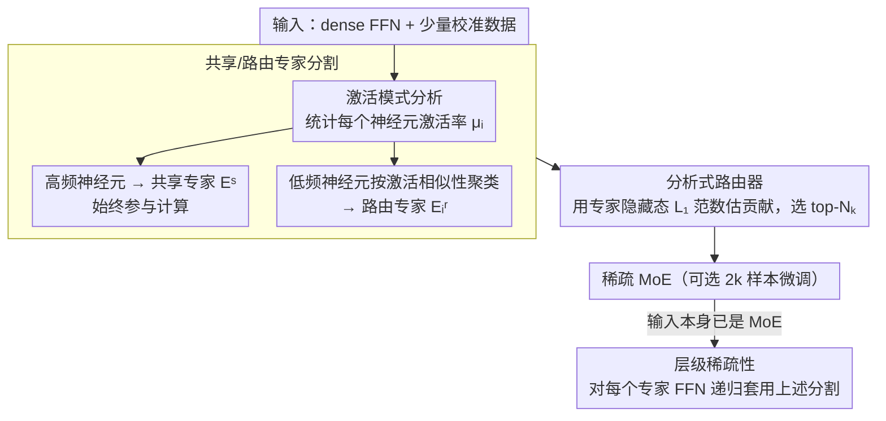

# Analytical FFN-to-MoE Restructuring via Activation Pattern Analysis

**会议**: ACL 2026  
**arXiv**: [2502.04416](https://arxiv.org/abs/2502.04416)  
**代码**: [GitHub](https://github.com/JarvisPei/CMoE)  
**领域**: Model Compression / MoE  
**关键词**: FFN转MoE, 激活模式分析, 共享专家, 分析式路由, 后训练压缩

## 一句话总结

提出一种分析式后训练框架，通过神经元激活模式分析将dense FFN快速重构为sparse MoE——区分高频共享专家和低频路由专家，并从激活统计量构建路由器，仅需2k样本微调即可实现1.17×加速。

## 研究背景与动机

**领域现状**：MoE架构通过稀疏激活实现参数规模与计算成本的解耦，但传统方法需要从头预训练MoE模型，成本极高。

**现有痛点**：(1) 现有dense-to-MoE方法（如MoEfication）基于权重聚类，忽略了不同神经元的激活频率差异；(2) LLaMA-MoE等方法需要200B token的持续训练来恢复质量；(3) 关键观察被忽略——神经元激活频率呈双模态分布，少数始终激活，多数仅条件激活。

**核心矛盾**：将高频始终激活的神经元与低频条件激活的神经元统一处理，会导致路由器需要为几乎所有输入激活大多数专家，破坏了MoE的稀疏性。

**本文目标**：利用激活模式的双模态结构设计分析式（无需大规模训练）的FFN转MoE方法。

**切入角度**：观察到FFN隐藏层激活高度稀疏且呈双模态——将高频神经元放入共享专家、低频神经元按共激活聚类成路由专家，路由器从统计量直接构建。

**核心 idea**：共享专家+路由专家的结构化划分利用了激活的自然结构，使路由器只需在真正输入依赖的专家间选择。

## 方法详解

### 整体框架

三阶段流程：(A) 激活模式分析——用小量校准数据计算每个神经元的激活率 $\mu_i$；(B) 共享/路由专家分割——高频神经元收进共享专家，低频神经元按激活相似性聚类成路由专家；(C) 分析式路由器——直接从激活统计量构建路由函数，无需训练。此外，当输入模型本身已是 MoE 时，把同一套分割递归套到每个专家的 FFN 上，做到层级稀疏。

### 关键设计

**1. 基于激活率的共享/路由专家分割：顺着双模态激活的天然结构切，而不是把所有神经元一视同仁**

痛点在于 MoEfication 这类方法按权重聚类，把神经元统一打散到各个专家里，结果那些"对几乎所有输入都重要"的高频神经元被分散后，路由器为了不漏掉它们就得几乎激活所有专家，稀疏性形同虚设。论文先用小量校准数据统计每个神经元的激活率 $\mu_i$（它在 top-$K_a$ 中出现的比例），把高频神经元整体收进共享专家 $E^s$ 让它始终参与计算，剩下的低频神经元再按激活模式相似性聚类成路由专家 $E_i^r$。

这样划分之后，共享专家承担了"无论什么输入都要用"的公共算力，路由器只需要在真正随输入而变的低频专家之间做选择。激活频率本就是双模态分布——少数始终激活、多数条件激活——让结构去贴合这个分布，稀疏性就不再被高频神经元拖累。

**2. 分析式路由器构建：不训练路由器，直接从激活统计量读出该激活哪些专家**

传统做法要专门训练一个路由器，代价高。论文把目标重写成最小化重构误差 $\|F_{MoE}(\mathbf{x}) - F(\mathbf{x})\|^2$，并指出这等价于最小化"被漏掉的未激活专家"的输出贡献——既然如此，只要能估出每个专家对当前输入的贡献大小，让贡献最大的胜出即可。具体用每个专家隐藏状态的 $L_1$ 范数作为贡献代理，路由器据此选出 top-$N_k$ 个专家。

它的好处是绕开了昂贵的路由器训练：路由信号直接来自原始 FFN 的激活统计量，整条重构链路因此能做到分析式、近乎无训练。

**3. 层级稀疏性：把同一套框架递归套到已有 MoE 的每个专家上，吃到更细粒度的加速**

前两个设计针对的是 dense FFN，但很多模型本身已经是 MoE。论文观察到 MoE 的每个专家内部其实还是一个 FFN，于是把共享/路由分割递归地应用到这些专家 FFN 上，再切出一层共享+路由结构。这样 dense→MoE 的思路就从"只能处理 dense 模型"扩展到"也能让现成 MoE 模型进一步提速"。

### 损失函数 / 训练策略

分析式重构完全无需训练（training-free baseline可直接部署）。可选的2k样本微调使用标准语言模型损失进一步提升质量。

## 实验关键数据

### 主实验

| 配置 | 加速比 | 处理时间 | 质量 |
|------|--------|---------|------|
| Training-free | 1.17× | 分钟级 | 可用 |
| +2k微调 | 1.17× | 分钟+微调 | 超越需数量级更多资源的方法 |

### 消融实验

| 配置 | 关键指标 | 说明 |
|------|---------|------|
| 统一vs分割专家 | 分割显著更好 | 验证了双模态分割的价值 |
| 分析式vs学习式路由 | 分析式可比 | 无需训练路由器 |
| 递归层级稀疏 | 有效 | 在MoE模型上进一步加速 |

### 关键发现
- 双模态激活模式在多个LLM架构中普遍存在（LLaMA-2, Mistral等）
- 仅需分钟级处理+2k样本微调即可超越需要200B token训练的方法
- 分析式路由器的质量接近学习式路由器，大幅降低成本

## 亮点与洞察
- 观察驱动的方法设计——从激活模式的双模态分布出发，方法设计自然而优雅
- "分钟级处理vs 200B token训练"的效率对比极具说服力
- 递归应用的思路使方法同时适用于dense和MoE模型

## 局限与展望
- 1.17×的加速比相对温和，在极端低延迟场景可能不够
- 共享专家比例的选择需要根据模型调整
- 未在视觉或多模态模型上测试
- 未来可结合量化等正交技术进一步加速

## 相关工作与启发
- **vs MoEfication**: 区分共享和路由神经元而非统一聚类，从根本上利用激活结构
- **vs LLaMA-MoE**: 无需大规模持续训练，成本降低数个数量级
- **vs 激活稀疏方法（DejaVu等）**: 在不同粒度操作，可组合使用

## 评分
- 新颖性: ⭐⭐⭐⭐ 激活双模态观察和分析式路由器的结合
- 实验充分度: ⭐⭐⭐⭐ 多模型、多任务、与强基线对比
- 写作质量: ⭐⭐⭐⭐⭐ 观察→动机→方法→验证的逻辑链极佳
- 价值: ⭐⭐⭐⭐ 对LLM高效推理有直接实用价值

<!-- RELATED:START -->

## 相关论文

- [\[ICLR 2026\] Steering MoE LLMs via Expert (De)Activation](../../ICLR2026/model_compression/steering_moe_llms_via_expert_deactivation.md)
- [\[ACL 2026\] IMPACT: Importance-Aware Activation Space Reconstruction](impact_importance-aware_activation_space_reconstruction.md)
- [\[ACL 2026\] A Layer-wise Analysis of Supervised Fine-Tuning](a_layer-wise_analysis_of_supervised_fine-tuning.md)
- [\[AAAI 2026\] CAMERA: Multi-Matrix Joint Compression for MoE Models via Micro-Expert Redundancy Analysis](../../AAAI2026/model_compression/camera_multi-matrix_joint_compression_for_moe_models_via_mic.md)
- [\[ACL 2026\] When Reviews Disagree: Fine-Grained Contradiction Analysis in Scientific Peer Reviews](when_reviews_disagree_fine-grained_contradiction_analysis_in_scientific_peer_rev.md)

<!-- RELATED:END -->
