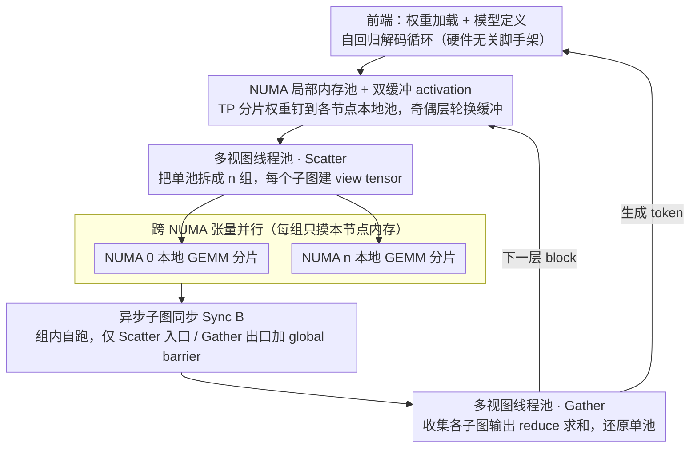

# ArcLight: A Lightweight LLM Inference Architecture for Many-Core CPUs

**会议**: ACL 2026  
**arXiv**: [2603.07770](https://arxiv.org/abs/2603.07770)  
**代码**: https://github.com/OpenBMB/ArcLight  
**领域**: 模型压缩 / 推理优化 / CPU 部署  
**关键词**: Many-Core CPU, NUMA-aware, 张量并行, llama.cpp, LLM 推理框架

## 一句话总结
ArcLight 是一个从零写的轻量级 LLM 推理框架（约 10 个 C++ 文件），专为多 NUMA 节点的 many-core CPU 设计，通过 NUMA 局部内存池、多视图线程池、跨 NUMA 张量并行 + 异步子图同步打破"远程内存墙"，在 192 核 ARM 鲲鹏平台上把 Qwen3-4B Q4_0 的 decode 吞吐相对 llama.cpp 提高至多 46%。

## 研究背景与动机

**领域现状**：LLM 推理框架两条主流路线——GPU 端 vLLM / TensorRT / SGLang，CPU 端以 llama.cpp 为代表。CPU 路线对边缘部署、Web 服务器、高端网络设备很关键，能直接复用既有硬件。

**现有痛点**：Web 服务器和网络设备里普遍是 many-core CPU（48-192 核分到 2-4 个 NUMA 节点），跨 NUMA 节点访存延迟是本地访存的 ~4 倍。实测 192 核机器上：本地访存 ~102 GB/s，跨节点只剩 22-26 GB/s。llama.cpp 只暴露 `--numa distribute` 把线程均分到各节点，但**不显式绑张量到 NUMA**，OS 按 first-touch 策略分配物理页 ⇒ 大量跨节点访存。结果是当核数从 6 扩到 48 时算力起飞、扩到 192 时撞内存墙。

**核心矛盾**：传统 CPU 框架按"UMA + 单线程池 + 串行计算图"设计，无法表达"多个 NUMA 节点并行跑不同子图、每个子图只摸本节点张量"这种 NUMA-aware 计算模式；而硬改 llama.cpp 需要外科手术式重构，从底层内存分配到高层模型定义全要动。

**本文目标**：从头设计一个 minimal、modular、NUMA-aware 的 CPU 推理框架，专门解决跨节点访存墙。

**切入角度**：观察到 transformer 里 $W_q,W_k,W_v,W_{gate},W_{up}$ 按行可切、$W_o,W_{down}$ 按列可切，正好对应 Megatron 风格的张量并行（TP）；只要让"切出来的每个分片"驻留在某个 NUMA 节点的本地内存上，子图就能完全在节点内做计算，跨节点通信只剩 Gather/Scatter 那一两步。

**核心 idea**：把 GPU 多卡上常见的 Megatron-LM 张量并行下移到"CPU 多 NUMA 节点"，配合 NUMA 局部内存池、多视图线程组、异步子图同步，把跨节点访存从 GEMM 主循环里彻底剔除。

## 方法详解

### 整体框架
分两层。**前端**：处理权重加载、模型定义、自回归解码循环，硬件无关。**后端推理引擎**：5 个核心模块——Tensor Library（C++ 类封装 header + data 两段）、Memory Manager（每个 NUMA 节点开独立内存池 + activation 双缓冲）、Thread Manager（多视图线程组 + 全局/局部 barrier）、Forward Graph Builder（追加式静态图构建）、Graph Computation Scheduler（按容器顺序调度算子）。整个引擎 ~10 个 C++ 文件，算子库直接复用 llama.cpp 的 GEMM / FlashAttention 等内核（不重新造轮子）。运行时每个 transformer block 的执行流是：权重按 NUMA 节点钉好后，Scatter 把线程池拆成 $n$ 组并各建 view tensor，各组在本节点内独立跑 TP 分片的 GEMM，只在 Gather 出口才跨节点汇合求和——三个关键设计正对应这条流向。

### 关键设计

**1. NUMA 局部内存池 + 双缓冲 activation：让每张量的物理页钉死在某个 NUMA 节点的本地内存，顺带把 activation 峰值砍半**

llama.cpp 用一整块 UMA buffer，分布式线程下让 OS 按 first-touch 自己决定页放哪个节点，结果绝大多数 GEMM 都在跨节点读权重——而跨节点带宽只有本地的约四分之一。ArcLight 反过来，启用 NUMA 时给每个节点开一个独立的 memory pool，张量按 TP 切分结果显式绑定到对应节点的本地池里，"哪个权重在哪个节点"从此是框架的显式决策而不是 OS 的猜测。

在此之上，activation 缓冲采用奇偶层交替的 double-buffering：相邻两层共用两块缓冲区轮换，常驻占用直接减半，正好适配显存吃紧的边缘设备。一个钉内存避免误判、一个轮缓冲压峰值，两件事都是为了在 many-core CPU 上把访存压力关进本地。

**2. 多视图线程池 + 全局/局部 barrier：同一组 worker 既能合伙跑一个 GEMM，又能拆成 $n$ 组各跑各的子图**

单线程池只能让所有线程协作执行同一个算子，根本表达不了"TP 切完之后多个子图并行"这种模式。ArcLight 在线程池里引入 "thread group" 的逻辑抽象——池初始化和图执行时都能通过显式 API 重新组织线程分组，并配两套同步：组内的 legacy intra-group barrier 和跨所有逻辑组的 global barrier。进入 TP 区时 Scatter 算子把池切成 $n$ 组并为每个子图建好 view tensor，出口处 Gather 算子收集各子图输出求和、再把池还原成单组。

关键巧思是它始终只有一个物理线程池：靠 group 抽象在"协作 / 独立"两种执行模式间动态切换，而不是维护多个线程池来回切，省掉了池切换的开销，也让"动态算子并行度"有了统一底座。

**3. 跨 NUMA 张量并行 + 异步子图同步：把每个 transformer block 的 GEMM 序列切成与节点数等量的 TP 分片，只在汇合点才跨节点通信**

观察到 $W_q,W_k,W_v,W_{gate},W_{up}$ 按行可切、$W_o,W_{down}$ 按列可切，正好是 Megatron 风格的 TP。以 MLP 为例，$Y=\sigma(AX),\,Z=BY$ 被切成 $[Y_1,Y_2]=[\sigma(A_1 X),\sigma(A_2 X)]$、$[Z_1,Z_2]=[B_1 Y_1,B_2 Y_2]$，最后 $Z=Z_1+Z_2$ 只在 Gather 时 reduce；所有 TP 张量（$A_i,B_i,W_q^i,W_k^i,W_v^i$ 等）按 NUMA 节点切分、驻留各自的本地内存池，于是从 attention 入口到出口、从 MLP 入口到出口的整段 GEMM 全程只摸本节点内存，跨节点通信被压缩到 attention 出口和 MLP 出口的 Gather 那一两步。

同步上论文用的是 Sync B 而非教科书的 Sync A。Sync A 在每个 GEMM 后都加一次跨组 barrier，子图进度被最慢一组拖住、线程大量闲置；Sync B 让每个 NUMA 组按自己的节奏跑，只在 Scatter 入口和 Gather 出口加全局 barrier，实测多出约 5 token/s。这一步把 GPU 时代每算子同步的 TP 习惯，改写成了 CPU 多 NUMA 下"只在结果汇合时才等齐"的版本。

### 损失函数 / 训练策略
纯推理框架，无训练。算子层依赖 ARM NEON (SIMD) 和 i8mm (int8 矩乘)，但 ArcLight 本身硬件无关，只要重写 ops 即可移植到 x86。

## 实验关键数据

### 主实验（Qwen3-4B Q4_0，prompt=15 / decode=256，HUAWEI Kunpeng-920 ARM，4 NUMA × 48 核 + 6×DDR4/节点）

**单 NUMA 节点（仅看节点内扩展性）**

| 线程数 | llama.cpp (tok/s) | ArcLight (tok/s) | 加速 |
|---|---|---|---|
| 6 | ~12 | ~13 | +8% |
| 24 | ~28 | ~31 | +11% |
| 48 | ~32 | ~36 | +12% |

ArcLight 略快，归因于强制节点本地分配（llama.cpp 让 OS 决定）。

**多 NUMA 节点（核心场景）**

| 配置 | llama.cpp | ArcLight (Sync A) | ArcLight (Sync B) | 相对 llama.cpp |
|---|---|---|---|---|
| 2 NUMA × 48 核 = 96 | ~38 tok/s | ~50 tok/s | ~55 tok/s | **+45%** |
| 4 NUMA × 48 核 = 192 | ~42 tok/s | ~57 tok/s | ~62 tok/s | **+46%** |

跨节点访存墙被 TP 拆开后，llama.cpp 在 192 核几乎不再扩展，ArcLight 还能继续线性涨；Sync B 异步同步相对 Sync A 再加 ~5 tok/s。

### 跨 NUMA 访存基准（4 节点机，每节点 48 ARM 核 + 6×DDR4）

| 核心位置 \ 内存位置 | node 0 | node 1 | node 2 | node 3 |
|---|---|---|---|---|
| node 0 | **102** | 26 | 24 | 23 |
| node 1 | 26 | **103** | 23 | 22 |
| node 2 | 24 | 23 | **103** | 26 |
| node 3 | 23 | 22 | 26 | **101** |

本地访存 ~4× 于跨节点（GB/s），证实"内存墙"是 many-core LLM 推理的真瓶颈。

### 关键发现
- **跨 NUMA TP 是必须的**：单 NUMA 节点扩展到 48 核后已逼近内存带宽上限，要再涨吞吐只能跨节点 + 走 TP，否则被 4× 远程访存惩罚拖死。
- **Sync B（异步子图）一致优于 Sync A**：约 +5 tok/s 的额外提升，证明严格的全局同步在多子图场景下浪费了 ~10% 的线程时间。
- **ArcLight 在 prefill 上的优势小于 decode**（附录 A.2）：prefill 是计算 bound，访存优化收益小；decode 是访存 bound，正好契合 NUMA 局部访存的优化方向。
- **长 prompt（300 tokens）下 decode 仍保持优势但绝对吞吐略降**：长 KV cache 会增加访存压力，但 NUMA-aware 设计依然胜出。
- **轻量代码量本身就是产品优势**：~10 个 C++ 文件 vs llama.cpp 的庞大代码库，研究者改 / 加新模型门槛极低。

## 亮点与洞察
- **把"GPU 多卡 TP"完整翻译到"CPU 多 NUMA"是真正的洞察**：以前以为 TP 只在多 GPU/多机才有意义，本文证明它在单机 CPU 的多 NUMA 节点上同样是"破墙"利器。这一思路可外推到 GPU 内的多 chiplet（H100/B100 都开始有 NVLink C2C）。
- **multi-view 线程池设计很巧**：用同一池子既能"协作"又能"分组"，避免了多池切换的开销，给"动态算子并行度"提供了通用底座。
- **Sync B 异步同步是被低估的工程细节**：教科书 TP 写法默认 Sync A，但 CPU 端线程切换成本高，Sync B 把"等齐"放到最后一刻收集，是 CPU TP 必须的微调。
- **隔离 framework 与 operator**：ArcLight 不写算子库，直接复用 llama.cpp 的 GEMM/FlashAttention，把精力集中在内存/线程/图层面创新——是"避开内核优化红海"的聪明工程选择。
- **代码精简也是科研贡献**：让推理框架变得"可读、可 hack"，研究者能快速验证新模型、新调度策略，对学术社区的实际价值不输性能数字本身。

## 局限与展望
- 只在 ARM 鲲鹏平台测过；x86 平台需要重写 NEON 部分（i8mm 等价指令 AVX-512 VNNI 也需要适配）。
- Scatter / Gather 算子作者明说"还很初步"，可能在更细粒度的算子并行上有进一步优化空间。
- 只评了 Qwen3-4B（Q4_0 量化）一个模型；更大模型（70B+ Q4_0 在 192 核 CPU 上估计相当慢）下的扩展性曲线不明。
- 异步子图执行可能在长尾问题（某些节点突发慢）出现"快子图等慢子图"的问题，论文未讨论调度容错。
- 未与 GPU 推理直接对比 cost/perf，对"何时选 CPU 推理"的指导性证据不强。

## 相关工作与启发
- **vs llama.cpp**：本文继承其算子库，但重写了 memory / thread / graph 三大模块，并新增跨 NUMA TP；直接对标比较。
- **vs vLLM / SGLang / TensorRT**：GPU 框架不需要面对 NUMA 内存墙，PagedAttention 解决的是 GPU KV cache 碎片问题，与本文的目标场景正交。
- **vs ONNX Runtime CPU**：通用框架，没有针对 many-core NUMA 的专门优化。
- **vs Megatron-LM TP**：思路源头，本文是 CPU 端的"低配版" Megatron（不需要 NCCL，只需 NUMA 本地内存）。
- **vs 量化/剪枝（OmniQuant / OneBit / Wanda / CRVQ）**：那些是降访存量，本文是降访存延迟，两者完全正交可叠加。

## 评分
- 新颖性: ⭐⭐⭐⭐ 把 TP 翻译到 CPU 多 NUMA 是清晰的工程突破，multi-view 线程池 + Sync B 是具体且新颖的实现细节；底层 TP 思路是借鉴 GPU 的。
- 实验充分度: ⭐⭐⭐ 192 核单机的 decode/prefill、单/多 NUMA、Sync A/B 都做了；只评 1 个模型 + 1 个量化档位 + 1 种硬件，覆盖偏窄。
- 写作质量: ⭐⭐⭐⭐ 7 个核心 figure + 表格清晰传达访存墙、TP 切法、双缓冲、线程视图等关键设计；架构图（Figure 2-9）信息密度高。
- 价值: ⭐⭐⭐⭐ 开源 + 代码极简 + 在 Web 服务器 / 网络设备实景下能直接套用，对企业边缘推理有真实部署价值。

<!-- RELATED:START -->

## 相关论文

- [\[ACL 2026\] WISCA: A Lightweight Model Transition Method to Improve LLM Training via Weight Scaling](wisca_a_lightweight_model_transition_method_to_improve_llm_training_via_weight_s.md)
- [\[ACL 2026\] Adaptive Layer Selection for Layer-Wise Token Pruning in LLM Inference](adaptive_layer_selection_for_layer-wise_token_pruning_in_llm_inference.md)
- [\[ACL 2026\] DASH-KV: Accelerating Long-Context LLM Inference via Asymmetric KV Cache Hashing](dash-kv_accelerating_long-context_llm_inference_via_asymmetric_kv_cache_hashing.md)
- [\[ACL 2026\] HeteroCache: A Dynamic Retrieval Approach to Heterogeneous KV Cache Compression for Long-Context LLM Inference](heterocache_a_dynamic_retrieval_approach_to_heterogeneous_kv_cache_compression_f.md)
- [\[ICLR 2026\] ParoQuant: Pairwise Rotation Quantization for Efficient Reasoning LLM Inference](../../ICLR2026/model_compression/paroquant_pairwise_rotation_quantization_for_efficient_reasoning_llm_inference.md)

<!-- RELATED:END -->
