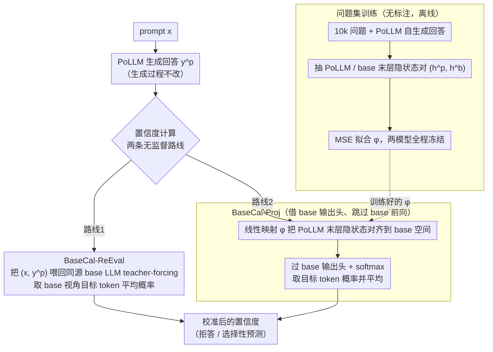

# BaseCal: Unsupervised Confidence Calibration via Base Model Signals

**会议**: ACL 2026  
**arXiv**: [2601.03042](https://arxiv.org/abs/2601.03042)  
**代码**: https://github.com/Tan-Hexiang/BaseCal (有)  
**领域**: 模型校准 / LLM 可靠性  
**关键词**: confidence calibration, post-trained LLM, base model, 隐状态投影, 无监督

## 一句话总结
观察到 base LLM 在 free-form QA 上仍然保持良好校准、而 post-trained LLM（PoLLM）严重过自信，BaseCal 提出两种无监督方案——把 PoLLM 的回答喂进 base LLM 拿 token 概率做置信度（BaseCal-ReEval），或用一层线性投影把 PoLLM 末层隐状态映射回 base LLM 空间再过 base 的输出层（BaseCal-Proj），在 5 个数据集 × 3 个模型族上把 ECE 相对最佳无监督基线平均降低 42.9%。

## 研究背景与动机
**领域现状**：可靠的置信度是缓解 LLM 幻觉的核心抓手——有了校准的 confidence 就能拒答、能向用户报警。校准方法分两类：有监督（temperature scaling、calibration-tuning）依赖人工标注难以扩展；无监督（聚合 token 概率、P(true)、verbalized confidence、semantic entropy）虽不需标签但都从 PoLLM 自身取信号。

**现有痛点**：post-training（SFT / RLHF / DPO / RLVR）会系统性地把模型推向过自信——错答案也敢给 0.9。Llama3.1-8B-Instruct 在 SQuAD 上 vanilla 概率 ECE 高达 0.5255；Olmo2 的 SFT/DPO/Instruct 三个 checkpoint 都显示 post-training 一致地破坏校准。所有从 PoLLM 自身取信号的无监督方法都被这层"过自信油漆"污染。

**核心矛盾**：要无监督校准，就必须找到**不依赖 PoLLM 自身概率的外部参考信号**；但又不能引入新的训练标注或模型修改，否则就失去了 unsupervised + plug-and-play 的工程价值。

**本文目标**：(i) 找到一个天然存在、与 PoLLM 同源、无需标注的参考信号；(ii) 设计低成本的方式把这个信号映射到 PoLLM 的回答上，不破坏生成质量。

**切入角度**：作者观察到——既然 base LLM 普遍训练良好（pretraining loss 与下一 token 真实分布对齐），它们应当比微调后的 PoLLM 更接近真实概率分布。在 TriviaQA、NQ、Qwen / Llama / Olmo 三族上的 calibration plot 验证了这一直觉：base LLM 的可靠性曲线接近对角线，而 PoLLM 普遍位于对角线下方（过自信）。

**核心 idea**：用 PoLLM 同源的 base LLM 作为"诚实参照"，把 PoLLM 生成的回答打分映射到 base LLM 的概率空间，从而恢复校准；并用一层线性投影替代 base LLM 前向以摊掉推理成本。

## 方法详解

### 整体框架
设 $\mathcal{M}_p$ 为 PoLLM、$\mathcal{M}_b$ 为同族 base LLM。$\mathcal{M}_p$ 像往常一样针对 prompt $x$ 生成回答 $y^p=(y_1^p,\dots,y_T^p)$。BaseCal 不改动 $\mathcal{M}_p$ 的生成过程，只接管"置信度计算"环节。两条路线：(1) **BaseCal-ReEval**：把 $(x, y^p)$ 喂给 $\mathcal{M}_b$ 强制解码，取 base LLM 给到 $y_t^p$ 的平均 token 概率作为置信度；(2) **BaseCal-Proj**：训练一个线性映射 $\phi_\theta:\mathbb{R}^d\to\mathbb{R}^d$，把 $\mathcal{M}_p$ 末层隐状态投到 $\mathcal{M}_b$ 末层空间，再过 $\mathcal{M}_b$ 的输出层 $W_b^o$ 得到近似 base 概率分布，从而避免 base 的整次前向。两种方案都是 plug-and-play、无监督（不要 ground-truth 标签）、不修改模型参数。

### 关键设计

**1. BaseCal-ReEval：把 PoLLM 的回答拿去 base LLM 上"复读"，用 base 的概率当置信度**

所有从 PoLLM 自身概率取信号的方法都被那层"过自信油漆"污染，最直接的破局是换一个没被污染的打分者。BaseCal-ReEval 不动 PoLLM 的生成，只把生成好的回答 $y^p$ 喂回同源 base LLM 做 teacher-forcing，置信度取 base 视角下每个目标 token 的平均概率 $c_b(x,y^p)=\frac{1}{T}\sum_{t=1}^T P_{\mathcal{M}_b}(y_t^p\mid x,y_{<t}^p)$。因为 base 的概率分布更贴近 token 真实分布，它对一段错答的整体概率自然偏低、对正确答偏高，平均下来就是一条"天生有校准"的置信度。代价是推理时多一次 base 的整次前向——这正是下一个设计要消掉的开销。

**2. BaseCal-Proj：用一层 $d\times d$ 线性映射"借" base 的输出头，跳过它的 transformer 前向**

ReEval 简单有效但延迟翻倍。BaseCal-Proj 的观察是：隐状态比概率含更丰富的信息，而校准信息恰好与输出层正交可分离，因此不必真的跑一遍 base，只需把 PoLLM 的末层隐状态"搬"到 base 的表示空间。具体地，对训练集中每条 $(x, y^p)$ 同时抽取 $\mathcal{M}_p$ 和 $\mathcal{M}_b$ 在每个位置的末层隐状态 $(h^p_{t-1}, h^b_{t-1})$，用 MSE 训练线性映射 $\phi_\theta(h^p)=Wh^p+b$ 去拟合 $h^b$；推理时只做 $\text{softmax}(W_b^o\,\phi_\theta(h^p_{t-1}))[y_t^p]$ 取目标 token 概率再平均，相当于借了 base 的 head 却跳过了它所有的 transformer 块。TSNE 可视化显示投影后的隐状态与 base 高度重合，说明这层平移确实把 PoLLM 末态对齐到了 base 空间。

**3. 训练只用"问题集"：监督信号是 base 的隐状态，不碰任何答案标签**

如果投影训练还需要 ground-truth answer 或 correctness 标签，就退回到了有监督校准、失去 plug-and-play 价值。BaseCal-Proj 把校准重新表述为"表示空间对齐"——训练集是从 TriviaQA / NQ / SQuAD / WebQ 等抽出的 10k 个**问题**，配 PoLLM 自己生成的回答，监督信号则是同输入下 base LLM 的隐状态，早停由 2k 问题的验证集 MSE 触发，全程不需要任何正确性标注。这一表述上的转变带来了关键好处：它对齐的是表示而非特定数据集的 accuracy 分布，因此跨数据集 OOD 评测时几乎无掉点（见 RQ2），而 temperature scaling 这类拟合 correctness 的方法在换数据集时会严重过拟合。

### 损失函数 / 训练策略
默认 $\phi_\theta$ 为单层线性映射，损失 $\mathcal{L}_{\text{MSE}}=\frac{1}{T}\sum_t \|\phi_\theta(h^p_{t-1})-h^b_{t-1}\|_2^2$。同时探索 MAE / Cosine / 三层 MLP，结论是 MSE 与 MAE 接近且都稳；Cosine 在 TriviaQA 上崩盘（ECE 0.5+），说明仅对齐角度不足以恢复校准。$\mathcal{M}_p,\mathcal{M}_b$ 在训练全程冻结，只更新 $W,b$。

## 实验关键数据

### 主实验
五个数据集 × 三个 PoLLM 的 ECE↓（节选）：

| Method | Unsup. | TriviaQA (Llama) | NQ (Llama) | SQuAD (Llama) | TriviaQA (Qwen) | MMLU (Qwen) |
|--------|--------|------------------|------------|----------------|------------------|-------------|
| Temp. Scaling (supervised) | ✗ | 0.0226 | 0.0460 | 0.0911 | 0.0895 | 0.2261 |
| Vanilla (avg token prob) | ✓ | 0.1725 | 0.4532 | 0.5255 | 0.3406 | 0.2569 |
| P(true) | ✓ | 0.2476 | 0.4439 | 0.5532 | 0.2113 | 0.3204 |
| Verbalization | ✓ | 0.1769 | 0.2689 | 0.3603 | 0.2889 | 0.1972 |
| Semantic Entropy | ✓ | 0.2443 | 0.4927 | 0.4645 | 0.3583 | 0.2858 |
| DACA (multi-choice only) | ✓ | – | – | – | – | 0.0703 |
| **BaseCal-Proj** | ✓ | **0.0387** | 0.2488 | 0.3134 | 0.1393 | 0.0889 |
| **BaseCal-ReEval** | ✓ | **0.0309** | **0.2462** | **0.2959** | **0.1120** | **0.0393** |

在 30 个 (数据集×模型×指标) 设置里 BaseCal 拿下 29 个最优；BaseCal-ReEval 相对最强无监督基线平均降 ECE 42.9%，BaseCal-Proj 降 35.3% 且几乎无额外推理开销。在 TriviaQA / MMLU 上 BaseCal 甚至打平有监督的 Temperature Scaling。

### 消融实验

| 维度 | 配置 | TriviaQA ECE | 备注 |
|------|------|--------------|------|
| 投影架构 (Llama) | 1-layer Linear | **0.0387** | 默认 |
| 投影架构 (Llama) | 3-layer MLP+ReLU | 0.1526 | 更复杂反而更差 |
| 损失函数 (Llama) | MSE | **0.0387** | 默认 |
| 损失函数 (Llama) | MAE | 0.0447 | 与 MSE 接近 |
| 损失函数 (Llama) | Cosine | 0.6125 | 角度对齐崩 |
| 模型规模 (Qwen, TriviaQA) | 7B vanilla→Proj→ReEval | 0.3406 → 0.1393 → 0.1120 | 各规模均显著降 |
| 模型规模 (Qwen, TriviaQA) | 14B | 0.2687 → 0.0778 → 0.0663 | |
| 模型规模 (Qwen, TriviaQA) | 32B | 0.2662 → 0.0854 → 0.0542 | |
| 模型规模 (Qwen, TriviaQA) | 72B | 0.2089 → 0.0502 → 0.0440 | base 越强收益越大 |
| Post-train 阶段 (Olmo2, TriviaQA) | SFT / DPO / Instruct | 0.0582 / 0.0269 / 0.0314 | 三种 post-train 都能救 |

### 关键发现
- **base LLM 在 free-form QA 上仍然校准**：Figure 2 显示 Qwen / Llama / Olmo 三族 base 的 reliability bar 都贴近对角线，PoLLM 普遍在下方过自信——这是整篇工作的实证基石。
- **简单线性投影就够**：3 层 MLP 几乎没收益甚至更差，验证了"校准信息没被 post-train 抹掉，只是发生了一个简单的表示空间偏移"。
- **跨数据集泛化强**：BaseCal-Proj 在 SQuAD/NQ/TriviaQA/WebQ 互换训练—测试时 $\Delta\text{ECE}\approx +0.0005$（几乎无掉点），而 Temperature Scaling $\Delta\text{ECE}\approx -0.0886$（严重过拟合训练集的 correctness 分布）。
- **大模型受益更大**：72B 上 BaseCal-Proj 把 ECE 从 0.21 砍到 0.05；可能因为更大的 base LLM 本身校准更好，给 PoLLM 提供了更强的对齐目标。
- **下游收益**：selective classification（阈值 0.5–0.95）下 BaseCal-Proj 在所有 cutoff 上都比 vanilla 准确率更高，说明它给出的高置信度样本确实更可靠。
- **失败模式**：Verbalization 在 Olmo2-7B-NQ 上偶然不错，但在 Qwen2.5-7B 上崩到 0.4718，说明依赖 instruction-following 的口头报告法不稳；BaseCal 在所有 30 设置里都是 top-2。

## 亮点与洞察
- **"找一个更诚实的同源参照"是一种新范式**：之前所有无监督校准都试图榨干 PoLLM 自己，本文转而问"谁是 PoLLM 的诚实兄弟"，用 base LLM 作为外部参考；这一思路完全可以套到 reward modeling、hallucination detection 等其他 trust-related 问题上。
- **隐状态线性可对齐 = post-train 没毁掉表示，只是平移了**：单层线性映射就能恢复校准且跨数据集稳，暗示 post-training 对内部表示是相对温和的几何变换。这与 RLHF / DPO 多以 KL 约束训练相吻合，也为未来"post-train 后保留 calibration head"的设计提供了直接证据。
- **BaseCal-Proj 把推理成本压到几乎为零**：只多一个 $d\times d$ 矩阵乘 + base 输出层一次 softmax，比 semantic entropy / verbalization 这类需要多次采样或多次前向的方法快得多，工程上立即可上线。
- **跨 post-train 策略一致有效**：SFT / DPO / RLVR 都能被同一招拯救，说明过自信不是某种 RL 特有 bug 而是 post-training 的共性副作用，这对未来对齐方法设计是个重要警示。

## 局限与展望
- 必须能访问 base LLM 的 final hidden state 与 output head（对 OpenAI / Anthropic 等闭源 API 不适用），生态上更适合开源 + 自研模型；
- 评测主要在事实型短答 QA + MMLU，长文本生成、复杂多步推理、代码等场景下 base 是否仍更校准、置信度是否仍可平均聚合，需要进一步验证；
- 只解释了"是什么"（base 更校准）而没解释"为什么"——是 pretraining 的 cross-entropy 目标、还是 RLHF 引入的偏置导致 collapse，仍是开放问题；
- BaseCal-Proj 训练问题集需要 10k 条，对超小数据领域（医学/法律）需要重新校验数据规模；
- 可延伸：把 base 当作"诚实先验"用于 RLHF 训练阶段的 calibration regularizer（而不是仅事后投影），或扩展到多模态 base→PoLLM 的同源对齐。

## 相关工作与启发
- **vs DACA (Luo et al., 2025)**: DACA 在概率层做单 temperature 重缩放，且只能在 base 和 PoLLM top-1 token 一致时工作，仅限多选题；BaseCal 在隐状态层做对齐，原生支持 free-form QA，MMLU 上也比 DACA 更好（Qwen 上 0.0393 vs 0.0703）。
- **vs Temperature Scaling**: TS 是有监督的 post-hoc fit，依赖 correctness 标签且强烈过拟合训练集的 accuracy 分布；BaseCal 无监督、跨集稳。
- **vs Semantic Entropy / P(true) / Verbalization**: 它们从 PoLLM 自身取信号，仍带过自信偏置；BaseCal 引入外部诚实参照，结构上规避了这一污染源。
- **vs Calibration-aware Fine-tuning (Xiao 2025, Wang 2025)**: 它们修改 PoLLM 参数把校准训进去；BaseCal 完全 plug-and-play，不改 PoLLM 一字。
- **vs Hidden State Probing for Hallucination (Orgad 2025)**: 同样利用末层隐状态，但 Orgad 等做 supervised probe 检测幻觉，BaseCal 做 unsupervised projection 恢复概率校准，目标更直接。

## 评分
- 新颖性: ⭐⭐⭐⭐ "base 是 PoLLM 的诚实兄弟" + 隐状态线性投影组合，思路简洁有力。
- 实验充分度: ⭐⭐⭐⭐⭐ 5 数据集 × 3 模型族 × 4 模型规模 × 3 post-train 阶段 + 投影结构/损失/泛化全面消融。
- 写作质量: ⭐⭐⭐⭐ 动机一路从观察到方法推导得很顺，TSNE 可视化和 calibration bar 图都很直观。
- 价值: ⭐⭐⭐⭐ 给现成的开源 PoLLM 提供了一个零侵入、低成本的校准方案，工程价值高。

<!-- RELATED:START -->

## 相关论文

- [\[ACL 2026\] CadLLM: Improving the Throughput of Diffusion-based LLMs via Training-Free Confidence-Aware Calibration](improving_the_throughput_of_diffusion-based_large_language_models_via_a_training.md)
- [\[NeurIPS 2025\] PPG-Distill: Efficient Photoplethysmography Signals Analysis via Foundation Model Distillation](../../NeurIPS2025/model_compression/ppg-distill_efficient_photoplethysmography_signals_analysis_via_foundation_model.md)
- [\[ICML 2026\] Multi-Adapter Representation Interventions via Energy Calibration](../../ICML2026/model_compression/multi-adapter_representation_interventions_via_energy_calibration.md)
- [\[ACL 2026\] VecCISC: Improving Confidence-Informed Self-Consistency with Reasoning Trace Clustering and Candidate Answer Selection](veccisc_improving_confidence-informed_self-consistency_with_reasoning_trace_clus.md)
- [\[ICML 2025\] ConfPO: Exploiting Policy Model Confidence for Critical Token Selection in Preference Optimization](../../ICML2025/model_compression/confpo_exploiting_policy_model_confidence_for_critical_token_selection_in_prefer.md)

<!-- RELATED:END -->
