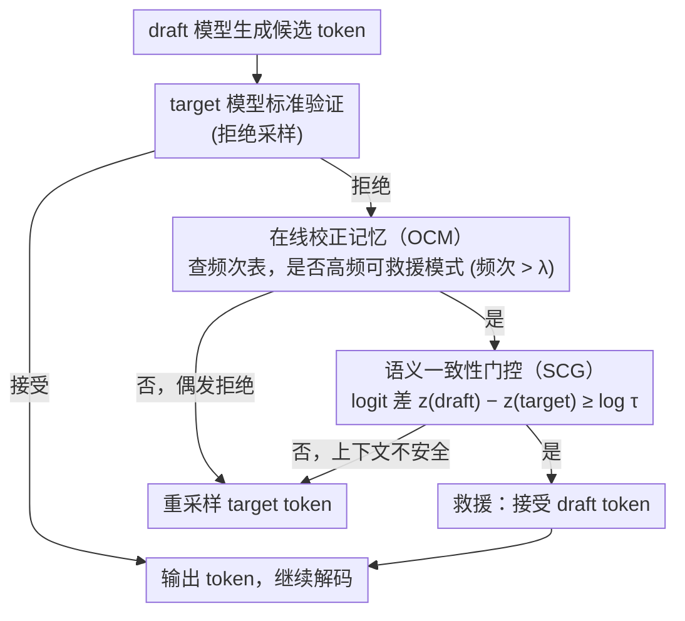

# Calibrated Speculative Decoding: Frequency-Guided Candidate Selection for Efficient Inference

**会议**: ACL 2026  
**arXiv**: [2604.13634](https://arxiv.org/abs/2604.13634)  
**代码**: 无  
**领域**: 模型压缩  
**关键词**: 推测解码, 虚假拒绝, 在线校正记忆, 语义一致性门控, 训练免

## 一句话总结
CSD 提出一种训练免的推测解码增强框架，通过在线校正记忆（OCM）记录高频拒绝模式提供救援候选，再用语义一致性门控（SCG）基于概率比验证候选可靠性，将推测解码的吞吐量提升至最高 2.33×，同时在 HumanEval 和 MATH500 上甚至提升了准确率。

## 研究背景与动机

**领域现状**：推测解码（Speculative Decoding）是 LLM 推理加速的主流范式，用轻量 draft 模型生成候选 token，再由 target 模型并行验证。标准验证使用拒绝采样保证输出分布不变。

**现有痛点**：现代小模型（如 Llama-3.2-1B）已具备很强的推理能力，但标准验证是严格 token 级精确匹配，导致大量"虚假拒绝"——draft 模型生成了语义正确但词汇不同的 token（如 `x` vs `*`），后续正确 token 全部被丢弃。

**核心矛盾**：draft 模型越强、推理能力越好，它选择的表达方式与 target 模型的词汇偏好差异就越大，反而导致更多虚假拒绝，效率提升受限于精确匹配这个天花板。

**本文目标**：在不训练任何额外模型的前提下，从虚假拒绝中恢复有效 token，打破精确匹配的接受率上限。

**切入角度**：对拒绝模式的统计分析发现两个关键观察：（1）前 20% 高频拒绝模式贡献了 69% 的总拒绝数（长尾分布）；（2）同一 token 对在不同上下文中的概率比跨越多个数量级（强上下文依赖）。

**核心 idea**："频率引导候选选择 + 概率守护接受"——用历史统计提名救援候选，用 target 模型的实时置信度做门控。

## 方法详解

### 整体框架
CSD 是标准推测解码的即插即用增强。在 draft token 被拒绝时启动救援流程：先查询在线校正记忆（OCM）判断该拒绝模式是否为高频模式，再通过语义一致性门控（SCG）验证 draft token 在当前上下文中是否具有足够的 target 模型置信度。两个条件同时满足则接受 draft token 而非重采样。

### 关键设计

**1. 在线校正记忆（OCM）：用一张频次表记住"谁经常被冤枉拒绝"，把高频拒绝模式标成可救援**

虚假拒绝并非均匀分布——统计显示前 20% 高频拒绝模式贡献了 69% 的总拒绝（强长尾），意味着只要抓住少量系统性差异就能覆盖大部分可恢复情况。OCM 为此维护一张 $(draft\_token, target\_token)$ → 频次的记忆表 $\mathcal{T}$，分两段工作：先用无标签语料做离线校准初始化频次，推理时再动态累加，一旦某模式频次超过阈值 $\lambda$ 就把它标记为"可救援"。整个校准只采集统计量、不更新任何参数，因此这层先验本质上是"哪些 draft→target 替换是反复出现的良性偏好"，给后续救援提供了上下文无关的候选名单。

**2. 语义一致性门控（SCG）：在 logit 空间直接比一刀，确认这次替换在当前上下文里也安全**

频率先验是上下文无关的，但同一个 "a→the" 替换在某些语境良性、在另一些语境会改变语义，光靠频次会误接受。SCG 因此引入 target 模型的实时置信度做最终裁决：直接比较 draft token 与 target token 的原始 logit 差 $z_i(\tilde{x}_i) - z_i(t^*) \geq \log \tau$（默认 $\tau=0.01$ 的宽松阈值）。这一形式等价于概率比检验，却省掉了 softmax 计算、且对采样温度不变。换言之 OCM 回答"该不该考虑救这个 token"，SCG 回答"此刻救它安不安全"，两者一个管频率、一个管上下文，正好互补。

**3. 双阶段协同：频率提名 + 置信度验证缺一不可，单用任一层都会掉准确率**

这两层不是可选的增强，而是互为安全保障。消融显示单独用 OCM（不看上下文）会接受错误 token、单独用 SCG（门控太松）会接受非系统性的偶然匹配，两种情况准确率都下降；只有"频率过滤 + 置信度验证"联合时，才能在提升接受率的同时保持甚至提升准确率。本质上这是一个"提名—验证"的双重保险：OCM 负责缩小怀疑范围、SCG 负责逐 token 放行，避免了任何单一松弛策略带来的失控风险。

### 损失函数 / 训练策略
CSD 完全无需训练。校准阶段仅用 2000-8000 个样本做统计收集（约 1.5 小时/千样本），推理时 OCM 的动态更新零额外计算开销。

## 实验关键数据

### 主实验

| 数据集 | 指标 | CSD | SpecDecode | Vanilla | 提升 |
|--------|------|-----|------------|---------|------|
| MATH500 (Llama-3) | 加速比 | 2.33× | 1.89× | 1.00× | +23.3% |
| HumanEval (Llama-3) | 加速比 | 2.33× | 1.90× | 1.00× | +22.6% |
| MATH500 (Llama-3) | 准确率 | 48.0% | 45.4% | 46.0% | +2.0 pts |
| HumanEval (Llama-3) | 准确率 | 79.3% | 76.8% | 76.8% | +2.5 pts |
| 平均 (Llama-3) | 加速比 | 2.02× | 1.75× | 1.00× | +15.4% |
| 平均 (Qwen-2.5) | 加速比 | 1.86× | 1.66× | 1.00× | +12.0% |

### 消融实验

| 配置 | MATH500 Acc | MATH500 AR | HumanEval Acc | 说明 |
|------|------------|------------|---------------|------|
| SpecDecode (baseline) | 45.4% | 63.6% | 76.8% | 标准推测解码 |
| SD + OCM only | 37.8% | 83.1% | 70.7% | 接受率上升但准确率大幅下降 |
| SD + SCG only | 43.6% | 88.7% | 70.7% | 同样准确率下降 |
| CSD (OCM + SCG) | 48.0% | 79.6% | 79.3% | 协同使用反而提升准确率 |

### 关键发现
- 被恢复的 token 主要分四类：数学格式（~45%）、标点空格（~20%）、词汇同义词（~20%）、推理连接词（~15%），都是语义中性的表面差异
- CSD 在推理任务上准确率反而提升，假说是 draft 模型帮助 target 模型逃离贪心解码的局部最优
- 高级加速方案（Lookahead、SWIFT）在 70B 模型上可能产生负加速（额外 FLOPs 成为瓶颈），CSD 因开销极小所以收益直接转化为吞吐量

## 亮点与洞察
- **"提名-验证"的双层架构**设计精巧：OCM 负责"应该救谁"（频率先验），SCG 负责"能否安全救"（实时验证），两者缺一不可的消融结果非常有说服力
- **准确率提升**的发现很有启发性——推测解码不仅是加速工具，还可能是贪心解码的正则化手段，draft 模型的替代路径可能避开了 target 的 greedy trap
- 整个框架完全 training-free 且与标准推测解码正交，可以叠加到任何现有方案上

## 局限与展望
- 校准阶段需要领域相关的无标签数据，跨域泛化需要分别校准
- 记忆表随推理在线增长，长期部署的内存管理策略未讨论
- 仅在 greedy decoding 下评估，高温采样场景的表现未知
- 对于创意生成等需要词汇多样性的任务，恢复"相似 token"可能降低多样性

## 相关工作与启发
- **vs Standard SpecDecode**: 标准方案严格精确匹配保证无损，CSD 通过松弛匹配实现更高吞吐量且在推理任务上意外提升准确率
- **vs Fly**: Fly 用延迟窗口做精确匹配一致性检验，在序列边界处容易失败；CSD 做逐 token 独立验证更灵活
- **vs Lossy SD**: 静态阈值松弛缺乏粒度（全局 $\tau=0.6$），CSD 通过频率过滤提供更精细的松弛控制

## 评分
- 新颖性: ⭐⭐⭐⭐ 虚假拒绝问题的形式化和双层恢复机制设计新颖
- 实验充分度: ⭐⭐⭐⭐⭐ 两个模型族、四个 benchmark、详细消融和敏感性分析、恢复 token 类型分析
- 写作质量: ⭐⭐⭐⭐ 动机清晰，"Frequency-Guided Selection, Probability-Guarded Acceptance"的口号贯穿全文

<!-- RELATED:START -->

## 相关论文

- [\[ACL 2026\] SSSD: Simply-Scalable Speculative Decoding](sssd_simply-scalable_speculative_decoding.md)
- [\[AAAI 2026\] Steering Pretrained Drafters during Speculative Decoding](../../AAAI2026/model_compression/steering_pretrained_drafters_during_speculative_decoding.md)
- [\[ICML 2025\] Speculative Decoding in Decentralized LLM Inference: Turning Communication Latency into Computation Throughput](../../ICML2025/model_compression/speculative_decoding_in_decentralized_llm_inference_turning_communication_latenc.md)
- [\[NeurIPS 2025\] Traversal Verification for Speculative Tree Decoding](../../NeurIPS2025/model_compression/traversal_verification_for_speculative_tree_decoding.md)
- [\[ICML 2026\] LK Losses: Direct Acceptance Rate Optimization for Speculative Decoding](../../ICML2026/model_compression/lk_losses_direct_acceptance_rate_optimization_for_speculative_decoding.md)

<!-- RELATED:END -->
