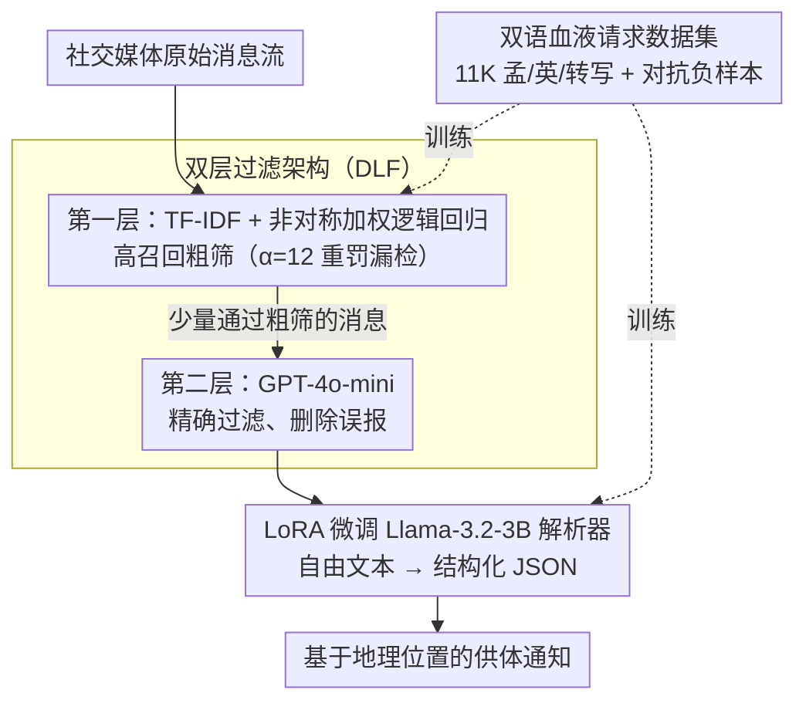

# CBRS: Cognitive Blood Request System with Bilingual Dataset and Dual-Layer Filtering

**会议**: ACL 2026 Findings  
**arXiv**: [2604.16665](https://arxiv.org/abs/2604.16665)  
**代码**: [GitHub](https://github.com/aaniksahaa/CBRS)  
**领域**: 模型压缩  
**关键词**: 血液捐献请求, 双语数据集, 双层过滤, 低资源语言, 信息提取

## 一句话总结
CBRS 提出一个多平台框架，通过双层过滤架构（轻量分类器 + LLM）从社交媒体消息流中高效检测并解析血液捐献请求，构建了首个包含 11K 条孟加拉语-英语-转写孟加拉语的血液捐献请求数据集，LoRA 微调的 Llama-3.2-3B 在解析任务上达到 92% 零样本准确率。

## 研究背景与动机

**领域现状**：社交媒体上的紧急血液捐献请求经常被海量日常消息淹没，传统基于 app 的系统依赖手动输入，在低资源环境中难以触达用户。现有灾难信息提取研究主要关注英语和高资源语言。

**现有痛点**：（1）消息量巨大但血液请求占比极低，需要高效过滤；（2）纯 LLM 过滤不可扩展（推理成本高），纯轻量模型漏检率高；（3）仅检测不够，还需要从自由文本中解析结构化信息（血型、医院、联系方式等）；（4）孟加拉语缺乏相关数据集。

**核心矛盾**：在血液请求检测中，漏检（false negative）的代价远高于误报（false positive），但追求高召回率会增加下游处理负担。

**本文目标**：构建一个成本高效、多语言、多平台的血液捐献请求检测与解析系统。

**切入角度**：用双层架构解耦"高召回率过滤"和"高精度验证+解析"两个目标。

**核心 idea**：第一层用非对称加权的轻量分类器确保高召回率，第二层用 LLM 同时完成精确过滤和结构化解析，两层共享一次 API 调用。

## 方法详解

### 整体框架
CBRS 把"高召回检测"和"精确解析"解耦成一条串行流水线。社交媒体原始消息先进**第一层**（TF-IDF 特征 + 非对称加权逻辑回归）做高召回粗筛，宁可多放、绝不漏掉真实请求；通过粗筛的少量消息再进**第二层**（GPT-4o-mini），做精确过滤、删除误报。随后由一个 LoRA 微调的 Llama-3.2-3B **解析器**把自由文本转成血型、医院、联系方式等字段的 JSON。两层分类器与解析器的训练都依赖作者构建的 **11K 双语血液请求数据集**（含对抗负样本）。最终的结构化 JSON 交给基于地理位置的供体通知系统，下发给附近供体。

### 关键设计

**1. 双层过滤架构（DLF）：第一层宽进保召回，第二层严出做精确分类与解析**

直接拿 LLM 过滤社交媒体的全部消息成本过高，但纯轻量模型又漏检严重——而血液请求里漏检（false negative）的代价远高于误报。DLF 因此把"高召回过滤"和"高精度验证"解耦成两层：第一层用子词 tokenization + TF-IDF 特征 + 非对称加权二元交叉熵（$\alpha=12$ 重罚漏检）做粗筛，刻意把召回拉满、宁可多放；第二层用 GPT-4o-mini 对通过粗筛的少量消息做精确分类，把误报删掉。关键巧思是第二层的"精确分类"和后续的"结构化解析"复用同一次 API 调用，所以严出这一层并没有引入额外成本，整体 API 调用次数被第一层大幅压下来。

**2. 11K 双语血液请求数据集：补上孟加拉语这个低资源空白，并用对抗负样本练硬分类器**

低资源语言（孟加拉语）此前缺乏专门的血液请求语料，且社交媒体里的方言变体、俚语需要专门覆盖。作者从 15 个公开 Telegram 和 Facebook 群组采集 11K 正样本，覆盖孟加拉语、英语与转写孟加拉语三种形态；负样本则取自 BengaliNMT、BengaliTLit 等数据集。为了防止分类器靠"看到 blood / urgent 就报警"偷懒，还用 DeepSeek-V3 生成了一批含这些关键词却并非真实请求的对抗性负样本——正是这批难负样本逼着分类器学到真正的语义，显著提升了鲁棒性。

**3. LoRA 微调 Llama-3.2-3B 解析器：让一个小模型把自由文本变成结构化 JSON，零样本反超大模型 few-shot**

光检测出"这是血液请求"还不够，下游通知系统需要血型、医院、联系方式等结构化字段。作者用 LoRA（$r=32,\alpha=16$，仅训练 0.81% 参数）在 7.9K 文本-JSON 配对上微调 Llama-3.2-3B，输出 blood_group、bags_needed、hospital_name、contacts 等字段。结果是这个任务特化的 3B 小模型在零样本下就超过了 GPT-4o-mini 的 few-shot 表现，且推理成本低约 35 倍——印证了"窄任务上微调小模型优于通用大模型"，对成本敏感的公益部署尤其有意义。

### 损失函数 / 训练策略
第一层使用非对称加权二元交叉熵：$\mathcal{L} = -\alpha y \log P(y=1|\mathbf{z}) - (1-y)\log P(y=0|\mathbf{z})$，其中 $\alpha=12$。LoRA 微调使用标准交叉熵，4-bit 量化，学习率 $2 \times 10^{-4}$。

## 实验关键数据

### 主实验

| 方法 | 准确率 | 精确率 | 召回率 | F1 |
|------|--------|--------|--------|-----|
| DLF (Layer 1) | 0.99 | 0.99 | 0.99 | 0.99 |
| TFIDF+LogReg | 0.98 | 0.98 | 0.98 | 0.98 |
| DistilBERT | 0.98 | 0.98 | 0.98 | 0.98 |
| W2V+LogReg | 0.83 | 0.80 | 0.87 | 0.81 |

| 解析模型 | 零样本准确率 | 说明 |
|---------|------------|------|
| LoRA Llama-3.2-3B | 92% | 微调模型，零样本 |
| Base Llama-3.2-3B | ~50% | 未微调 (+41.54% 提升) |
| GPT-4o-mini (few-shot) | <92% | few-shot 仍不如微调零样本 |

### 消融实验

| 配置 | 关键指标 | 说明 |
|------|---------|------|
| 仅 Layer 1 | 高召回但较多误报 | 非对称加权保证召回 |
| Layer 1 + Layer 2 | 99% 准确率 | LLM 过滤消除误报 |
| 无对抗负样本 | 较低鲁棒性 | 对抗样本增强分类器鲁棒性 |

### 关键发现
- 双层架构有效平衡了效率和精度，第一层过滤掉大量无关消息，第二层消除误报
- LoRA 微调 3B 模型在解析上超越 GPT-4o-mini 等大模型的 few-shot，且输入 token 减少 35 倍
- 对抗性负样本（包含"blood""urgent"等关键词的非请求文本）显著提升分类器鲁棒性
- DLF 在推理速度上远优于 BERT 类模型

## 亮点与洞察
- **双层"宽进严出"架构**巧妙地利用了漏检和误报的不对称代价——第一层宁可多放，第二层精确删，且两层的精确过滤和解析共享同一次 API 调用
- 在低资源语言（孟加拉语+转写）上构建首个血液请求数据集有实际社会价值
- LoRA 微调小模型打败大模型 few-shot 的结果印证了"任务特异的小模型优于通用大模型"的趋势

## 局限与展望
- 数据集主要来自孟加拉国的社交媒体群组，其他地区和语言的泛化性未验证
- 系统依赖 GPT-4o-mini API，有成本和隐私问题
- 仅处理文本消息，未考虑图片中的血液请求信息
- 解析字段是预定义的，新类型的信息（如保险信息）需要重新定义 schema

## 相关工作与启发
- **vs Mathur et al. (2020)**: 他们仅在 Twitter 上识别血液请求，未做结构化解析，也未处理孟加拉语
- **vs CrisisBench**: 灾难信息提取的通用 benchmark，但不包含血液请求的专门任务
- **vs 直接用 LLM**: 不可扩展，DLF 的双层架构是一个可推广到其他领域的成本优化模式

## 评分
- 新颖性: ⭐⭐⭐ 双层过滤架构有工程价值但技术新颖性一般，主要贡献在数据集
- 实验充分度: ⭐⭐⭐⭐ 多模型对比、人工评估、实际部署测试
- 写作质量: ⭐⭐⭐ 结构完整但部分公式不必要，可以更简洁

<!-- RELATED:START -->

## 相关论文

- [\[CVPR 2026\] DualReg: Dual-Space Filtering and Reinforcement for Rigid Registration](../../CVPR2026/model_compression/dualreg_dual-space_filtering_and_reinforcement_for_rigid_registration.md)
- [\[ICLR 2026\] Understanding Dataset Distillation via Spectral Filtering](../../ICLR2026/model_compression/understanding_dataset_distillation_via_spectral_filtering.md)
- [\[ACL 2026\] Cognitive-Uncertainty Guided Knowledge Distillation for Accurate Classification of Student Misconceptions](cognitive-uncertainty_guided_knowledge_distillation_for_accurate_classification_.md)
- [\[ACL 2026\] Adaptive Layer Selection for Layer-Wise Token Pruning in LLM Inference](adaptive_layer_selection_for_layer-wise_token_pruning_in_llm_inference.md)
- [\[ACL 2026\] TELL-TALE: Task Efficient LLMs with Task Aware Layer Elimination](tell-tale_task_efficient_llms_with_task_aware_layer_elimination.md)

<!-- RELATED:END -->
