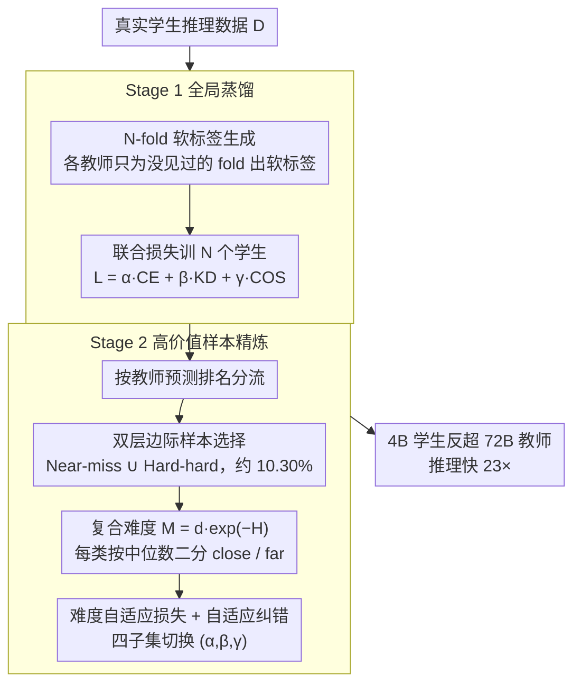

# Cognitive-Uncertainty Guided Knowledge Distillation for Accurate Classification of Student Misconceptions

**会议**: ACL 2026 Findings  
**arXiv**: [2605.14752](https://arxiv.org/abs/2605.14752)  
**代码**: https://github.com/RoschildRui/acl2026_map (有)  
**领域**: 模型压缩 / 知识蒸馏 / 教育 AI  
**关键词**: 学生误解分类, 两阶段蒸馏, 不确定性样本选择, 难度自适应损失, 边缘部署

## 一句话总结
论文用两阶段知识蒸馏 + 基于教师认知不确定性的"双层边际样本选择" + 难度自适应损失，在仅用 10.30% 真实样本增量训练的情况下，把 4B 学生模型在 MAP-Charting 上做到 MAP@3 = 0.9585（+17.8%），并在 220 题中学代数误解 benchmark 上以 84.38% 准确率超过 GPT-5（67.73%）与直接微调的 72B 教师（81.25%），同时推理速度比教师快 23×。

## 研究背景与动机

**领域现状**：教学评估正从"答对/答错"评分迁移到"理解学生推理过程"。NLP 端已有 LLM 把学生推理过程做细粒度误解分类的尝试（MisstepMath、MathEDU、Otero 2025 等），常见做法是用 LLM 合成大量训练数据 + 直接 fine-tune。

**现有痛点**：作者诊断出三个核心难题：(1) **数据稀缺与长尾**：真实学生推理过程难合成 —— LLM 生成的文字过于规范、流畅，与学生口语化、跳步、逻辑断裂的真实文本存在 distribution gap；(2) **标签噪声与边界模糊**：误解类别多、边界含糊，标注噪声大，传统 hard-label 模型学不到细粒度差异；(3) **部署悖论**：大模型有知识但因预训练偏置会无视学生的非标准但合理思路，并且因隐私 + 边端限制无法部署；小模型可部署但易过拟合到噪声标签。

**核心矛盾**：传统路径是"造更多数据"，但合成数据与真实数据分布偏差大；想用小模型部署又怕过拟合噪声；想用大模型当老师又怕把它的偏置一并蒸馏给学生。

**本文目标**：(1) 不靠大规模合成数据，而是从现有真实数据里挖"高价值样本"做增量训练；(2) 让小学生模型既能从软标签继承类间关系，又能区分模糊误解；(3) 用两阶段蒸馏抵抗大模型的"diversity 盲点"，让 4B 学生敢于识别非标准答题。

**切入角度**：作者把样本分成"教师高度自信 + 正确"、"看似对但低置信"、"严重错"等几类，用教师的认知不确定性作为信号，仅在最有信息量的"近 miss"和"硬 hard"样本上做二次蒸馏，并按样本类型动态分配 CE / KD / COS 三种损失的权重。

**核心 idea**：阶段一做全局蒸馏迁移基础能力 → 阶段二用"双层边际选择"挑出 ~10% 的高价值样本，用难度自适应损失（α/β/γ 按样本类型切换）针对性训练，让小模型不仅会答还会区分边界。

## 方法详解

### 整体框架
两阶段蒸馏，结构如图 2：

1. **Stage 1 (Global Distillation)**：用 stratified $n=5$-fold cross-validation 训练 $n$ 个教师 $f_t^{(k)}$，每个 fold 在 $\mathcal{D}\setminus\mathcal{D}_k$ 上训、为 $\mathcal{D}_k$ 生成软标签，避免 teacher 在自己见过的数据上过拟合。然后用 $\mathcal{L}=\alpha\mathcal{L}_{\text{CE}}+\beta\mathcal{L}_{\text{KD}}+\gamma\mathcal{L}_{\text{COS}}$（默认 $(0.33,0.33,0.34)$，见附录 grid search）训 $n$ 个学生模型，奠定基础分类能力。
2. **Stage 2 (High-Value Sample Selection + Adaptive Refinement)**：基于 Stage 1 教师预测把样本分成 Near-miss ($\mathcal{S}_{\text{NM}}$) 与 Hard-hard ($\mathcal{S}_{\text{HH}}$) 两类，再用复合难度指标 $\mathcal{M}(x_i,y_i)=d(x_i,y_i)\cdot e^{-H(x_i)}$ 把每类按中位数二分为 close / far 子集；对四个子集用不同 $(\alpha,\beta,\gamma)$ 组合训练学生模型。
3. 最终训练数据 = $\mathcal{S}_{\text{NM}} \cup \mathcal{S}_{\text{HH}}$，占总样本约 10.30%。

### 关键设计

**1. 双层边际样本选择：让 ~10% 数据承担最大学习负担**

完全已会的样本对决策边界毫无贡献，真正决定 fine-grained 误解分类的是"边界附近模糊"和"完全偏离"两端，因此第二阶段不再喂全量数据，而是用教师的认知不确定性把这两端挑出来。第一层按教师预测排名切样本：Near-miss 集合 $\mathcal{S}_{\text{NM}}=\{(x_i,y_i):[(\hat{y}_i=y_i)\land(p^{(1)}-p^{(2)})\leq\delta)]\lor \text{rank}(y_i)\in\{2,3\}\}$ 收的是"正确但低置信、或正确答案只排第 2/3"的样本，它们直接决定分类边界；Hard-hard 集合 $\mathcal{S}_{\text{HH}}=\{(x_i,y_i):\text{rank}(y_i)>3\}$ 收的是严重错答，暴露知识漏洞。

第二层再用复合难度指标把每一类按中位数二分为 close / far：

$$\mathcal{M}(x_i,y_i)=d(x_i,y_i)\cdot e^{-H(x_i)}$$

其中 $d$ 是概率边际、$H$ 是预测熵。$e^{-H(x_i)}$ 是这里最关键的乘子——熵小时它放大难度（模型自信地错，最该重点纠正），熵大时它衰减（模型自己也犹豫，样本本身可能就模糊，不必死磕）。两层切下来，最终的 $\mathcal{S}_{\text{NM}} \cup \mathcal{S}_{\text{HH}}$ 只占全量约 10.30%，却扛起了第二阶段的全部增量训练；$\delta=0.05$、fold 数 $K=5$ 由 grid search 选出（见 Figure 4）。

**2. 难度自适应损失：在不同样本上让不同信号说话**

传统 KD 全程固定权重，对"边界模糊"和"严重噪声"两种截然不同的样本一视同仁，效果自然打折。本文让总损失 $\mathcal{L}_{\text{total}}=\alpha\mathcal{L}_{\text{CE}}+\beta\mathcal{L}_{\text{KD}}+\gamma\mathcal{L}_{\text{COS}}$ 的三元组 $(\alpha,\beta,\gamma)$ 随四类子集切换：$\mathcal{S}_{\text{NM}}^{\text{close}}\!\to\!(1,0,0)$、$\mathcal{S}_{\text{NM}}^{\text{far}}\!\to\!(1,1,1)$、$\mathcal{S}_{\text{HH}}^{\text{close}}\!\to\!(0,1,1)$、$\mathcal{S}_{\text{HH}}^{\text{far}}\!\to\!(1,1,1)$。

其中最反直觉、也最精巧的是 NM-close 上的 $(1,0,0)$：当样本已经接近正确但边界仍紧时，软标签的"平滑性"反而成了敌人，会把本就该锐利的边界抹糊，所以这里干脆把 $\beta=\gamma=0$，只用 hard label 强约束。相对地，HH-close（接近真值但显著偏离）改信教师软标签 $(0,1,1)$ 来抗噪，两端的 far 子集则 hard + soft 双保险——同一个损失框架，按样本难度让 CE / KD / COS 各自在最该出力的地方出力。

**3. N-fold 软标签生成 + 自适应纠错：让 4B 学生反超 72B 教师**

"压缩"和"超越"通常是对立目标，本文却让 Qwen3-4B 学生在准确率上盖过 Qwen2.5-72B 教师，靠的是三条相互配合的路径。其一，Stage 1 用 StratifiedKFold 让每个教师 $f_t^{(k)}$ 只为自己没见过的 fold 生成软标签，避免在见过的数据上 confidence inflation。其二，Stage 2 在 NM-far / HH-far 子集上借难度自适应损失抬高 ground-truth 的监督权重，等于"当教师自信地错"时让学生听真相而非盲从教师。其三，整套增量训练只动 10.30% 真实样本，小模型不会被海量噪声标签拖坏。

作者把反超明确归因于三点：教师的预训练偏置（系统性无视学生非标准但合理的思路）、任务特化（聚焦不确定性区域）、自适应纠错（教师自信出错时让学生回到 ground truth）。这是 KD 文献里少见的"教师不必是上界"实证，对教育、医疗等专家偏置强的领域尤其有方法论价值。

### 损失函数 / 训练策略
- **Stage 1**：$\mathcal{L}_{\text{CE}}=-\log p_s(y_i|x_i)$ + $\mathcal{L}_{\text{KD}}=\tau^2\cdot\text{KL}(p_t\|p_s)$（$\tau=1.0$）+ $\mathcal{L}_{\text{COS}}=1-\cos(p_s,p_t)$，$(\alpha,\beta,\gamma)=(0.33,0.33,0.34)$，AdamW lr=2×10⁻⁴（student）、1×10⁻⁴（teacher），batch=16，grad acc=4。
- **Stage 2**：增量学习率 1×10⁻⁶，max_grad_norm=4，按四类样本切 $(\alpha,\beta,\gamma)$（见 Appendix A）。
- **底座**：学生 = Qwen-3-4B / Gemma-2-9B / Llama-3.1-8B，教师 = Qwen-2.5-72B。

## 实验关键数据

### 主实验 (MAP-Charting + Algebra Misconception)

| 方法 | MAP-Charting MAP@3 | MAP@10 | Acc | F1@3 | Algebra Misc. MAP@3 | Acc |
|---|---|---|---|---|---|---|
| **Prompting baselines** | | | | | | |
| GPT-5 | 0.8137 | 0.8145 | 0.7225 | 0.4626 | 0.7409 | 0.6773 |
| Claude-4-Sonnet | 0.7833 | 0.7841 | 0.6914 | 0.4579 | 0.6636 | 0.5636 |
| Qwen-2.5-72B (prompt) | 0.7285 | 0.7293 | 0.6222 | 0.4328 | 0.6280 | 0.5320 |
| **Fine-tuned** | | | | | | |
| Qwen-2.5-72B (FT) | 0.9497 | 0.9501 | 0.9014 | 0.4993 | 0.8438 | 0.8125 |
| Qwen-3-4B (FT) | 0.9472 | 0.9475 | 0.8987 | 0.4992 | 0.7552 | 0.7188 |
| **Ours (两阶段蒸馏)** | | | | | | |
| **Qwen-3-4B + Ours** | **0.9585** | **0.9587** | **0.9198** | **0.4996** | **0.8750** | **0.8438** |
| Gemma-2-9B + Ours | 0.9560 | 0.9562 | 0.9148 | 0.4995 | 0.8015 | 0.7656 |
| Llama-3.1-8B + Ours | 0.9553 | 0.9555 | 0.9134 | 0.4995 | 0.7865 | 0.7564 |

Qwen-3-4B + Ours 在 MAP-Charting 上比 GPT-5 高 17.8% MAP@3，比 72B 教师直接 FT 高 1.0% MAP@3、1.8% Accuracy，4B 学生反超 72B 教师约 0.9-2 个百分点。

### 消融 (Qwen-3-4B, MAP-Charting + Algebra)

| 配置 | MAP-Charting MAP@3 / Acc | Algebra MAP@3 / Acc | 说明 |
|---|---|---|---|
| **Full Method** | **0.9585 / 0.9198** | **0.8750 / 0.8438** | 完整方法 |
| w/o Adaptive Loss | 0.9540 / 0.9123 | 0.8657 / 0.8321 | 全部用统一损失 |
| w/o Sample Selection | 0.9519 / 0.9085 | 0.8603 / 0.8269 | 用全量数据 |
| w/o Stage-1 Distillation | 0.9546 / 0.9132 | 0.8679 / 0.8342 | 只做 Stage 2 |
| w/o Stage-2 Distillation | 0.9493 / 0.9024 | 0.7893 / 0.7577 | **只做 Stage 1（最大跌幅）** |

去掉 Stage 2 在 Algebra 上 Accuracy 直接掉 8.6 个百分点（0.8438→0.7577），证明高价值样本选择 + 自适应损失是核心驱动力。

### 效率对比 (7339 样本推理)

| 模型 | MAP@3 | 用时 (h) | 硬件 |
|---|---|---|---|
| GPT-5 (API) | 0.8137 | 1.50 | Cloud |
| GPT-OSS-120B | 0.7661 | 1.10 | 32× H20 |
| Qwen-2.5-72B teacher (FT) | 0.9497 | 0.186 | 8× H20 |
| **Qwen-3-4B student** | **0.9599** | **0.008** | 8× H20 |

学生模型比 GPT-5 快 187.5×，比教师快 23.25×，比 GPT-OSS-120B 快 137.5×，且 MAP@3 全面领先。

### 关键发现
- **Stage 2 是核心**：去掉它在 Algebra 上掉 8.6 Acc，是去掉 Adaptive Loss (1.2)、Sample Selection (1.7)、Stage 1 (1.0) 的几倍。
- **4B 反超 72B**：Qwen-3-4B + Ours 在 MAP-Charting 准确率比直接 FT 的 72B 教师高 1.8 个点，效率快 23×，证明合理的样本选择 + 损失分配能突破教师上界。
- **超参鲁棒**：$(\alpha,\beta,\gamma)=(0.33,0.33,0.34)$ 在三种学生底座上都是 grid search 最优（附录 Tables 8-10），跨模型稳定。
- **$\delta=0.05, K=5$ 是甜点**：$\delta$ 过低样本太少、过高引入噪声；$K$ 取 5 在覆盖度与稳定性间最佳（Figure 4）。
- **只用 10.30% 样本**：Stage 2 训练数据规模仅占全量 10.30%，避免长时增量训练，工程上对小数据场景很友好。

## 亮点与洞察
- **"高价值样本"思想很巧妙**：作者证明在标签噪声 + 数据稀缺的教育场景，"挑对样本"比"造更多样本"更值钱。Near-miss + Hard-hard 的双层切片是一种特别清晰的 active learning 概念落地。
- **难度自适应损失对 NM-close 的反常处理**：在"近边界正确"样本上反而把 KD 权重设为 0，因为软标签的平滑性会模糊本就紧的边界 —— 这是个反直觉但合理的设计，给后续 KD 工作提供"不要无脑用 soft label"的警示。
- **复合难度指标 $d\cdot e^{-H}$ 同时捕获两个维度**：概率边际反映"偏离真值多远"，熵反映"模型有多自信"，乘起来等于"自信地错"的程度，是个简洁好用的工具，可以迁到其他 KD / active learning 场景。
- **教育 AI 部署痛点的工程级回应**：4B 模型 + 真实数据 + 边端能跑 + 效果反超 72B + 23× 加速，构成一套可立刻投产的"小模型教育系统"recipe，对隐私敏感场景（中小学）特别契合。

## 局限与展望
- 作者承认：(1) $K$-fold cross-partition 开销大，每次评估需完整全局训练，资源紧时难以搜最优 $K$；(2) 方法对"先天质量差"数据效果有限，需结合数据合成 / 修复策略。
- 自己看到的局限：MAP-Charting 数据集 36k 样本与 Algebra Misconception 仅 220 样本规模差距大，220 题上的"反超教师"统计意义需打个折扣；只测了中学数学领域，跨学科（语文、科学）泛化性未验；难度自适应损失的四类权重是手工设计，没自动学习；Stage 2 用学习率 1×10⁻⁶ 几乎是"微调中的微调"，对超参敏感性可能比报告的更强。
- 改进思路：把 $K$ 改成可学习的 schedule；把四类样本的损失权重做成 learnable；把高价值样本选择与少量数据合成结合，filter + repair 双轮驱动；探索把 $d\cdot e^{-H}$ 用作 active learning 的 acquisition function。

## 相关工作与启发
- **vs Self-rewarding / RLAIF (Yuan 2024)**：自奖励通过 LLM 自评扩数据，但容易放大偏差；本文反向走"挑现有真实样本"路线，避开合成数据 distribution gap。
- **vs Curriculum Learning (Bengio 2009) / BatchBALD (Kirsch 2019)**：curriculum 从易到难、active learning 挑信息量高样本；本文把两者合并 —— 用教师不确定性做信息量信号 + 难度自适应损失承担 curriculum 角色。
- **vs Spot-Adaptive KD (Song 2022)**：spot-adaptive 在样本级别动态选择哪一层蒸馏；本文在样本级别动态选择哪一种 loss（CE/KD/COS）权重，方向相似但操作更细，并把 Near-miss / Hard-hard 显式建模。
- **vs MathEDU (Hsu 2025) / MisstepMath (Ansari 2025)**：这些工作主要是数据集 / 框架贡献；本文站在"如何在它们上更好训"的角度，给现有数据集喂方法。

## 评分
- 新颖性: ⭐⭐⭐⭐ 双层边际选择 + 难度自适应损失（特别是 NM-close 上 $\beta=\gamma=0$ 的反直觉设计）是个有意思的组合；"4B 反超 72B"也提供了 KD 上界突破的实证。
- 实验充分度: ⭐⭐⭐⭐ 三学生底座 × 两数据集 × 完整 ablation + grid search + 5-fold cross-validation + 效率分析，附录附满；只是 Algebra 220 样本规模有点小。
- 写作质量: ⭐⭐⭐⭐ 三大挑战 → 三大设计 → 三大贡献的对应关系清晰；附录把 N-fold 完整结果、参数搜索表全给出，可复现性高。
- 价值: ⭐⭐⭐⭐ 给隐私敏感、低预算的教育 AI 部署提供了完整 recipe；"挑样本比造样本更值钱"的方法论可直接迁到任何长尾 + 噪声的分类场景。

<!-- RELATED:START -->

## 相关论文

- [\[ACL 2026\] CBRS: Cognitive Blood Request System with Bilingual Dataset and Dual-Layer Filtering](cbrs_cognitive_blood_request_system_with_bilingual_dataset_and_dual-layer_filter.md)
- [\[NeurIPS 2025\] PKD: Preference-driven Knowledge Distillation for Few-shot Node Classification](../../NeurIPS2025/model_compression/preference-driven_knowledge_distillation_for_few-shot_node_classification.md)
- [\[AAAI 2026\] Pairing-free Group-level Knowledge Distillation for Robust Gastrointestinal Lesion Classification in White-Light Endoscopy](../../AAAI2026/model_compression/pairing-free_group-level_knowledge_distillation_for_robust_gastrointestinal_lesi.md)
- [\[ACL 2026\] Reason Only When Needed: Efficient Generative Reward Modeling via Model-Internal Uncertainty](reason_only_when_needed_efficient_generative_reward_modeling_via_model-internal_.md)
- [\[CVPR 2026\] Streamlined Knowledge Distillation](../../CVPR2026/model_compression/streamlined_knowledge_distillation.md)

<!-- RELATED:END -->
