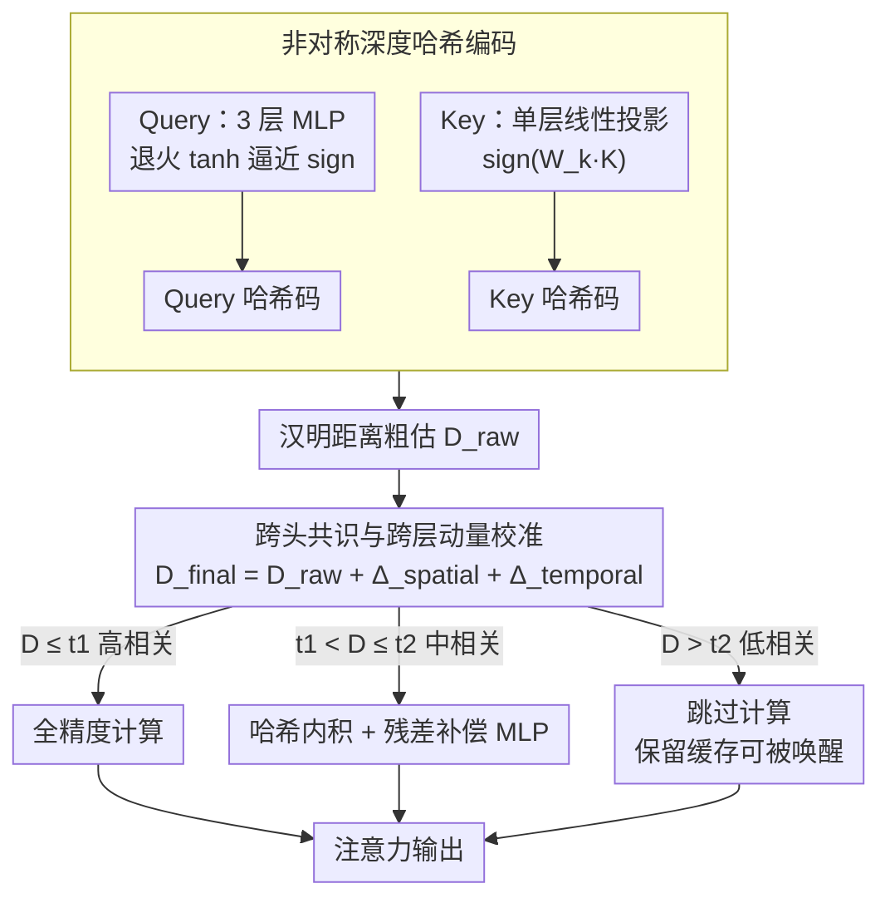

# DASH-KV: Accelerating Long-Context LLM Inference via Asymmetric KV Cache Hashing

**会议**: ACL 2026 Findings  
**arXiv**: [2604.19351](https://arxiv.org/abs/2604.19351)  
**代码**: [https://github.com/Zhihan-Zh/DASH-KV](https://github.com/Zhihan-Zh/DASH-KV)  
**领域**: 模型压缩  
**关键词**: KV缓存, 深度哈希, 非对称编码, 注意力加速, 长上下文推理

## 一句话总结

提出 DASH-KV 框架，将注意力机制重构为近似最近邻搜索问题，通过非对称深度哈希将高维浮点相似度计算替换为高效的汉明距离比特操作，配合动态混合精度机制，将长上下文推理复杂度从 $O(N^2)$ 降至 $O(N)$ 且性能匹配全注意力。

## 研究背景与动机

**领域现状**：标准注意力机制的二次复杂度是 LLM 长上下文推理的根本瓶颈。现有 KV 缓存优化方法包括量化压缩、选择性驱逐和结构化共享，但都没有改变底层的浮点计算范式。

**现有痛点**：（1）量化方法在超低位（1-2 bit）时性能严重退化，且反量化引入额外开销；（2）选择性驱逐导致信息不可逆丢失，损害长程依赖任务；（3）结构化共享忽略了不同头/层的异构特性。更关键的是，这些方法都仍在浮点计算框架内操作，没有从根本上解决计算范式问题。

**核心矛盾**：Query-Key 的相似度计算需要数十亿次高精度浮点运算，而现有所有优化都是在这个浮点框架内做文章。需要一种全新的计算范式来替代浮点相似度计算。

**本文目标**：将注意力计算从浮点运算范式转变为二进制比特运算范式，实现根本性的加速。

**切入角度**：注意力中的 Query-Key 相似度匹配与信息检索中的相关性匹配高度类似。深度哈希在大规模检索中已被证明有效——将高维向量编码为紧凑的二进制码，用汉明距离替代点积计算。

**核心 idea**：将注意力计算重构为近似最近邻搜索，用非对称深度哈希分别编码 Query（高精度 MLP）和 Key（轻量线性投影），配合跨头共识和跨层动量校准哈希距离，并对关键 token 保留全精度计算。

## 方法详解

### 整体框架

DASH-KV 包含三个核心组件：（1）非对称哈希——Query 通过3层 MLP 编码，Key 通过线性投影编码，映射到二进制哈希码；（2）校准的汉明距离检索——用跨头共识和跨层动量修正粗粒度的哈希距离；（3）动态混合精度注意力——根据校准距离将 Key 分为高相关（全精度）、中等相关（哈希+残差补偿）和低相关（跳过计算）三级。

### 关键设计

**1. 非对称深度哈希编码：Query 保精度、Key 保效率，各取所需**

注意力里的 Query 和 Key 角色完全不同，却被以往方法用同一套编码方式对待，这正是哈希精度上不去的根源。本文据此做了非对称设计：Query 每步动态生成、语义各不相同，需要精确编码，于是用一个 3 层 MLP（$d\to256\to256\to l$）映射，并在训练时用渐进退火的 $\tanh(\beta \cdot v_q)$ 模拟 sign 函数（$\beta$ 从 1 慢慢升到 10，让梯度可传又逐步逼近二值化），推理时直接取 sign 得到二进制码。Key 一旦写入缓存就会被海量复用，优先级是编码速度与存储，于是只用单层线性投影 $h_k = \text{sign}(W_k K)$。

对称编码无法同时满足"Query 要准、Key 要快"这两个互斥诉求，而非对称切分让精度预算花在真正动态的一侧、效率预算花在可复用的一侧，是整个框架能用比特运算替代浮点点积的前提。

**2. 跨头共识与跨层动量校准：用 Transformer 的结构先验修正粗哈希**

汉明距离终究是浮点相似度的粗粒度近似，单看一次哈希容易误判，于是本文借多头、多层的结构先验来修。跨头共识统计同一个 Key 被多少注意力头同时选中，一旦超过投票阈值 $T_{\text{vote}}$，说明它被多头一致认可，给它一个空间折扣 $\Delta_{\text{spatial}}$；跨层动量则把前一层的注意力分布当先验，对持续受关注的 Key 给时序折扣 $\Delta_{\text{temporal}}$。

两项折扣叠加到原始哈希距离上得到校准后的最终距离：

$$D_{\text{final}} = D_{\text{raw}} + \Delta_{\text{spatial}} + \Delta_{\text{temporal}}$$

折扣系数都是可学习的，让模型自己决定多头共识和层间惯性各值多少信任。这样一来，被多头反复选中、又被上一层重点关注的 Key，不会因为一次粗哈希的抖动而被错误地判远。

**3. 动态重要性混合精度注意力：按相关度实例级分配计算精度**

不是所有 token 都同等重要——全用哈希会丢关键信息，全用全精度又失去加速意义，于是本文用自适应百分位阈值（而非固定阈值，更稳健）把 Key 按校准距离分三级。高相关（$D \leq t_1$）的 Key 保留全精度计算；中等相关（$t_1 < D \leq t_2$）走"哈希 + 残差补偿"——先用哈希内积做粗估，再用一个轻量 MLP 拟合残差 $\Delta(h_q, h_k; \phi)$ 把误差补回来；低相关（$D > t_2$）则跳过计算但不丢弃，这点与驱逐方法本质不同，被跳过的 Key 仍留在缓存里，后续步骤可被重新"唤醒"。此外 CLS / SEP / sink / 邻近 token 等特殊位置强制走全精度，避免误伤结构性关键信息。三级分层把昂贵的全精度算力只花在真正高相关的少数 Key 上，实现按需分配。

### 损失函数 / 训练策略

主损失是列表式蒸馏 $\mathcal{L}_{\text{distill}} = \text{KL}(P_{\text{student}} \| P_{\text{teacher}})$，配合比特均衡损失 $\mathcal{L}_{\text{bal}}$ 和量化损失 $\mathcal{L}_{\text{quant}}$，辅助损失系数均为0.1。使用非对称温度缩放处理哈希内积分布过于平滑的问题。

## 实验关键数据

### 主实验

| 方法 | Qwen2-7B LongBench 平均 | 复杂度 |
|------|------------------------|--------|
| Full Attention | 基准 | $O(N^2)$ |
| H2O (驱逐) | 低于基准 | 线性 |
| SnapKV (驱逐) | 低于基准 | 线性 |
| KIVI (量化) | 低于基准 | 接近线性 |
| DASH-KV | **匹配基准** | **$O(N)$** |

### 消融实验

| 配置 | 效果 | 说明 |
|------|------|------|
| 仅哈希（无校准） | 性能下降 | 粗粒度距离不准确 |
| 加跨头共识 | 提升 | 多头投票减少误判 |
| 加跨层动量 | 进一步提升 | 时序先验有用 |
| 加混合精度 | 最优 | 关键 token 保持精度 |

### 关键发现

- DASH-KV 在 LongBench 上匹配 Full Attention 性能，同时实现线性复杂度
- 驱逐方法因信息不可逆丢失而性能下降，DASH-KV 不丢弃任何信息
- 非对称编码优于对称编码，验证了 Query 和 Key 确实需要差异化处理
- 哈希码长度 $l$ 在32-64 bit 时达到性能与效率的最佳平衡

## 亮点与洞察

- **"注意力=检索"的重构视角很有启发**：将注意力从计算问题转化为检索问题，引入了信息检索领域的成熟技术（深度哈希），打开了全新的优化路径
- **非对称设计体现了对 Q/K 不同角色的深入理解**：Query 是一次性的需要精确，Key 是多次复用的需要高效，这一区分在以往方法中被忽视
- **不丢弃信息的设计理念**：与驱逐方法不同，低相关 Key 只是跳过计算而非被永久删除，保留了在后续步骤中被"唤醒"的可能

## 局限与展望

- 需要训练哈希编码器（轻量但仍有成本），不能即插即用
- 跨头共识和跨层动量引入的两个可学习参数需要调优
- 仅在 LongBench 上验证，其他长上下文基准（如 RULER、∞-Bench）未测试
- 残差补偿 MLP 的设计可能需要针对不同模型调整

## 相关工作与启发

- **vs H2O/SnapKV（驱逐方法）**: 驱逐永久丢失信息，DASH-KV 保留所有 Key 只跳过低相关计算。在信息保留和效率之间取得更好平衡
- **vs KIVI/Atom（量化方法）**: 量化仍在浮点框架内操作，DASH-KV 用比特操作从根本上改变计算范式

## 评分

- 新颖性: ⭐⭐⭐⭐⭐ 将深度哈希引入注意力机制是首创，非对称设计和三级混合精度都很有思路
- 实验充分度: ⭐⭐⭐⭐ 3个模型+LongBench+详细消融，但基准覆盖有限
- 写作质量: ⭐⭐⭐⭐ 方法描述系统详尽，但公式较多，部分描述冗长

<!-- RELATED:START -->

## 相关论文

- [\[ICML 2025\] RocketKV: Accelerating Long-Context LLM Inference via Two-Stage KV Cache Compression](../../ICML2025/model_compression/rocketkv_accelerating_long-context_llm_inference_via_two-stage_kv_cache_compress.md)
- [\[ACL 2026\] HeteroCache: A Dynamic Retrieval Approach to Heterogeneous KV Cache Compression for Long-Context LLM Inference](heterocache_a_dynamic_retrieval_approach_to_heterogeneous_kv_cache_compression_f.md)
- [\[ACL 2026\] FastKV: Decoupling of Context Reduction and KV Cache Compression for Prefill-Decoding Acceleration](fastkv_decoupling_of_context_reduction_and_kv_cache_compression_for_prefill-deco.md)
- [\[ACL 2026\] The Pitfalls of KV Cache Compression](the_pitfalls_of_kv_cache_compression.md)
- [\[NeurIPS 2025\] ChunkKV: Semantic-Preserving KV Cache Compression for Efficient Long-Context LLM Inference](../../NeurIPS2025/model_compression/chunkkv_semanticpreserving_kv_cache_compression_for_efficien.md)

<!-- RELATED:END -->
