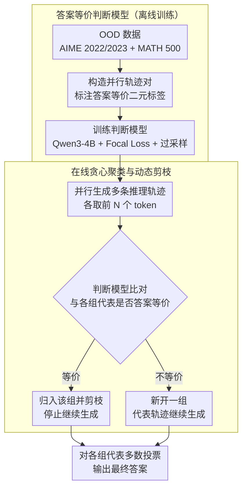

# DeepPrune: Parallel Scaling without Inter-Trace Redundancy

**会议**: ACL 2026  
**arXiv**: [2510.08483](https://arxiv.org/abs/2510.08483)  
**代码**: [https://deepprune.github.io/](https://deepprune.github.io/)  
**领域**: 模型压缩  
**关键词**: 并行推理, CoT剪枝, 推理冗余, 答案等价预测, 推理效率

## 一句话总结

本文提出 DeepPrune，通过训练专门的判断模型从部分推理轨迹预测答案等价性，结合在线贪心聚类算法动态剪枝冗余的并行 CoT 路径，在保持竞争准确率（3 个百分点以内）的同时减少 65.73%-88.50% 的 token 消耗。

## 研究背景与动机

**领域现状**：并行扩展（如 best-of-n 采样）通过同时生成多条推理轨迹来增强 LLM 推理能力，总 token 消耗可达 100M+。现有高效推理方法主要关注序列扩展的过度思考问题，对并行扩展的效率研究较少。

**现有痛点**：(1) 超过 80% 的并行推理轨迹产生相同的最终答案，代表了大量浪费的计算；(2) 基于置信度的早停方法无法减少轨迹间冗余，且有过早终止正确推理的风险；(3) 浅层语义相似度（如 SentenceBERT）无法从早期推理阶段预测最终答案等价性。

**核心矛盾**：并行扩展的收益来自答案多样性（少数不同答案中可能包含正确答案），但绝大多数（80%+）并行轨迹产生相同答案，多样性极低。

**本文目标**：在保留答案多样性的前提下，主动剪枝冗余的并行推理轨迹。

**切入角度**：训练专门的判断模型来理解推理过程的深层语义，从部分推理轨迹预测两条轨迹是否最终会得到相同答案。

**核心 idea**：早期发现答案等价 → 保留多样轨迹 + 剪枝冗余轨迹 → 高效并行扩展。

## 方法详解

### 整体框架

DeepPrune 分两个阶段。**离线训练阶段**：构造大量「并行轨迹对」并标注它们最终答案是否等价的二元标签，用 Focal Loss 加过采样训练出一个判断模型（judge model），让它能从两条轨迹各自的前 $N$ 个 token 就预判二者是否殊途同归（OOD 上 AUROC=0.7072）。**在线剪枝阶段**：并行生成多条推理轨迹时，用判断模型把轨迹动态聚成「答案等价组」——新轨迹与已有各组的代表比对，判为等价就归入该组并立即停止生成（剪掉冗余），判为不等价就新开一组；每组只留一条代表继续推理，最后对存活的各组代表做多数投票（majority voting）得到最终答案。这样既掐掉了 80%+ 的冗余计算，又把不同答案各自保成一组、不破坏答案多样性。

### 关键设计

**1. 答案等价判断模型：从半截推理就看出两条轨迹会不会殊途同归**

剪枝冗余轨迹的前提是"早期就能判断两条轨迹最终是否得到相同答案"，但浅层语义相似度（SentenceBERT，AUROC=0.58，几乎等于随机）和通用 LLM（AUROC=0.66）都做不到——它们只看文本表面，读不懂推理过程的深层语义。本文为此专门训了一个判断模型：以 Qwen3-4B 为底座，输入是两条轨迹各自的前 $N$ 个 token，输出是它们答案等价的概率。

训练时刻意用 OOD 的 AIME 2022/2023 和 MATH 500 构造轨迹对，与评估集 AIME 2024/2025 严格不重叠，并用 Focal Loss 加过采样缓解正负样本失衡（等价对远多于不等价对）。这样训出来的模型在 OOD 上达到 AUROC=0.7072，明显超过 SentenceBERT（0.58）和通用 LLM（0.66）两个基线，能在轨迹只跑了一半时就预判它会不会和别人撞答案。

更关键的是跨模型泛化：真实部署里不可能为每个新上线的推理模型重训一个判断模型，因此本文在训练集与评估集完全隔离的设定下，验证它能直接迁移到训练时未见过的推理模型（DeepSeek-8B、Qwen3-32B、GPT-OSS-20B），逼模型学到「推理过程是否同质」这种与具体生成模型无关的信号、而非记住某个模型的表面文风——这是整套方案具备实用价值的前提。

**2. 在线贪心聚类与动态剪枝：边推理边收敛，不等全部跑完**

光有判断模型还不够，关键是怎么用它省算力。本文不做事后剪枝，而是在推理进行中维护一组"答案等价组"：每当某条轨迹生成出新片段，就用判断模型拿它和已有各组的代表轨迹比一遍，若判为等价就直接剪掉这条（停止继续生成），若不等价就为它新开一组；每组只留一条代表轨迹继续往下跑。

这种在线贪心的好处是冗余轨迹在半途就被掐断、而不是白白生成到底，省下的 token 远多于事后剪枝；同时"每组留一条代表"保证了答案多样性不被破坏——少数不同答案各自成组，正确答案所在的稀有分支不会被误剪。所有轨迹处理完后，对存活的各组代表做多数投票得出最终答案。贪心虽不保证全局最优，但在实践中很好地平衡了效率与多样性。

### 损失函数 / 训练策略

判断模型用 Focal Loss 训练这个二分类任务，并对少数类（不等价对）过采样以平衡数据，二者共同缓解"等价对占绝大多数"带来的类别失衡。

## 实验关键数据

### 主实验

**与标准共识采样的对比（LLaDA 推理模型）**

| 方法 | Token 减少率 | 准确率差异 |
|------|------------|----------|
| 标准共识采样 | 0% | 基线 |
| 置信度早停 | ~30% | 可能损害 |
| **DeepPrune** | **65.73%-88.50%** | **≤3%** |

### 消融实验

| 组件 | 效果 |
|------|------|
| 判断模型 AUROC | 0.7072（OOD 泛化） |
| SentenceBERT 基线 | 0.58（接近随机） |
| 通用 LLM 基线 | 0.66（次优） |

### 关键发现

- DeepPrune 在三个挑战性基准（AIME 2024、AIME 2025、GPQA）上减少 65-88% token
- 准确率损失控制在 3 个百分点以内
- 判断模型成功泛化到未见过的推理模型
- 剪枝保留了答案多样性——高多样性轨迹不会被误剪

## 亮点与洞察

- 定量揭示了并行推理的核心效率问题：80%+ 的轨迹产生相同答案
- 从"推理理解"而非"文本相似"出发训练判断模型，是对浅层方法的重要改进
- 在线剪枝设计使得加速在推理过程中即时生效

## 局限与展望

- 判断模型的 AUROC（0.7072）仍有提升空间，可能导致少量有价值轨迹被误剪
- 在线聚类的贪心策略可能次优
- 依赖特定的判断阈值，不同场景可能需要调整
- 仅在数学推理任务上验证，其他推理类型的效果待确认

## 相关工作与启发

- **vs 置信度早停**: 置信度方法不能减少轨迹间冗余，DeepPrune 直接解决冗余问题
- **vs 序列剪枝**: 序列方法减少单条轨迹的长度，DeepPrune 减少并行轨迹的数量

## 评分

- 新颖性: ⭐⭐⭐⭐ 并行推理冗余分析和答案等价判断模型是新颖贡献
- 实验充分度: ⭐⭐⭐⭐ 三个基准、多模型验证、OOD 泛化测试
- 写作质量: ⭐⭐⭐⭐ 问题分析清晰，方法直观
- 价值: ⭐⭐⭐⭐ 为推理时并行扩展的效率化提供了实用工具

<!-- RELATED:START -->

## 相关论文

- [\[ICLR 2026\] Parallel Token Prediction for Language Models](../../ICLR2026/model_compression/parallel_token_prediction_for_language_models.md)
- [\[ACL 2026\] Task-Stratified Knowledge Scaling Laws for Post-Training Quantized LLMs](task-stratified_knowledge_scaling_laws_for_post-training_quantized_large_languag.md)
- [\[ACL 2026\] VecCISC: Improving Confidence-Informed Self-Consistency with Reasoning Trace Clustering and Candidate Answer Selection](veccisc_improving_confidence-informed_self-consistency_with_reasoning_trace_clus.md)
- [\[ACL 2026\] WISCA: A Lightweight Model Transition Method to Improve LLM Training via Weight Scaling](wisca_a_lightweight_model_transition_method_to_improve_llm_training_via_weight_s.md)
- [\[ACL 2026\] Rethinking Table Pruning in TableQA: From Sequential Revisions to Gold Trajectory-Supervised Parallel Search](rethinking_table_pruning_in_tableqa_from_sequential_revisions_to_gold_trajectory.md)

<!-- RELATED:END -->
