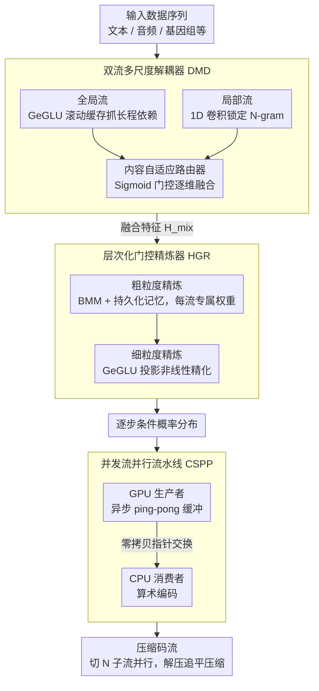

# Efficient Learned Data Compression via Dual-Stream Feature Decoupling

**会议**: ACL 2026  
**arXiv**: [2604.07239](https://arxiv.org/abs/2604.07239)  
**代码**: [https://github.com/huidong-ma/FADE](https://github.com/huidong-ma/FADE)  
**领域**: 模型压缩 / 数据压缩  
**关键词**: 学习型数据压缩、双流特征解耦、概率建模、并行流水线、无损压缩

## 一句话总结
本文提出FADE框架，通过双流多尺度解耦器将微观句法和宏观语义特征分离到并行浅层流中处理（取代深层串行堆叠），结合层次化门控精炼器和并发流并行流水线，在压缩率和吞吐量上同时达到SOTA。

## 研究背景与动机

**领域现状**：学习型数据压缩（LDC）利用深度学习进行概率预测，已显著超越传统方法（Gzip、zstd等）的压缩率。主流方法使用自回归框架——每步预测条件概率分布 $P(x_t|x_{<t})$，然后通过熵编码压缩。

**现有痛点**：存在两个结构性限制——(1) 单一流架构难以同时捕获微观句法（局部N-gram模式）和宏观语义（长距离依赖），迫使使用深层MLP堆叠来近似复杂分布，加剧自回归解码延迟；(2) 异构系统中GPU概率生成和CPU算术编码的速度不匹配导致流水线停滞，而自回归串行解码严格受Amdahl定律约束，阻止并行加速。

**核心矛盾**：精确的概率建模（高压缩率）需要深层网络，但深层串行执行导致高延迟；通过分析互信息衰减曲线，数据序列确实存在"微观句法"（尖锐的初始衰减）和"宏观语义"（持续的非零尾部）两种不同的依赖模式。单流MLP用共享参数拟合这两种异质特征，导致显著性分布弥散。

**本文目标**：在保持或提升压缩率的同时，大幅降低延迟和提高吞吐量。

**切入角度**：从信息论角度分析数据的双重依赖模式，据此设计显式特征解耦——将深层串行替换为浅层并行，同时解决模型和系统两个层面的瓶颈。

**核心 idea**：用CNN分支捕获微观局部模式、MLP分支捕获宏观全局依赖，通过内容自适应路由器动态融合，再用层次化门控精炼器做实例自适应精炼。

## 方法详解

### 整体框架
FADE包含三个核心创新：(1) 双流多尺度解耦器（DMD）将特征分离到局部CNN流和全局MLP流中并行处理；(2) 层次化门控精炼器（HGR）通过粗细两级精炼实现实例自适应的概率建模；(3) 并发流并行流水线（CSPP）融合数据并行和时序并行，实现零等待处理。前两者在模型层面把"深层串行"换成"浅层并行 + 实例自适应精炼"提升压缩率与表达力，第三者在系统层面打通 GPU 概率生成与 CPU 算术编码的流水线、绕开自回归因果依赖提升吞吐。

### 关键设计

**1. 双流多尺度解耦器（DMD）：把微观句法和宏观语义拆到两条互不干扰的浅流里并行处理**

单流MLP的根本问题在于：互信息衰减分析和特征显著性热力图都证实，数据序列同时存在"微观句法"（局部N-gram，对应衰减曲线尖锐的初始段）和"宏观语义"（长距离依赖，对应持续非零的尾部）两种异质模式，而共享参数的MLP拟合二者时显著性分布弥散，捕不住尖锐的句法波动，只能靠堆深层来勉强逼近，反过来又拖慢自回归解码。DMD的做法是给两种模式各配一条带不同归纳偏置的浅流：全局流用 GeGLU-based Rolling Cache 抓长程依赖，维护一个滚动缓存 $\bm{M}$ 并每步更新 $\bm{M}_t = \text{Roll}(\bm{M}_{t-1}, \text{GeGLU}(\bm{X}_t))$；局部流用 1D 卷积施加强局部归纳偏置精确锁定 N-gram。两条流的输出再由一个内容自适应路由器通过 Sigmoid 门控逐维度融合：

$$\bm{H}_{\text{mix}} = \bm{\alpha} \odot \bm{H}_{\text{global}} + (1-\bm{\alpha}) \odot \bm{H}_{\text{local}}$$

关键在于"两条并行浅流取代一条串行深流"——既消除了特征互相干扰，又把深度换成了宽度，延迟随之大幅下降而表达力不减。

**2. 层次化门控精炼器（HGR）：对融合特征做粗到细的实例自适应精炼，让模型记住每条数据流的脾气**

DMD用的是全局共享参数，但在线压缩里特征分布是非平稳的，不同数据流（文本、音频、基因组……）的统计特性差异极大，一套固定参数顾不过来。HGR用两级级联补这个缺口。粗粒度一级先做通道交互：用批矩阵乘法 BMM 配上持久化记忆 $\bm{W}_U \in \mathbb{R}^{B \times d_h \times d_h}$，让每个 batch 索引绑定一条固定数据流、通过反向传播不断演化出该流专属的模式，再用内容感知自门控抑制噪声：

$$\bm{H}_{\text{coarse}} = \big(\bm{H}_a \odot \sigma(\bm{H}_{\text{mix}} \bm{W}_c)\big) + \lambda_c \cdot \bm{H}_{\text{mix}}$$

细粒度一级再经 GeGLU 和投影做非线性精化。这套"每流一份可学权重 + 门控选择性增强"的组合，等于在共享主干之上挂了一层随流自适应的旋钮，比纯靠全局参数估计得更准。

**3. 并发流并行流水线（CSPP）：用子流切分绕过自回归因果依赖，让解压缩追上压缩的速度**

系统侧的老大难是：压缩阶段还能吃到时序并行的红利，但解压缩因为自回归因果性退回串行，被 Amdahl 定律死死按住，再加上 GPU 出概率、CPU 做算术编码两者速度不匹配，流水线频繁停滞。CSPP从两个维度同时并行。时序维度上，用异步 ping-pong 缓冲把 GPU 生产者线程和 CPU 消费者线程解耦，零拷贝指针交换消除内存争用；数据维度上，把输入流切成 $N$ 个各自维持内部因果性的独立子流，$N$ 个 worker 通过双屏障协议并发跑，复杂度从 $O(B)$ 降到 $O(B/N)$。压缩阶段两种并行一起上，解压缩阶段因为子流切分已经绕开了全局因果依赖，仅靠数据并行就能把速度拉到与压缩对齐——这正是解决了长期存在的压缩/解压缩不对称。

### 损失函数 / 训练策略
使用交叉熵损失优化概率预测精度。HGR中的持久化记忆通过在线反向传播适应各数据流的特定模式。

## 实验关键数据

### 主实验

| 方法 | 平均压缩率↑ | 吞吐量 | 延迟 | GPU内存 |
|------|-----------|--------|------|--------|
| 传统方法 (Gzip/zstd) | 低 | 高 | 低 | — |
| PAC | 中高 | 中 | 中 | 中 |
| SEP | 高 | 中高 | 中 | 中高 |
| EDPC | 高 | 高 | 中低 | 中低 |
| FADE | **最高** | **最高** | **最低** | **最低** |

### 消融实验

| 配置 | 压缩率 | 吞吐量 | 说明 |
|------|--------|--------|------|
| Full FADE | 最优 | 最优 | 完整模型 |
| w/o 局部流 | 下降 | 略升 | 损失微观句法捕获能力 |
| w/o HGR | 下降 | 略升 | 实例适应性丧失 |
| w/o CSPP | 相同 | 大幅下降 | 系统并行的重要性 |

### 关键发现
- FADE在压缩率和吞吐量上同时达到SOTA，打破了以往两者之间的trade-off
- 双流解耦将深层串行替换为浅层并行，显著降低延迟同时提升表达能力
- 持久化记忆使HGR能在在线压缩中实现流特定的自适应，比全局共享参数更精确
- CSPP的数据并行策略使解压缩速度接近压缩速度，解决了长期存在的不对称问题
- 在文本、音频、图像、视频、浮点和基因组等异构数据上均表现优异

## 亮点与洞察
- **从信息论分析到架构设计的完整链条**：先用互信息衰减和自相似矩阵验证双重依赖模式的存在，再据此设计解耦架构。这种"分析驱动设计"比直觉驱动更有说服力。
- **浅层并行替代深层串行**：在不牺牲表达能力的前提下降低延迟，核心洞察是"分离+专精"优于"统一+堆叠"。
- **持久化记忆的创新使用**：BMM中每个batch索引对应一个可学习的权重矩阵，在在线压缩中通过反向传播不断演化，实现了"记住每个数据流的独特模式"。

## 局限与展望
- 数据并行需要将输入分割为独立子流，子流间的跨流依赖被忽略
- 持久化记忆的大小与batch size线性相关，大规模并行时内存开销可能显著
- 与基于LLM的压缩方法（如LLMZip）相比，压缩率仍有差距，但效率优势巨大
- 自适应路由器的权重分配策略较简单，可探索更复杂的MoE-style路由

## 相关工作与启发
- **vs PAC/OREO**：基于MLP的轻量方法，通过掩码和缓存加速。FADE通过双流解耦进一步提升效率和表达力
- **vs SEP**：SEP引入语义增强模块和多流流水线。FADE的CSPP实现了更完整的并行化
- **vs EDPC**：EDPC提出双路径框架和潜在变换引擎。FADE的DMD更明确地将解耦对准微观/宏观模式

## 评分
- 新颖性: ⭐⭐⭐⭐ 双流解耦的设计有清晰的理论支撑和实验验证
- 实验充分度: ⭐⭐⭐⭐⭐ 7个数据集（文本/音频/图像/视频/浮点/基因组/异构），全面覆盖
- 写作质量: ⭐⭐⭐⭐ 结构清晰，从分析到设计到系统层层递进
- 价值: ⭐⭐⭐⭐ 同时解决模型和系统两个层面的瓶颈，工程实用性高

<!-- RELATED:START -->

## 相关论文

- [\[CVPR 2026\] DAGE: Dual-Stream Architecture for Efficient and Fine-Grained Geometry Estimation](../../CVPR2026/model_compression/dage_dual-stream_architecture_for_efficient_and_fine-grained_geometry_estimation.md)
- [\[ACL 2026\] FastKV: Decoupling of Context Reduction and KV Cache Compression for Prefill-Decoding Acceleration](fastkv_decoupling_of_context_reduction_and_kv_cache_compression_for_prefill-deco.md)
- [\[ICML 2026\] Efficient Learned Image Compression without Entropy Coding](../../ICML2026/model_compression/efficient_learned_image_compression_without_entropy_coding.md)
- [\[ACL 2026\] CBRS: Cognitive Blood Request System with Bilingual Dataset and Dual-Layer Filtering](cbrs_cognitive_blood_request_system_with_bilingual_dataset_and_dual-layer_filter.md)
- [\[AAAI 2026\] InfoCom: Kilobyte-Scale Communication-Efficient Collaborative Perception with Information-Aware Feature Compression](../../AAAI2026/model_compression/infocom_kilobyte-scale_communication-efficient_collaborative_perception_with_inf.md)

<!-- RELATED:END -->
