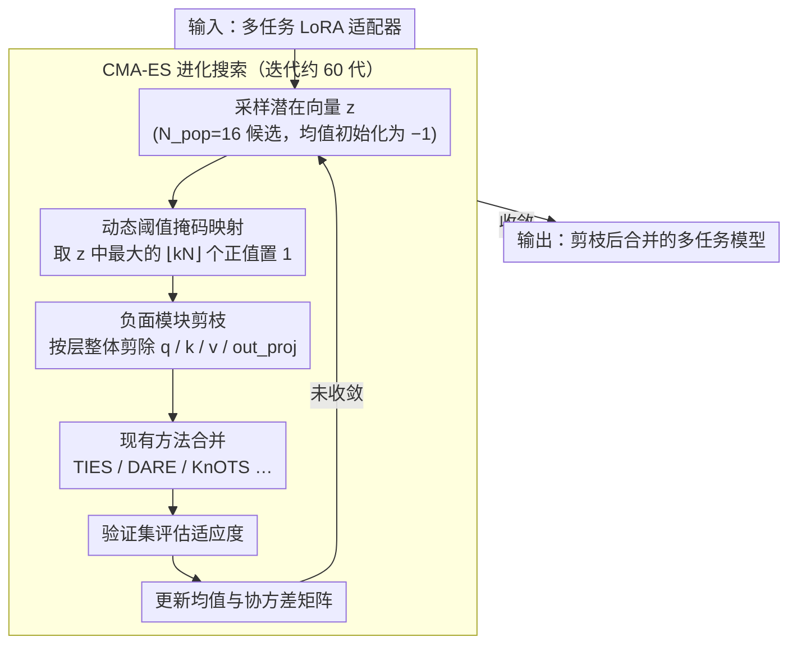

# Evolutionary Negative Module Pruning for Better LoRA Merging

**会议**: ACL 2026  
**arXiv**: [2604.17753](https://arxiv.org/abs/2604.17753)  
**代码**: [github](https://github.com/CaoAnda/ENMP-LoRAMerging)  
**领域**: 模型合并 / LoRA 融合  
**关键词**: LoRA合并, 负面模块剪枝, 进化搜索, 多任务部署, CMA-ES

## 一句话总结

提出 ENMP 方法，通过进化搜索策略发现并剪除 LoRA 合并中降低性能的"负面模块"，作为即插即用的增强手段，在 NLP 和视觉领域全面提升现有合并算法的效果。

## 研究背景与动机

**领域现状**：LoRA 因其参数效率和良好收敛性成为大模型微调的主流方法，实际部署中常需将多个任务的 LoRA 适配器合并到单一骨干网络中，以实现高效多任务推理。

**现有痛点**：现有合并方法（如 Task Arithmetic、TIES、DARE、KnOTS、CoreSpace 等）都隐式假设所有 LoRA 矩阵对合并后的模型有正向贡献。然而作者发现某些特定层的 LoRA 模块在合并时反而会降低全局性能——即"负面模块"的存在。

**核心矛盾**：负面模块的影响是相互依赖的：一个在完整集合中表现为"负面"的模块，在其他有害模块被移除后可能变为有益的，反之亦然。这种条件依赖导致贪心策略无法捕获高阶交互，且 $2^N$ 的搜索空间使穷举搜索不可行。

**本文目标**：设计一种能够自动定位并剪除这些负面模块的方法，作为现有合并算法的通用增强插件。

**切入角度**：将模块选择问题建模为组合优化问题，利用进化策略在连续潜在空间中高效搜索最优剪枝配置。

**核心 idea**：利用 CMA-ES 进化策略的协方差矩阵建模模块间依赖关系，在连续空间搜索后映射为离散剪枝掩码，精确移除有害模块。

## 方法详解

### 整体框架

ENMP 框架包含两个核心阶段：(1) 通过 CMA-ES 进化搜索在连续潜在空间中采样候选剪枝掩码；(2) 将掩码应用于 LoRA 适配器，剪除负面模块后再用现有方法（如 TIES、DARE）完成合并。搜索过程通过验证集性能迭代优化分布参数。

### 关键设计

**1. 负面模块剪枝机制：合并前先把拖后腿的 LoRA 层摘掉**

现有合并方法都默认每个 LoRA 模块都在帮忙，但作者的 leave-one-out 分析戳破了这个假设——把某些层的 LoRA 模块拿掉后，合并性能反而上升，说明这些层在合并时是净负贡献的"负面模块"。ENMP 因此定义一个二值剪枝掩码 $\mathbf{m} \in \{0,1\}^{L \times T}$（$L$ 层、$T$ 任务），$0$ 表示保留、$1$ 表示剪除。剪枝的最小单元不是单个权重矩阵，而是 Transformer 一层里的全部注意力投影（q/k/v/out_proj）一起处理——这样做是为了不破坏注意力机制内部的语义一致性，避免只剪掉 q 却留下 k 这种割裂状态。

**2. CMA-ES 进化搜索：用协方差矩阵捕获模块之间的依赖，绕开 $2^N$ 的组合爆炸**

难点在于负面模块的影响是相互纠缠的——某个模块在完整集合里是负面的，等其他有害模块被移除后又可能翻成有益的，反之亦然。这种条件依赖让贪心策略只能看到局部、抓不住高阶交互，而 $2^N$ 的离散搜索空间又让穷举不现实。ENMP 把离散的掩码搜索松弛到连续空间：引入一个连续潜在向量 $\mathbf{z} \in \mathbb{R}^N$ 当作每个模块可学习的"负面分数"，再用 CMA-ES 在 $\mathbf{z}$ 上做进化搜索。CMA-ES 维护的协方差矩阵恰好能建模模块两两之间的依赖关系，正是贪心方法漏掉的那部分高阶交互。初始化时把均值设成 $-1$（保守初始化），让搜索从"全部保留、不剪任何模块"的全合并状态出发，再逐步往外探。

**3. 动态阈值掩码映射：把连续分数翻译成离散掩码，并用上界约束逼出自适应稀疏度**

搜索是在连续的 $\mathbf{z}$ 上跑的，但真正应用到 LoRA 上需要离散的 0/1 掩码，这一步负责把两者接起来。做法是设一个最大剪枝比例 $k$，取 $\mathbf{z}$ 中数值最大的 $\lfloor k \cdot N \rfloor$ 个正值元素置 1（剪除），其余全部置 0（保留）。关键是 $k$ 只是上界而非固定剪枝量——实验里算法并不会把额度用满，而是自主收敛到最优的稀疏水平，所以这个超参不需要精细调，给个宽松上界即可。

### 训练策略

进化搜索为一次性离线计算。种群大小 $N_{\text{pop}}=16$，迭代60代，初始步长 $\sigma=0.5$，最大剪枝比 $k=0.2$。在8张RTX 4090上并行评估候选方案，约2.3小时收敛，前10代即可获得大部分收益。

## 实验关键数据

### 主实验（NLP Benchmark - Llama-3-8B）

| 方法 | 平均归一化准确率 | 提升 |
|------|-----------------|------|
| TA | 90.25% | - |
| TA + ENMP | 93.49% | +3.24% |
| TIES | 89.99% | - |
| TIES + ENMP | 96.39% | +6.40% |
| DARE | 89.20% | - |
| DARE + ENMP | 96.17% | +6.97% |
| KnOTS | 92.47% | - |
| KnOTS + ENMP | 97.29% | +4.82% |
| CoreSpace | 94.18% | - |
| CoreSpace + ENMP | 96.73% | +2.55% |

### 消融实验

| 配置 | 平均归一化准确率 | 说明 |
|------|-----------------|------|
| TA + Random Pruning | 89.10% | 随机剪枝反而降低性能 |
| TA + ENMP | 93.49% | 精确定位是关键 |
| k=0.0 | 90.25% | 不剪枝 |
| k=0.1 | 93.37% | 少量剪枝即有显著收益 |
| 64 samples/task | 91.17% | 少量验证数据即可有效 |

### 关键发现
- ENMP 在所有基线方法上都带来一致提升，说明负面模块是 LoRA 合并的普遍瓶颈
- 在敏感任务 QNLI 上实现超过 +20% 的恢复，说明任务干扰分布不均匀
- Prune-then-Align 优于 Align-then-Prune，避免负面模块"污染"共享子空间
- 视觉域同样有效（KnOTS +5.54%），方法具有跨模态通用性

## 亮点与洞察
- 首次系统揭示 LoRA 合并中"负面模块"现象，挑战了"所有模块贡献正向"的隐含假设
- 即插即用设计：可与任意现有合并算法组合，无需修改合并算法本身
- 自适应稀疏性：搜索算法自动确定最优剪枝数量，无需精细调参
- 合并后模型与原始骨干结构一致，推理时零额外开销

## 局限与展望
- 进化搜索需要一次性离线计算（约2.3小时），扩展到极大规模模型（70B+）仍有挑战
- 依赖验证集来计算适应度，无法用于严格的无数据合并场景
- 未来可探索更高效的采样策略和无数据剪枝方法

## 相关工作与启发
- **vs Task Arithmetic/TIES/DARE**: 这些方法在参数层面处理干扰，ENMP 在模块层面消除干扰，两者互补
- **vs KnOTS/CoreSpace**: 子空间对齐方法假设所有模块有正向贡献，ENMP 先移除有害模块再对齐效果更好
- **vs 贪心剪枝**: 贪心策略忽略跨层依赖，导致性能下降（55.76%），进化搜索捕获高阶交互

## 评分
- 新颖性: ⭐⭐⭐⭐ 首次系统揭示负面模块现象并提出进化搜索解决方案，角度新颖
- 实验充分度: ⭐⭐⭐⭐⭐ NLP+CV双域验证，6种基线对比，丰富的消融实验
- 写作质量: ⭐⭐⭐⭐ 动机清晰，从现象到方法再到实验逻辑通顺
- 价值: ⭐⭐⭐⭐ 即插即用的实用价值高，对 LoRA 合并领域有重要启示

<!-- RELATED:START -->

## 相关论文

- [\[ACL 2026\] LoRA on the Go: Instance-level Dynamic LoRA Selection and Merging](lora_on_the_go_instance-level_dynamic_lora_selection_and_merging.md)
- [\[CVPR 2026\] Preference-Aligned LoRA Merging: Preserving Subspace Coverage and Addressing Directional Anisotropy](../../CVPR2026/model_compression/preference-aligned_lora_merging_preserving_subspace_coverage_and_addressing_dire.md)
- [\[ICLR 2026\] AdaRank: Adaptive Rank Pruning for Enhanced Model Merging](../../ICLR2026/model_compression/adarank_adaptive_rank_pruning_for_enhanced_model_merging.md)
- [\[ACL 2025\] Unraveling LoRA Interference: Orthogonal Subspaces for Robust Model Merging](../../ACL2025/model_compression/osrm_lora_merging_orthogonal.md)
- [\[ICLR 2026\] ConFu: Contemplate the Future for Better Speculative Sampling](../../ICLR2026/model_compression/confu_contemplate_the_future_for_better_speculative_sampling.md)

<!-- RELATED:END -->
