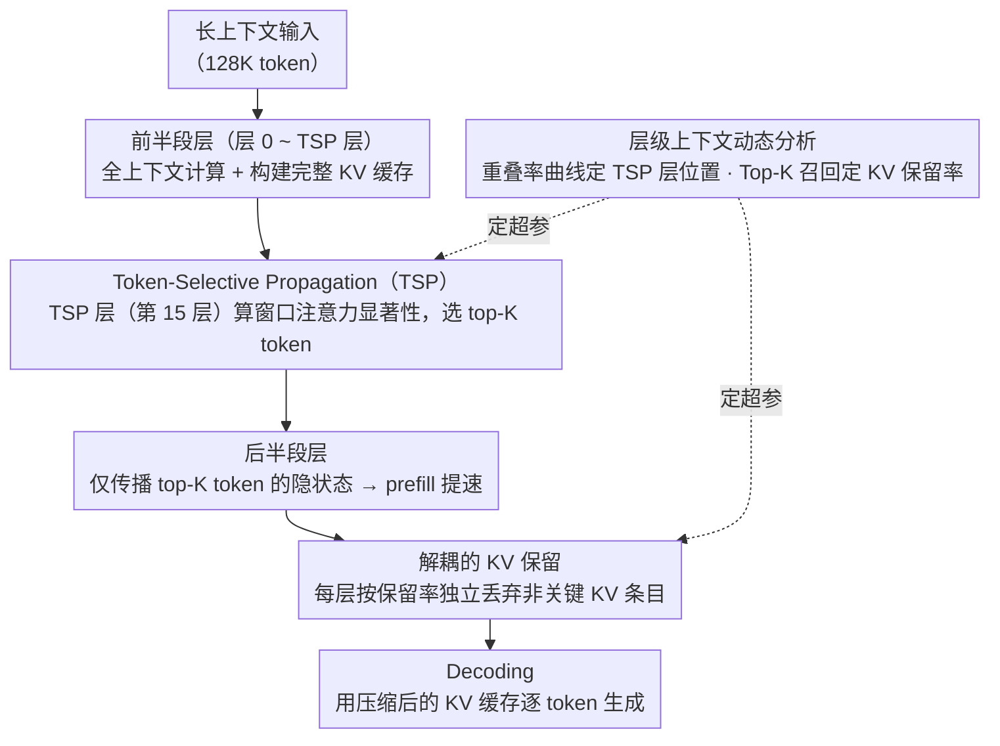

# FastKV: Decoupling of Context Reduction and KV Cache Compression for Prefill-Decoding Acceleration

**会议**: ACL 2026 Findings  
**arXiv**: [2502.01068](https://arxiv.org/abs/2502.01068)  
**代码**: [GitHub](https://github.com/dongwonjo/FastKV)  
**领域**: 模型压缩 / 推理加速  
**关键词**: KV缓存压缩, Prefill加速, Token选择性传播, 层间上下文动态, 解码加速

## 一句话总结

本文提出 FastKV，通过将上下文缩减（prefill 阶段的 Token-Selective Propagation）与 KV 缓存压缩（decoding 阶段的层级 KV 保留）解耦，在 LLaMA-3.1-8B-Instruct 上实现 prefill 1.82× 和 decoding 2.87× 加速，同时在 LongBench 上精度下降控制在 1% 以内。

## 研究背景与动机

**领域现状**：LLM 支持 128K 甚至百万 token 的上下文窗口，但长上下文推理面临两阶段瓶颈——prefill 阶段注意力计算与输入长度平方增长，decoding 阶段线性增长的 KV 缓存成为内存和带宽瓶颈。

**现有痛点**：(1) Decoding 端方法（如 SnapKV、H2O）仅压缩已生成的 KV 缓存，不加速 prefill；(2) Prefill 端方法（如 GemFilter）从早期层开始剪枝 token，但早期层的关键 token 高度不稳定，过早剪枝导致不可恢复的信息丢失；(3) 现有 prefill 感知方法将上下文缩减与 KV 预算紧耦合——要足够加速 decoding 就必须激进剪枝 prefill，导致精度退化。

**核心矛盾**：prefill 需要全上下文处理以保持精度，但 decoding 只依赖极少量 token——将两者耦合意味着无法同时优化两个阶段。

**本文目标**：解耦 prefill 的上下文缩减和 decoding 的 KV 压缩，独立控制两个阶段的效率-精度权衡。

**切入角度**：利用两个关键观察——(1) 早期层的关键 token 高度不稳定（重叠率低），后期层趋于稳定（重叠率高）；(2) 所有层在 decoding 时只依赖极少数 token（Top-512 即 0.38% 就捕获大部分注意力质量）。

**核心 idea**：在稳定层设置 TSP 分界点——前半段全上下文计算保持灵活性，后半段仅传播关键 token 加速 prefill；同时每层独立保留小比例 KV 缓存用于 decoding，两个比率独立可调。

## 方法详解

### 整体框架

FastKV 分两步工作：(1) 两阶段 prefill——前半段（层 0 到 TSP 层）处理全上下文并构建完整 KV 缓存；TSP 层根据窗口 token 的注意力权重选择 top-K token，仅将这些 token 的隐状态传递给后续层；(2) 层级 KV 保留——每层独立丢弃非关键 KV 条目，仅保留指定比例的缓存用于 decoding。两个核心超参（TSP 层位置、KV 保留率）由层级上下文动态分析提供数据依据，且彼此独立可调。

### 关键设计

**1. Token-Selective Propagation (TSP)：等关键 token 稳定下来再截断上下文，给后半段 prefill 提速**

GemFilter 这类 prefill 端方法从很早的层就开始剪 token，但早期层选出的关键 token 极不稳定——FastKV 的分析显示层距一拉开，层间关键 token 的重叠率就急剧下降，过早剪枝等于赌错了对象、丢掉的信息再也找不回来。TSP 的对策是把剪枝时机推迟到网络中段：先让前半段（层 0 到 TSP 层）按全上下文正常计算，到了 TSP 层（实验中第 15 层最优，此时往后重叠率衰减已经很慢、关键 token 趋于一致）才动手。具体地，在 TSP 层对每个 token 计算它被最近窗口 token 查询时的平均注意力权重作为显著性分数 $S_i^{TSPlayer} = \frac{1}{H}\sum_{h=0}^{H-1} S_i^{TSPlayer,h}$，按预定义的 TSP 率选出 top-ranked token，只把这部分 token 的隐状态往后传。后半段层因此只在一个小得多的 token 子集上算注意力，prefill 自然变快，而前半段保留全上下文又守住了精度。

**2. 解耦的 KV 保留（Decoupled KV Retention）：让 decoding 的 KV 预算和 prefill 的压缩率各调各的**

以往方法（GemFilter、PyramidInfer）把"prefill 压多狠"和"KV 缓存留多少"绑死成一个旋钮——想让 decoding 快就得激进剪 prefill，于是精度跟着塌。FastKV 把这两件事拆开：prefill 端由上面的 TSP 率控制传播多少 token，decoding 端则给每一层单独设一个 KV 保留率，按注意力分数各自丢掉非关键的 KV 条目。前半段的层虽然处理了全上下文，KV 缓存照样按保留率压到很小——因为 decoding 时每层本来就只依赖极少量 token；后半段的层 KV 天然更小（只含 TSP 传过来的那些 token）。两个比率彼此独立，于是即便 TSP 率开得较高（传播较多 token 以保精度），KV 保留率仍可压得很低来加速 decoding，两个阶段的效率-精度权衡终于能分开优化。

**3. 层级上下文动态分析：用两条实测曲线为"何时压、压多少"提供依据**

FastKV 的两个核心超参（TSP 层位置、KV 保留率）不是拍脑袋定的，而是由对模型本身的测量逼出来的。作者把 128K token 喂进 LLaMA-3.1-8B-Instruct，每层取 top-512 关键 token 的索引算层间重叠率：≤15 层时重叠率随层距急剧下降（说明早期层不稳定，不能压），>15 层后衰减变缓（说明趋于稳定，可以安全剪），这条曲线直接回答了"TSP 层该设在哪"。另一条 Top-K 注意力召回分析则显示，所有层里仅 0.38% 的 token（K=512）就主导了大部分注意力质量，这回答了"KV 能压到多低"。两个观察共同把 FastKV 的设计从超参盲调变成了数据驱动。

### 损失函数 / 训练策略

FastKV 为无训练方法，仅需在推理时应用。主要在 LLaMA-3.1-8B-Instruct 上验证，LongBench 作为主要评估基准。

## 实验关键数据

### 主实验

| 方法 | Prefill | Decoding | 精度 |
|------|---------|---------|------|
| Full-context | 慢 | 慢 | 高 |
| StreamingLLM | 慢 | 快 | 低 |
| SnapKV | 慢 | 快 | 高 |
| GemFilter | 快 | 快 | 低 |
| **FastKV** | **快（1.82×）** | **快（2.87×）** | **高（<1% 下降）** |

### 消融实验

| 分析维度 | 结果 |
|----------|------|
| TSP 层位置 | 第 15 层最优——更早导致精度下降，更晚减少加速收益 |
| TSP 率 vs KV 保留率解耦 | 解耦后可独立优化，优于耦合方案 |
| 层间关键 token 重叠率 | ≤15 层急剧下降，>15 层稳定 |
| Top-K 注意力召回 | K=512（0.38%）捕获大部分注意力质量 |

### 关键发现

- FastKV 是唯一同时实现 prefill 加速、decoding 加速和高精度的方法
- 解耦设计允许灵活的效率-精度权衡——可独立调整两个比率
- 层间上下文动态的两阶段特性（不稳定→稳定）为 token 剪枝时机提供了明确的指导
- 在 LongBench 上精度下降 <1% 表明后半段层对全上下文的依赖确实很低

## 亮点与洞察

- "解耦" prefill 和 decoding 压缩的思路简洁而深刻——之前的方法隐含假设两者必须同步，这是不必要的约束
- 层间关键 token 重叠率的分析为 TSP 层选择提供了数据驱动的依据，避免了超参数盲调
- 稀疏上下文利用的发现（0.38% token 主导注意力）为极端 KV 压缩提供了理论支持

## 局限与展望

- 主要在 LLaMA-3.1-8B-Instruct 上验证，更大模型和不同架构的泛化性需验证
- 128K token 的分析可能不完全适用于更长上下文
- TSP 层是固定的——自适应选择可能进一步提升性能
- 未与量化等正交压缩技术组合

## 相关工作与启发

- **vs SnapKV/H2O**: 这些方法仅压缩 decoding 端 KV 缓存，prefill 仍需全计算；FastKV 同时加速两者
- **vs GemFilter**: GemFilter 从单层的注意力选择 token 并强制所有后续层使用，损害早期层；FastKV 保留前半段全上下文
- **vs PyramidInfer**: 从第一层即开始渐进剪枝，过于激进；FastKV 等到稳定后才开始

## 评分

- 新颖性: ⭐⭐⭐⭐ 解耦思路和 TSP 设计简洁有效，但 KV 压缩方向已有大量工作
- 实验充分度: ⭐⭐⭐⭐ LongBench 评估充分，但模型覆盖有限
- 写作质量: ⭐⭐⭐⭐⭐ 动机分析清晰，实验设计逻辑严密，比较表格直观
- 价值: ⭐⭐⭐⭐⭐ 同时加速 prefill+decoding 且保持精度的实用价值极高

<!-- RELATED:START -->

## 相关论文

- [\[ACL 2026\] DASH-KV: Accelerating Long-Context LLM Inference via Asymmetric KV Cache Hashing](dash-kv_accelerating_long-context_llm_inference_via_asymmetric_kv_cache_hashing.md)
- [\[ACL 2026\] HeteroCache: A Dynamic Retrieval Approach to Heterogeneous KV Cache Compression for Long-Context LLM Inference](heterocache_a_dynamic_retrieval_approach_to_heterogeneous_kv_cache_compression_f.md)
- [\[ACL 2026\] The Pitfalls of KV Cache Compression](the_pitfalls_of_kv_cache_compression.md)
- [\[ICML 2025\] RocketKV: Accelerating Long-Context LLM Inference via Two-Stage KV Cache Compression](../../ICML2025/model_compression/rocketkv_accelerating_long-context_llm_inference_via_two-stage_kv_cache_compress.md)
- [\[NeurIPS 2025\] KVzip: Query-Agnostic KV Cache Compression with Context Reconstruction](../../NeurIPS2025/model_compression/kvzip_query-agnostic_kv_cache_compression_with_context_reconstruction.md)

<!-- RELATED:END -->
