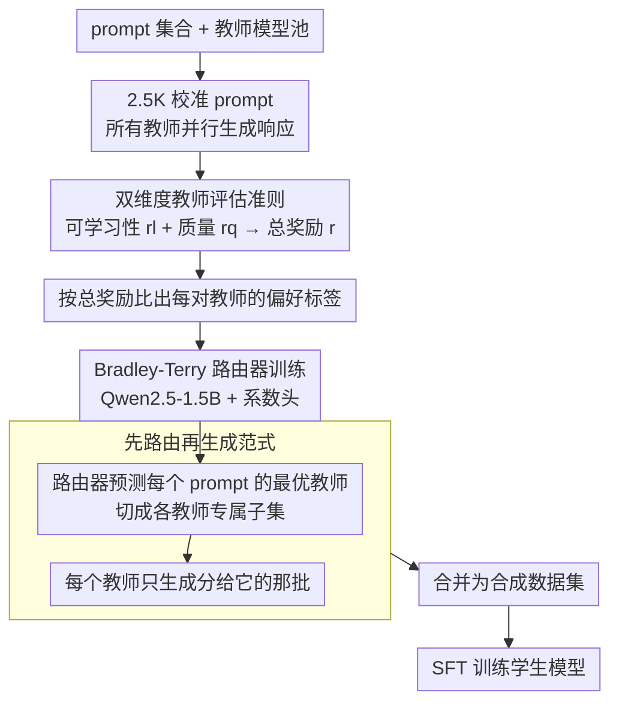

# Find Your Optimal Teacher: Personalized Data Synthesis via Router-Guided Multi-Teacher Distillation

**会议**: ACL 2026  
**arXiv**: [2510.10925](https://arxiv.org/abs/2510.10925)  
**代码**: 无（但开源 PerSyn-Math 数据集）  
**领域**: 模型压缩 / 知识蒸馏  
**关键词**: 知识蒸馏, 合成数据, 多教师, 路由机制, 个性化蒸馏

## 一句话总结

提出 PerSyn（Personalized data Synthesis），通过"先路由再生成"范式让路由器为每个 prompt 分配最优教师模型，综合考虑学生可学习性和教师响应质量，比传统"先生成再选择"范式高效且效果更好，在指令微调和数学推理两个场景中一致超越所有基线。

## 研究背景与动机

**领域现状**：用强大的教师模型生成合成数据来训练小学生模型是知识蒸馏的主流方式。通常假设越强的教师产出越高质量的数据，学生就学得越好。

**现有痛点**：近期研究发现"更强的模型未必是更好的老师"——强模型的输出可能过于复杂，偏离学生的分布，导致学生难以有效学习。Mix 方法混合强弱教师数据，CAR 方法选择单一最佳教师，但它们都遵循"Generate then Select"范式，需要所有教师对全部 prompt 生成响应，成本线性增长于教师数量。

**核心矛盾**：(1) 效率问题——"先生成再选择"要求所有候选教师为每个 prompt 都生成响应，20 个教师 × 100K prompt = 200 万次生成；(2) 粒度问题——现有方法选择单一教师或固定混合比例，忽略了不同 prompt 需要不同教师的事实。

**本文目标**：设计 prompt 级别的最优教师分配机制，以更低成本构建个性化的合成数据集。

**切入角度**：作者观察到不同 prompt 的最优教师是不同的——有些简单 prompt 更适合弱教师（输出更匹配学生水平），有些困难 prompt 需要强教师。

**核心 idea**：训练一个轻量级路由器（基于 Qwen2.5-1.5B），根据学生可学习性和教师质量为每个 prompt 预测最优教师，将范式从"Generate then Select"转变为更高效的"Route then Generate"。

## 方法详解

### 整体框架

输入为 prompt 集合 $\mathcal{X}$ 和教师模型池 $\mathcal{M}$，PerSyn 路由器 $\pi(x)$ 为每个 prompt $x$ 输出一个分数向量 $\mathbf{o} \in \mathbb{R}^{|\mathcal{M}|}$，取最高分对应的教师。该教师仅为其被分配的 prompt 子集生成响应，所有教师的输出合并为最终合成数据集 $\mathcal{D}$，用于 SFT 训练学生模型。整条流程只在一小撮校准集上付"所有教师都生成"的代价，用来训练路由器，之后对全量 prompt 只做一次轻量前向就完成教师分配。

### 关键设计

**1. 双维度教师评估准则：好不好不光看教师强不强，还要看学生学不学得动**

"更强的教师未必是更好的老师"——强模型的输出往往太复杂、偏离学生的分布，学生反而学不进去。但若反过来只挑学生最容易模仿的响应，又会偏向简单甚至低质量的内容。PerSyn 因此用两项奖励一起给每个教师响应打分：可学习性奖励 $r_l$ 用学生模型对该响应的平均 log-likelihood 衡量（越高说明越贴合学生当前能力），质量奖励 $r_q$ 用外部奖励模型给出（指令微调场景用 Skywork-Reward，数学推理场景直接用答案的二值正确性）。两者各自标准化后加权组合成总奖励

$$r(y_i^{\mathcal{M}_n}, \theta) = (1-\alpha) \cdot r_q(y_i^{\mathcal{M}_n}) + \alpha \cdot r_l(y_i^{\mathcal{M}_n}, \theta)$$

取 $\alpha=0.4$，即质量权重略高于可学习性。消融实验印证了这个偏向是对的——去掉质量奖励的掉点比去掉可学习性更狠，但两者缺一不可。

**2. Bradley-Terry 路由器训练：只用 2.5K 校准 prompt 学一个能泛化到全量的路由器**

上面的奖励要算出来，前提是每个教师都对每个 prompt 生成过响应——这正是"先生成再选择"范式昂贵的根源。PerSyn 的办法是只在一小撮校准集上付这个代价：仅对 2.5K prompt 让所有教师并行生成响应，按总奖励比较出每对教师的偏好标签，再用 Bradley-Terry 模型把成对偏好建成概率

$$\mathbb{P}(B \succ A \mid z, x) = \sigma(z^\top \pi(x))$$

其中 $z$ 是标记这一对教师的 two-hot 编码，$\pi(x)$ 是路由器对 prompt $x$ 输出的教师分数向量。路由器本体是 Qwen2.5-1.5B，把原来的语言建模头换成一个系数头（输出维度等于教师数量），用二元交叉熵损失训练。这 2.5K 条并行响应足以让路由器的 Hit@3 稳定下来，相比需要全量并行响应的 Oracle 路由器，效率高出 20–40 倍。

**3. "先路由再生成"范式：每个教师只为分给它的那批 prompt 干活**

传统的"Generate then Select"要求所有候选教师对每个 prompt 都生成一遍（20 个教师 × 100K prompt 就是 200 万次生成），成本随教师数量线性膨胀。PerSyn 把流程倒过来：先让训练好的路由器一次前向预测每个 prompt 的最优教师，把整个 prompt 集合切成若干子集 $\mathcal{X}_{\mathcal{M}_i}$（分给教师 $\mathcal{M}_i$ 的那部分），然后每个教师只负责生成自己那一份，最后合并成数据集。路由本身只是一次轻量前向，成本几乎可忽略；而且实验发现 >95% 的 prompt 被路由到较小的教师模型，把昂贵的超大模型调用量进一步压了下去。

### 损失函数 / 训练策略

路由器训练：二元交叉熵损失；学生模型训练：标准 SFT，仅在响应 token 上计算损失。小于 14B 的学生模型做全参数微调，更大模型用 LoRA。

## 实验关键数据

### 主实验

五个学生模型在六个基准上的平均性能（%）：

| 学生模型 | Strong | Mix | CAR | **PerSyn** |
|----------|--------|-----|-----|-----------|
| Qwen2.5-0.5B | 28.51 | 30.75 | 32.77 | **34.13** |
| Qwen2.5-1.5B | 46.82 | 47.79 | 49.21 | **50.63** |
| Gemma-2-2B | 28.45 | 29.76 | 31.41 | **32.85** |
| Qwen2.5-3B | 55.38 | 55.39 | 57.17 | **58.09** |
| Llama-3.2-3B | 31.37 | 31.75 | 32.99 | **34.81** |

Llama-3.2-3B 上的具体提升（PerSyn vs CAR）：IFEval +5.8%，TruthfulQA +4.1%，MATH +7.5%

### 消融实验

消融学习性和质量奖励（所有学生模型平均）：

| 设置 | 影响 |
|------|------|
| PerSyn（完整） | 最高性能 |
| PerSyn w/o Learnability | 下降约 1-2% |
| PerSyn w/o Quality | 下降约 2-4%（更大） |

路由器效率对比：

| 路由器 | Qwen2.5-0.5B | Qwen2.5-3B | Llama-3.2-3B |
|--------|-------------|------------|-------------|
| PerSyn Router | 27.18 | 40.53 | 30.35 |
| Oracle Router | 27.63 | 41.02 | 30.18 |

### 关键发现

- >95% 的 prompt 被路由到较小教师模型，Llama-3.1-405B 等超大模型分配极少
- Qwen2.5-72B-Instruct 在所有学生模型中一致获得高分配比，是最通用的教师
- Long-CoT 模型（如 DeepSeek-R1）仅占少量分配，但不可或缺——将其替换为 Short-CoT 教师导致 1.3% 性能下降
- 全部使用 Long-CoT 数据训练的 Strong 基线反而更差，模型容易产生重复推理

## 亮点与洞察

- "Route then Generate" 范式转换简洁优雅，从根本上解决了多教师蒸馏的效率瓶颈
- Bradley-Terry 路由器仅需 2.5K 校准样本即可泛化，实用性极强
- 质量比可学习性更重要（$\alpha=0.4$），但两者缺一不可——纠正了"只用最强教师"和"只用最匹配教师"两种极端观点

## 局限与展望

- 仅在指令微调和数学推理两个场景验证，代码生成、多模态等场景未探索
- 学生模型规模限于 14B 以下，更大模型是否也受益于个性化蒸馏有待验证
- 路由器对每个（设置，学生模型）组合需要单独训练，当设置变化频繁时成本可能累积

## 相关工作与启发

- Li et al. (2025) 首先揭示了"可学习性差距"问题并提出 Mix 策略，PerSyn 将其从数据集级别细化到 prompt 级别
- CAR (Xu et al., 2025) 选择单一教师，PerSyn 证明不同 prompt 需要不同教师
- 启发：蒸馏不仅是"数据质量"问题，更是"数据-学生匹配"问题，路由机制有望推广到其他数据选择场景

## 评分

- 新颖性: ⭐⭐⭐⭐ 范式转换思路清晰，路由器设计实用，但核心想法（不同样本用不同教师）相对直觉
- 实验充分度: ⭐⭐⭐⭐⭐ 五个学生模型 × 三个家族 × 两个场景 × 六个基准，消融和分析极其详尽
- 写作质量: ⭐⭐⭐⭐ 图表设计出色，Table 1 的对比直观有力，整体叙事流畅

<!-- RELATED:START -->

## 相关论文

- [\[CVPR 2026\] How to Choose Your Teacher for Fine Grained Image Recognition](../../CVPR2026/model_compression/how_to_choose_your_teacher_for_fine_grained_image_recognition.md)
- [\[CVPR 2026\] Teacher-Guided Routing for Sparse Vision Mixture-of-Experts](../../CVPR2026/model_compression/teacher-guided_routing_for_sparse_vision_mixture-of-experts.md)
- [\[ICLR 2026\] Pedagogically-Inspired Data Synthesis for Language Model Knowledge Distillation](../../ICLR2026/model_compression/pedagogically-inspired_data_synthesis_for_language_model_knowledge_distillation.md)
- [\[CVPR 2026\] Distilling Balanced Knowledge from a Biased Teacher](../../CVPR2026/model_compression/distilling_balanced_knowledge_from_a_biased_teacher.md)
- [\[ICLR 2026\] STAR: Similarity-guided Teacher-Assisted Refinement for Super-Tiny Function Calling Models](../../ICLR2026/model_compression/star_similarity-guided_teacher-assisted_refinement_for_super-tiny_function_calli.md)

<!-- RELATED:END -->
