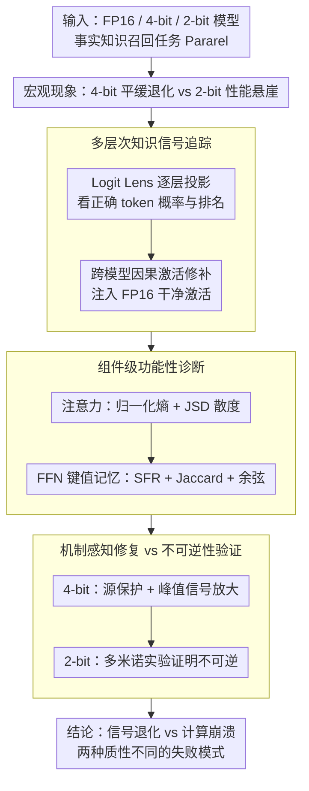

# From Signal Degradation to Computation Collapse: Uncovering the Two Failure Modes of LLM Quantization

**会议**: ACL 2026  
**arXiv**: [2604.19884](https://arxiv.org/abs/2604.19884)  
**代码**: 无  
**领域**: 模型量化 / 可解释性  
**关键词**: 后训练量化, 信号退化, 计算崩溃, 机械可解释性, 因果追踪, 知识召回, PTQ

## 一句话总结

本文通过系统的机械可解释性分析，揭示LLM量化存在两种质性不同的失败模式：4-bit的信号退化（Signal Degradation，计算模式完整但精度受损，可局部修复）和2-bit的计算崩溃（Computation Collapse，关键组件功能性破坏，需结构重建）。

## 研究背景与动机

**领域现状**: 后训练量化（PTQ）是LLM高效部署的关键技术。4-bit量化被广泛认为是精度与压缩的最佳平衡点，而2-bit量化通常会触发灾难性的"性能悬崖"——准确率骤降至接近零。

**现有痛点**: 现有研究集中于三个方向：(1) 宏观评估（测量性能下降幅度）；(2) 算法改进（离群值抑制、旋转矩阵等数值优化）；(3) 初步机械探索（层/组件敏感性分析）。三者共同局限在于将量化损害视为"数值问题"，未深入探究模型内部机制为何失败。

**核心矛盾**: 2-bit的灾难性失败究竟是4-bit退化的"量变"积累，还是代表了一种质变？如果是质变，则意味着当前所有基于数值优化的修复策略在2-bit上从根本上就走错了方向。

**本文目标**: 通过系统的机械可解释性分析（层级信息流、因果路径、组件功能、表示空间），揭示量化失败的内在机制差异，并验证不同失败模式对应不同的修复策略。

**切入角度**: 将量化失败类比为信号处理问题——信号是被噪声削弱了（退化）还是计算管道本身坏了（崩溃）？

**核心idea**: 4-bit和2-bit的失败不是程度之别而是本质之别。信号退化可通过定向的无训练修复恢复，计算崩溃则需要结构重建（如微调），这一差异是区分两种模式最有力的证据。

## 方法详解

**整体框架**: 以Llama-3.1-8B为主要分析对象，在事实知识召回任务（Pararel）上系统对比FP16/4-bit/2-bit的内部行为。从宏观的性能现象出发，依次经过逐层信号追踪、组件功能诊断、机制导向修复三个环节，一步步把"哪种失败"坐实成"哪个组件以什么方式失败"，最后用"能不能修好"反证两种失败模式的本质差异。

**关键设计**:

**1. 多层次知识信号追踪：判断信号是"变弱"还是"从未产生"**

区分两种失败模式的第一步，是搞清楚正确答案的知识信号在模型内部到底处于什么状态。本文用 Logit Lens 把每一层的隐状态投影回词表空间，逐层观察正确 token 的概率与排名：4-bit 下信号在中后层仍会浮现、只是强度被削弱（典型的退化），而 2-bit 下信号自始至终接近零、仿佛从未产生。仅看信号强弱还不够，本文进一步做跨模型因果激活修补——把 FP16"干净"模型在关键位置（最后一个主语 token）的激活直接注入量化模型：4-bit 一接到正确激活就能恢复输出，2-bit 却毫无反应。这说明 2-bit 不是信号被噪声盖住，而是负责处理信号的计算管道本身已经坏了，构成"退化 vs 崩溃"假说的核心证据。

**2. 组件级功能性诊断：把"信号缺失"归因到具体组件**

确认了信号层面的差异后，需要进一步定位失败发生在注意力还是 FFN、以什么方式发生。注意力侧用归一化熵衡量注意力分布的全局集中度、用 JSD 散度衡量焦点相对 FP16 的偏移；FFN（视作键值记忆）侧用门控符号翻转率（SFR，超过 30% 即严重不稳定）、Top-1% 激活神经元的 Jaccard 重叠（≈0.1 表示激活几乎完全错位）和输出余弦相似度（≈0 表示语义方向彻底偏离）三个指标。结果是 2-bit 在所有指标上都呈现组件功能性崩溃，从而把宏观的"信号缺失"坐实为具体组件的功能丧失，而非单纯的数值精度损失。

**3. 机制感知的两阶段修复 vs 不可逆性验证：用"能不能修好"反证两种模式**

如果两种失败本质不同，那它们对修复的反应也该不同——这是最直接的实用证据。针对 4-bit 的信号退化，本文设计"源保护 + 信号恢复"两步：先用更高精度保护前几层（Llama/Mistral 用 8-bit 保留前 2 层，约 4.25 平均比特；Qwen/Gemma 改用峰度选择层，约 4.1 平均比特），再对峰值信号做 α 倍 logit 放大；这套无训练方案能把 4-bit 失败子集的准确率从 0% 拉回 64–81%。同样的策略乃至 EORA 低秩补偿用到 2-bit 上却全部无效。更有说服力的是"多米诺实验"：对 2-bit 仅量化前 2 层就把准确率从 100% 砸到 41.65%，而后面 30 层保持 FP16 也无力回天，直观坐实了计算崩溃的不可逆——退化能局部修复，崩溃只能结构重建。

## 实验关键数据

**4-bit修复实验（Failure Subset上的准确率）**:

| 模型 | Baseline(4-bit) | +基础修复 | +信号放大(最终) |
|------|----------------|----------|-----------------|
| Llama3.1-8B | 0.00% | 67.91% | 75.19% (α=3) |
| Mistral-7B | 0.00% | 66.86% | 81.26% (α=9) |
| Qwen3-8B | 0.00% | 40.24% | 79.88% (α=7) |
| Gemma2-9B | 0.00% | 33.85% | 64.08% (α=2) |

**2-bit"多米诺效应"（Llama3.1-8B）**:

| 量化层数 | Robust子集 | Failure子集 |
|---------|-----------|-----------|
| 无(FP16) | 100.00% | 100.00% |
| Layer 0 | 65.47% | 15.03% |
| Layers 0-1 | 41.65% | 5.29% |
| Layers 0-5 | 2.51% | 0.38% |

**表示空间结构分析**:
- 4-bit: CKA保持清晰对角结构，激活子空间与FP16相似度>0.8
- 2-bit: CKA几乎全暗（结构崩溃），激活子空间相似度≈0
- 4-bit误差子空间与信号对齐度≈0.3（类似随机噪声）
- 2-bit误差子空间与信号对齐度≈0.8（直接干扰主特征）

**关键发现**:
- 4-bit是"答案排名下降"（正确答案仍在Top-5），2-bit是"排名崩溃"（降至数千位，等同随机猜测）
- 架构依赖的退化模式：Llama/Mistral呈"早期表示瓶颈"，Qwen/Gemma呈"均匀退化"
- 2-bit模型即使接收高精度信号输入也无法正确处理——组件本身已失效
- 跨GPTQ和AWQ两种量化方法，两种失败模式的区分一致

## 亮点与洞察

- **质性区分的框架价值**: 首次系统证明4-bit和2-bit不是同一连续谱上的不同程度，而是两种根本不同的失败模式
- **诊断→修复的完整闭环**: 机制分析直接指导修复策略设计，且修复有效性差异反过来验证了诊断
- **"多米诺实验"极具说服力**: 2-bit仅量化前2层就导致灾难性崩溃，且30层FP16后续层无法恢复，直观展示了计算崩溃的不可逆性
- **误差方向分析洞察深刻**: 2-bit的量化误差与信号子空间高度对齐意味着噪声不是随机的，而是系统性地破坏了模型的核心特征

## 局限与展望

- 聚焦weight-only量化，activation量化的失败模式待研究
- 评估锚定在事实回忆任务，复杂推理任务中的表现待验证
- 修复策略需要额外精度开销（~4.1-4.25 avg bits），实用性待优化
- 两种模式的边界（3-bit行为）值得深入研究
- 不同模型架构的失败模式分界点可能不同

## 相关工作与启发

- **GPTQ (Frantar et al., 2023)**: 最广泛的weight-only PTQ方法，本文的主要量化基线
- **Causal Tracing (Meng et al., 2022)**: 知识定位方法，本文扩展为跨模型修复实验
- **Logit Lens (nostalgebraist, 2020)**: 中间层解码工具
- **SpQR (Dettmers et al., 2023)**: 混合精度方法，本文的源保护策略与之呼应
- **启发**: 量化研究不应停留在数值优化层面，机制理解对于突破性能瓶颈至关重要；2-bit的实用化需要从"补偿"转向"重建"

## 评分

- **新颖性**: ★★★★★ — 两种失败模式的系统区分和验证是全新且重要的贡献
- **实验充分度**: ★★★★★ — 4个模型、多层次分析、多指标验证，证据链完整
- **写作质量**: ★★★★★ — 从现象→假设→验证→干预层层递进，叙事极为清晰
- **价值**: ★★★★☆ — 为量化研究提供了重要的诊断框架和机制洞见

<!-- RELATED:START -->

## 相关论文

- [\[ACL 2026\] Two-Stage Regularization-Based Structured Pruning for LLMs](two-stage_regularization-based_structured_pruning_for_llms.md)
- [\[ICML 2025\] Speculative Decoding in Decentralized LLM Inference: Turning Communication Latency into Computation Throughput](../../ICML2025/model_compression/speculative_decoding_in_decentralized_llm_inference_turning_communication_latenc.md)
- [\[ICLR 2026\] Rethinking Continual Learning with Progressive Neural Collapse](../../ICLR2026/model_compression/rethinking_continual_learning_with_progressive_neural_collapse.md)
- [\[ICLR 2026\] ParoQuant: Pairwise Rotation Quantization for Efficient Reasoning LLM Inference](../../ICLR2026/model_compression/paroquant_pairwise_rotation_quantization_for_efficient_reasoning_llm_inference.md)
- [\[ICML 2025\] RocketKV: Accelerating Long-Context LLM Inference via Two-Stage KV Cache Compression](../../ICML2025/model_compression/rocketkv_accelerating_long-context_llm_inference_via_two-stage_kv_cache_compress.md)

<!-- RELATED:END -->
